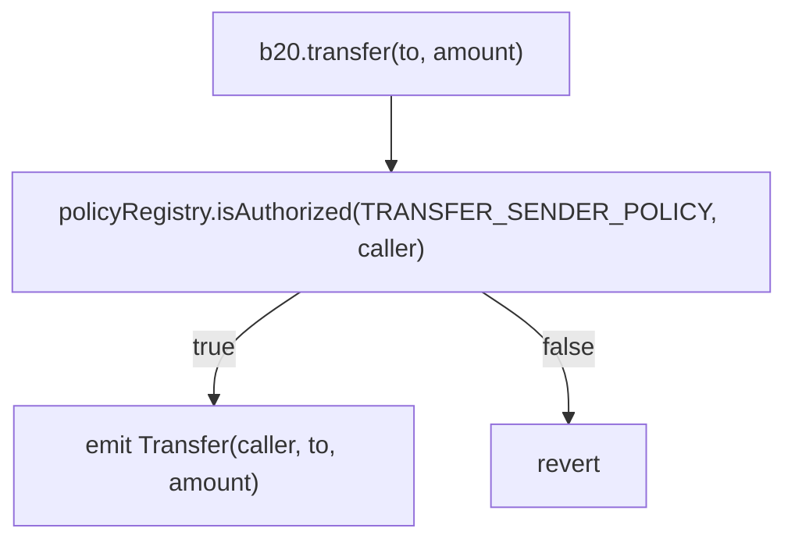
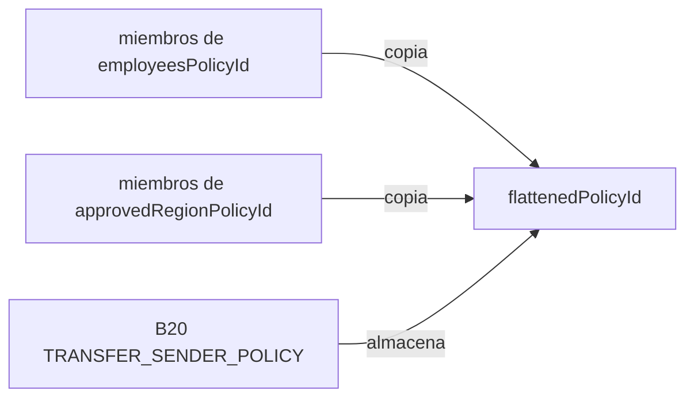

## Resumen {#summary}

[Cobalt](/es/upgrades/cobalt/overview) añade políticas compuestas a `PolicyRegistry`. Una política compuesta
combina entre dos y cuatro políticas simples existentes de tipo `ALLOWLIST` o `BLOCKLIST` mediante una puerta lógica `UNION` (OR) o
`INTERSECT` (AND). Crea una política compuesta con `createCompositePolicy` y reemplaza el conjunto completo
de sus políticas hijas con `updateComposite`.

El cambio es aditivo. Los selectores, eventos y errores existentes de Beryl, así como el comportamiento de las políticas simples, siguen
siendo invocables en Cobalt. `createPolicy` y `createPolicyWithAccounts` incorporan un nuevo caso de reversión:
`IncompatiblePolicyType`, cuando se invocan con un `policyType` compuesto.

## Motivación {#motivation}

Los emisores de activos suelen reutilizar políticas de autorización en distintos activos, como una lista de permitidos de KYC o una
lista de bloqueo por sanciones. Antes de Cobalt, combinar más de una política obligaba a copiar sus miembros
en una política aplanada y a mantener infraestructura offchain para sincronizar cada actualización de las fuentes.
Esa duplicación puede quedar desactualizada: una cuenta válida puede ser rechazada, o una cuenta eliminada puede seguir
autorizada, hasta que se actualice la lista copiada.

La autorización también puede requerir una relación OR o AND explícita. Por ejemplo, una política puede admitir
una cuenta que figure en una lista de permitidos compartida o en una específica del token, o puede exigir que una cuenta
esté verificada por KYC y, además, figure en una lista de permitidos de Pro User. Las políticas compuestas expresan estas relaciones
sin copiar datos de pertenencia. Cada comprobación de autorización utiliza el estado actual de todas las políticas
hijas evaluadas.

## Qué ha cambiado {#what-changed}

### Contexto de políticas {#policy-context}

B20 almacena un ID de política de `PolicyRegistry` para cada operación restringida. Cuando se
intenta realizar una operación, B20 llama a `isAuthorized(policyId, account)` y la rechaza si la cuenta no
está autorizada.



`BLOCKLIST` y `ALLOWLIST` siguen siendo políticas simples. Son las únicas políticas hijas válidas de una política compuesta.

### Cambios en la interfaz {#interface-changes}

`PolicyType` solo admite añadir valores al final: `UNION = 2` e `INTERSECT = 3` se sitúan después de `BLOCKLIST = 0` y
`ALLOWLIST = 1`. Así se mantiene la codificación empaquetada actual de los ID de políticas.

```solidity IPolicyRegistry.sol lines expandable wrap highlight={13-22}
enum PolicyType {
    BLOCKLIST,
    ALLOWLIST,
    UNION,
    INTERSECT
}

error ChildPoliciesOutsideOfRange();
error InvalidChildPolicy(uint64 childPolicyId);

event CompositePolicyUpdated(uint64 indexed policyId, address indexed updater, uint64[] childPolicyIds);

function createCompositePolicy(address admin, PolicyType policyType, uint64[] calldata childPolicyIds)
    external
    returns (uint64 newPolicyId);

function updateComposite(uint64 policyId, uint64[] calldata childPolicyIds) external;

function compositePolicyChildIds(uint64 policyId) external view returns (uint64[] memory);

function MIN_COMPOSITE_CHILD_POLICIES() external view returns (uint256);
function MAX_COMPOSITE_CHILD_POLICIES() external view returns (uint256);
```

| Símbolo                                             | Selector / Topic0                                                    | Estado       | Comportamiento                                                                                                               |
| --------------------------------------------------- | -------------------------------------------------------------------- | ------------ | ---------------------------------------------------------------------------------------------------------------------------- |
| `createCompositePolicy(address,uint8,uint64[])`     | `0x6fdd1491`                                                         | Nuevo        | Crea una política compuesta `UNION` o `INTERSECT`. `PolicyType` se codifica en ABI como `uint8`.                             |
| `updateComposite(uint64,uint64[])`                  | `0xbfe142c0`                                                         | Nuevo        | Reemplaza el conjunto completo de políticas hijas.                                                                           |
| `compositePolicyChildIds(uint64)`                   | `0x7c40df74`                                                         | Nueva vista  | Devuelve los ID de las políticas hijas en el orden almacenado, o un array vacío si la política no es compuesta.              |
| `MIN_COMPOSITE_CHILD_POLICIES()`                    | `0xb3ae29f7`                                                         | Nueva vista  | Devuelve `2`.                                                                                                                |
| `MAX_COMPOSITE_CHILD_POLICIES()`                    | `0x54309870`                                                         | Nueva vista  | Devuelve `4`.                                                                                                                |
| `ChildPoliciesOutsideOfRange()`                     | `0x697ec868`                                                         | Nuevo error  | El número de políticas hijas está fuera de `[2, 4]`; no debe confundirse con el límite de 64 cuentas de `BatchSizeTooLarge`. |
| `InvalidChildPolicy(uint64)`                        | `0x46508ef6`                                                         | Nuevo error  | Una política hija es compuesta o es un centinela integrado.                                                                  |
| `CompositePolicyUpdated(uint64,address,uint64[])`   | `0x4ff6adaab31b0df87aa7b8b7320c52b8b3b5eede3bf28a6baaaa8b8b7e1d6363` | Nuevo evento | Se emite al crear la política compuesta y en cada actualización, con el conjunto completo resultante.                        |
| `isAuthorized(uint64,address)`                      | `0x55a1179e`                                                         | Ampliado     | Despacha las políticas compuestas evaluando en tiempo real las políticas hijas.                                              |
| `createPolicy(address,uint8)`                       | `0xca5d55f6`                                                         | Ampliado     | Rechaza `UNION` e `INTERSECT` con `IncompatiblePolicyType`.                                                                  |
| `createPolicyWithAccounts(address,uint8,address[])` | `0xa2d3044f`                                                         | Ampliado     | Rechaza `UNION` e `INTERSECT` con `IncompatiblePolicyType`.                                                                  |

Para ver la interfaz actual completa, consulta la [referencia de IPolicyRegistry](/specifications/b20/reference/interfaces/i-policy-registry/index).

#### Creación de políticas compuestas {#composite-policy-creation}

`createCompositePolicy(admin, policyType, childPolicyIds)` crea una política `UNION` o `INTERSECT`,
asigna `admin` como su administrador inicial y devuelve un nuevo ID de política. La política almacena referencias a
sus políticas hijas en lugar de copiar sus miembros.

El conjunto de hijas debe contener entre dos y cuatro políticas simples existentes. Las políticas hijas no pueden ser compuestas
ni tampoco los centinelas integrados `ALWAYS_ALLOW` y `ALWAYS_BLOCK`. Cada hija evaluada requiere una
lectura de almacenamiento para comprobar la pertenencia, por lo que el gas aumenta con el número de hijas evaluadas.

La validación se realiza en este orden:

1. `ZeroAddress`: `admin` es `address(0)`.
2. `IncompatiblePolicyType`: `policyType` no es `UNION` ni `INTERSECT`.
3. `ChildPoliciesOutsideOfRange`: el número de hijas está fuera del rango `[2, 4]`.
4. `PolicyNotFound`: una o más hijas no existen; el registro completa esta comprobación antes de
   verificar los tipos de las hijas.
5. `InvalidChildPolicy`: una hija es compuesta o es un centinela integrado.

Si la operación se completa correctamente, el registro emite `PolicyCreated(policyId, creator, policyType)`,
`PolicyAdminUpdated(policyId, address(0), admin)` y
`CompositePolicyUpdated(policyId, creator, childPolicyIds)`, en ese orden.

#### Actualizaciones de políticas compuestas {#composite-policy-updates}

`updateComposite(policyId, childPolicyIds)` reemplaza de forma atómica el conjunto completo de políticas hijas de una política compuesta.
No admite actualizaciones parciales ni un conjunto de hijas vacío. Si la operación se completa correctamente, se emite el evento
`CompositePolicyUpdated(policyId, updater, childPolicyIds)`; la actualización
no emite `PolicyAdminUpdated` porque el administrador no cambia.

Las validaciones se ejecutan en este orden:

1. `PolicyNotFound`: `policyId` no existe.
2. `IncompatiblePolicyType`: `policyId` no es una política `UNION` ni `INTERSECT`.
3. `Unauthorized`: quien realiza la llamada no es el administrador actual. Una política compuesta cuya administración se ha renunciado no se puede
   actualizar.
4. `ChildPoliciesOutsideOfRange`: el nuevo número de hijas está fuera del rango `[2, 4]`.
5. `PolicyNotFound`: una o más de las nuevas hijas no existen.
6. `InvalidChildPolicy`: una de las nuevas hijas es una política compuesta o un centinela integrado.

### Cambios de comportamiento {#behavioral-changes}

#### Reversiones en los constructores existentes {#existing-constructor-reverts}

`createPolicy` y `createPolicyWithAccounts` siguen creando solo políticas simples. Ahora ambas funciones
revierten con `IncompatiblePolicyType` si su `policyType` es `UNION` o `INTERSECT`.

#### Evaluación de la autorización {#authorization-evaluation}

`isAuthorized` evalúa los compuestos de la siguiente forma:

```text Authorization Evaluation lines expandable wrap highlight={1-12}
isAuthorized(policyId, account):
    if policy is ALLOWLIST:
        return account is in the policy

    if policy is BLOCKLIST:
        return account is not in the policy

    if policy is UNION:
        return true when any child authorizes the account

    if policy is INTERSECT:
        return false when any child does not authorize the account
```

Las políticas hijas de una política compuesta deben ser políticas simples, por lo que la evaluación tiene una profundidad máxima de uno y no puede
ser recursiva ni formar ciclos. La autorización se evalúa en tiempo real, no a partir de una instantánea de la pertenencia: los cambios en una política hija
se aplican a todas las políticas compuestas que la referencian en su siguiente comprobación de autorización.

La evaluación usa cortocircuito. `UNION` se detiene en la primera política hija que autoriza e `INTERSECT` se detiene en la
primera política hija que no autoriza. El orden de las políticas hijas no altera el resultado de la autorización, pero sí puede afectar
al consumo de gas; coloque primero la política hija con mayor probabilidad de provocar el cortocircuito.

El registro conserva el orden de las políticas hijas y admite ID de hijas duplicados. No los ordena ni
elimina los duplicados. Una política hija sigue vigente después de que su administrador renuncie a la administración:
la renuncia congela las futuras actualizaciones de pertenencia, pero no elimina la política ni cambia su resultado de
autorización actual.

Un ID de `UNION` bien formado pero nunca creado no tiene hijas y devuelve `false`; un ID de `INTERSECT` bien formado pero
nunca creado no tiene hijas y devuelve `true`. Los consumidores que almacenen ID de políticas
deben llamar a `policyExists(policyId)` antes de almacenarlos. De lo contrario, un ID de `INTERSECT` no válido puede
comportarse como `ALWAYS_ALLOW`.

#### Cambios de estado {#state-changes}

El cambio añade un mapeo `children` en el desplazamiento `4` del espacio de nombres ERC-7201 `base.policy_registry`.
Es un cambio aditivo: los desplazamientos existentes del `0` al `3` no se modifican y no se requiere ninguna migración de almacenamiento.
El desplazamiento es relativo a la ubicación del espacio de nombres; no se refiere literalmente a la ranura de almacenamiento `4` de la EVM.

| Campo                            | Valor                                                                |
| -------------------------------- | -------------------------------------------------------------------- |
| Ubicación del espacio de nombres | `0x00503aeb06982fa1fe3151dc68f90b3946c55c449dfd447e49dcaece71ba4a00` |
| Desplazamiento                   | `CHILDREN_OFFSET = 4`                                                |
| Tipo de campo                    | `mapping(uint64 policyId => uint64[] childPolicyIds) children`       |

Cada entrada del mapeo almacena la longitud del array dinámico. Sus elementos comienzan en el hash de esa entrada y
empaquetan cuatro ID secundarios `uint64` en una sola ranura de almacenamiento de 256 bits, lo que basta para el límite de dos a cuatro políticas secundarias.

| Bits      | Índice del array | Campo               |
| --------- | ---------------- | ------------------- |
| `0–63`    | `0`              | `childPolicyIds[0]` |
| `64–127`  | `1`              | `childPolicyIds[1]` |
| `128–191` | `2`              | `childPolicyIds[2]` |
| `192–255` | `3`              | `childPolicyIds[3]` |

Las políticas simples y compuestas comparten el contador global `nextCounter`, que empieza en `2` porque `0` y
`1` están reservados para `ALWAYS_ALLOW` y `ALWAYS_BLOCK`. El ID de una política compuesta almacena su
`PolicyType` en el byte más significativo y el siguiente valor del contador en los 56 bits menos significativos; las políticas compuestas no usan un
contador propio.

## Ejemplos {#examples}

Supongamos que `employeesPolicyId` y `approvedRegionPolicyId` son políticas `ALLOWLIST` ya existentes. Ambos
ejemplos autorizan las transferencias de cualquier cuenta que figure en alguna de las dos listas.

### Antes: política aplanada {#before-flattened-policy}

B20 almacena un único ID de política por ámbito, así que ambas listas de origen deben copiarse en una lista de permitidos aplanada.
Después, la infraestructura offchain supervisa ambos orígenes y propaga a la copia los cambios en la pertenencia.

```solidity Flattened Policy
uint64 flattenedPolicyId = policyRegistry.createPolicyWithAccounts(
    admin,
    PolicyType.ALLOWLIST,
    /* unión de las direcciones de empleados y de las regiones aprobadas */
);

b20.updatePolicy(TRANSFER_SENDER_POLICY, flattenedPolicyId);
```



```mermaid Flattened Policy Synchronization lines expandable wrap highlight={1-12}
sequenceDiagram
    participant SourceAdmin
    participant Employees as employeesPolicyId
    participant Listener as Sync infrastructure
    participant Flat as flattenedPolicyId
    participant B20

    SourceAdmin->>Employees: updateAllowlist(true, [Alice])
    Employees-->>Listener: AllowlistUpdated(..., true, [Alice])
    Note over B20,Flat: Alice cannot transfer yet
    Listener->>Flat: updateAllowlist(true, [Alice])
    Note over B20,Flat: Alice can transfer
```

### Después: política compuesta {#after-composite-policy}

Crea una política compuesta `UNION` que haga referencia a las políticas de origen y asigna su ID a B20. B20 no necesita
ninguna lógica específica para políticas compuestas: sigue pasando a `PolicyRegistry` el ID de política almacenado.

```solidity Composite Policy
uint64 compositePolicyId = policyRegistry.createCompositePolicy(
    admin,
    PolicyType.UNION,
    [employeesPolicyId, approvedRegionPolicyId]
);

b20.updatePolicy(TRANSFER_SENDER_POLICY, compositePolicyId);
```

La llamada de creación emite `PolicyCreated(policyId, admin, UNION)`, luego
`PolicyAdminUpdated(policyId, address(0), admin)` y, por último,
`CompositePolicyUpdated(policyId, admin, childPolicyIds)`. Si se añade a Alice a `employeesPolicyId`,
queda autorizada a partir de la siguiente comprobación, sin necesidad de copiar miembros a otra política.

```mermaid Composite Policy Authorization lines expandable wrap highlight={1-15}
sequenceDiagram
    participant Admin
    participant Employees as employeesPolicyId
    participant Region as approvedRegionPolicyId
    participant Union as UNION composite
    participant B20

    Admin->>Union: createCompositePolicy(UNION, [employees, approvedRegion])
    Admin->>B20: updatePolicy(TRANSFER_SENDER_POLICY, compositePolicyId)

    Note over Employees: Alice added to employeesPolicyId
    B20->>Union: isAuthorized(compositePolicyId, Alice)
    Union->>Employees: isAuthorized(employeesPolicyId, Alice)
    Employees-->>Union: true
    Union-->>B20: true
```

## Decisiones de diseño y alternativas consideradas {#design-decisions-and-alternatives-considered}

Cobalt usa dos tipos de política explícitos, una única función `createCompositePolicy` y el reemplazo
completo a través de `updateComposite`.

### Un único tipo compuesto genérico {#one-generic-composite-type}

Un tipo compuesto genérico con un operador almacenado por separado, como AND, OR, NOT o XOR, añadiría
complejidad de almacenamiento y de autorización sin que se requieran operadores adicionales. Los tipos explícitos
`UNION` e `INTERSECT` permiten que la codificación del ID de política, el perfil de gas y la superficie de auditoría sean más reducidos.

### Grupos de políticas a nivel de token {#token-level-policy-groups}

Almacenar varios ID de políticas y un operador en cada token B20 impediría crear políticas compuestas reutilizables y
obligaría a propagar el cambio a las variantes de token, las factorías y las rutas críticas de autorización. En cambio, una política
reutilizable de PolicyRegistry permite que la ranura de política de B20 siga siendo un ID `uint64` opaco.

### Actualizaciones incrementales de hijos {#incremental-child-updates}

Las operaciones independientes de adición/eliminación requerirían gestionar la mutación de arreglos, la longitud y la deduplicación. Un
compuesto tiene como máximo cuatro hijos, por lo que el reemplazo completo y atómico resulta más sencillo y poco costoso.

### Funciones de creación independientes {#separate-creator-functions}

Disponer de funciones `createUnionPolicy` y `createIntersectPolicy` independientes duplicaría la API de creación.
Una única función `createCompositePolicy` admite ambos operadores de forma coherente.

### Políticas compuestas anidadas {#nested-composites}

Permitir que las políticas compuestas hagan referencia a otras políticas compuestas exige límites de profundidad, protecciones contra ciclos y,
potencialmente, un recorrido de autorización no acotado. Restringir los hijos a políticas simples garantiza una evaluación de
profundidad 1 y acota el consumo de gas en el peor de los casos.

## Migración {#migration}

Este cambio no rompe la compatibilidad. Las políticas simples `ALLOWLIST` y `BLOCKLIST` existentes siguen funcionando,
y las integraciones que no necesitan un comportamiento compuesto no tienen que hacer nada.

Para reemplazar una política aplanada:

1. Identifica las políticas simples existentes que quieres combinar.
2. Crea una política compuesta `UNION` o `INTERSECT` con `createCompositePolicy`.
3. Escribe el ID de la política compuesta en el ámbito de política de B20 correspondiente con `b20.updatePolicy`.
4. Elimina la política aplanada anterior si ya no la necesitas.

B20 trata el ID de la política compuesta igual que el ID de política opaco `uint64` que usa para las políticas simples, así que no
es necesario modificar el contrato de B20.