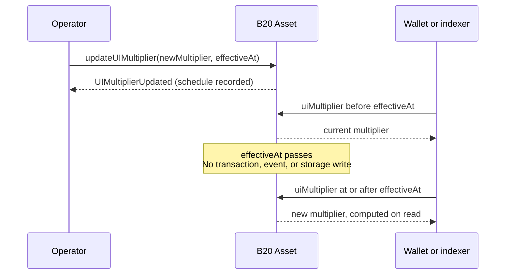

*Modelo mental del multiplicador de UI de B20 Asset ([ERC-8056](https://eips.ethereum.org/EIPS/eip-8056)). Las guías de uso, los eventos y los errores se documentan en [`updateUIMultiplier`](/specifications/b20/reference/interfaces/ib20-asset/update-ui-multiplier). Solo aplica a Asset; Stablecoin no tiene multiplicador. Consulta [Tipos de tokens](/es/specifications/b20/concepts/token-types).*

Público: integradores e indexadores.

***

## Por qué existen los multiplicadores {#why-multipliers-exist}

Los emisores necesitan poder realizar splits de acciones que modifiquen el número de acciones que se muestra. Si un split reescribiera el saldo ERC-20 bruto de cada titular, los vaults y otros protocolos DeFi que llaman a `balanceOf` y `transfer` verían cambiar esas cantidades aunque no se hubiera movido ningún token.

B20 Asset almacena los saldos de los titulares en unidades ERC-20 brutas. El multiplicador cambia la escala mostrada sin reescribir esos saldos, por lo que la interfaz ERC-20 permanece intacta.

Las wallets y los indexadores leen una vista derivada para la UI, lo que les permite mostrar el número de acciones tras un split.

Un split inverso es la misma primitiva con `multiplier < 1e18`.

## Cómo funcionan {#how-they-work}

### Cómo funciona la UI {#how-the-ui-works}

Cada titular tiene dos cantidades: un saldo **raw** almacenado y un saldo **UI** derivado. El saldo UI es lo que las wallets y los indexadores muestran como número de acciones. Se calcula como `raw * multiplier / WAD_PRECISION`.

Como esa fórmula divide entre `WAD_PRECISION` (`1e18`), el multiplicador debe escalarse en la misma proporción. Una escala de `1.0` equivale a `1 * 1e18`. Ese es el valor predeterminado, por lo que UI es igual a raw. Un `0` almacenado se interpreta como `WAD_PRECISION`.

Un split de 2 por 1 corresponde a una escala de `2.0`, por lo que el multiplicador es `2 * 1e18`, es decir, `2e18`. Para un saldo raw de `100`, UI es `200`. Si se pasara `2`, se calcularía `raw * 2 / 1e18` y ese mismo saldo se redondearía a la baja hasta `0`.

Un split inverso usa la misma codificación. Uno de 1 por 2 corresponde a una escala de `0.5`, por lo que el multiplicador es `0.5 * 1e18`, es decir, `5e17`. Para un saldo raw de `100`, UI es `50`.

El operador escribe ese valor escalado como un multiplicador **absoluto**, no como una proporción respecto al actual. Un segundo split de 2 por 1 es `4e18`, no «aplicar ×2 de nuevo». Una proporción ocultaría la escala actual y haría que fuera fácil configurar mal splits encadenados.

Esa misma división es entera y redondea a la baja. Una conversión de ida y vuelta con `toUIAmount` y después `fromUIAmount` puede perder una unidad en la última posición (ULP) cuando `multiplier != WAD_PRECISION`. Usa preferiblemente 18 decimales para las acciones, de modo que ese efecto sea mínimo. Encontrarás más detalles sobre el redondeo en la especificación de Asset y en la guía de splits de acciones.

### Consulta y lectura de cambios del multiplicador {#viewing-and-reading-multiplier-changes}

Los indexadores e integradores leen estas vistas, pero no escriben el multiplicador. Los nombres de ERC-8056 son alias de los nombres de B20; se recomienda usar los de ERC-8056.

La escala actual la indica `uiMultiplier()` (`multiplier()`), que devuelve el multiplicador efectivo en `block.timestamp`.

Un cambio pendiente puede consultarse en `newUIMultiplier()` y `effectiveAt()`. El cambio sigue programado mientras `effectiveAt() > block.timestamp`. Una vez aplicado, `uiMultiplier()` devuelve el nuevo valor. No se emite un segundo evento.

El número de acciones del titular en la UI es `balanceOfUI(account)` (`scaledBalanceOf`): `balanceOf(account) * uiMultiplier() / WAD_PRECISION`. `totalSupplyUI()` aplica la misma fórmula sobre `totalSupply()`.

Para convertir un importe individual, usa `toUIAmount(raw)` y `fromUIAmount(ui)` con ese multiplicador efectivo. `toScaledBalance` y `toRawBalance` son alias obsoletos de estas dos funciones.

### Qué se conserva {#what-it-preserves}

`balanceOf`, los montos de `transfer`, `totalSupply` y las asignaciones (allowances) se mantienen sin escalar. Los protocolos que usan esa interfaz ERC-20 no perciben el split.

Las vistas de UI anteriores son opcionales. Los protocolos que llaman a `balanceOfUI`, `scaledBalanceOf` o `totalSupplyUI` sí perciben el split.

### Programación {#scheduling}

Los operadores suelen envolver la programación en `announce` para que el split sea una acción corporativa divulgada. Consulta [`announce`](/specifications/b20/reference/interfaces/ib20-asset/announce).

Envolverla así no fusiona ambos conceptos. El evento del multiplicador indica que se registró un cambio de escala. El anuncio indica que el operador divulgó una acción corporativa.

La vía canónica es `updateUIMultiplier(newMultiplier, effectiveAt)`, no el setter instantáneo. Una cuenta con `OPERATOR_ROLE` registra un multiplicador pendiente y un `effectiveAt` futuro. El activo solo admite una actualización pendiente activa a la vez.

Mientras `effectiveAt() > block.timestamp`, `uiMultiplier()` sigue devolviendo el multiplicador actual. `newUIMultiplier()` devuelve el valor programado. `effectiveAt()` devuelve el momento del cambio.

Cuando `block.timestamp >= effectiveAt`, las lecturas devuelven el nuevo multiplicador. La entrada en vigor no emite ningún evento ni escribe en el almacenamiento. Los indexadores no deben esperar un log de &quot;el split se produjo&quot; en `effectiveAt`. `UIMultiplierUpdated` se emite cuando la actualización se **registra**.

Después del cambio, detecta si hay una actualización pendiente activa con `effectiveAt() > block.timestamp`. No compruebes `effectiveAt() == 0`.

`cancelUIMultiplierUpdate` elimina una actualización pendiente activa antes de `effectiveAt`. Encontrarás más detalles en la guía de split de acciones.

`updateMultiplier`, ya obsoleto, aplica un valor de inmediato y elimina cualquier actualización pendiente. Úsalo solo como anulación de emergencia. Para splits rutinarios, usa preferentemente `updateUIMultiplier`. Encontrarás más detalles en la guía de split de acciones.

## Ejemplo {#example}

Un split de 2 por 1 duplica lo que muestran las wallets. Las unidades raw no cambian y el cambio no emite ningún evento.

Un titular parte de un saldo raw de `100` y un multiplicador de `1e18`, por lo que la UI muestra `100`. El operador programa `updateUIMultiplier(2e18, T)`.

Hasta `T`, no cambia nada: el saldo raw sigue en `100` y `uiMultiplier()` sigue en `1e18`. El split pendiente puede consultarse en `newUIMultiplier()` (`2e18`) y `effectiveAt()` (`T`).

Una vez pasado `T`, la UI muestra `200`. El saldo raw sigue siendo `100`. No se emite un segundo evento.

Un split inverso sigue el mismo procedimiento. Uno de 1 por 2 usa `5e17`.

## Contenido relacionado {#related}

* [Tipos de token](/es/specifications/b20/concepts/token-types) — Asset frente a Stablecoin; el multiplicador solo existe en Asset.
* [Roles y pausa](/es/specifications/b20/concepts/roles-and-pause) — `OPERATOR_ROLE`.
* [`updateUIMultiplier`](/specifications/b20/reference/interfaces/ib20-asset/update-ui-multiplier) — cómo programar, cancelar y sobrescribir; eventos y errores.
* [`announce`](/specifications/b20/reference/interfaces/ib20-asset/announce) — wrapper de divulgación sobre la programación.