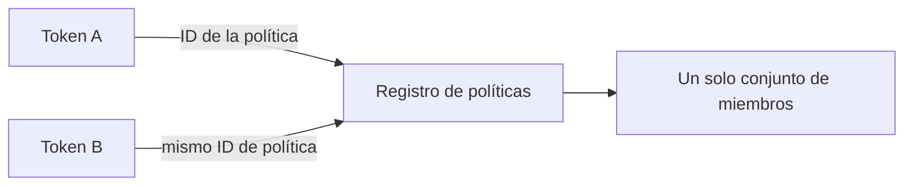
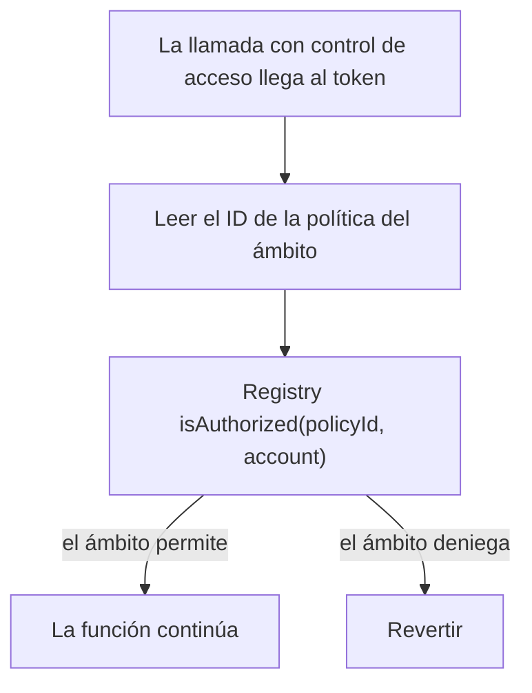
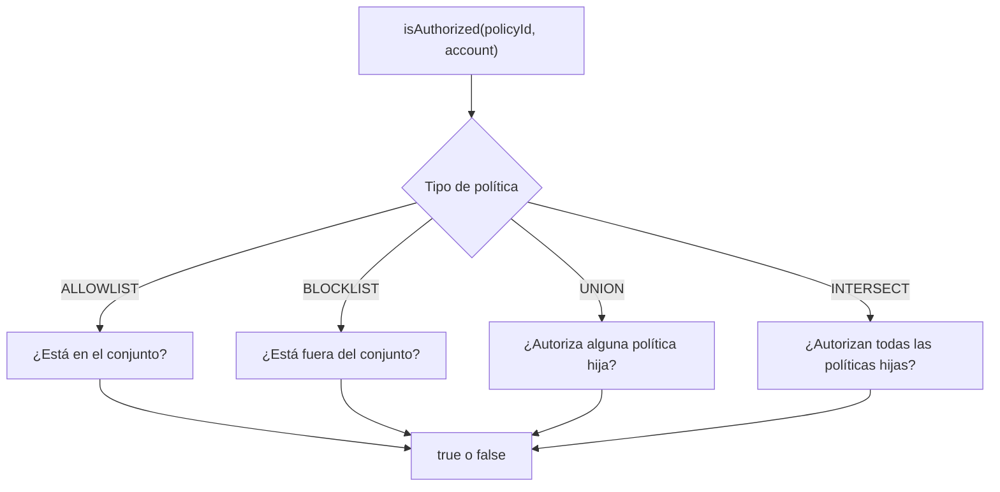
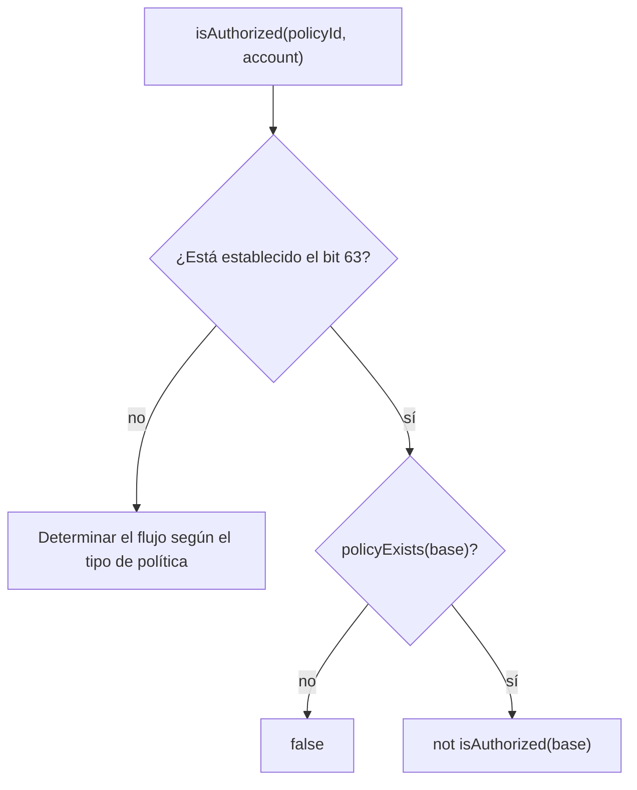
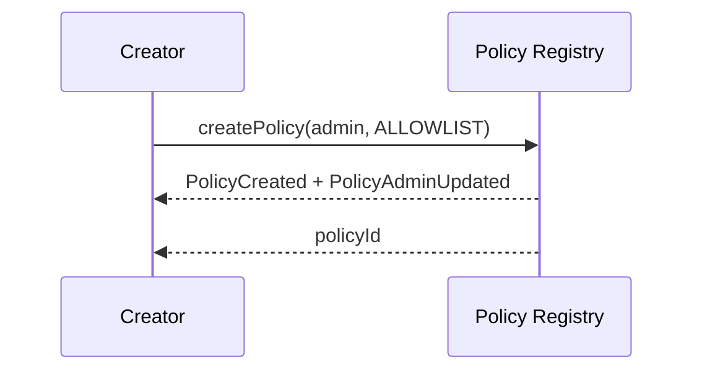
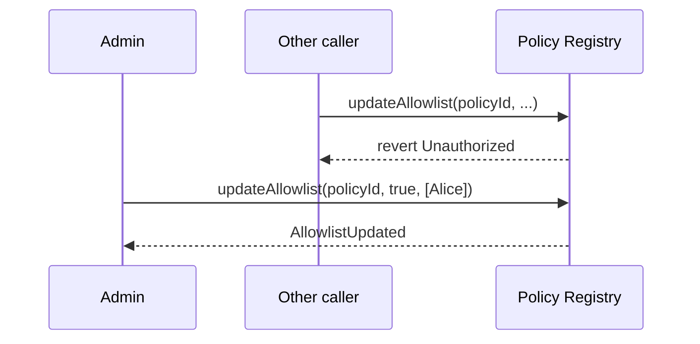
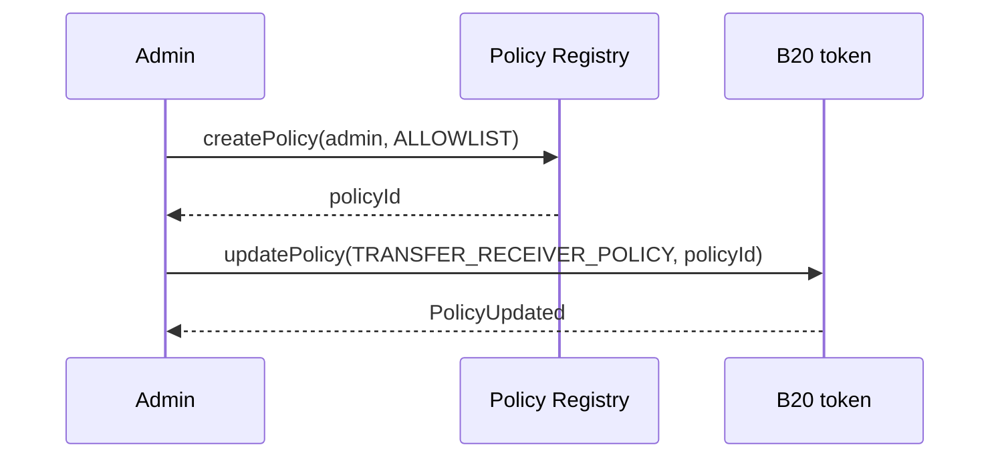
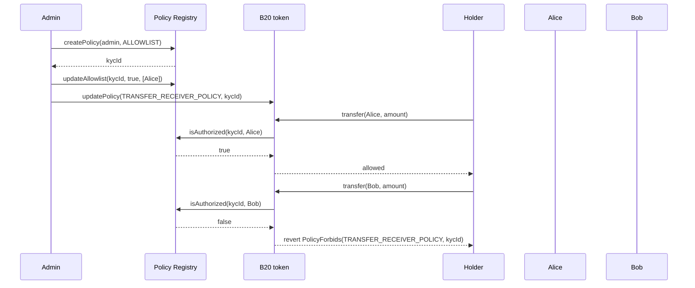

*Cómo B20 reutiliza listas compartidas de permitidos y listas de bloqueo para las comprobaciones de cumplimiento normativo. Los roles y la pausa forman una capa de autorización independiente; consulta [Roles y pausa](/es/specifications/b20/concepts/roles-and-pause).*

## 1. Por qué existen las políticas {#1-why-policies-exist}

La mayor parte del cumplimiento normativo de los tokens se reduce a comprobar si una dirección pertenece a una lista: ¿puede esta cuenta enviar, recibir o recibir tokens acuñados? Los emisores repiten esas listas en muchos tokens. Copiar la misma lista de permitidos de KYC o la misma lista de bloqueo por sanciones en cada token hace que las copias acaben divergiendo: una sola actualización de la lista tiene que aplicarse en todas ellas.

Las políticas centralizan la lista en un único lugar. El registro de políticas es un precompilado singleton. Almacena cada lista una sola vez, junto con la lógica de membresía que se ejecuta sobre ella. Un token solo almacena un ID de política en un slot. Antes de que se ejecute una función restringida, el token consulta al registro si la dirección correspondiente está autorizada. Muchos tokens pueden compartir una misma política, y cualquier actualización de esa política es visible para todos los tokens que hacen referencia a ella.



Un rol determina quién puede llamar a una función privilegiada. La pausa determina si ese tipo de operación está habilitado. Una política determina si una dirección concreta está autorizada para esa operación. Los tres mecanismos pueden aplicarse a una misma llamada.

## 2. Cómo funcionan las políticas {#2-how-policies-work}

### 2.1 El registro y el token {#21-the-registry-and-the-token}

El registro de políticas es propietario de los conjuntos de miembros y de las compuertas compuestas. Cualquiera puede crearlas, sin necesidad de permisos. Cada política tiene un administrador que actualiza la membresía, reemplaza los hijos de una compuerta compuesta o transfiere la administración. Los tokens nunca escriben en esas listas. Almacenan un ID de política `uint64` por cada [ámbito](#32-policy-scopes) y llaman a `isAuthorized(policyId, account)` cuando se ejecuta ese ámbito.

`isAuthorized` nunca revierte. Indica si la cuenta está autorizada según esa política. Es el token quien decide qué significa un `false` (o, en el caso de un ámbito, un `true`). La mayoría de los ámbitos revierten con `PolicyForbids` cuando el resultado es `false`. En ese caso, la función no se ejecuta.



### 2.2 Tipos de políticas {#22-policy-types}

Una política puede ser simple o compuesta.

Una política **simple** decide a partir de un único conjunto de direcciones:

| Tipo        | Autorizada cuando                |
| ----------- | -------------------------------- |
| `ALLOWLIST` | La cuenta está en el conjunto    |
| `BLOCKLIST` | La cuenta no está en el conjunto |

Una lista de permitidos vacía no autoriza a nadie. Una lista de bloqueo vacía autoriza a todo el mundo.

Una política **compuesta** combina entre dos y cuatro políticas simples existentes. No copia sus miembros: cada llamada a `isAuthorized` lee el conjunto actual de cada política hija:

| Tipo        | Autorizada cuando                     |
| ----------- | ------------------------------------- |
| `UNION`     | Alguna hija autoriza a la cuenta      |
| `INTERSECT` | Todas las hijas autorizan a la cuenta |

Las hijas deben ser políticas `ALLOWLIST` o `BLOCKLIST` existentes. Una política compuesta no puede ser hija de otra. Los centinelas integrados de [§2.5](#25-built-in-sentinels) tampoco pueden ser hijas. Al actualizar los miembros de una hija, cambian todas las políticas compuestas que la referencian. No hay ningún paso de aplanado y copia. Además, cualquiera de estos tipos puede invertirse. Consulta [§2.3](#23-inverting-a-policy).



### 2.3 Invertir una política {#23-inverting-a-policy}

Un emisor puede necesitar lo contrario de una política existente sin tener que crear un segundo conjunto de miembros. El bit 63 de un ID de política es el indicador de inversión (NOT). No se trata de un nuevo tipo de política ni de una vía de creación. Los miembros permanecen en la política base, por lo que cualquier actualización de la base se refleja también en la inversa.

Llama a `invertedPolicyId(policyId)` para activar o desactivar ese bit. También puedes activar el bit 63 manualmente. Vincula el ID invertido a un ámbito de token o pásalo como hijo de una política compuesta (&quot;A AND NOT X&quot;). El indicador se aplica a todos los tipos: `ALLOWLIST`, `BLOCKLIST`, `UNION` e `INTERSECT`.

`isAuthorized` sobre un ID invertido devuelve el resultado opuesto al de la base. Si la base no existe, el resultado es `false`. Esta protección de tipo *fail-closed* evita que un ID invertido mal escrito acabe autorizando a todo el mundo.

Las vistas de lectura eliminan el bit 63 y cargan la base. `policyExists` y `policyAdmin` sobre un ID invertido devuelven lo mismo que para la base. Un ID invertido no tiene registro propio.



Un ID de hijo compuesto puede llevar el bit de inversión. El registro comprueba la existencia y el tipo simple con respecto al ID base. Un hijo simple invertido es válido. Un hijo compuesto invertido revierte con `InvalidChildPolicy`. En el conjunto completo de hijos, `PolicyNotFound` sigue teniendo prioridad sobre `InvalidChildPolicy`.

### 2.4 Creación y actualización {#24-creating-and-updating}

Cualquiera puede crear una política. La llamada de creación designa un único `admin`. Esa dirección es la única que podrá, más adelante, cambiar la membresía, reemplazar los hijos de una política compuesta, transferir la administración o renunciar a ella. El creador no tiene por qué ser el administrador. `admin` no puede ser `address(0)`.

También puedes omitir la creación y reutilizar una política existente. Si otro emisor ya mantiene la lista que necesitas, vincula el ID de su política a tu token. Vincularla no te convierte en administrador de esa política.

#### 2.4.1 Crear una política {#241-creating-a-policy}

Una política simple comienza como `ALLOWLIST` o `BLOCKLIST`. Llama a `createPolicy(admin, ALLOWLIST)` o `createPolicy(admin, BLOCKLIST)`. El registro asigna un nuevo ID de política y lo devuelve. El conjunto de miembros empieza vacío. `createPolicyWithAccounts(admin, policyType, accounts)` hace lo mismo, pero además inicializa el conjunto en esa misma llamada. Los lotes de membresía están limitados a 64 cuentas.

Una política compuesta se crea a partir de políticas ya existentes. Llama a `createCompositePolicy(admin, UNION | INTERSECT, childPolicyIds)`. El número de políticas hijas debe estar en el rango `[MIN_COMPOSITE_CHILD_POLICIES, MAX_COMPOSITE_CHILD_POLICIES]` (de `2` a `4`). El registro almacena referencias, no una instantánea de los miembros de las políticas hijas. Un ID de política hija puede invertirse: el registro valida la política base y almacena el ID de la política hija con el bit de inversión activado. Consulta [§2.3](#23-inverting-a-policy).

Ambas vías emiten `PolicyCreated` y `PolicyAdminUpdated(policyId, address(0), admin)`. A partir de ese momento, `policyAdmin(policyId)` devuelve ese administrador.



#### 2.4.2 Actualizar una política {#242-updating-a-policy}

Una vez creada la política, solo el administrador actual puede modificarla. Cualquier otro llamador provoca una reversión con `Unauthorized`. La actualización debe corresponder al tipo de la política; de lo contrario, se revierte con `IncompatiblePolicyType`.

El administrador de una lista de permitidos llama a `updateAllowlist(policyId, allowed, accounts)` para agregar o eliminar miembros. El administrador de una lista de bloqueo llama a `updateBlocklist(policyId, blocked, accounts)`. El administrador de una política compuesta llama a `updateComposite(policyId, childPolicyIds)` para reemplazar por completo el conjunto de políticas hijas. No es posible editar parcialmente las políticas hijas.

Estas escrituras modifican lo que devuelve `isAuthorized` en la siguiente consulta. Todos los tokens que ya almacenan este ID de política obtienen el nuevo resultado, sin necesidad de volver a llamar a `updatePolicy`.



#### 2.4.3 Cambiar el administrador {#243-changing-the-admin}

Una política tiene un solo administrador a la vez. Para transferir ese rol, el administrador actual llama a `stageUpdateAdmin(policyId, newAdmin)`. Esto todavía no cambia quién puede actualizar la política: `policyAdmin` sigue devolviendo el administrador actual, mientras que `pendingPolicyAdmin` devuelve `newAdmin`. Si se pasa `address(0)`, se anula una nominación que aún no se ha finalizado.

A continuación, el administrador pendiente llama a `finalizeUpdateAdmin(policyId)`. Quien realiza la llamada debe ser la dirección preparada; de lo contrario, la llamada revierte con `Unauthorized`. Si no hay ninguna dirección preparada, revierte con `NoPendingAdmin`. Si la llamada se completa correctamente, el administrador pendiente pasa a ser el administrador actual, la ranura pendiente se vacía y el administrador anterior ya no puede actualizar la política.

```mermaid 3 Changing the admin Diagram lines wrap expandable highlight={1}
sequenceDiagram
    participant Admin
    participant Next as nextAdmin
    participant Registry as Policy Registry

    Admin->>Registry: stageUpdateAdmin(policyId, nextAdmin)
    Registry-->>Admin: PolicyAdminStaged
    Admin->>Registry: updateAllowlist(policyId, ...)
    Registry-->>Admin: AllowlistUpdated
    Next->>Registry: finalizeUpdateAdmin(policyId)
    Registry-->>Next: PolicyAdminUpdated
    Admin->>Registry: updateAllowlist(policyId, ...)
    Registry-->>Admin: revert Unauthorized
    Next->>Registry: updateAllowlist(policyId, ...)
    Registry-->>Next: AllowlistUpdated
```

Para congelar una política en lugar de transferirla, el administrador actual llama a `renounceAdmin(policyId)`. La administración se pierde de forma definitiva. Ya no se pueden modificar ni la membresía ni los conjuntos secundarios. `isAuthorized` sigue funcionando. Tras la renuncia, no existe ninguna llamada que permita asignar un nuevo administrador.

### 2.5 Centinelas integrados {#25-built-in-sentinels}

Hay dos ID de política que existen sin necesidad de crearlos:

| ID                   | `isAuthorized`                 | Uso típico                                                                                                    |
| -------------------- | ------------------------------ | ------------------------------------------------------------------------------------------------------------- |
| `ALWAYS_ALLOW` (`0`) | `true` para todas las cuentas  | Sin controles de cumplimiento normativo en ese ámbito. Es el valor predeterminado si no se configura ninguno. |
| `ALWAYS_BLOCK`       | `false` para todas las cuentas | Deniega el acceso a todas las cuentas en ese ámbito.                                                          |

## 3. Cómo se vinculan las políticas a un token {#3-how-policies-attach-to-a-token}

Un ámbito (scope) es un identificador de la política que se ejecuta en una función concreta. Funciona como un hook: cuando se llama a esa función, el token lee el ID de política vinculado al ámbito y consulta al registro, mediante `isAuthorized`, por la dirección que el ámbito verifica. La lista sigue estando en el registro; el token solo almacena el ID.

### 3.1 Actualizar un ámbito {#31-updating-a-scope}

`updatePolicy(policyScope, newPolicyId)` vincula un ID de política a un ámbito. Requiere `DEFAULT_ADMIN_ROLE`. El ID debe ser un centinela integrado o una política existente en el registro. De lo contrario, la llamada revierte con `PolicyNotFound`. Un ID invertido es válido si su base existe, ya que `policyExists` elimina el bit 63. El token trata el ID como un `uint64` opaco. Un `policyScope` desconocido revierte con `UnsupportedPolicyType`.

La escritura surte efecto en la siguiente llamada que pase por ese ámbito y emite `PolicyUpdated`. Mientras no actualices un ámbito, su valor es `0` (`ALWAYS_ALLOW`), por lo que la comprobación se supera para cualquier dirección. Un mismo ID de política puede asignarse a varios ámbitos y a varios tokens. `policyId(policyScope)` devuelve la vinculación actual.

También puedes vincular una política en las `initCalls` de `createB20`, en la misma transacción que crea el token.



### 3.2 Ámbitos de las políticas {#32-policy-scopes}

La mayoría de los ámbitos deniegan la operación cuando `isAuthorized` es `false` y revierten con `PolicyForbids`. `SEIZE_EXEMPT_POLICY` la deniega cuando `isAuthorized` es `true` y revierte con `AccountNotSeizable`: una cuenta autorizada está exenta de incautación.

| Ámbito                     | Se ejecuta en                                                                                                                                  | Cuenta comprobada                   | Deniega cuando `isAuthorized` es | Error                |
| -------------------------- | ---------------------------------------------------------------------------------------------------------------------------------------------- | ----------------------------------- | -------------------------------- | -------------------- |
| `TRANSFER_SENDER_POLICY`   | `transfer`, `transferFrom` y sus variantes con memo. Se omite en las transferencias de `initCalls` de la fábrica.                              | `from` (`msg.sender` en `transfer`) | `false`                          | `PolicyForbids`      |
| `TRANSFER_RECEIVER_POLICY` | `transfer`, `transferFrom` y sus variantes con memo. Se omite en las transferencias de `initCalls` de la fábrica.                              | `to`                                | `false`                          | `PolicyForbids`      |
| `TRANSFER_EXECUTOR_POLICY` | `transfer`, `transferFrom` y sus variantes con memo. Se omite en las transferencias de `initCalls` de la fábrica.                              | `msg.sender`                        | `false`                          | `PolicyForbids`      |
| `MINT_RECEIVER_POLICY`     | `mint`, `mintWithMemo` y `batchMint` de Asset. Siempre se comprueba, incluidas las acuñaciones de `initCalls` de la fábrica.                   | `to`                                | `false`                          | `PolicyForbids`      |
| `SEIZE_EXEMPT_POLICY`      | `seizeWithMemo`. Si no se configura (`ALWAYS_ALLOW`), todas las cuentas están exentas de incautación, por lo que no se puede incautar ninguna. | `from`                              | `true`                           | `AccountNotSeizable` |
| `SEIZE_RECEIVER_POLICY`    | `seizeWithMemo`. Si no se configura (`ALWAYS_ALLOW`), la incautación puede enviar fondos a cualquier destino.                                  | `to`                                | `false`                          | `PolicyForbids`      |

## 4. Ejemplo {#4-example}

Comience con una lista de receptores permitidos. Luego, combínela con una lista de bloqueo por sanciones para que una transferencia deba cumplir ambas. Por último, invierta una lista de permitidos de exclusión para que la misma restricción pueda expresar «en KYC y no en esa lista» sin necesidad de un segundo conjunto de miembros.

### 4.1 Una sola lista de permitidos {#41-one-allowlist}

Crea una lista de permitidos, añade las cuentas que han superado el KYC y vincúlala a `TRANSFER_RECEIVER_POLICY`. Alice está en la lista; Bob, no. Un titular puede enviar a Alice, pero cualquier envío a Bob se revierte.



Si más adelante se añade a Bob a la lista de permitidos, queda autorizado en todos los tokens que ya apuntan a `kycId`. No hace falta una segunda escritura en el token.

### 4.2 Política compuesta: KYC y sanciones {#42-composite-kyc-and-sanctions}

Una única lista de permitidos no puede expresar &quot;está en la lista KYC y no está en la lista de sanciones&quot; cuando esas listas se mantienen por separado. Crea primero las dos políticas simples, después una política compuesta `INTERSECT` y, por último, vincula la política compuesta a los ámbitos de transferencia y acuñación.

```mermaid 2 Composite KYC and sanctions Diagram lines wrap expandable highlight={1}
flowchart TD
    C["Composición INTERSECT"] --> K[LISTA DE AUTORIZADOS CON KYC]
    C --> S[LISTA DE BLOQUEO POR SANCIONES]
    K --> A1[Alice: miembro]
    K --> A2[Bob: no es miembro]
    K --> A3[Carol: miembro]
    S --> B1[Alice: no figura en la lista]
    S --> B2[Bob: no figura en la lista]
    S --> B3[Carol: figura en la lista]
```

```mermaid 2 Composite KYC and sanctions Diagram lines wrap expandable highlight={1}
sequenceDiagram
    participant Admin
    participant Registry as Policy Registry
    participant Token as B20 token
    participant Alice
    participant Dave
    participant Carol

    Admin->>Registry: createPolicy(admin, ALLOWLIST)
    Registry-->>Admin: kycId
    Admin->>Registry: updateAllowlist(kycId, true, [Alice, Dave, Carol])
    Admin->>Registry: createPolicy(admin, BLOCKLIST)
    Registry-->>Admin: sanctionsId
    Admin->>Registry: updateBlocklist(sanctionsId, true, [Carol])
    Admin->>Registry: createCompositePolicy(admin, INTERSECT, [kycId, sanctionsId])
    Registry-->>Admin: gateId
    Admin->>Token: updatePolicy(TRANSFER_SENDER_POLICY, gateId)
    Admin->>Token: updatePolicy(TRANSFER_RECEIVER_POLICY, gateId)
    Admin->>Token: updatePolicy(MINT_RECEIVER_POLICY, gateId)

    Alice->>Token: transfer(Dave, amount)
    Token->>Registry: isAuthorized(gateId, Alice)
    Registry-->>Token: true
    Token->>Registry: isAuthorized(gateId, Dave)
    Registry-->>Token: true
    Token-->>Alice: allowed

    Alice->>Token: transfer(Carol, amount)
    Token->>Registry: isAuthorized(gateId, Carol)
    Registry-->>Token: false
    Token-->>Alice: revert PolicyForbids(TRANSFER_RECEIVER_POLICY, gateId)
```

Alice y Dave están en la lista KYC y no figuran en la lista de sanciones, así que ambas políticas hijas los autorizan y la `INTERSECT` devuelve `true`. Carol ha superado el KYC, pero está sancionada: la lista de bloqueo devuelve `false`, por lo que la política compuesta devuelve `false` y la transferencia se revierte. Bob no está en la lista KYC, así que se le deniega aunque no esté sancionado.

Si más adelante se llama a `updateBlocklist` para añadir o eliminar a Carol, el resultado de la política compuesta cambia en la siguiente llamada. El token sigue conservando `gateId` y el emisor no tiene que volver a llamar a `updatePolicy`.

Si más adelante el emisor necesita combinar mediante OR la misma lista KYC con una lista de permitidos de socios específica del token, crea en su lugar una `UNION` de esas dos listas de permitidos. El paso de vinculación al token no cambia.

### 4.3 Invertir: con KYC y fuera de una lista de permitidos de exclusión {#43-invert-kyc-and-not-on-an-exclusion-allowlist}

La sección 4.2 almacena las direcciones sancionadas como una `BLOCKLIST`, por lo que &quot;no sancionada&quot; ya es el resultado de autorización de la lista de bloqueo. Invertir sirve para el caso contrario: la lista de exclusión es una `ALLOWLIST` de direcciones que quieres dejar fuera, y necesitas lo opuesto a esa lista sin copiarla en una lista de bloqueo.

Crea una lista de permitidos de KYC y una lista de permitidos de exclusión. Invierte el ID de exclusión. Pasa ambos a un compuesto `INTERSECT`.

```mermaid 3 Invert KYC and not on an exclusion allowlist Diagram lines wrap expandable highlight={1}
flowchart TD
    C["INTERSECT compuesto"] --> K[LISTA DE PERMITIDOS KYC]
    C --> N["LISTA DE PERMITIDOS de exclusión invertida"]
    N --> X[LISTA DE PERMITIDOS de exclusión]
    K --> A1[Alice: miembro]
    K --> A2[Bob: no es miembro]
    K --> A3[Carol: miembro]
    X --> B1[Alice: no está en la lista]
    X --> B2[Bob: no está en la lista]
    X --> B3[Carol: está en la lista]
```

```mermaid 3 Invert KYC and not on an exclusion allowlist Diagram lines wrap expandable highlight={1}
sequenceDiagram
    participant Admin
    participant Registry as Policy Registry
    participant Token as B20 token
    participant Alice
    participant Dave
    participant Carol

    Admin->>Registry: createPolicy(admin, ALLOWLIST)
    Registry-->>Admin: kycId
    Admin->>Registry: updateAllowlist(kycId, true, [Alice, Dave, Carol])
    Admin->>Registry: createPolicy(admin, ALLOWLIST)
    Registry-->>Admin: exclusionId
    Admin->>Registry: updateAllowlist(exclusionId, true, [Carol])
    Admin->>Registry: invertedPolicyId(exclusionId)
    Registry-->>Admin: notExcluded
    Admin->>Registry: createCompositePolicy(admin, INTERSECT, [kycId, notExcluded])
    Registry-->>Admin: gateId
    Admin->>Token: updatePolicy(TRANSFER_RECEIVER_POLICY, gateId)

    Alice->>Token: transfer(Dave, amount)
    Token->>Registry: isAuthorized(gateId, Dave)
    Registry-->>Token: true
    Token-->>Alice: allowed

    Alice->>Token: transfer(Carol, amount)
    Token->>Registry: isAuthorized(gateId, Carol)
    Registry-->>Token: false
    Token-->>Alice: revert PolicyForbids(TRANSFER_RECEIVER_POLICY, gateId)
```

Alice y Dave están en la lista KYC y no figuran en la lista de exclusión. El hijo invertido los autoriza, así que `INTERSECT` devuelve `true`. Carol ha superado la verificación KYC, pero figura en la lista de exclusión. El hijo invertido devuelve `false`, por lo que la política compuesta devuelve `false` y la transferencia se revierte. Bob no está en la lista KYC, así que se le deniega el acceso aunque no esté excluido.

Si más adelante una llamada a `updateAllowlist` añade o elimina a Carol en `exclusionId`, el resultado del hijo invertido cambia a partir de la siguiente llamada. El token sigue conservando `gateId`. El emisor no necesita volver a llamar a `updatePolicy`.

## Eventos y errores {#events-and-errors}

### Token {#token}

| Evento                                                 | Emitido por                                                    |
| ------------------------------------------------------ | -------------------------------------------------------------- |
| `PolicyUpdated(policyScope, oldPolicyId, newPolicyId)` | `updatePolicy`; también al crear el token (`oldPolicyId == 0`) |

| Error                                  | Se lanza cuando                                                                                   |
| -------------------------------------- | ------------------------------------------------------------------------------------------------- |
| `PolicyForbids(policyScope, policyId)` | Un ámbito de tipo deny-on-false (deniega si el resultado es falso) rechazó la cuenta              |
| `PolicyNotFound(policyId)`             | Se pasó a `updatePolicy` un ID que no es un valor centinela ni existe en el registro              |
| `UnsupportedPolicyType(policyScope)`   | `policyScope` no es un slot compatible con este token                                             |
| `AccountNotSeizable(account)`          | El `from` de `seizeWithMemo` sigue autorizado (exento de incautación) según `SEIZE_EXEMPT_POLICY` |
| `AccountNotBlocked(account)`           | El `from` de la función obsoleta `burnBlocked` sigue autorizado según `TRANSFER_SENDER_POLICY`    |

### Registro de políticas {#policy-registry}

| Evento                                                      | Emitido por                                                           |
| ----------------------------------------------------------- | --------------------------------------------------------------------- |
| `PolicyCreated(policyId, creator, policyType)`              | `createPolicy`, `createPolicyWithAccounts`, `createCompositePolicy`   |
| `PolicyAdminStaged(policyId, currentAdmin, pendingAdmin)`   | `stageUpdateAdmin`                                                    |
| `PolicyAdminUpdated(policyId, previousAdmin, newAdmin)`     | `finalizeUpdateAdmin`, `renounceAdmin`; también al crear una política |
| `AllowlistUpdated(policyId, updater, allowed, accounts)`    | `updateAllowlist`                                                     |
| `BlocklistUpdated(policyId, updater, blocked, accounts)`    | `updateBlocklist`                                                     |
| `CompositePolicyUpdated(policyId, updater, childPolicyIds)` | `createCompositePolicy`, `updateComposite`                            |

| Error                               | Se lanza cuando                                                                                                   |
| ----------------------------------- | ----------------------------------------------------------------------------------------------------------------- |
| `Unauthorized()`                    | El llamador no es el administrador de la política (o, en `finalizeUpdateAdmin`, no es el administrador pendiente) |
| `PolicyNotFound()`                  | El ID de política indicado no existe                                                                              |
| `IncompatiblePolicyType()`          | La llamada no corresponde al tipo de la política                                                                  |
| `ZeroAddress()`                     | Un argumento de dirección obligatorio era `address(0)`                                                            |
| `BatchSizeTooLarge(maxBatchSize)`   | Un lote de membresía superó las 64 cuentas                                                                      |
| `NoPendingAdmin()`                  | Se llamó a `finalizeUpdateAdmin` sin ningún administrador preparado                                               |
| `ChildPoliciesOutsideOfRange()`     | El número de políticas hijas de una política compuesta está fuera del intervalo `[2, 4]`                          |
| `InvalidChildPolicy(childPolicyId)` | Una política hija de una política compuesta no es una política simple existente                                   |
| `NonPayable()`                      | Se adjuntó ETH a una llamada al registro                                                                          |