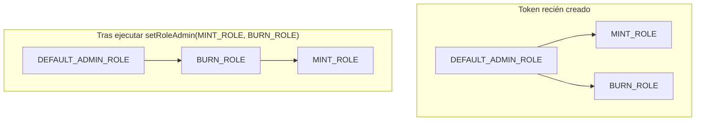
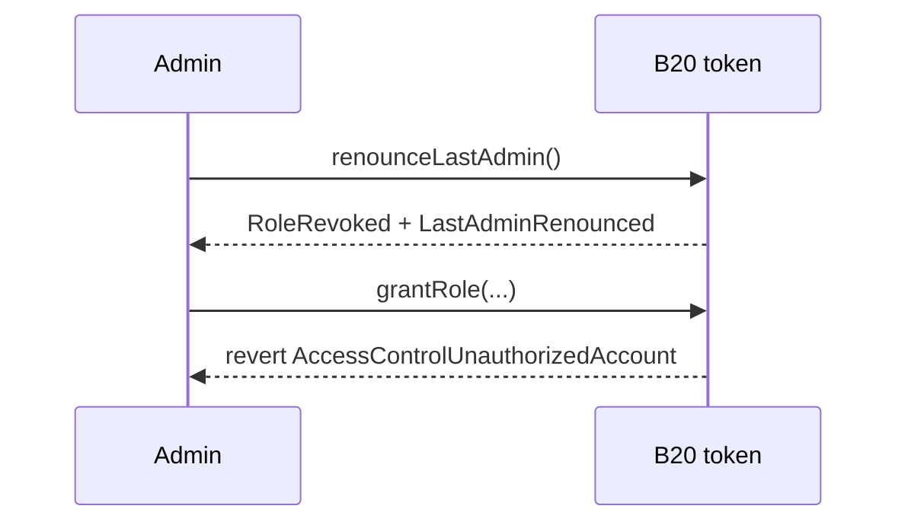
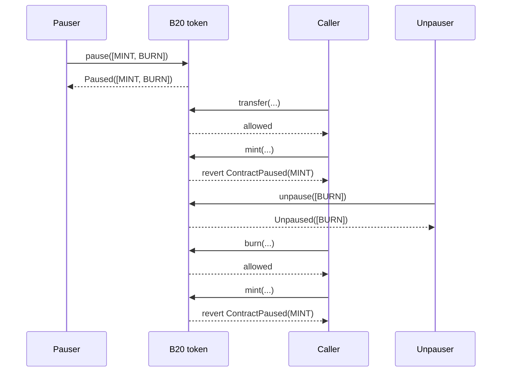

*Cómo B20 restringe las operaciones privilegiadas mediante roles y cómo la pausa congela un tipo de operaciones sin detener el resto del token. Las comprobaciones de políticas constituyen una capa de autorización independiente; consulta [Políticas](/es/specifications/b20/concepts/policies).*

## 1. Por qué existen los roles y la pausa {#1-why-roles-and-pause-exist}

Los roles permiten que un emisor asigne cada operación privilegiada a una cuenta concreta. Acuñar, incautar y pausar son tareas distintas, así que corresponden a roles distintos. Cada rol restringe el acceso a un conjunto concreto de funciones de administración. La correspondencia entre roles y funciones se detalla en [§2](#2-roles).

La pausa es un segundo control, independiente del anterior. Un rol determina quién puede llamar a una función, mientras que un `PausableFeature` determina si esa clase de operación está activa. Los emisores pueden pausar una funcionalidad sin pausar el resto del token. Las funcionalidades se describen en [§3](#3-pause).

## 2. Roles {#2-roles}

B20 implementa los roles mediante [OpenZeppelin AccessControl](https://docs.openzeppelin.com/contracts/5.x/access-control) directamente en el token. No existe un registro de roles independiente.

### 2.1 El administrador predeterminado {#21-the-default-admin}

`createB20` otorga `DEFAULT_ADMIN_ROLE` a `initialAdmin`. Ese titular es el administrador raíz y delega cada operación privilegiada en otras cuentas otorgándoles un rol operativo: minter, burner, pauser o editor de metadatos. También puede otorgar el propio `DEFAULT_ADMIN_ROLE`, de modo que varias direcciones compartan el control raíz.

Cualquier número de direcciones puede tener el mismo rol. `hasRole` comprueba la pertenencia a un rol; no se trata de un puesto con un único titular.

Dos funciones siempre requieren `DEFAULT_ADMIN_ROLE`: `updatePolicy` y `updateSupplyCap`. Estas comprobaciones no se trasladan a un administrador reasignado.

### 2.2 Roles disponibles {#22-available-roles}

| Rol                  | Controla                                                                                                      |
| -------------------- | ------------------------------------------------------------------------------------------------------------- |
| `DEFAULT_ADMIN_ROLE` | `updatePolicy`, `updateSupplyCap`, `renounceLastAdmin`; administrador predeterminado de todos los demás roles |
| `MINT_ROLE`          | `mint`, `mintWithMemo`; en Asset también controla `batchMint`                                                 |
| `BURN_ROLE`          | `burn`, `burnWithMemo`                                                                                        |
| `BURN_BLOCKED_ROLE`  | `burnBlocked` (obsoleto)                                                                                      |
| `SEIZE_ROLE`         | `seizeWithMemo`                                                                                               |
| `PAUSE_ROLE`         | `pause`                                                                                                       |
| `UNPAUSE_ROLE`       | `unpause`                                                                                                     |
| `METADATA_ROLE`      | `updateName`, `updateSymbol`, `updateContractURI`; en Asset también controla `updateExtraMetadata`            |
| `OPERATOR_ROLE`      | Solo en Asset: `announce`, `updateUIMultiplier`, `cancelUIMultiplierUpdate` y el obsoleto `updateMultiplier`  |

`OPERATOR_ROLE` solo existe en Asset. Consulta [Tipos de token](/es/specifications/b20/concepts/token-types). `approve` no está restringido por roles, como tampoco lo está la función `transfer` del titular. Un titular siempre puede mover su propio saldo, sin perjuicio de la pausa y la política aplicables.

### 2.3 Concesión y revocación {#23-granting-and-revoking}

Cada rol tiene un rol administrador, que se obtiene con `getRoleAdmin(role)`. En un token recién creado, ese administrador es `DEFAULT_ADMIN_ROLE` para todos los roles. El administrador actual llama a `grantRole(role, account)` para añadir un titular y a `revokeRole(role, account)` para retirarlo. Un titular también puede renunciar por sí mismo a un rol con `renounceRole(role, callerConfirmation)`. `callerConfirmation` debe ser igual a `msg.sender`; de lo contrario, la llamada revierte con `AccessControlBadConfirmation`.

`grantRole` y `revokeRole` son idempotentes. Una llamada que no modifica la pertenencia no emite ningún evento. `RoleGranted` y `RoleRevoked` solo se emiten cuando la pertenencia cambia de verdad.

`revokeRole` y `renounceRole` sobre `DEFAULT_ADMIN_ROLE` no permiten eliminar al último administrador predeterminado: revierten con `LastAdminCannotRenounce`. La forma de eliminar al último administrador se describe en [§2.6.1](#261-all-admin).

### 2.4 Delegación de la administración {#24-delegating-administration}

El administrador de un rol no es fijo. `setRoleAdmin(role, newAdminRole)` lo reasigna a cualquier otro rol, incluido uno personalizado. A partir de esa llamada, `grantRole` y `revokeRole` responden al nuevo administrador, ya que no están vinculados de forma fija a `DEFAULT_ADMIN_ROLE`. Un emisor puede convertir a los titulares de `BURN_ROLE` en administradores de `MINT_ROLE` sin modificar `DEFAULT_ADMIN_ROLE`. Solo el administrador actual del rol puede llamar a `setRoleAdmin`. La llamada emite `RoleAdminChanged(role, previousAdminRole, newAdminRole)`.



### 2.5 Ejemplo {#25-example}

#### 2.5.1 El administrador predeterminado otorga y revoca roles {#251-default-admin-grants-and-revokes}

El administrador predeterminado otorga `MINT_ROLE` a `minterA`. `minterA` puede acuñar. El administrador revoca el rol. La siguiente llamada a `mint` se revierte.

```mermaid 1 Default admin grants and revokes Diagram lines wrap expandable highlight={1}
sequenceDiagram
    participant Admin
    participant Token as B20 token
    participant Minter as minterA

    Admin->>Token: grantRole(MINT_ROLE, minterA)
    Token-->>Admin: RoleGranted
    Minter->>Token: mint(...)
    Token-->>Minter: allowed
    Admin->>Token: revokeRole(MINT_ROLE, minterA)
    Token-->>Admin: RoleRevoked
    Minter->>Token: mint(...)
    Token-->>Minter: revert AccessControlUnauthorizedAccount(minterA, MINT_ROLE)
```

#### 2.5.2 Un administrador delegado otorga roles {#252-a-delegated-admin-grants}

El administrador predeterminado establece `BURN_ROLE` como administrador de `MINT_ROLE` y luego otorga `BURN_ROLE` a `burnAdmin`. `burnAdmin` otorga `MINT_ROLE` a `minterA`, sin que el administrador predeterminado tenga que intervenir en esa concesión.

```mermaid 2 A delegated admin grants Diagram lines wrap expandable highlight={1}
sequenceDiagram
    participant Admin
    participant Token as B20 token
    participant BurnAdmin as burnAdmin
    participant Minter as minterA

    Admin->>Token: setRoleAdmin(MINT_ROLE, BURN_ROLE)
    Token-->>Admin: RoleAdminChanged
    Admin->>Token: grantRole(BURN_ROLE, burnAdmin)
    Token-->>Admin: RoleGranted
    BurnAdmin->>Token: grantRole(MINT_ROLE, minterA)
    Token-->>BurnAdmin: RoleGranted
    Minter->>Token: mint(...)
    Token-->>Minter: allowed
```

### 2.6 Renunciar a la administración {#26-giving-up-admin}

`renounceLastAdmin` es una operación de todo o nada: elimina la administración raíz de todos los roles a la vez. Si lo que quieres es retirar una sola capacidad —por ejemplo, cerrar la acuñación de forma permanente—, conserva `DEFAULT_ADMIN_ROLE` y bloquea únicamente ese rol.

#### 2.6.1 Todos los administradores {#261-all-admin}

Un token puede quedarse sin administradores de dos maneras.

Al crearlo, pasa `initialAdmin = address(0)` a `createB20`. La Factory omite la concesión inicial y el token queda sin administrador desde su creación.

Después de la creación, la única vía es `renounceLastAdmin()`. El llamador debe ser el único titular restante de `DEFAULT_ADMIN_ROLE`; de lo contrario, la llamada revierte con `NotSoleAdmin`. La llamada emite `RoleRevoked(DEFAULT_ADMIN_ROLE, admin, admin)` y `LastAdminRenounced(admin)`.

`DEFAULT_ADMIN_ROLE` lleva un recuento interno de titulares únicamente para aplicar estas protecciones sobre el último administrador. El recuento no limita el número de miembros. No existe ningún setter que asigne `DEFAULT_ADMIN_ROLE` a `address(0)`.



Una vez que no queda ningún administrador, `grantRole`, `revokeRole` y `setRoleAdmin` revierten para todos los roles. Las cadenas de administración personalizadas también quedan congeladas. `updatePolicy` y `updateSupplyCap` quedan permanentemente inaccesibles. Quien tenga el rol `METADATA_ROLE` todavía puede actualizar el nombre, el símbolo y la URI.

#### 2.6.2 Una única capacidad {#262-a-single-capability}

Para cerrar la acuñación, combina `revokeRole` y `setRoleAdmin`:

1. Llama a `revokeRole(MINT_ROLE, holder)` para cada titular actual de `MINT_ROLE`.
2. Llama a `setRoleAdmin(MINT_ROLE, MINT_ROLE)`. El rol pasa a ser su propio administrador.

Si queda algún titular sin revocar, seguirá pudiendo acuñar y otorgar `MINT_ROLE` a otros. En ese caso, los titulares restantes serán los únicos administradores de ese rol.

Estos mismos dos pasos permiten retirar cualquier rol operativo. La llamada emite `RoleAdminChanged(role, previousAdminRole, role)`. Vigila los eventos en los que `newAdminRole == role`.

```mermaid 2 A single capability Diagram lines wrap expandable highlight={1}
sequenceDiagram
    participant Admin
    participant Token as B20 token

    Admin->>Token: revokeRole(MINT_ROLE, titular) for every holder
    Token-->>Admin: RoleRevoked
    Admin->>Token: setRoleAdmin(MINT_ROLE, MINT_ROLE)
    Token-->>Admin: RoleAdminChanged(MINT_ROLE, DEFAULT_ADMIN_ROLE, MINT_ROLE)
```

## 3. Pausa {#3-pause}

La pausa congela un tipo de operaciones sin afectar al resto del token. `pause` y `unpause` reciben `PausableFeature[]`. `PausableFeature` es un enum con cuatro valores: `TRANSFER`, `MINT`, `BURN` y `SEIZE`. Cada valor corresponde a un tipo de operación independiente.

Un llamador que aún tenga `MINT_ROLE` no puede acuñar mientras `MINT` esté en pausa. `pause` requiere `PAUSE_ROLE` y `unpause` requiere `UNPAUSE_ROLE`. Al tratarse de roles distintos, la cuenta que pausa no tiene por qué ser la misma que reanuda.

### 3.1 Las funcionalidades {#31-the-features}

| Funcionalidad | Controla                                            | Introducida en |
| ------------- | --------------------------------------------------- | -------------- |
| `TRANSFER`    | `transfer`, `transferFrom` y sus variantes con memo | Beryl          |
| `MINT`        | `mint`, `mintWithMemo` y `batchMint` de Asset       | Beryl          |
| `BURN`        | `burn`, `burnWithMemo` y el obsoleto `burnBlocked`  | Beryl          |
| `SEIZE`       | `seizeWithMemo`                                     | Cobalt         |

El conjunto de funcionalidades pausadas se almacena en una única palabra de almacenamiento, con un bit por funcionalidad. El bit corresponde al ordinal de `PausableFeature`:

```solidity 1 The features Diagram
enum PausableFeature {
    TRANSFER, // bit 0
    MINT,     // bit 1
    BURN,     // bit 2
    SEIZE     // bit 3
}
```

`ALL_FEATURES_PAUSED` (`15`) significa que los cuatro bits están activados.

### 3.2 Pausar y reanudar {#32-pausing-and-unpausing}

Llama a `pause(PausableFeature[] features)` para pausar una o más funcionalidades. Llama a `unpause(PausableFeature[] features)` para reanudarlas. Si pasas un arreglo vacío, la llamada revierte con `EmptyFeatureSet`.

Si una funcionalidad ya está en el estado solicitado, no se realiza ninguna acción. Los duplicados en el arreglo tampoco tienen efecto. En ninguno de estos casos la llamada revierte.

La llamada emite `Paused(updater, features)` o `Unpaused(updater, features)` con el mismo arreglo que pasaste. Ese arreglo no refleja el conjunto de funcionalidades pausadas resultante. Para obtener el conjunto actual, consulta `isPaused(feature)` o `pausedFeatures()`.

Si una operación posterior se encuentra con una funcionalidad pausada, revierte con `ContractPaused(feature)`. El error indica únicamente la funcionalidad que bloqueó la llamada.

### 3.3 Ejemplo {#33-example}

Pausa `MINT` y `BURN` en una sola llamada. `transfer` sigue funcionando. `mint` y `burn` revierten con `ContractPaused`.

Luego reanuda solo `BURN`. La quema vuelve a funcionar. `MINT` sigue en pausa, así que `mint` continúa revirtiendo.



## Eventos y errores {#events-and-errors}

| Evento                                                    | Emitido por                                                    |
| --------------------------------------------------------- | -------------------------------------------------------------- |
| `RoleGranted(role, account, sender)`                      | `grantRole`, concesión al administrador inicial en la creación |
| `RoleRevoked(role, account, sender)`                      | `revokeRole`, `renounceRole`, `renounceLastAdmin`              |
| `RoleAdminChanged(role, previousAdminRole, newAdminRole)` | `setRoleAdmin`                                                 |
| `LastAdminRenounced(previousAdmin)`                       | `renounceLastAdmin`                                            |
| `Paused(updater, features)`                               | `pause`                                                        |
| `Unpaused(updater, features)`                             | `unpause`                                                      |

| Error                                                   | Se lanza cuando                                                                  |
| ------------------------------------------------------- | -------------------------------------------------------------------------------- |
| `AccessControlUnauthorizedAccount(account, neededRole)` | El llamador no tiene el rol necesario para la llamada                            |
| `AccessControlBadConfirmation()`                        | El argumento de confirmación de `renounceRole` no coincide con el llamador       |
| `ContractPaused(feature)`                               | La funcionalidad correspondiente a la operación intentada está en pausa          |
| `EmptyFeatureSet()`                                     | Se llama a `pause`/`unpause` con un arreglo vacío                                |
| `LastAdminCannotRenounce()`                             | `revokeRole`/`renounceRole` eliminaría al último titular de `DEFAULT_ADMIN_ROLE` |
| `NotSoleAdmin()`                                        | Se llama a `renounceLastAdmin` cuando todavía existen otros administradores      |