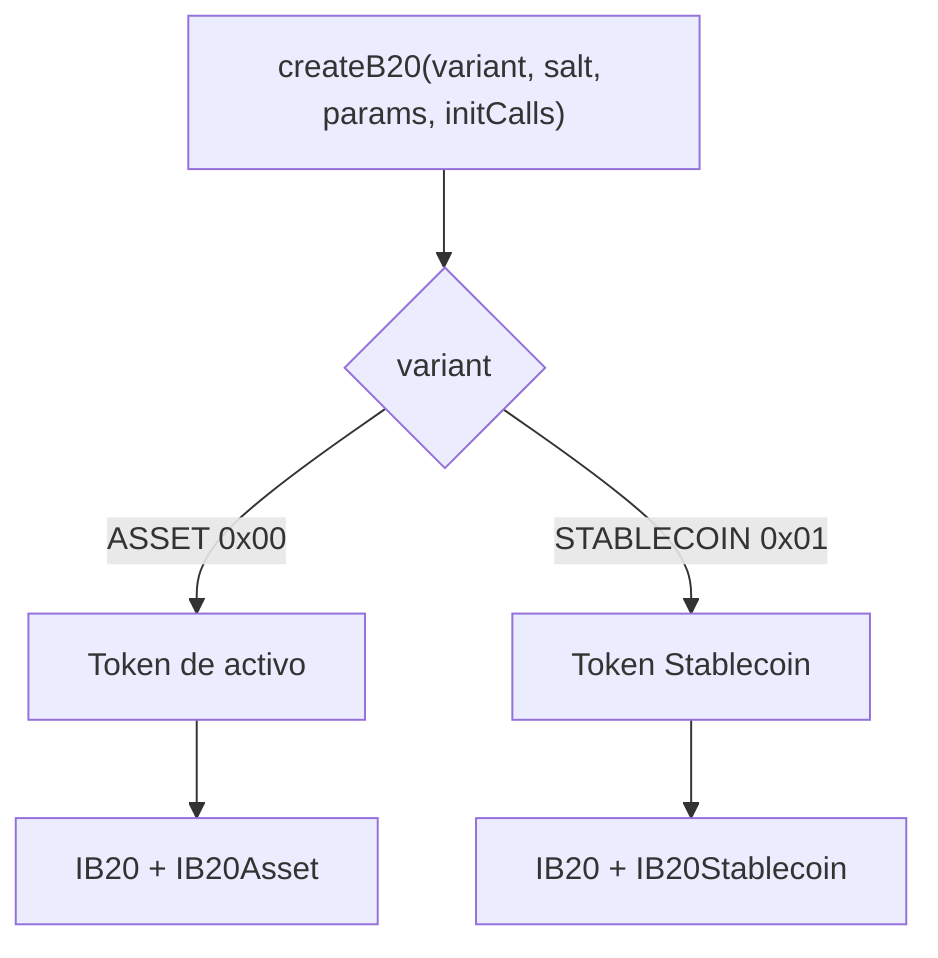
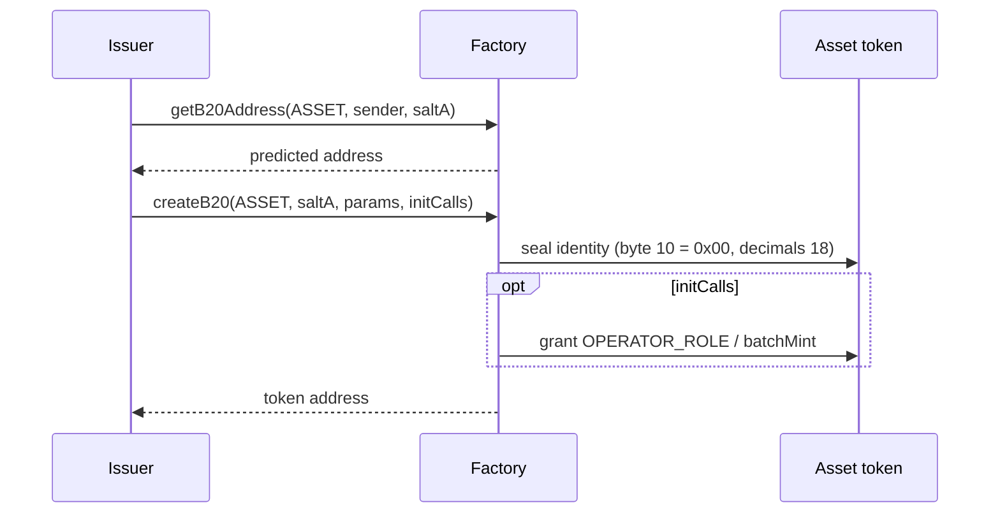
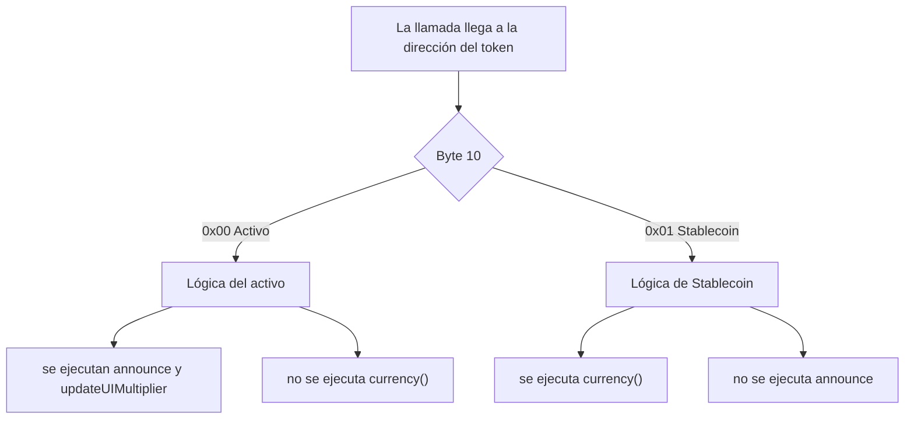

*Qué son Asset y Stablecoin, cómo `createB20` deja fijado el tipo en la dirección y qué añade cada tipo a `IB20`. Los roles y las políticas son comunes a todos los tipos; consulta [Roles y pausa](/es/specifications/b20/concepts/roles-and-pause) y [Políticas](/es/specifications/b20/concepts/policies).*

## 1. Qué es un tipo de token {#1-what-a-token-type-is}

Un tipo de token B20 es la variante que se elige al crearlo. El nombre en la ABI es `B20Variant`. Hay dos variantes disponibles:

| Variante                  | Byte de dirección `[10]` | Interfaz en la dirección del token |
| ------------------------- | ------------------------ | ---------------------------------- |
| Asset (`ASSET`)           | `0x00`                   | `IB20` e `IB20Asset`               |
| Stablecoin (`STABLECOIN`) | `0x01`                   | `IB20` e `IB20Stablecoin`          |

Ambas variantes implementan `IB20`: ERC-20, roles, pausa, políticas, acuñación, quema e incautación. Cada variante añade su propio conjunto de capacidades, sin solapamiento con la otra. El estado específico de cada tipo usa un espacio de nombres [ERC-7201](https://eips.ethereum.org/EIPS/eip-7201) independiente (`base.b20.asset` o `base.b20.stablecoin`), de modo que esos campos no pueden colisionar con los slots compartidos de `base.b20` ni con los del otro tipo.

El tipo se elige una sola vez. `createB20` lo codifica en la dirección del token. Una vez que esa llamada retorna, el tipo ya no puede cambiarse.



## 2. Por qué hay dos {#2-why-there-are-two}

Los tokens de propósito general, incluidos los RWA, y los tokens vinculados a monedas fiduciarias necesitan campos distintos que definan su clase. Con una única superficie combinada, cada Asset tendría un código de moneda y cada Stablecoin, anuncios. B20 divide la superficie: Asset incluye decimales configurables, anuncios, un multiplicador de interfaz programado, metadatos adicionales y acuñación por lotes. Stablecoin incluye un código de moneda inmutable y una convención fija de `6` decimales.

Si esos extras fueran indicadores opcionales en un único binario, las reglas de clase serían comprobaciones en tiempo de ejecución, y una dirección de Stablecoin podría ejecutar selectores de Asset. Por eso, B20 compila cada variante como una implementación nativa independiente. El nodo lee el byte `[10]` de la dirección y ejecuta la lógica de esa variante. Una dirección de Stablecoin nunca ejecuta selectores de Asset, y una dirección de Asset nunca ejecuta selectores de Stablecoin.

Aun así, las billeteras, los indexadores y los emisores necesitan un único Factory, un único modelo de políticas y una única superficie ERC-20. Duplicar esa pila para cada tipo fragmentaría todas las integraciones. Por ello, la infraestructura común se mantiene compartida: Factory, Policy Registry, Activation Registry e `IB20`. Quienes solo necesitan saldos, transferencias, roles o políticas usan `IB20`. Para las llamadas específicas de cada tipo se usa `IB20Asset` o `IB20Stablecoin` en la misma dirección.

## 3. Cómo se elige el tipo {#3-how-the-type-is-chosen}

El emisor elige la variante únicamente en `createB20(variant, salt, params, initCalls)` de la Factory. La Factory codifica esa elección en la dirección del token: deriva la dirección a partir de `(variant, sender, salt)`, escribe `0xB2` en el byte `[0]` y escribe el discriminante en el byte `[10]`: Asset `0x00`, Stablecoin `0x01`. `getB20Address(variant, sender, salt)` devuelve esa dirección antes de la creación. Si la dirección ya está ocupada, `createB20` revierte con `TokenAlreadyExists`. Una vez completada la llamada, el tipo ya no puede cambiar, porque está contenido en la propia dirección.

`params` contiene la identidad. El nombre, el símbolo y `initialAdmin` son comunes a ambas variantes. Asset añade `decimals` y Stablecoin añade `currency`. El blob se codifica en ABI con un byte `version` inicial (actualmente `1`): `B20AssetCreateParams` o `B20StablecoinCreateParams`. Las `initCalls` opcionales se ejecutan sobre el nuevo token en la misma transacción. Después, la Factory renuncia a su acceso. Si esa variante no está activada (`B20Asset` / `B20Stablecoin`), `createB20` revierte con `FeatureNotActivated`. Desactivar una variante impide crear nuevos tokens de ese tipo, pero los tokens existentes siguen funcionando.

Tras la creación, el nodo lee el byte de variante de la dirección y ejecuta la lógica correspondiente a esa variante. Consulta [`isB20`](/specifications/b20/reference/interfaces/ib20-factory/is-b20) e [`isB20Initialized`](/specifications/b20/reference/interfaces/ib20-factory/is-b20-initialized) para ver cómo los llamadores detectan un token activo.

## 4. Asset {#4-asset}

Asset es la variante de propósito general, que incluye activos del mundo real (RWA). No es un tipo exclusivo para RWA. La superficie específica del tipo es [`IB20Asset`](/specifications/b20/reference/interfaces/ib20-asset), que extiende `IB20` en la misma dirección.

Al crearse, se fija un valor inmutable de `decimals` dentro de `[6, 18]`. Los valores fuera de ese rango revierten con `InvalidDecimals`. Asset no tiene `currency()`.

Añade las llamadas exclusivas de Asset: `announce`, para divulgar una acción corporativa con un `id` de un solo uso y llamadas internas opcionales; `updateUIMultiplier` / `cancelUIMultiplierUpdate` programadas ([ERC-8056](https://eips.ethereum.org/EIPS/eip-8056)); un almacén de metadatos adicionales de tipo clave/valor, y `batchMint`. `OPERATOR_ROLE` es exclusivo de Asset y controla el acceso a `announce` y a las actualizaciones del multiplicador. El nombre, el símbolo, la URI del contrato y los metadatos adicionales siguen usando el `METADATA_ROLE` heredado.

El estado específico de Asset reside en `base.b20.asset`: `decimals`, `multiplier`, los ID de anuncios ya usados, los metadatos adicionales y el multiplicador pendiente. El estado compartido de ERC-20, roles, políticas y pausa permanece en `base.b20`.

## 5. Stablecoin {#5-stablecoin}

Stablecoin es la variante vinculada a una moneda fiduciaria.

`currency` es obligatorio e inmutable. Solo puede contener caracteres ASCII en mayúsculas de `A` a `Z`, por ejemplo `"USD"`. Un código vacío revierte con `MissingRequiredField`. Cualquier otro byte revierte con `InvalidCurrency`.

`decimals` está fijado en `6`. El emisor no especifica los decimales.

La única superficie adicional respecto a `IB20` es `currency()`. Stablecoin no tiene anuncio, multiplicador, metadatos adicionales, `batchMint` ni `OPERATOR_ROLE`.

El estado específico de Stablecoin se almacena en `base.b20.stablecoin` (solo `currency`). El estado compartido de ERC-20, roles, políticas y pausa permanece en `base.b20`.

`B20Created.variantEventParams` contiene `currency` codificado en ABI para Stablecoin. Para Asset, está vacío.

## 6. Ejemplo {#6-example}

Un mismo emisor puede crear ambos tipos. Salts distintos generan direcciones distintas. El tipo se puede ver en el byte `[10]`. Los selectores específicos de un tipo no funcionan con el otro. Reutilizar la misma tupla `(variant, sender, salt)` revierte con `TokenAlreadyExists`.

### 6.1 Creación de una Stablecoin {#61-creating-a-stablecoin}

Predice la dirección con `getB20Address(STABLECOIN, sender, saltB)`. A continuación, llama a `createB20` con `B20StablecoinCreateParams`: `version` `1`, nombre, símbolo, `initialAdmin` y `currency: "USD"`.

```mermaid 1 Creating a Stablecoin Diagram lines wrap expandable highlight={1}
sequenceDiagram
    participant Issuer
    participant Factory
    participant Token as Stablecoin token

    Issuer->>Factory: getB20Address(STABLECOIN, sender, saltB)
    Factory-->>Issuer: predicted address
    Issuer->>Factory: createB20(STABLECOIN, saltB, params, [])
    Factory->>Token: seal identity (byte 10 = 0x01, currency USD, decimals 6)
    Factory-->>Issuer: token address
```

Tras el retorno, el byte `[10]` de la dirección es `0x01`, `decimals()` devuelve `6` y `currency()` devuelve `"USD"`. La interfaz específica del tipo es [`IB20Stablecoin`](/specifications/b20/reference/interfaces/ib20-stablecoin). Llamar a `announce` en esa dirección no ejecuta la lógica de Asset.

### 6.2 Creación de un Asset {#62-creating-an-asset}

Predice la dirección con `getB20Address(ASSET, sender, saltA)`. A continuación, llama a `createB20` con `B20AssetCreateParams`: `version` `1`, nombre, símbolo, `initialAdmin` y `decimals: 18`. Opcionalmente, `initCalls` permite otorgar `OPERATOR_ROLE` o llamar a `batchMint` en la misma transacción.



Tras el retorno, el byte `[10]` de la dirección es `0x00`. `decimals()` devuelve `18`. Las funciones `announce` y `updateUIMultiplier` de [`IB20Asset`](/specifications/b20/reference/interfaces/ib20-asset) están activas. No existe `currency()`.

### 6.3 Una llamada posterior {#63-a-later-call}

Una llamada a la dirección del token no vuelve a elegir el tipo. El nodo lee el byte `[10]` y ejecuta la lógica de esa variante.

