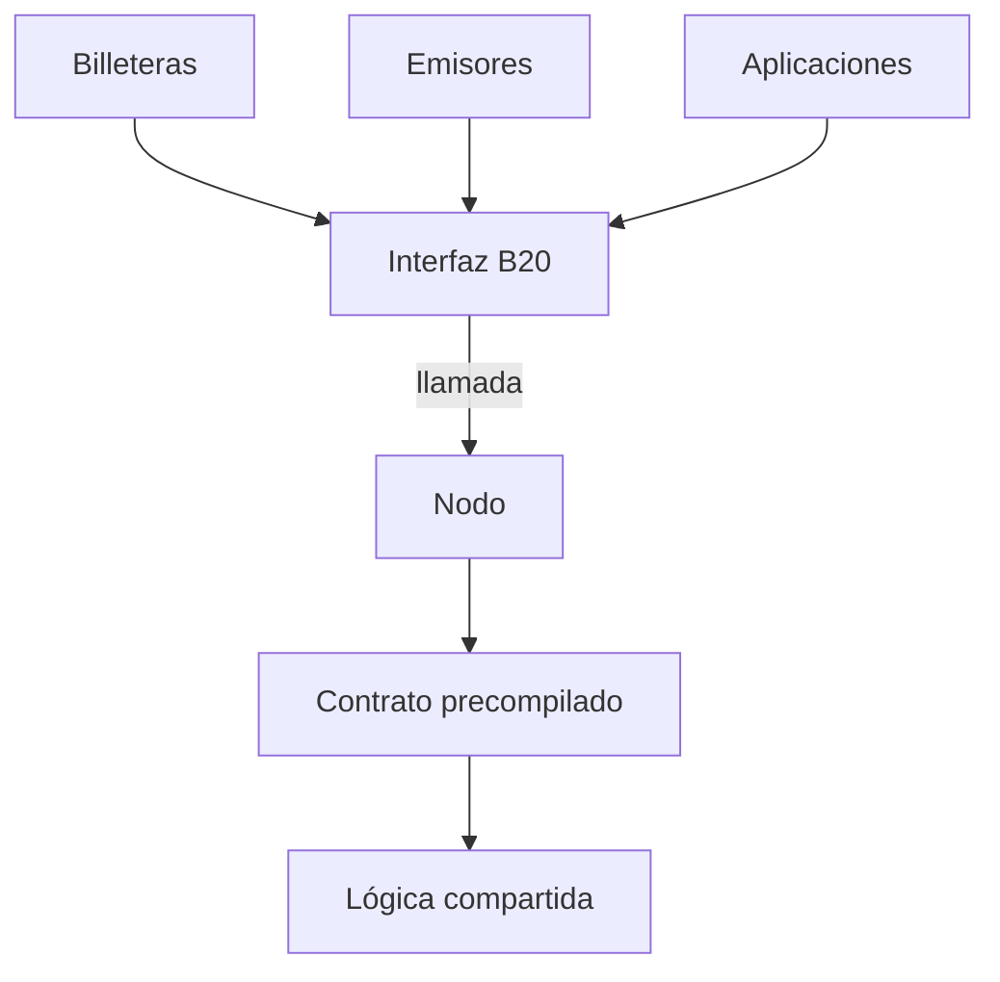
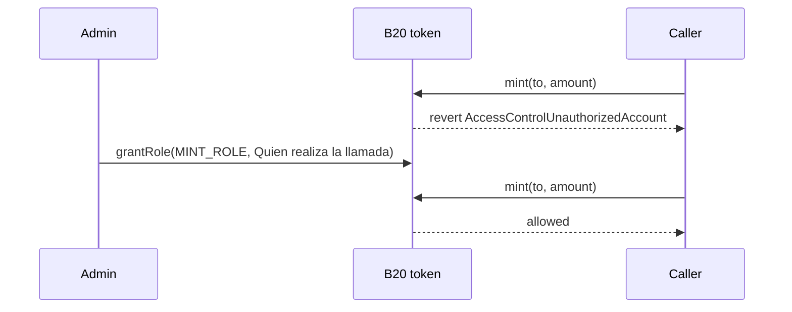
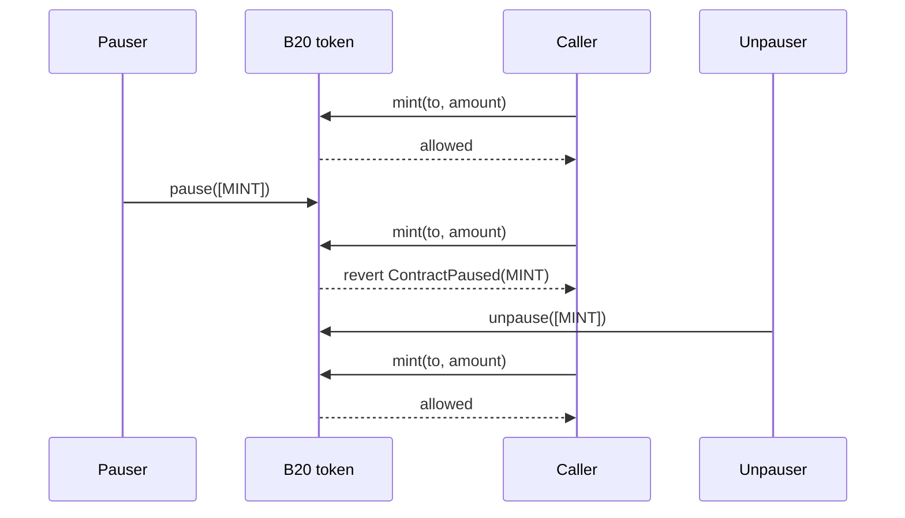

B20 es el estándar de token nativo de Base para emitir y gestionar activos programables onchain.

Este documento ofrece una introducción general a B20: qué es, por qué existe, qué primitivas fundamentales expone y cómo encajan todas esas piezas.

## Conceptos {#concepts}

<CardGroup cols={2}>
  <Card title="Tipos de tokens" icon="coins" href="/es/specifications/b20/concepts/token-types">
    Compara las variantes Asset y Stablecoin y sus capacidades.
  </Card>

  <Card title="Políticas" icon="shield-check" href="/es/specifications/b20/concepts/policies">
    Configura listas de permitidos, listas de bloqueados, políticas compuestas y ámbitos de las políticas.
  </Card>

  <Card title="Roles y pausa" icon="user-lock" href="/es/specifications/b20/concepts/roles-and-pause">
    Asigna permisos operativos y pausa funciones concretas del token.
  </Card>

  <Card title="Multiplicadores de UI" icon="chart-column" href="/es/specifications/b20/concepts/multipliers">
    Entiende cómo funciona el multiplicador de Asset y los saldos de UI de ERC-8056.
  </Card>
</CardGroup>

## Construye en Base {#build-on-base}

Usa estas demos de Build on Base para crear y gestionar tokens B20.

<CardGroup cols={2}>
  <Card title="Crear un token de activo" icon="building-columns" href="/es/build-on-base/issue-rwa/create-an-asset-token">
    Crea un token B20 Asset con un despliegue determinista mediante una factory.
  </Card>

  <Card title="Emitir una stablecoin" icon="coins" href="/es/build-on-base/issue-stablecoins/issue-your-stablecoin">
    Crea una B20 Stablecoin con un código de moneda inmutable.
  </Card>

  <Card title="Restringir los titulares elegibles" icon="user-check" href="/es/build-on-base/issue-rwa/restrict-eligible-holders">
    Aplica una política que limite la titularidad del activo a las cuentas elegibles.
  </Card>

  <Card title="Aplicar un multiplicador" icon="chart-column" href="/es/build-on-base/issue-rwa/apply-a-multiplier">
    Programa o aplica un multiplicador de Asset UI para una operación societaria.
  </Card>
</CardGroup>

## Referencia {#reference}

Para consultar los detalles técnicos, revisa las [interfaces de B20](/es/specifications/b20/reference/interfaces) y las [constantes de B20](/es/specifications/b20/reference/constants).

<CardGroup cols={2}>
  <Card title="Interfaces" icon="file-contract" href="/es/specifications/b20/reference/interfaces">
    Explora las interfaces de B20, el código fuente canónico en Solidity e importaciones listas para copiar y pegar.
  </Card>

  <Card title="Constantes" icon="table" href="/es/specifications/b20/reference/constants">
    Encuentra direcciones de precompilados, identificadores de roles, ámbitos de políticas y límites de validación.
  </Card>

  <Card title="Errores" icon="bug" href="/es/specifications/b20/reference/errors">
    Consulta los errores personalizados, sus selectores y las condiciones que los provocan.
  </Card>

  <Card title="Eventos" icon="bolt" href="/es/specifications/b20/reference/events">
    Consulta los eventos de B20 y en qué casos los emite cada interfaz.
  </Card>
</CardGroup>

## Registro de cambios {#changelog}

<Card title="Registro de cambios" href="/es/specifications/b20/changelog">
  Consulta la evolución de B20: sus actualizaciones y los cambios en el protocolo.
</Card>

***

## ¿Qué es B20? {#what-is-b20}

B20 es el estándar de tokens nativo de Base para emitir y gestionar activos programables onchain. Base lo creó para estandarizar la emisión de activos del mundo real (RWA) y de stablecoins. B20 es un superconjunto de ERC-20: los saldos, las transferencias y las aprobaciones funcionan igual que en ERC-20, y todos los activos B20 comparten las mismas interfaces adicionales y la misma lógica de protocolo, en lugar de que cada emisor despliegue su propia implementación de token.

El estándar también incluye controles administrativos y de cumplimiento normativo. Los emisores pueden configurar roles y permisos, asociar políticas, acuñar y quemar suministro, pausar operaciones y realizar otras acciones administrativas que suelen exigir los flujos de trabajo con activos regulados.

B20 se ejecuta como precompilados en el nodo de Base, no como código Solidity independiente para cada token. Las billeteras, los emisores y las aplicaciones llaman a interfaces al estilo de ERC-20, y el nodo ejecuta de forma nativa la lógica compartida de B20. Base actualiza esa lógica mediante hardforks, de modo que quien la invoque obtiene un comportamiento coherente y una ejecución nativa en todos los activos B20.

### De un vistazo {#at-a-glance}



Un activo B20 se invoca igual que cualquier otro contrato: a través de su interfaz en la dirección del activo. Todos los activos B20 usan esa misma interfaz y la misma lógica del precompilado, por lo que los integradores cuentan con una única fuente de verdad.

***

## ¿Por qué B20? {#why-b20}

La emisión onchain de activos del mundo real (RWA) requiere un estándar de token compartido que integre el cumplimiento normativo en el propio activo. ERC-20 cubre saldos, transferencias y aprobaciones, pero los activos regulados también necesitan verificaciones de elegibilidad, roles, acuñación y quema, pausas y otros controles administrativos. Los emisores vuelven a construir esas primitivas para prácticamente cada activo tokenizado.

Los emisores que implementan esa pila por su cuenta repiten la misma lógica, acaban con comportamientos dispares y obligan a cada billetera y aplicación a integrar un token personalizado. B20 ofrece una alternativa: creas un activo B20 y configuras sus roles y políticas, en lugar de escribir y mantener un token hecho a medida. El cumplimiento normativo es una primitiva de primera clase, no un añadido que cada emisor diseña en torno a las transferencias.

Contar con un único estándar también beneficia a integradores y emisores. Las billeteras y aplicaciones se integran con una sola interfaz, y los emisores pueden usar servicios compartidos, como oráculos, sin tener que diseñar una nueva integración para cada activo.

***

## Creación de un B20 Asset {#creating-a-b20-asset}

Todos los tokens B20 se crean a través de la Factory, un precompilado singleton. Para enviar `createB20` a un nodo de Base, se procede igual que con cualquier otra llamada a un contrato.

```mermaid Creating a B20 Asset Diagram lines wrap expandable highlight={1}
sequenceDiagram
    participant Issuer
    participant Factory
    participant Token as B20 token

    Issuer->>Factory: createB20(variant, salt, params, initCalls)
    Factory->>Token: seal identity
    Factory->>Token: initCalls (grantRole, updatePolicy, mint)
    Factory-->>Issuer: token address
```

1. El emisor llama a `createB20` con una variante, un salt y los parámetros de creación (nombre, símbolo, administrador inicial y campos específicos de la variante).
2. La Factory asigna una dirección determinista a partir de `(variant, sender, salt)` y sella la identidad del token.
3. Las `initCalls` opcionales se ejecutan sobre el nuevo token para que el emisor pueda otorgar roles, asociar políticas o acuñar tokens en la misma transacción.
4. `createB20` finaliza. La Factory no conserva ningún acceso permanente al token.

Elige **Asset** para emisiones de uso general, incluidos los RWA, o **Stablecoin** para un token vinculado a una moneda fiduciaria con un código de moneda fijo. Ambas variantes comparten roles, políticas y la interfaz ERC-20. Consulta [Tipos de token](/es/specifications/b20/concepts/token-types).

El Activation Registry es un interruptor de seguridad gestionado por Base que habilita las funcionalidades de la Factory y de los tokens. Los emisores y las aplicaciones no lo gestionan.

***

## Configuración de roles {#configuring-roles}

Los roles permiten que un emisor asigne cada operación privilegiada a una cuenta específica. Un administrador puede conceder la acuñación a un acuñador, la incautación a un operador de cumplimiento y la pausa de una sola funcionalidad (`TRANSFER`, `MINT`, `BURN` o `SEIZE`) sin pausar el resto del token.

B20 implementa esto con [OpenZeppelin AccessControl](https://docs.openzeppelin.com/contracts/5.x/access-control) en el propio token. Los roles no residen en un registro independiente. Un único titular de `DEFAULT_ADMIN_ROLE` concede y revoca los roles operativos. Una llamada privilegiada comprueba primero el rol y, después, el vector de pausa correspondiente. Cuando un titular llama a `transfer`, no se comprueba ningún rol, pero la llamada sigue sujeta al vector de pausa `TRANSFER` y a la política.

La lista completa de roles, junto con las operaciones que restringe cada uno, está en [Roles y pausa](/es/specifications/b20/concepts/roles-and-pause). Una llamada restringida por rol tiene este aspecto:



1. Al crearse el contrato, `initialAdmin` tiene asignado `DEFAULT_ADMIN_ROLE`.
2. Ese administrador otorga roles operativos, como `MINT_ROLE` y `PAUSE_ROLE`.
3. Si quien llama no tiene el rol requerido, la llamada se rechaza con `AccessControlUnauthorizedAccount`.

***

## Vectores de pausa {#pause-vectors}

Los vectores de pausa detienen un tipo de operaciones sobre un token sin pausar el resto del activo. Un emisor los utiliza cuando un flujo de trabajo off-chain requiere congelar una funcionalidad (por ejemplo, durante una ventana de liquidación) o cuando se descubre una vulnerabilidad y es necesario bloquear esa ruta de inmediato.

La pausa se aplica por funcionalidad, no de forma global. Los cuatro vectores son `TRANSFER`, `MINT`, `BURN` y `SEIZE`. Pausar `MINT` detiene la emisión de nuevos tokens, mientras que las transferencias siguen funcionando. `approve` no está sujeto a pausa.

`pause` requiere `PAUSE_ROLE`. `unpause` requiere `UNPAUSE_ROLE`. Se trata de roles independientes, por lo que la cuenta que pausa no tiene por qué ser la misma que reanuda.

Así se ve una llamada pausada:



1. Una cuenta que tiene `MINT_ROLE` puede acuñar mientras `MINT` no esté pausado.
2. Una cuenta con `PAUSE_ROLE` pausa `MINT`. Las demás funcionalidades siguen activas.
3. La siguiente llamada a `mint` revierte con `ContractPaused(MINT)`, aunque quien llama siga teniendo `MINT_ROLE`.
4. Una cuenta con `UNPAUSE_ROLE` reanuda `MINT`. La acuñación vuelve a funcionar.

***

## Integración de comprobaciones de cumplimiento normativo {#integrating-compliance-checks}

La mayoría de las comprobaciones de cumplimiento normativo se reducen a un conjunto de direcciones y a una decisión de permitir o denegar sobre una función concreta. B20 sigue ese modelo en lugar de usar hooks por token: mantienes una lista de permitidos o una lista de bloqueados, la vinculas a una función del token y la llamada se ejecuta o se revierte.

Esas listas no residen en el token, sino en el Policy Registry, un precompilado singleton global. Allí se almacenan las listas de permitidos, las listas de bloqueados y las políticas compuestas (unión o intersección), que se referencian mediante un ID de política. Al ser un registro compartido, una misma lista puede respaldar muchos tokens: gestionas la pertenencia una sola vez y todos los tokens vinculados obtienen el mismo resultado.

Un administrador del token vincula un ID de política a un ámbito de política con `updatePolicy`. Un ámbito cumple un papel similar al de un hook: se ejecuta sobre una función concreta. Cuando se ejecuta esa función, el token consulta al registro `isAuthorized(policyId, account)` y revierte con `PolicyForbids` si la comprobación falla. En [Políticas](/es/specifications/b20/concepts/policies) se detalla qué ámbito se ejecuta sobre cada función.

Una transferencia sujeta a políticas tiene este aspecto:

```mermaid Integrating Compliance Checks Diagram lines wrap expandable highlight={1}
sequenceDiagram
    participant Admin
    participant Registry as Policy Registry
    participant Token as B20 token
    participant Alice

    Admin->>Registry: createPolicy(ALLOWLIST)
    Admin->>Token: updatePolicy(TRANSFER_RECEIVER_POLICY, id)
    Alice->>Token: transfer(Bob)
    Token->>Registry: isAuthorized(id, Bob)
    Registry-->>Token: false
    Token-->>Alice: revert PolicyForbids

    Admin->>Registry: updateAllowlist(Bob)
    Alice->>Token: transfer(Bob)
    Token->>Registry: isAuthorized(id, Bob)
    Registry-->>Token: true
    Token-->>Alice: allowed
```

1. Crea una lista de permitidos o una lista de bloqueados en el registro.
2. El administrador del token vincula ese ID de política a un ámbito.
3. Al ejecutar `transfer`, el token consulta al registro si el receptor está autorizado.
4. Si está autorizado, la llamada continúa. Si se deniega, la llamada se revierte con `PolicyForbids`.
5. Los ámbitos no configurados permiten todo de forma predeterminada. `approve` no está sujeto a políticas.