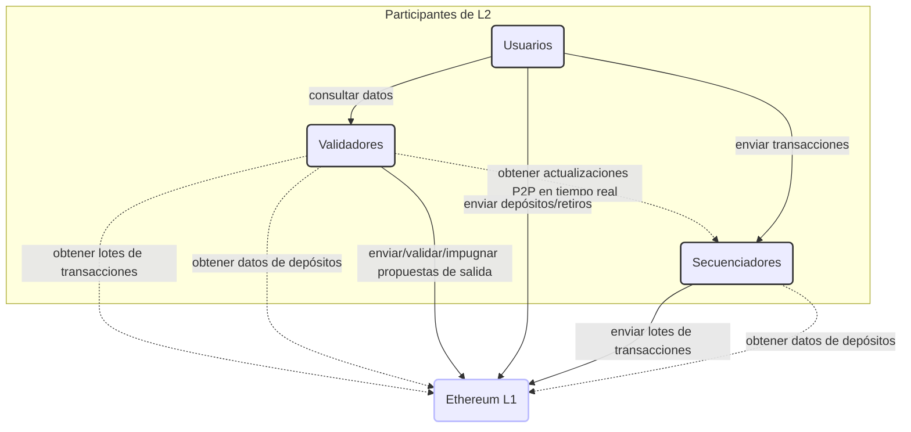
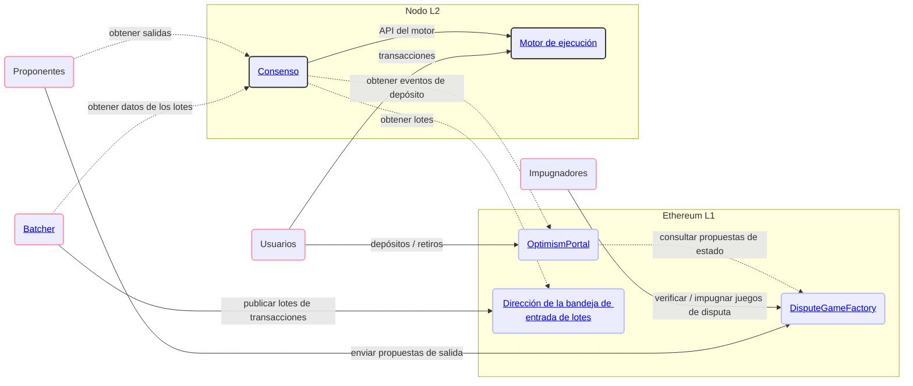
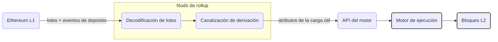
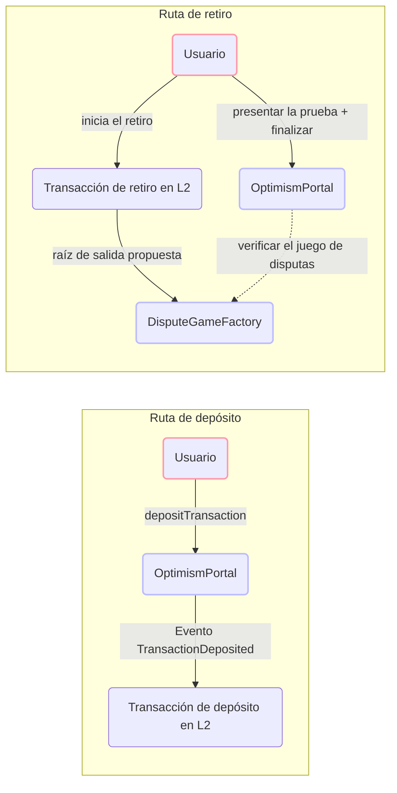
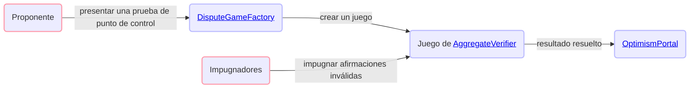
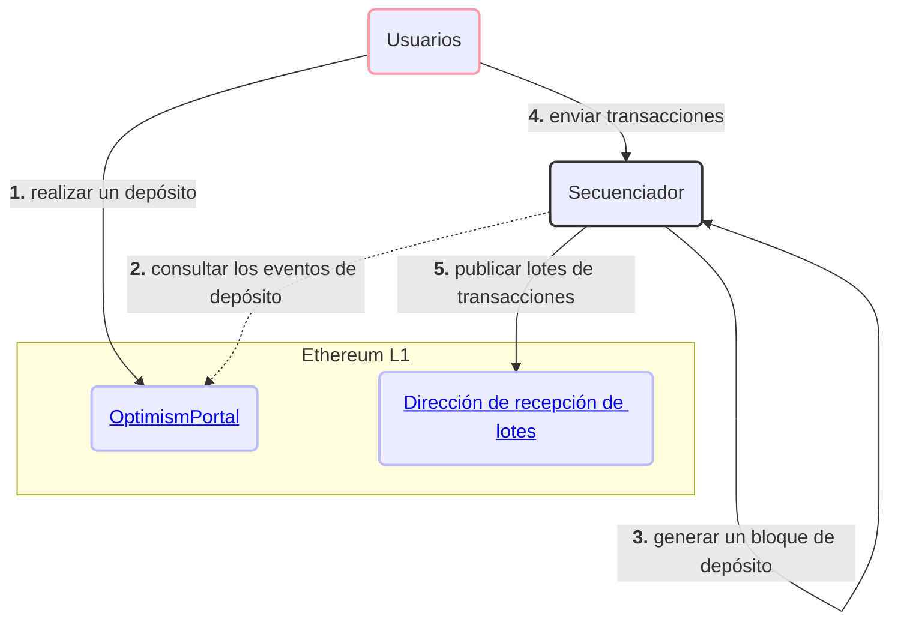
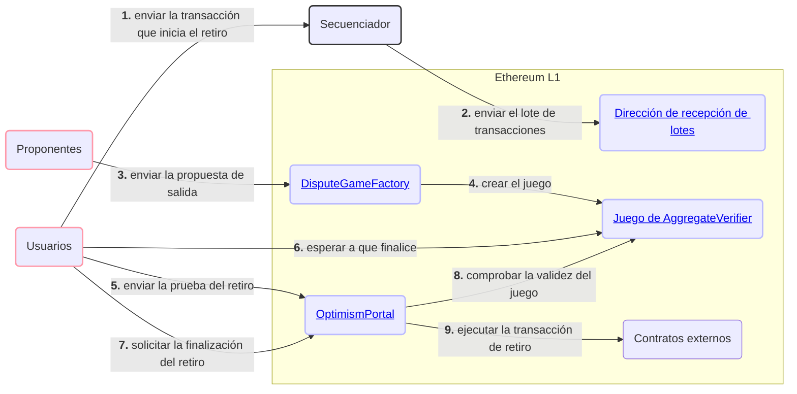

Base es un rollup construido sobre Ethereum. Los datos de las transacciones de L2 se publican en Ethereum para garantizar la disponibilidad de datos,
y las pruebas permiten que cualquiera impugne transiciones de estado no válidas. Esta página ofrece un recorrido general por los
componentes del protocolo y los principales flujos de usuario.

## Participantes de la red {#network-participants}

Hay tres actores principales que interactúan con Base: los usuarios, los secuenciadores y los validadores.

### Usuarios {#users}

Los usuarios son la categoría general de participantes de la red que:

* Envían transacciones a través del secuenciador o mediante la interacción con contratos en Ethereum.
* Consultan datos de transacciones en interfaces operadas por validadores.

### Secuenciadores {#sequencers}

El secuenciador cumple la función de productor de bloques en Base. Actualmente, Base opera con un único secuenciador activo.

El secuenciador:

* Acepta transacciones directamente de los usuarios.
* Observa las transacciones de «depósito» generadas en Ethereum.
* Consolida ambos flujos de transacciones en bloques de L2 ordenados.
* Envía a L1 información suficiente para reproducir por completo esos bloques de L2.
* Proporciona acceso en tiempo real a los bloques de L2 pendientes que aún no se han confirmado en L1.
* Produce Flashblocks cada 200 ms, con lo que se compromete con el orden de las transacciones dentro del bloque mientras este se construye.

El secuenciador desempeña un papel importante en el funcionamiento de una cadena L2, pero no es un actor de confianza. En general, el secuenciador
se encarga de mejorar la experiencia del usuario, ya que ordena las transacciones de forma mucho más rápida y económica de lo que
hoy sería posible si los usuarios enviaran todas las transacciones directamente a L1.

### Validadores {#validators}

Los validadores ejecutan la función de transición de estado de L2 de forma independiente del secuenciador. Los validadores contribuyen a mantener
la integridad de la red y sirven datos de la blockchain a los usuarios.

Por lo general, los validadores:

* Sincronizan los datos del rollup desde L1 y el secuenciador.
* Utilizan los datos del rollup para ejecutar la función de transición de estado de L2.
* Sirven a los usuarios los datos del rollup y la información calculada sobre el estado de L2.

Los validadores también pueden actuar como proponentes o impugnadores (o ambos), que:

* Envían afirmaciones sobre el estado de L2 a un contrato inteligente en L1.
* Validan las afirmaciones realizadas por otros participantes.
* Impugnan las afirmaciones no válidas realizadas por otros participantes.

## Diagrama general del sistema {#high-level-system-diagram}

El siguiente diagrama muestra cómo interactúan los principales componentes del protocolo en L1 y L2.

## Componentes del protocolo {#protocol-components}

### Consenso {#consensus}

La capa de consenso se encarga de derivar la cadena L2 canónica a partir de los datos de L1. Lee los lotes de transacciones
del Batch Inbox y los eventos de depósito de OptimismPortal, construye los atributos del payload y dirige el
motor de ejecución mediante la API del motor. Los bloques no seguros (sin confirmar) se propagan por gossip a otros nodos a través de una red
P2P dedicada, de modo que los validadores puedan acceder a ellos con baja latencia antes de que los lotes se publiquen en L1.

[Consenso →](/es/specifications/base-protocol/consensus/specification)

### Ejecución {#execution}

El motor de ejecución es un runtime basado en Reth. Expone la API JSON-RPC estándar de Ethereum y
procesa los bloques producidos por la capa de consenso. Los predeploys (contratos del sistema en direcciones fijas de L2), los precompilados
y los contratos preinstalados amplían la EVM con funcionalidades específicas del rollup, como la distribución de comisiones, la inyección
de atributos de bloque de L1 y la mensajería entre dominios.

[Ejecución →](/es/specifications/base-protocol/execution/l2-execution-engine)

### Puentes {#bridging}

Los depósitos pasan del contrato `OptimismPortal` en L1 a L2 como transacciones de depósito especiales que se incluyen al
inicio de cada bloque de L2. Los retiros siguen el camino inverso: se inicia una transacción de retiro en L2,
un proponente envía un output root a `DisputeGameFactory` y, una vez transcurrido el período de impugnación, el usuario prueba y
finaliza el retiro en L1 mediante `OptimismPortal`.

[Puentes →](/es/specifications/base-protocol/bridging/deposits)

### Batcher {#batcher}

El Batcher es un servicio operado por el secuenciador que comprime los datos de transacciones de L2 en tramas de channel y las publica
como calldata (o blobs) en la dirección de la bandeja de entrada de lotes de L1. Esta es la capa de disponibilidad de datos que permite
que cualquier validador reconstruya de forma independiente la cadena L2 a partir de L1.

[Batcher →](/es/specifications/base-protocol/batcher)

```mermaid Batcher Flow lines wrap expandable
graph LR
    Sequencer(Secuenciador)
    Batcher(<a href="/specifications/base-protocol/batcher">Agrupador de lotes</a>)
    BatchInbox(<a href="/specifications/reference/glossary#batcher-transaction">Dirección de la bandeja de entrada de lotes</a>)
    RollupNode(<a href="/specifications/base-protocol/consensus/specification">Nodo de rollup</a>)

    Sequencer -->|Bloques de L2| Batcher
    Batcher -->|tramas de canal comprimidas| BatchInbox
    BatchInbox -.->|recuperar lotes| RollupNode

    classDef l1 stroke:#bbf,stroke-width:2px;
    classDef l2 stroke:#333,stroke-width:2px;
    classDef systemUser stroke:#f9a,stroke-width:2px;
    class BatchInbox l1;
    class RollupNode l2;
    class Batcher,Sequencer systemUser;
```

### Pruebas {#proofs}

Las propuestas de salida y las pruebas permiten verificar el estado de L2. Los proponentes crean juegos de punto de control
mediante `DisputeGameFactory`, los contratos verificadores onchain comprueban el material de prueba y
los impugnadores pueden disputar afirmaciones no válidas. Los retiros válidos solo pueden finalizarse mediante
`OptimismPortal` una vez que el juego asociado se resuelva a favor del proponente.

[Pruebas →](/es/specifications/base-protocol/proofs/overview)

## Flujos de usuario principales {#core-user-flows}

### Depositar ETH en Base {#depositing-eth-to-base}

Los usuarios suelen empezar a usar la L2 depositando ETH desde la L1.
Una vez que tienen ETH para pagar las comisiones, comienzan a enviar transacciones en la L2.
El siguiente diagrama muestra esta interacción y los componentes clave del protocolo de Base.

### Envío de transacciones en Base {#sending-transactions-on-base}

Enviar transacciones en Base funciona igual que en Ethereum. Los usuarios firman las transacciones y las envían mediante
`eth_sendRawTransaction` al endpoint JSON-RPC de cualquier nodo. El secuenciador las recoge de su mempool,
las ordena en bloques de L2 y, posteriormente, publica el lote en L1.

### Retirar fondos de Base {#withdrawing-from-base}

Los usuarios también pueden querer retirar ETH o tokens ERC20 de Base y devolverlos a Ethereum. Los retiros se inician
como transacciones estándar en L2, pero luego se completan mediante transacciones en L1. Los retiros deben hacer referencia a un
contrato de juego de pruebas válido que proponga el estado de L2 en un momento determinado.

