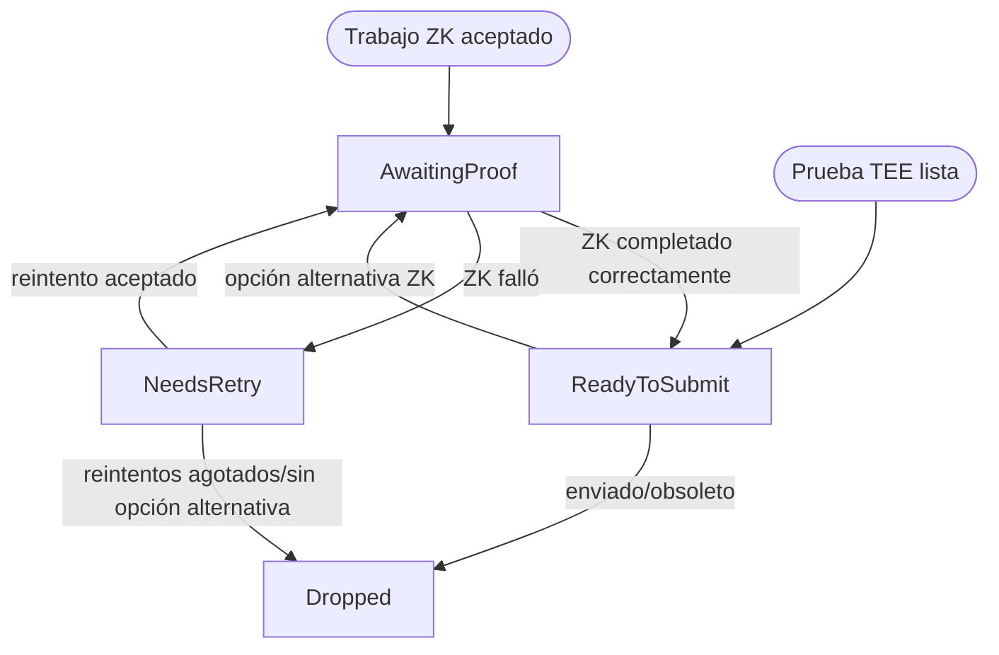

El challenger es un servicio offchain que protege el sistema de pruebas al comprobar de forma independiente
los juegos `AggregateVerifier` en curso contra el estado canónico de L2. Cuando detecta una raíz de
checkpoint inválida, obtiene el material de prueba que exige el contrato del juego y envía una transacción
de disputa en L1.

En la ruta ZK, el challenger no requiere permisos: cualquier operador con acceso a RPC canónicos de L1 y L2,
a un servicio de generación de pruebas ZK y a un firmante de transacciones de L1 puede ejecutarlo. Base también puede ejecutar un challenger
con acceso a un endpoint de pruebas TEE, de modo que los juegos inválidos respaldados por TEE puedan anularse por una vía más rápida
antes de recurrir a ZK.

## Responsabilidades {#responsibilities}

Un challenger conforme realiza las siguientes tareas:

1. Examinar los juegos recientes de `DisputeGameFactory`.
2. Seleccionar los juegos que siguen en estado `IN_PROGRESS` y cuyo estado de prueba pueda requerir alguna acción.
3. Recalcular los output roots de los checkpoints correspondientes a partir de un nodo de L2.
4. Identificar el primer root de checkpoint no válido, o determinar si un desafío ZK se dirigió a un
   checkpoint válido.
5. Obtener una prueba TEE o ZK para el intervalo de checkpoints que deba probarse.
6. Enviar `nullify()` o `challenge()` al contrato del juego.
7. Hacer seguimiento del ciclo de vida del bono resultante cuando esté configurado para reclamar bonos.

El challenger no determina el estado canónico de L2 confiando en el juego. Recalcula los roots a partir de
los encabezados y las pruebas de cuenta de L2, y trata el juego como una entrada que debe verificarse.

## Selección de juegos {#game-selection}

El challenger lee el valor actual de `AnchorStateRegistry.anchorGame()`, localiza ese juego en el
arreglo de índices de la factory y recorre todos los índices posteriores de la factory. Si el registro sigue en el ancla
inicial, o si el juego ancla no se encuentra en la factory, el recorrido comienza en el índice `0`. Los juegos
observados en estado `IN_PROGRESS` se siguen monitorizando hasta que se resuelven o quedan completamente anulados, de modo que las métricas reflejan
el conjunto activo posterior al ancla. Cada recorrido vuelve a evaluar todo el rango posterior al ancla, por lo que los juegos pueden pasar
de una categoría a otra a medida que se publican onchain nuevas pruebas, impugnaciones o anulaciones. Los fallos al consultar juegos
individuales se registran y se reintentan en el siguiente recorrido, sin interrumpir el recorrido completo.

Un juego solo se selecciona cuando `status() == IN_PROGRESS`. A continuación, el challenger lee:

* `teeProver()`
* `zkProver()`
* `counteredByIntermediateRootIndexPlusOne()`
* `rootClaim()`
* `l2SequenceNumber()`
* `startingBlockNumber()`
* `l1Head()`
* `INTERMEDIATE_BLOCK_INTERVAL()` de la implementación del juego correspondiente al tipo de juego

La tupla `(teeProver, zkProver, countered index)` determina la categoría del candidato.

| Prover TEE       | Prover ZK        | Índice impugnado | Categoría                  | Acción del challenger                                                                                                                                  |
| ---------------- | ---------------- | ---------------- | -------------------------- | ------------------------------------------------------------------------------------------------------------------------------------------------------ |
| distinto de cero | cero             | `0`              | Propuesta TEE inválida     | Validar todas las raíces de checkpoint. Si son inválidas, priorizar la anulación TEE y, en su defecto, recurrir a `challenge()` de ZK.                 |
| distinto de cero | distinto de cero | `> 0`            | Desafío ZK fraudulento | Validar solo el checkpoint impugnado. Si la raíz impugnada es correcta, enviar `nullify()` de ZK.                                                      |
| cero             | distinto de cero | `0`              | Propuesta ZK inválida      | Validar todas las raíces de checkpoint. Si son inválidas, enviar `nullify()` de ZK.                                                                    |
| distinto de cero | distinto de cero | `0`              | Propuesta dual inválida    | Validar todas las raíces de checkpoint. Si son inválidas, anular primero la prueba TEE y luego volver a recorrer para gestionar la prueba ZK restante. |

Los juegos con ambas direcciones de prover en cero ya están completamente anulados y se omiten. Los juegos solo TEE o
solo ZK con un índice impugnado distinto de cero se consideran estados inesperados y se omiten.

## Validación del output root {#output-root-validation}

En una propuesta no impugnada, el challenger valida las raíces intermedias enviadas. Para el índice
`i`, el bloque de checkpoint es:

```text Checkpoint Block Formula
startingBlockNumber + INTERMEDIATE_BLOCK_INTERVAL * (i + 1)
```

El número de raíces enviadas debe ser igual a:

```text Submitted Root Count
(l2SequenceNumber - startingBlockNumber) / INTERMEDIATE_BLOCK_INTERVAL
```

El intervalo debe ser distinto de cero y el bloque inicial debe ser inferior al número de secuencia L2
propuesto. Un desbordamiento aritmético o una discrepancia en el número de checkpoints hacen que la validación falle en ese ciclo de escaneo.

Para cada bloque de checkpoint, el challenger calcula el output root esperado de la siguiente manera:

1. Obtiene el encabezado del bloque L2 a partir del número de bloque.
2. Verifica que el hash del encabezado proporcionado por el RPC coincida con el hash calculado a partir del encabezado de consenso.
3. Obtiene una prueba de cuenta `eth_getProof` para `L2ToL1MessagePasser` en ese hash de bloque.
4. Verifica la prueba de cuenta con la raíz de estado del encabezado.
5. Construye el output root a partir de la raíz de estado de L2, la raíz de almacenamiento de `L2ToL1MessagePasser` y el hash
   del bloque L2.
6. Compara la raíz calculada con la raíz almacenada en el juego.

Las raíces intermedias se validan de forma concurrente, pero los resultados se procesan en el orden de los checkpoints. La
primera discrepancia determina los valores de `intermediateRootIndex` y `intermediateRootToProve` que se usan en la
transacción de disputa. `intermediateRootToProve` es la raíz correcta calculada localmente para el checkpoint
no válido.

Si el bloque L2 solicitado aún no está disponible, el challenger omite el juego en ese ciclo de escaneo.
El juego sigue siendo elegible y se volverá a intentar en el siguiente escaneo.

## Validación de desafíos ZK fraudulentos {#fraudulent-zk-challenge-validation}

Cuando una propuesta TEE ha sido desafiada mediante una prueba ZK, el juego almacena un índice impugnado basado en 1.
El challenger lo convierte en un índice de checkpoint basado en 0 y valida únicamente ese checkpoint.

Si la raíz onchain en el índice desafiado no coincide con la raíz calculada localmente, el desafío ZK
era legítimo y el challenger no hace nada. Si la raíz onchain coincide con la raíz
local, el desafío ZK apuntaba a un checkpoint correcto y, por tanto, es fraudulento. En ese caso, el challenger obtiene
una prueba ZK para ese intervalo de checkpoints y envía `nullify()`.

Esta validación se limita intencionadamente al índice desafiado. Que haya raíces inválidas anteriores no hace legítimo un
desafío contra una raíz válida posterior.

## Obtención de pruebas {#proof-sourcing}

El challenger prueba únicamente el intervalo que contiene el checkpoint inválido. El ancla de confianza es
la raíz del checkpoint anterior o, cuando el checkpoint inválido tiene el índice `0`, el estado de
`startingBlockNumber` del juego.

Para una solicitud de prueba ZK:

* `start_block_number` es el inicio del intervalo del checkpoint inválido.
* `number_of_blocks_to_prove` es `INTERMEDIATE_BLOCK_INTERVAL`.
* `proof_type` es Groth16 SNARK.
* `session_id` se deriva de forma determinista de `(game address, invalid checkpoint index)`.
* `prover_address` es la dirección de L1 que enviará la transacción.
* `l1_head` es el hash de la cabeza de L1 que se almacenó en el juego al crearlo.

Al ser determinista, el ID de sesión hace que las solicitudes de prueba sean idempotentes entre reintentos.

Cuando la obtención de pruebas TEE está configurada y el juego tiene un prover TEE, el challenger intenta primero la
vía TEE para las propuestas TEE inválidas y las propuestas duales inválidas. La solicitud TEE utiliza el `l1Head` del juego, el
número de bloque de L1 correspondiente, el output de L2 acordado, calculado localmente, al inicio del intervalo
y la output root esperada en el checkpoint inválido. El challenger solo acepta el resultado TEE
si la output root del enclave coincide con la raíz esperada calculada localmente y, a continuación, codifica los bytes de la prueba
de disputa TEE para `nullify()`.

Si la solicitud TEE falla o se agota el tiempo de espera, el challenger recurre a ZK. Si se obtiene una prueba TEE
pero la transacción `nullify()` de TEE falla, la entrada pendiente pasa a convertirse en una solicitud de prueba ZK
en lugar de reintentar indefinidamente la misma transacción TEE.

## Transacciones de disputa {#dispute-transactions}

El challenger envía una de estas dos llamadas al juego:

| Intención | Llamada al contrato                                                     | Se usa para                                                                                              |
| --------- | ----------------------------------------------------------------------- | -------------------------------------------------------------------------------------------------------- |
| Anular    | `nullify(proofBytes, intermediateRootIndex, intermediateRootToProve)`   | Eliminar una prueba TEE no válida, eliminar una prueba ZK no válida o refutar un desafío ZK fraudulento. |
| Desafiar  | `challenge(proofBytes, intermediateRootIndex, intermediateRootToProve)` | Desafiar una propuesta TEE no válida con una prueba ZK.                                                  |

Las pruebas TEE siempre van dirigidas a `nullify()`. Las pruebas ZK pueden dirigirse a `challenge()` o a `nullify()`,
según la categoría del candidato.

Antes de enviar una prueba o de reintentar una que haya fallado, el challenger vuelve a comprobar el estado del juego y los slots
del prover. Si el juego ya se ha resuelto, ya ha sido desafiado o el slot del prover correspondiente
ya se ha puesto a cero, la prueba pendiente se descarta. Así se evitan transacciones duplicadas cuando
otro actor ya se ha encargado del juego.

## Ciclo de vida de las pruebas pendientes {#pending-proof-lifecycle}

Cada prueba pendiente se indexa por la dirección del juego y registra:

* tipo de prueba: TEE o ZK
* índice del checkpoint inválido
* raíz esperada para ese checkpoint
* intención de disputa
* número de reintentos
* fase

La máquina de estados de fases es la siguiente:



Las pruebas ZK se consultan periódicamente al servicio de generación de pruebas hasta que el trabajo se completa correctamente, falla o sigue pendiente.
Los recibos ZK correctos llevan como prefijo el byte del tipo de prueba ZK antes de enviarse. Los trabajos de prueba fallidos
se reintentan hasta tres veces. Una prueba TEE pasa a `ReadyToSubmit` en cuanto se obtiene;
si su transacción falla, el challenger solicita de inmediato la prueba ZK de respaldo generada previamente, si
hay alguna disponible. Si no existe ninguna solicitud de respaldo, la entrada se descarta; si falla la llamada de respaldo a `prove_block`,
la entrada permanece en `NeedsRetry` hasta el siguiente tick. Si una prueba sigue pendiente, si falla una
transacción ZK o si falla un reintento de `prove_block`, la prueba se mantiene en su fase actual hasta
el siguiente tick. Una prueba pendiente no genera lecturas del contrato para ese juego en ese tick.

## Reclamación de bonos {#bond-claiming}

La reclamación de bonos es opcional y se habilita configurando direcciones de reclamación. Cuando está habilitada, el challenger
hace seguimiento de los juegos cuyo `bondRecipient()` o cuyo `zkProver()` previo a la resolución coincide con alguna de esas direcciones.
Esto permite que un challenger recupere los juegos reclamables tras un reinicio y descubra juegos gestionados por
otros actores.

El ciclo de vida del bono es el siguiente:

1. `NeedsResolve`: esperar a `gameOver()` y, a continuación, enviar `resolve()`.
2. `NeedsUnlock`: enviar el primer `claimCredit()` para desbloquear el crédito de `DelayedWETH`.
3. `AwaitingDelay`: esperar a que transcurra el retardo de `DelayedWETH`.
4. `NeedsWithdraw`: enviar el segundo `claimCredit()` para retirar el crédito.

Tras la resolución, el challenger vuelve a leer `bondRecipient()` y deja de hacer seguimiento del juego si el bono
ya no puede reclamarlo ninguna dirección configurada. En los juegos que se resuelven como `DEFENDER_WINS`, también
intenta, en la medida de lo posible, actualizar mediante `AnchorStateRegistry.setAnchorState(game)`. La llamada al registro no
requiere permisos y se autovalida; las llamadas prematuras o no válidas pueden revertir y reintentarse.

## Ciclo de vida del servicio {#service-lifecycle}

Al iniciarse, el challenger:

1. Crea clientes RPC de L1 y L2.
2. Crea el gestor de transacciones de L1 a partir del firmante configurado.
3. Crea los clientes de `DisputeGameFactory` y `AggregateVerifier`.
4. Crea el cliente de pruebas ZK y, opcionalmente, el cliente de pruebas TEE.
5. Inicia el servidor de health checks.
6. Inicia el bucle del driver.

En cada tick del driver:

1. Consulta las sesiones de prueba pendientes y envía las disputas que ya estén listas.
2. Detecta los bonos que se pueden reclamar y hace avanzar las reclamaciones de bonos en seguimiento.
3. Busca juegos candidatos en curso.
4. Valida los nuevos candidatos e inicia sus pruebas.

El endpoint de health check solo indica que el servicio está listo después del primer paso exitoso del driver. El apagado se controla mediante
un token de cancelación, de modo que el driver y el servidor de health checks se detienen a la vez.

## Entradas del operador {#operator-inputs}

Un challenger necesita:

* Endpoint RPC de L1.
* Endpoint RPC de ejecución de L2.
* Dirección de `DisputeGameFactory`.
* Dirección de `AnchorStateRegistry`.
* Endpoint RPC de pruebas ZK.
* Firmante de transacciones de L1.
* Intervalo de sondeo.

Entradas opcionales:

* Endpoint RPC de pruebas TEE y tiempo de espera, que habilitan la anulación con prioridad TEE para los juegos respaldados por TEE.
* Direcciones de reclamación de bonos, intervalo de detección de bonos y ventana retrospectiva de detección de bonos, que habilitan
  la recuperación y el cobro automáticos de bonos.
* Configuración del servidor de métricas y de estado.

## Requisitos de seguridad {#safety-requirements}

Una implementación de challenger debe preservar estas propiedades de seguridad:

* No dispute un juego basándose únicamente en las raíces que declara el propio juego; recalcule las raíces a partir de los encabezados de L2 y
  de las pruebas de cuenta verificadas de `L2ToL1MessagePasser`.
* Use el head de L1 almacenado en el juego al solicitar pruebas de disputa, para que los journals de las pruebas coincidan con el contexto
  del juego verificado onchain.
* En los desafíos ZK por fraude, valide el propio checkpoint desafiado y no el primer
  checkpoint inválido de toda la propuesta.
* Vuelva a comprobar el estado del juego antes de enviar una prueba ya generada, ya que otro challenger o prover podría haber
  modificado el juego en ese intervalo.
* Trate los bloques de L2 no disponibles y los fallos transitorios de RPC como condiciones de escaneo reintentables, no como
  resultados de validación definitivos.