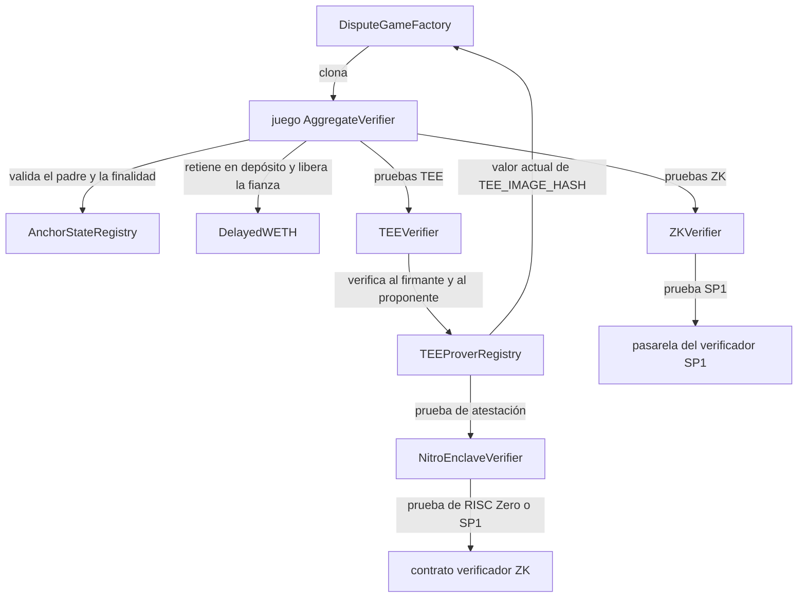

Los contratos de prueba convierten el material de prueba offchain en juegos de punto de control onchain. Un juego afirma un
output root de L2 para un intervalo fijo de bloques. Los contratos verifican la prueba inicial, aceptan una
segunda prueba opcional, permiten impugnar o anular el material de prueba no válido, resuelven el juego
una vez transcurrido el retraso correspondiente, hacen avanzar el estado de anclaje y liberan la fianza de inicialización.

Esta página especifica el comportamiento de los contratos que utiliza el sistema de pruebas:

* `AnchorStateRegistry`
* `DelayedWETH`
* `DisputeGameFactory`
* `AggregateVerifier`
* `ZKVerifier`
* `TEEVerifier`
* `TEEProverRegistry`
* `NitroEnclaveVerifier`

## Grafo de contratos {#contract-graph}



`DisputeGameFactory`, `AnchorStateRegistry` y `DelayedWETH` son contratos del sistema detrás de un proxy.
`AggregateVerifier` se despliega como implementación y la fábrica lo clona con argumentos
inmutables. `TEEVerifier`, `ZKVerifier`, `TEEProverRegistry` y `NitroEnclaveVerifier` son
contratos independientes de verificación y de registro a los que hace referencia la implementación del juego.

## Modelo de datos {#data-model}

Los contratos comparten los mismos tipos de juegos de disputa:

| Tipo         | Significado                                                                                                  |
| ------------ | ------------------------------------------------------------------------------------------------------------ |
| `GameType`   | Un identificador `uint32` de una implementación de juego de disputa.                                         |
| `Claim`      | Una reclamación raíz de 32 bytes. En este sistema de pruebas, es un output root de L2.                        |
| `Hash`       | Un envoltorio para un hash de 32 bytes.                                                                      |
| `Timestamp`  | Un envoltorio para una marca de tiempo `uint64`.                                                             |
| `Proposal`   | `(root, l2SequenceNumber)`, donde `l2SequenceNumber` es el número de bloque de L2 correspondiente a la raíz. |
| `GameStatus` | `IN_PROGRESS`, `CHALLENGER_WINS` o `DEFENDER_WINS`.                                                          |
| `ProofType`  | `TEE` o `ZK` dentro de `AggregateVerifier`.                                                                  |

El juego `AggregateVerifier` utiliza dos intervalos de bloques:

```text Block Intervals
BLOCK_INTERVAL
INTERMEDIATE_BLOCK_INTERVAL
```

`BLOCK_INTERVAL` es la distancia entre un output root padre y un output root propuesto.
`INTERMEDIATE_BLOCK_INTERVAL` es la separación entre las raíces intermedias dentro de ese rango.
`BLOCK_INTERVAL` e `INTERMEDIATE_BLOCK_INTERVAL` deben ser distintos de cero, y `BLOCK_INTERVAL` debe ser
divisible entre `INTERMEDIATE_BLOCK_INTERVAL`.

El número de raíces intermedias en cada juego es:

```text Intermediate Root Count
BLOCK_INTERVAL / INTERMEDIATE_BLOCK_INTERVAL
```

La raíz intermedia final debe coincidir con el `rootClaim` del juego.

## Ciclo de vida del juego {#game-lifecycle}

1. El propietario de la fábrica configura un tipo de juego con una implementación de `AggregateVerifier` y una
   fianza de inicialización.
2. Los operadores de TEE registran las direcciones de los firmantes del enclave en `TEEProverRegistry` mediante una atestación
   de Nitro verificada con ZK.
3. Un proponente crea un juego mediante `DisputeGameFactory.createWithInitData()`, paga el importe exacto de la fianza de
   inicialización y aporta una prueba inicial TEE o ZK.
4. El juego valida su padre, el número de bloque de L2, las raíces intermedias, el L1 origin y el journal
   de la prueba. La fianza se deposita en `DelayedWETH`.
5. Se puede enviar una segunda prueba mediante `verifyProposalProof()`. Si la propuesta no es válida,
   los impugnadores pueden llamar a `challenge()` o `nullify()` con material de prueba para una raíz intermedia.
6. Una vez transcurrido el tiempo de resolución previsto, cualquiera puede llamar a `resolve()`. El resultado es
   `DEFENDER_WINS` si el juego es válido y no se ha impugnado, y `CHALLENGER_WINS` si la impugnación prospera
   o el padre no es válido.
7. Tras la resolución y el retraso de finalidad del registro, cualquiera puede llamar a `closeGame()` para intentar
   actualizar el ancla, sin garantía de que se produzca.
8. El destinatario de la fianza llama a `claimCredit()` dos veces: una para desbloquear el crédito de `DelayedWETH` y
   otra, tras el retraso de `DelayedWETH`, para retirar y recibir ETH.

## DisputeGameFactory {#disputegamefactory}

`DisputeGameFactory` crea e indexa clones de juegos de disputa. Cada juego se identifica de forma única por:

```text Game UUID
keccak256(abi.encode(gameType, rootClaim, extraData))
```

La fábrica almacena ese UUID en `_disputeGames` y, además, añade un `GameId` empaquetado a
`_disputeGameList` para que los juegos puedan descubrirse por índice. Los servicios offchain usan `DisputeGameCreated`,
`gameAtIndex()` y `findLatestGames()` para descubrir los juegos.

### Configuración {#configuration}

Solo el propietario de la fábrica puede:

* establecer una implementación de juego con `setImplementation(gameType, impl)`
* establecer una implementación de juego junto con argumentos de implementación opacos mediante
  `setImplementation(gameType, impl, args)`
* establecer la fianza de creación exacta requerida con `setInitBond(gameType, initBond)`

La creación se revierte si la implementación no está configurada, si el valor pagado difiere de `initBonds` o si
ya existe un juego con el mismo UUID.

### Argumentos del clon {#clone-arguments}

Cuando no hay argumentos de implementación configurados, la carga útil del clon con argumentos inmutables es:

| Bytes          | Descripción                                              |
| -------------- | -------------------------------------------------------- |
| `[0, 20)`      | Dirección del creador del juego                          |
| `[20, 52)`     | Reclamación raíz                                         |
| `[52, 84)`     | Hash del bloque padre de L1 en el momento de la creación |
| `[84, 84 + n)` | `extraData` opaco del juego                              |

Cuando hay argumentos de implementación configurados, la carga útil es:

| Bytes                  | Descripción                                              |
| ---------------------- | -------------------------------------------------------- |
| `[0, 20)`              | Dirección del creador del juego                          |
| `[20, 52)`             | Reclamación raíz                                         |
| `[52, 84)`             | Hash del bloque padre de L1 en el momento de la creación |
| `[84, 88)`             | Tipo de juego                                            |
| `[88, 88 + n)`         | `extraData` opaco del juego                              |
| `[88 + n, 88 + n + m)` | Argumentos de implementación opacos                      |

`AggregateVerifier` utiliza la disposición estándar. Su `extraData` se especifica en la
sección `AggregateVerifier` más adelante.

## AnchorStateRegistry {#anchorstateregistry}

`AnchorStateRegistry` es la fuente de verdad que determina si el sistema de pruebas puede confiar en un juego de disputa. Almacena:

* el `SystemConfig`
* el `DisputeGameFactory`
* la raíz de anclaje inicial
* el juego de anclaje actual, si se ha aceptado alguno
* el tipo de juego respetado actual
* una lista negra de juegos
* una marca de tiempo de retiro
* un retardo de finalidad para los juegos de disputa

La marca de tiempo de retiro inicial se establece durante la primera inicialización. Los juegos creados en la marca de tiempo de retiro o antes quedan retirados.

### Predicados de los juegos {#game-predicates}

El registro expone estos predicados:

| Predicado                 | Verdadero cuando                                                                                                                           |
| ------------------------- | ------------------------------------------------------------------------------------------------------------------------------------------ |
| `isGameRegistered(game)`  | La fábrica vuelve a asignar la tupla `(gameType, rootClaim, extraData)` del juego a la misma dirección, y el juego apunta a este registro. |
| `isGameRespected(game)`   | El juego indica que su tipo de juego era respetado en el momento de su creación.                                                           |
| `isGameBlacklisted(game)` | El guardián ha incluido la dirección del juego en la lista negra.                                                                          |
| `isGameRetired(game)`     | `game.createdAt() <= retirementTimestamp`.                                                                                                 |
| `isGameResolved(game)`    | El juego tiene un `resolvedAt` distinto de cero y terminó con `DEFENDER_WINS` o `CHALLENGER_WINS`.                                         |
| `isGameProper(game)`      | El juego está registrado, no está en la lista negra, no está retirado y el sistema no está en pausa.                                       |
| `isGameFinalized(game)`   | El juego está resuelto y han transcurrido más de `disputeGameFinalityDelaySeconds` desde `resolvedAt`.                                     |
| `isGameClaimValid(game)`  | El juego es válido (proper), está respetado, finalizado y resuelto con `DEFENDER_WINS`.                                                    |

`isGameProper()` no demuestra que la reclamación raíz sea correcta. Solo significa que los controles del registro no han
invalidado el juego. Los consumidores que necesiten comprobar la validez de la reclamación deben usar
`isGameClaimValid()`.

### Controles del guardián {#guardian-controls}

El `SystemConfig.guardian()` puede:

* establecer el tipo de juego respetado
* actualizar la marca de tiempo de retiro a la marca de tiempo del bloque actual
* incluir juegos individuales en la lista negra

Estos controles son las válvulas de seguridad onchain que permiten invalidar juegos antes de que se conviertan en
reclamaciones válidas.

### Actualizaciones del ancla {#anchor-updates}

`getAnchorRoot()` devuelve la raíz de anclaje inicial hasta que se acepta un juego de anclaje. A partir de entonces,
devuelve la reclamación raíz y el número de bloque de L2 de `anchorGame`.

`setAnchorState(game)` acepta un nuevo juego de anclaje solo si:

* `isGameClaimValid(game)` es true
* el número de secuencia de L2 del juego es mayor que el número de secuencia de la raíz de anclaje actual

La actualización no requiere permisos y se valida por sí misma.

## DelayedWETH {#delayedweth}

`DelayedWETH` es WETH con retiros diferidos. Mantiene en custodia las fianzas de los juegos e impone un proceso de reclamación de créditos
en dos pasos:

1. El juego llama a `unlock(subAccount, amount)` para el destinatario de la fianza.
2. Transcurridos `delay()` segundos, el juego llama a `withdraw(subAccount, amount)` y envía ETH al
   destinatario.

Los desbloqueos se indexan por:

```text Withdrawal Request Key
withdrawals[msg.sender][subAccount]
```

En los juegos de prueba, `msg.sender` es el contrato de juego `AggregateVerifier` y `subAccount` es el
`bondRecipient` actual.

Los retiros revierten mientras el sistema está en pausa. El propietario del administrador del proxy también tiene facultades de
recuperación de emergencia:

* `recover(amount)` envía hasta `amount` ETH del contrato al propietario.
* `hold(account)` o `hold(account, amount)` retira WETH de una cuenta y lo transfiere a la dirección del propietario.

## AggregateVerifier {#aggregateverifier}

`AggregateVerifier` es la implementación del juego de disputa para las pruebas de punto de control. Cada juego
creado por la fábrica es un clon con datos de juego inmutables. La implementación no tiene almacenamiento
propio por juego, aparte del almacenamiento del clon.

### Configuración del constructor {#constructor-configuration}

Una implementación fija estos valores para todos los clones de ese tipo de juego:

| Valor                         | Propósito                                                                         |
| ----------------------------- | --------------------------------------------------------------------------------- |
| `GAME_TYPE`                   | El tipo de juego de disputa que atiende esta implementación.                      |
| `ANCHOR_STATE_REGISTRY`       | Validación del padre, validez de las afirmaciones y actualizaciones del ancla.    |
| `DISPUTE_GAME_FACTORY`        | Se lee del registro durante la construcción.                                      |
| `DELAYED_WETH`                | Custodia de las fianzas.                                                          |
| `TEE_VERIFIER`                | Verificador de firmas TEE.                                                        |
| `TEE_IMAGE_HASH`              | Hash esperado de la imagen TEE, comprometido en los journals TEE.                 |
| `ZK_VERIFIER`                 | Verificador de pruebas ZK.                                                        |
| `ZK_RANGE_HASH`               | Hash del programa de rango, comprometido en los journals ZK.                      |
| `ZK_AGGREGATE_HASH`           | Hash del programa de agregación que se pasa al verificador ZK.                    |
| `CONFIG_HASH`                 | Hash de la configuración del rollup, comprometido en los journals de las pruebas. |
| `L2_CHAIN_ID`                 | Cadena L2 sobre la que versa el juego.                                            |
| `BLOCK_INTERVAL`              | Distancia entre el bloque padre y el bloque propuesto.                            |
| `INTERMEDIATE_BLOCK_INTERVAL` | Distancia entre las raíces de los puntos de control intermedios.                  |
| `PROOF_THRESHOLD`             | Número de pruebas necesarias para la resolución: `1` o `2`.                       |

`PROOF_THRESHOLD` controla la resolución, no el envío de pruebas. El juego puede almacenar una prueba TEE, una
prueba ZK o ambas.

### Datos adicionales del juego {#game-extra-data}

`AggregateVerifier.extraData()` se codifica de la siguiente manera:

| Bytes               | Descripción                                                                           |
| ------------------- | ------------------------------------------------------------------------------------- |
| `[0, 32)`           | Número de bloque de L2 propuesto.                                                     |
| `[32, 52)`          | Dirección del juego padre. El primer juego usa la dirección de `AnchorStateRegistry`. |
| `[52, 52 + 32 * n)` | Output roots intermedios, en orden.                                                   |

donde:

```text Extra Data Root Count
n = BLOCK_INTERVAL / INTERMEDIATE_BLOCK_INTERVAL
```

La última output root intermedia debe ser igual a `rootClaim`.

### Inicialización {#initialization}

`initializeWithInitData(proof)` solo puede ejecutarse una vez. Verifica el tamaño del calldata para que los
bytes no utilizados no puedan generar varios UUID de fábrica para la misma propuesta lógica.

Durante la inicialización, el juego:

1. Comprueba que la raíz intermedia final coincida con `rootClaim`.

2. Resuelve la raíz inicial. Si `parentAddress` es la dirección del registro, la raíz inicial es
   `AnchorStateRegistry.getStartingAnchorRoot()`. De lo contrario, el padre debe ser un juego
   registrado válido.

3. Exige que:

   ```text
   l2SequenceNumber == startingL2SequenceNumber + BLOCK_INTERVAL
   ```

4. Registra `createdAt`, `wasRespectedGameTypeWhenCreated` y un valor inicial de `expectedResolution`.

5. Verifica el hash del L1 origin declarado en la prueba de inicialización contra `blockhash()` o contra
   el historial de EIP-2935.

6. Verifica la prueba TEE o ZK proporcionada.

7. Registra el probador inicial, establece `bondRecipient` en `gameCreator` y deposita la fianza en
   `DelayedWETH`.

El formato de la prueba de inicialización es el siguiente:

| Bytes       | Descripción                                          |
| ----------- | ---------------------------------------------------- |
| `[0, 1)`    | `ProofType`: `0` para TEE, `1` para ZK.              |
| `[1, 33)`   | Hash del L1 origin.                                  |
| `[33, 65)`  | Número de bloque del L1 origin.                      |
| `[65, end)` | Bytes de la prueba para el verificador seleccionado. |

El bloque del L1 origin debe ser anterior al actual. Se usa el `blockhash()` nativo para bloques con una antigüedad de hasta 256
bloques, y el historial de EIP-2935, para hasta 8191 bloques. Si el bloque del L1 origin es más antiguo o no está disponible, la ejecución se revierte.

### Pruebas adicionales {#additional-proofs}

`verifyProposalProof(proofBytes)` añade el tipo de prueba que falta mientras un juego está en curso y aún no
ha terminado. No vuelve a leer un nuevo L1 origin desde el calldata, sino que utiliza el `l1Head()` que la
fábrica capturó al crear el clon.

El formato de la prueba adicional es:

| Bytes      | Descripción                                          |
| ---------- | ---------------------------------------------------- |
| `[0, 1)`   | `ProofType`: `0` para TEE, `1` para ZK.              |
| `[1, end)` | Bytes de la prueba para el verificador seleccionado. |

Un juego no puede almacenar más de una prueba del mismo tipo.

### Diarios de pruebas {#proof-journals}

Las pruebas TEE y ZK generan un compromiso sobre la misma forma de transición:

```text Proof Journal Fields lines wrap expandable
proposer
l1OriginHash
startingRoot
startingL2SequenceNumber
endingRoot
endingL2SequenceNumber
intermediateRoots
CONFIG_HASH
hash específico del sistema de pruebas
```

En las pruebas TEE, el último campo es `TEE_IMAGE_HASH` y `TEEVerifier` se encarga de verificar el journal.
El juego realiza la siguiente llamada:

```text TEE Journal Verification Call
TEE_VERIFIER.verify(proposer || signature, TEE_IMAGE_HASH, keccak256(journal))
```

En el caso de las pruebas ZK, el campo final es `ZK_RANGE_HASH` y la prueba la verifica `ZKVerifier`. El
juego llama a:

```text ZK Journal Verification Call
ZK_VERIFIER.verify(proofBytes, ZK_AGGREGATE_HASH, keccak256(journal))
```

### Plazo de resolución {#resolution-delay}

`expectedResolution` se calcula a partir del número de pruebas aceptadas en ese momento:

| Número de pruebas | Plazo                                      |
| ----------------- | ------------------------------------------ |
| `0`               | Nunca se puede resolver.                   |
| `1`               | `SLOW_FINALIZATION_DELAY`, fijo en 7 días. |
| `2`               | `FAST_FINALIZATION_DELAY`, fijo en 1 día.  |

Añadir una prueba solo puede reducir `expectedResolution`. Anular una prueba puede aumentarlo. Una
impugnación con una prueba ZK fija `expectedResolution` en 7 días a partir de la impugnación, para que la propia impugnación
también pueda anularse.

### Impugnación {#challenge}

`challenge(proofBytes, intermediateRootIndex, intermediateRootToProve)` impugna una
propuesta respaldada por TEE con una prueba ZK para un intervalo intermedio.

La llamada solo se acepta si:

* el juego sigue en estado `IN_PROGRESS`
* el propio juego es válido según el registro
* el juego padre no se ha resuelto con `CHALLENGER_WINS`
* el juego tiene una prueba TEE
* el juego aún no tiene una prueba ZK
* el tipo de prueba proporcionado es ZK
* el índice impugnado está dentro del rango válido
* la raíz proporcionada difiere de la raíz intermedia propuesta actualmente

Si la prueba ZK se verifica correctamente, el juego registra el probador ZK, incrementa `proofCount`, almacena el
índice intermedio refutado (con base 1) y emite `Challenged`. Cuando el juego se resuelve, el impugnador
recibe la fianza y el estado del juego pasa a `CHALLENGER_WINS`.

### Anulación {#nullification}

`nullify(proofBytes, intermediateRootIndex, intermediateRootToProve)` elimina una prueba ya aceptada
demostrando una raíz intermedia contradictoria.

En un juego no impugnado, la raíz objetivo debe ser distinta de la raíz intermedia propuesta. En un
juego impugnado, solo se puede anular el índice impugnado, únicamente con una prueba ZK, y la raíz
proporcionada debe coincidir con la raíz intermedia propuesta originalmente.

Tras una anulación correcta:

* se elimina la ranura del probador para ese tipo de prueba
* `proofCount` disminuye
* se recalcula `expectedResolution`
* se borra el índice refutado si se anuló la impugnación ZK
* se anula el contrato verificador correspondiente

La anulación del verificador es un mecanismo de parada de seguridad global. Una vez que `TEE_VERIFIER.nullify()` o
`ZK_VERIFIER.nullify()` se ejecuta correctamente, cualquier verificación de pruebas posterior a través de ese verificador revierte hasta que el
sistema se actualice o se reconfigure.

### Resolución, cierre y fianzas {#resolve-close-and-bonds}

Cualquiera puede llamar a `resolve()`. El padre debe estar resuelto, salvo que el padre sea el propio
registro. Si el padre se resolvió con `CHALLENGER_WINS`, o posteriormente pasó a la lista negra o fue retirado, el
hijo también se resuelve con `CHALLENGER_WINS`. De lo contrario, el juego debe haber terminado y contar con al menos
`PROOF_THRESHOLD` pruebas aceptadas.

Si el juego fue impugnado, `resolve()` establece `CHALLENGER_WINS` y asigna al probador ZK como destinatario
de la fianza. De lo contrario, establece `DEFENDER_WINS`.

`closeGame()` no requiere permisos. Revierte mientras el registro está en pausa, exige que el registro haya
resuelto y finalizado el juego y, a continuación, intenta ejecutar `AnchorStateRegistry.setAnchorState()`.
La actualización del ancla se hace en la medida de lo posible: si el registro rechaza el juego porque ya no es la
afirmación válida más reciente, `closeGame()` captura y descarta esa reversión del registro.

`claimCredit()` tiene dos fases:

1. Desbloquear la fianza en `DelayedWETH`.
2. Una vez transcurrido el retardo de `DelayedWETH`, retirar el WETH y enviar ETH a `bondRecipient`.

Si las pruebas aceptadas se han anulado y `expectedResolution` se restablece al valor centinela de
«nunca resoluble», `claimCredit()` queda bloqueado hasta 14 días después de `createdAt`. Así se evita que un juego
atascado bloquee la fianza indefinidamente.

## ZKVerifier {#zkverifier}

`ZKVerifier` adapta el gateway del verificador SP1 de Succinct a la interfaz común `IVerifier` que utiliza
`AggregateVerifier`.

La llamada:

```text ZKVerifier Verify Call
verify(proofBytes, imageId, journal)
```

realiza:

```text SP1 Verification Call
SP1_VERIFIER.verifyProof(imageId, abi.encodePacked(journal), proofBytes)
```

y devuelve `true` si el gateway de SP1 no revierte. `imageId` es la clave de verificación del programa
agregado que proporciona el juego, y `journal` es el hash de las entradas públicas que ensambla
el juego.

`ZKVerifier` hereda la anulación del verificador. Una vez que un juego respetado válido anula el verificador,
todas las llamadas posteriores a `verify()` revierten.

## TEEVerifier {#teeverifier}

`TEEVerifier` verifica las firmas de las pruebas TEE con respecto al `TEEProverRegistry`.

Los bytes de la prueba que se pasan a `TEEVerifier` son:

| Bytes      | Descripción               |
| ---------- | ------------------------- |
| `[0, 20)`  | Dirección del proponente. |
| `[20, 85)` | Firma ECDSA de 65 bytes.  |

La firma se recupera directamente sobre el hash del journal. No se envuelve con el prefijo
de mensaje firmado de Ethereum.

Una prueba TEE solo es válida cuando:

* la prueba tiene al menos 85 bytes
* la firma se recupera correctamente
* el proponente figura en la lista de permitidos de `TEEProverRegistry`
* el firmante recuperado está registrado en `TEEProverRegistry`
* el hash de imagen registrado del firmante coincide con el `imageId` proporcionado por el juego que realiza la llamada

La comprobación del hash de imagen impide que un enclave registrado para una imagen genere pruebas aceptadas
para un tipo de juego o una actualización que espera otra imagen.

`TEEVerifier` también hereda la anulación del verificador.

## TEEProverRegistry {#teeproverregistry}

`TEEProverRegistry` gestiona el registro de firmantes TEE y la lista de proponentes autorizados.

El registro contiene:

* un propietario
* un administrador
* un `NitroEnclaveVerifier`
* un `DisputeGameFactory`
* un `gameType` configurable
* el estado de los firmantes registrados
* el estado de la lista de proponentes autorizados

El propietario puede establecer las direcciones de los proponentes y actualizar el `gameType`. El propietario o el administrador pueden registrar
y dar de baja firmantes.

### Hash de imagen esperado {#expected-image-hash}

El registro obtiene el hash de imagen TEE esperado a partir de la implementación actual del juego:

```text Expected Image Hash Lookup
DisputeGameFactory.gameImpls(gameType).TEE_IMAGE_HASH()
```

`setGameType()` valida que esta llamada se ejecute correctamente y devuelva un hash distinto de cero. `isValidSigner()`
devuelve true solo si el firmante está registrado y su hash de imagen almacenado coincide con el
hash esperado actual.

El registro de firmantes, por sí mismo, es independiente de PCR0. Esto permite a los operadores registrar de antemano firmantes para una imagen
futura antes de una migración de tipo de juego. Dichos firmantes no serán válidos para enviar pruebas hasta que
el `TEE_IMAGE_HASH` de la implementación del juego coincida con su hash de imagen registrado.

### Registro de firmantes {#signer-registration}

`registerSigner(output, proofBytes)` llama a:

```text Attestation Verification Call
NITRO_VERIFIER.verify(output, ZkCoProcessorType.RiscZero, proofBytes)
```

El journal devuelto debe contener `VerificationResult.Success`. La marca de tiempo de la atestación no debe tener
una antigüedad superior a `MAX_AGE`, fijada en 60 minutos. La clave pública debe tener exactamente 65 bytes en
formato ANSI X9.62 sin comprimir:

```text Uncompressed Public Key Layout
0x04 || x || y
```

El registro deriva la dirección del firmante de la siguiente manera:

```text Signer Address Derivation
address(uint160(uint256(keccak256(x || y))))
```

El registro extrae el PCR0 del journal y almacena:

```text Signer Image Hash
signerImageHash[signer] = keccak256(pcr0.first || pcr0.second)
```

A continuación, marca al firmante como registrado y lo añade a un conjunto enumerable de firmantes.

### Baja del registro {#deregistration}

`deregisterSigner(signer)` elimina el registro y el hash de imagen del firmante, lo quita
del conjunto enumerable y emite `SignerDeregistered`.

`getRegisteredSigners()` devuelve el conjunto enumerable actual. No se garantiza ningún orden.

## NitroEnclaveVerifier {#nitroenclaveverifier}

`NitroEnclaveVerifier` verifica pruebas ZK de documentos de atestación de AWS Nitro Enclave. Es el
verificador de atestaciones que utiliza `TEEProverRegistry`.

El contrato admite:

* verificación de atestaciones individuales
* verificación de atestaciones por lotes
* sistemas de pruebas RISC Zero y Succinct SP1
* configuración de certificados raíz
* almacenamiento en caché de certificados intermedios de confianza
* revocación de certificados
* selección de verificador por ruta
* rutas de prueba congeladas permanentemente

### Roles y configuración {#roles-and-configuration}

El propietario controla:

* `rootCert`
* `maxTimeDiff`
* `proofSubmitter`
* `revoker`
* la configuración del verificador ZK
* los ID de programa del verificador
* los ID de programa del agregador
* las anulaciones de verificador específicas por ruta
* el congelamiento de rutas

El `revoker` también puede revocar certificados intermedios de confianza. `proofSubmitter` es la única
dirección autorizada a llamar a `verify()` o `batchVerify()`.

`zkConfig[zkCoProcessor]` almacena:

| Campo          | Propósito                                          |
| -------------- | -------------------------------------------------- |
| `verifierId`   | ID de programa para verificar una sola atestación. |
| `aggregatorId` | ID de programa para la verificación por lotes.     |
| `zkVerifier`   | Dirección del contrato verificador predeterminado. |

Las anulaciones de verificador específicas por ruta se indexan por `(zkCoProcessor, selector)`, donde `selector` corresponde a
los primeros cuatro bytes de `proofBytes`. Si una ruta está congelada, toda verificación a través de ella
revierte de forma permanente.

### Verificación individual {#single-verification}

`verify(output, zkCoprocessor, proofBytes)`:

1. Requiere que `msg.sender == proofSubmitter`.
2. Resuelve la ruta del verificador a partir del selector de la prueba.
3. Verifica la prueba ZK con respecto a `zkConfig[zkCoprocessor].verifierId`.
4. Decodifica `output` como un `VerifierJournal`.
5. Valida el journal.
6. Emite `AttestationSubmitted`.
7. Devuelve el journal con su resultado de verificación final.

En el caso de RISC Zero, la verificación de la prueba utiliza:

```text RISC Zero Verification Call
IRiscZeroVerifier.verify(proofBytes, programId, sha256(output))
```

En el caso de Succinct, la verificación de pruebas utiliza:

```text Succinct Verification Call
ISP1Verifier.verifyProof(programId, output, proofBytes)
```

### Verificación por lotes {#batch-verification}

`batchVerify(output, zkCoprocessor, proofBytes)`:

1. Exige que `msg.sender == proofSubmitter`.
2. Verifica la prueba ZK con respecto a `zkConfig[zkCoprocessor].aggregatorId`.
3. Decodifica `output` como un `BatchVerifierJournal`.
4. Exige que `batchJournal.verifierVk == getVerifierProofId(zkCoprocessor)`.
5. Valida cada uno de los `VerifierJournal` incrustados.
6. Emite `BatchAttestationSubmitted`.
7. Devuelve los journals validados.

### Validación del journal {#journal-validation}

Un journal exitoso solo se mantiene como exitoso si:

* la longitud del prefijo de certificados de confianza no es cero
* el primer certificado es igual a `rootCert`
* todos los certificados intermedios de confianza siguen siendo de confianza y no han caducado
* ninguno de los certificados recién proporcionados ha caducado
* la marca de tiempo de la atestación no es demasiado antigua
* la marca de tiempo de la atestación no está en el futuro

Las marcas de tiempo de la atestación se proporcionan en milisegundos y se convierten a segundos. La marca de tiempo es
válida solo si:

```text Timestamp Validity Conditions
timestamp + maxTimeDiff > block.timestamp
timestamp < block.timestamp
```

Los certificados nuevos situados más allá del prefijo de confianza se almacenan en caché junto con sus marcas de tiempo de expiración tras una
validación correcta. Un certificado revocado solo puede volver a considerarse de confianza si aparece en una prueba de
atestación posterior validada correctamente y se vuelve a almacenar en caché.

## Propiedades de seguridad entre contratos {#cross-contract-safety-properties}

Los contratos de prueba dependen de las siguientes propiedades entre contratos:

* Unicidad de la fábrica: una tupla lógica `(gameType, rootClaim, extraData)` puede crear como máximo un juego.
* Validez del padre: los juegos que no son de anclaje solo pueden partir de un padre registrado, respetado, no retirado,
  que no esté en la lista negra y que no haya perdido.
* Puntos de control monótonos: cada juego hijo debe avanzar exactamente `BLOCK_INTERVAL` bloques de L2 desde su
  raíz inicial.
* Rendición de cuentas intermedia: cada propuesta se compromete con todas las raíces intermedias, de modo que los impugnadores
  pueden atacar el primer intervalo de puntos de control no válido.
* Separación de verificadores: las pruebas TEE y ZK usan contratos verificadores distintos y separadores de dominio de journal
  distintos (`TEE_IMAGE_HASH` frente a `ZK_RANGE_HASH`).
* La finalidad rápida requiere diversidad: un juego con dos tipos de prueba aceptados puede resolverse al cabo de un día,
  mientras que un juego con una sola prueba debe esperar siete días.
* La finalidad del registro es independiente de la resolución del juego: un juego puede resolverse antes de que el
  `AnchorStateRegistry` lo acepte como reclamación válida.
* Los controles de seguridad fallan de forma cerrada: la pausa, la lista negra, el retiro, la anulación de verificadores, el congelamiento
  de rutas y la revocación de certificados impiden la aceptación en lugar de ampliar la confianza.

## Superficies administrativas {#administrative-surfaces}

| Contrato               | Rol privilegiado                        | Acciones privilegiadas                                                                                                             |
| ---------------------- | --------------------------------------- | ---------------------------------------------------------------------------------------------------------------------------------- |
| `DisputeGameFactory`   | Propietario                             | Establecer implementaciones de juegos, argumentos de implementación y fianzas de inicialización.                                   |
| `AnchorStateRegistry`  | Guardián de `SystemConfig`              | Establecer el tipo de juego respetado, añadir juegos a la lista negra y actualizar la marca de tiempo de retiro.                   |
| `DelayedWETH`          | Propietario del administrador del proxy | Recuperar ETH y retener WETH de cuentas.                                                                                           |
| `TEEProverRegistry`    | Propietario                             | Establecer proponentes, actualizar el tipo de juego y transferir la propiedad o la gestión.                                        |
| `TEEProverRegistry`    | Propietario o administrador            | Registrar y dar de baja firmantes TEE.                                                                                             |
| `NitroEnclaveVerifier` | Propietario                             | Configurar el certificado raíz, la tolerancia de tiempo, el remitente de pruebas, el revocador, las rutas ZK y los ID de programa. |
| `NitroEnclaveVerifier` | Propietario o revocador                 | Revocar certificados intermedios de confianza.                                                                                     |

Estas superficies son deliberadamente limitadas, pero tienen un gran impacto. Los cambios operativos que se realicen en ellas pueden influir
en qué juegos se respetan, qué pruebas se verifican y qué atestaciones pueden registrar nuevos firmantes
TEE.