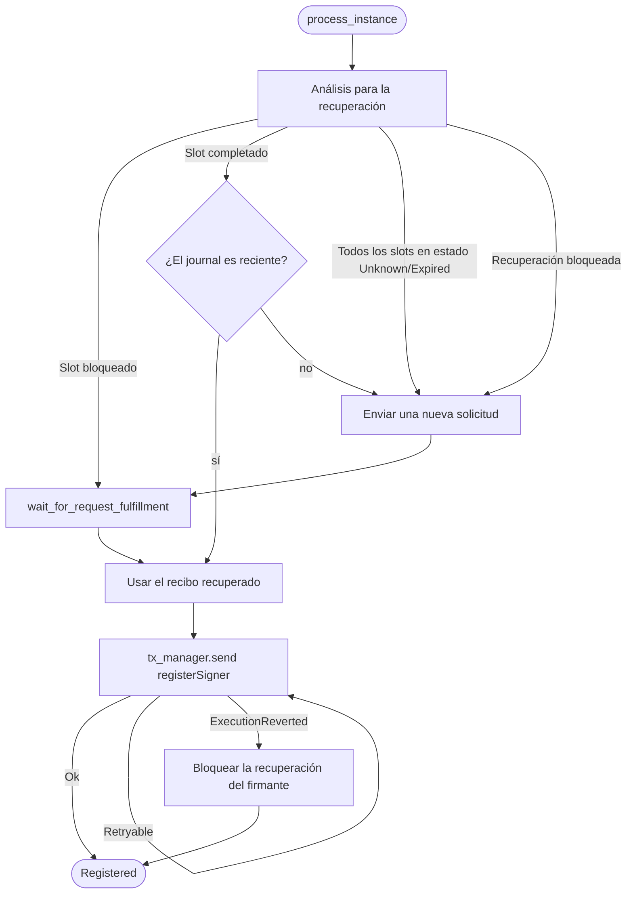

El registrador es un servicio offchain que mantiene el registro onchain de las identidades de firmantes TEE
aceptadas. Detecta las instancias de probadores TEE en ejecución, obtiene de cada enclave los documentos de atestación
de AWS Nitro Enclave, genera una prueba ZK de que la atestación está bien formada y envía
el registro de firmante resultante a [`TEEProverRegistry`](https://github.com/base/contracts/blob/main/src/L1/proofs/tee/TEEProverRegistry.sol)
en L1. Además, da de baja a los firmantes cuyas instancias subyacentes ya no son accesibles y revoca
los certificados intermedios que AWS ha retirado.

Base opera un registrador. El sistema de pruebas solo confía en los firmantes que este registrador ha
registrado, por lo que el correcto funcionamiento del registrador es un requisito previo para aceptar pruebas TEE onchain. Aun así, su salida
es autovalidable: `TEEProverRegistry` y [`NitroEnclaveVerifier`](https://github.com/base/contracts/blob/main/src/L1/proofs/tee/NitroEnclaveVerifier.sol) verifican la prueba ZK de atestación, la medición PCR0 del enclave y la clave pública del
firmante antes de que este pase a ser válido.

## Responsabilidades {#responsibilities}

Un registrador conforme realiza las siguientes tareas:

1. Descubrir el conjunto actual de instancias de probadores TEE que hay detrás del balanceador de carga de producción.
2. Obtener de cada instancia las claves públicas de firmante de cada enclave y los documentos de atestación de Nitro.
3. Opcionalmente, verificar la cadena de certificados de atestación con las CRL publicadas por AWS y con el
   conjunto de revocaciones persistente onchain.
4. Generar una prueba ZK de la corrección de la atestación para cada enclave que aún no esté registrado.
5. Enviar `TEEProverRegistry.registerSigner()` para los firmantes recién atestados.
6. Enviar `TEEProverRegistry.deregisterSigner()` para los firmantes onchain cuyas instancias ya no existen.
7. Enviar `NitroEnclaveVerifier.revokeCert()` para los certificados intermedios que se detecten como
   revocados.
8. Recuperar las solicitudes de prueba en curso tras los reinicios del proceso sin repetir el trabajo de generación de pruebas ya realizado.

El registrador no determina qué mediciones PCR0 se aceptan. El registro es independiente de PCR0 para
que los firmantes de la siguiente imagen puedan registrarse antes de un hardfork. La aceptación de las pruebas
generadas por un firmante determinado se aplica onchain mediante [`TEEVerifier`](https://github.com/base/contracts/blob/main/src/L1/proofs/tee/TEEVerifier.sol),
que las valida con el `TEE_IMAGE_HASH` actual de la implementación de juego activa.

El registrador tampoco crea propuestas, ni genera material de prueba para propuestas o disputas,
ni impugna transiciones de estado inválidas. Esas responsabilidades corresponden al proponente, a los probadores
TEE y al impugnador.

## Configuración de inicio {#startup-configuration}

Al iniciarse, el registrador se conecta a:

* un RPC de ejecución de L1 para leer contratos y enviar transacciones
* las API de AWS para consultar el estado de salud de los destinos de ELBv2 y los metadatos de las instancias de EC2
* un endpoint JSON-RPC en cada instancia de probador TEE descubierta
* un backend de generación de pruebas (el marketplace de Boundless o un probador RISC Zero autoalojado)
* `TEEProverRegistry`
* un `NitroEnclaveVerifier` opcional, necesario solo cuando la verificación de CRL está habilitada

Al iniciarse, el registrador no lee ninguna configuración de contratos aparte de las direcciones del registro y del verificador
que proporciona el operador. Considera candidato huérfano a todo firmante onchain que no haya visto en su propio
conjunto de instancias, por lo que un único registrador debe ser el único que escriba en un registro
determinado.

## Bucle del controlador {#driver-loop}

El registrador ejecuta un único bucle del controlador:

1. Descubrir el conjunto actual de instancias.
2. Procesar todas las instancias de forma concurrente, con un límite de `max_concurrency`.
3. Leer el conjunto de firmantes onchain.
4. Dar de baja a los firmantes huérfanos.
5. Esperar `poll_interval` segundos o salir si se produce una cancelación.

Al iniciarse, el bucle ejecuta `step()` una vez antes de entrar en espera. La cancelación se detecta rápidamente entre
ciclos y durante los reintentos de transacciones de larga duración, de modo que el servicio pueda detenerse sin dejar un estado
parcial.

## Descubrimiento de instancias {#instance-discovery}

El registrador utiliza el sondeo de grupos de destino de AWS ALB. No se admite el descubrimiento mediante DNS, SRV ni
Kubernetes.

En cada ciclo de descubrimiento, el registrador:

1. Llama a `elasticloadbalancingv2.DescribeTargetHealth(target_group_arn)`.
2. Descarta los destinos que no son instancias (ID de destino que no comienzan por `i-`).
3. Elimina los ID de instancia duplicados que aparecen en más de un puerto.
4. Llama a `ec2.DescribeInstances(instance_ids)` para leer la IP privada y la hora de lanzamiento de cada instancia.
5. Construye las URL de los endpoints JSON-RPC con el formato `http://{private_ip}:{prover_port}` y asocia cada
   una con el estado de salud que informa el ALB.

Los estados de salud se asignan de la siguiente manera:

| Estado de AWS  | Estado interno | `should_register()` |
| -------------- | -------------- | ------------------- |
| `initial`      | `Initial`      | true                |
| `healthy`      | `Healthy`      | true                |
| `draining`     | `Draining`     | false               |
| cualquier otro | `Unhealthy`    | false               |

Las instancias `Unhealthy` que se encuentran dentro de los `unhealthy_registration_window` segundos posteriores a `launch_time` pueden
registrarse de todos modos. Se trata de un periodo de gracia para el calentamiento: permite que una instancia nueva cuyo endpoint JSON-RPC
tarda momentáneamente en responder complete la atestación del enclave y el registro antes de que la siguiente comprobación
de salud del ALB la dé de baja. La ventana debe ser menor que el tiempo de espera de generación de pruebas de Boundless, de modo que
una prueba ya iniciada pueda completarse antes de que la instancia deje de ser apta.

Si el descubrimiento falla, se aborta ese ciclo y se omite la limpieza de huérfanos. Los firmantes activos no se dan de baja.

## Procesamiento por instancia {#per-instance-processing}

Para cada instancia descubierta, el registrador:

1. Llama a `enclave_signerPublicKey` para obtener las claves públicas SEC1 de cada enclave. Cada instancia puede
   alojar varios enclaves y cada enclave tiene su propia clave de firmante.
2. Deriva la dirección de firmante de Ethereum a partir de cada clave pública, tomando los últimos 20 bytes de
   `keccak256(uncompressed_pubkey_xy)`.
3. Retorna inmediatamente si no se informó ningún firmante. En ese caso, esta instancia no aporta ninguna dirección al
   conjunto y la llamada no tiene efecto.
4. Decide si la instancia es registrable en ese momento:
   * Las instancias `Initial` y `Healthy` continúan.
   * Las instancias `Unhealthy` que están dentro de la ventana de calentamiento continúan.
   * Todas las demás instancias aportan sus direcciones al conjunto activo, pero no generan nuevas
     pruebas ni transacciones.
5. Genera un único nonce aleatorio de 32 bytes y llama a `enclave_signerAttestation` una sola vez con ese
   nonce. El nonce vincula todas las atestaciones por enclave del lote devuelto al mismo
   compromiso de frescura.
6. Realiza las comprobaciones de CRL una vez por lote cuando la verificación de CRL está habilitada. Cada enclave tiene su propia
   clave de firma, pero las atestaciones de AWS Nitro las firma el Nitro
   Hypervisor de la instancia EC2 principal, cuya clave de firma está respaldada por una cadena de certificados emitida por AWS para cada instancia.
   Por lo tanto, todos los enclaves de una misma instancia producen atestaciones bajo la misma cadena
   principal, de modo que basta con una única comprobación de CRL por instancia.
7. Para cada dirección de firmante, ejecuta el flujo de registro.

Todas las instancias accesibles aportan al conjunto de firmantes activos, incluidas las `Draining` y `Unhealthy`.
Así se evita que una instancia que está entrando o saliendo de la rotación se dé de baja antes de tiempo.

## Generación de pruebas de atestación {#attestation-proof-generation}

El registrador genera el material de prueba para cada firmante que aún no está onchain mediante una llamada a un
`AttestationProofProvider`. El proveedor devuelve:

```text Attestation Proof Provider Output
output      // VerifierJournal codificado en ABI (PCR, clave pública, marca de tiempo, hashes de certificados)
proofBytes  // Sello Groth16
```

`output` es el `VerifierJournal` que consume `NitroEnclaveVerifier.verify()` durante
`registerSigner()`. `proofBytes` es el SNARK Groth16 que demuestra que el journal corresponde a un
documento de atestación de Nitro válido.

El registrador admite dos backends:

| Backend     | Descripción                                                                                                                                                                       |
| ----------- | --------------------------------------------------------------------------------------------------------------------------------------------------------------------------------- |
| `boundless` | Envía el trabajo de generación de pruebas al marketplace de Boundless mediante una billetera dedicada.                                                                               |
| `direct`    | Carga localmente el ELF del programa invitado y genera la prueba mediante `risc0_zkvm::default_prover()`, que la deriva a Bonsai o a un prover local según las variables de entorno de RISC Zero. |

Ambos backends son opciones válidas para producción. `boundless` es el backend principal de producción.
`direct` también se usa para desarrollo local y pruebas, pero sirve como alternativa de respaldo en producción
cuando un operador necesita prescindir del marketplace, por ejemplo, durante un incidente de Boundless o en
escenarios de despliegue privado.

En el caso de Boundless, el registrador envía un `RequestParams` que contiene la URL del programa, la entrada de
atestación, el `image_id` esperado y un requisito `prefix_match(image_id)` para que una solicitud ya completada
no pueda reutilizarse con un programa distinto. Los envíos onchain a Boundless se serializan
mediante un mutex para evitar condiciones de carrera en el nonce de la billetera.

### Recuperación tras reinicios {#restart-recovery}

El propio proceso del registrador es efímero. A lo largo de los reinicios, no debe volver a invertir trabajo de generación de pruebas ni
enviar pruebas obsoletas. Los slots de `RequestId` de Boundless se derivan de forma determinista:

```text Request Index Derivation
request_index(signer, attempt) = u32::from_be_bytes(keccak256(signer || attempt)[..4])
```

Para cada firmante, el registrador sondea `max_recovery_attempts` slots deterministas consecutivos
antes de enviar una solicitud nueva. La acción depende del estado del slot:

| Estado del slot | Acción del registrador                                                                            |
| --------------- | ------------------------------------------------------------------------------------------------- |
| `Unknown`       | Registra el primer slot en este estado como slot candidato para un envío nuevo; sigue escaneando. |
| `Locked`        | Reanuda `wait_for_request_fulfillment` y usa el recibo resultante.                                |
| `Fulfilled`     | Obtiene el recibo y comprueba la vigencia del journal antes de aceptarlo.                         |
| `Expired`       | Descarta el slot de forma permanente; sigue escaneando.                                           |

Si durante el escaneo se produce un revert `RequestIsNotLocked`, se considera que la solicitud está en curso y se pasa directamente a
esperar en ese slot.

Si la marca de tiempo de la atestación de un recibo recuperado supera la antigüedad de `max_attestation_age`, el registrador
lo descarta y envía una solicitud nueva en el slot candidato. La ventana de vigencia predeterminada es de
3300 segundos, estrictamente inferior al `MAX_AGE` onchain de 3600 segundos, para que una prueba recuperada
todavía pueda enviarse antes de caducar onchain.

Tras un `ExecutionReverted` de `registerSigner()`, el firmante se añade a un conjunto `recovery_blocked`
propio de cada proceso. En el siguiente ciclo se omite el escaneo de recuperación para ese firmante y se envía una solicitud
nueva, de modo que nunca se reintenta una prueba recuperada que se sabe defectuosa. El conjunto se vacía al reiniciar, lo que
permite un intento nuevo por proceso incluso para los firmantes bloqueados anteriormente.

## Transacciones de registro {#registration-transactions}

Para cada firmante no registrado, el registrador:

1. Llama a `TEEProverRegistry.isRegisteredSigner(signer)`. Si devuelve true, se omite el firmante.
2. Genera o recupera el material de prueba como se describió anteriormente.
3. Codifica en ABI `registerSigner(output, proofBytes)`.
4. Envía la transacción a través del gestor de transacciones de L1.
5. Reintenta los envíos fallidos según las reglas que se indican a continuación.
6. Al recibir un recibo exitoso, incrementa el contador de registros.

Las reglas de reintento de transacciones son las siguientes:

| Fallo                                    | Comportamiento requerido                                                                                                        |
| ---------------------------------------- | ------------------------------------------------------------------------------------------------------------------------------- |
| Error reintentable                       | Esperar `tx_retry_delay` y luego reintentar, hasta un total de `max_tx_retries` intentos.                                       |
| Reversión `ExecutionReverted`            | Bloquear la recuperación para este firmante, de modo que el siguiente ciclo genere una prueba nueva, y luego devolver el error. |
| Fondos insuficientes, límite de comisión | Tratar como no reintentable. Propagar el error y dejar de intentarlo con este firmante durante el ciclo actual.                 |
| Recibo revertido                         | Tratar como un fallo de la transacción aunque el envío se haya realizado correctamente.                                         |
| Error notificado tras el minado          | Volver a leer `isRegisteredSigner(signer)`. Si devuelve true, tratar el intento como exitoso.                                   |

La conciliación posterior al error es obligatoria porque el aumento de comisiones y las condiciones de carrera del nonce pueden devolver errores
incluso cuando la transacción subyacente ya se ha minado. Sin esta segunda comprobación, el registrador
desperdiciaría trabajo de generación de pruebas generando una prueba nueva para un firmante que ya está registrado.

El envío de transacciones admite cancelación: tanto el envío en curso como la espera entre intentos
se interrumpen limpiamente durante el apagado, de modo que el siguiente proceso parte de un estado de nonce limpio sin confirmar
ninguna transacción parcial.

## Baja de firmantes huérfanos {#orphan-deregistration}

Después de procesar todas las instancias, el registrador concilia el conjunto de firmantes onchain con el
conjunto activo:

1. Si el descubrimiento falló en este ciclo, omite la limpieza.
2. Si se solicitó la cancelación, omite la limpieza.
3. Compara el número de instancias accesibles con el total de instancias descubiertas. Si
   `reachable_instances * 2 <= total_instances`, omite la limpieza.
4. Lee el conjunto onchain con `TEEProverRegistry.getRegisteredSigners()`.
5. Calcula `orphans = onchain_signers \ active_signers`.
6. Para cada huérfano, en orden:
   1. Vuelve a comprobar `isRegisteredSigner(signer)`. Omítelo si devuelve false.
   2. Codifica con ABI `deregisterSigner(signer)` y envíalo a través del gestor de transacciones.

La salvaguarda de mayoría accesible evita que una interrupción transitoria de AWS o de la VPC dé de baja a la mayor parte de
la flota de probadores de golpe. La nueva comprobación de `isRegisteredSigner` para cada huérfano protege frente a condiciones de carrera: el conjunto
devuelto por `getRegisteredSigners()` se lee una sola vez por ciclo, y otro escritor podría haber
dado de baja a un firmante entre esa lectura y esta transacción. Al omitir las direcciones que ya se dieron de baja,
se evita desperdiciar gas en una transacción sin efecto.

Este procedimiento presupone un único registrador por `TEEProverRegistry`. Si dos registradores compartieran un
registro, cada uno trataría a los firmantes del otro como huérfanos.

## Revocación de certificados {#certificate-revocation}

Cuando el operador habilita la verificación de CRL, el registrador aplica la revocación mediante dos capas que se evalúan
en orden. Ambas son necesarias para que la gestión de las CRL sea segura.

### Capa 1: Comprobación previa de revocación persistente onchain {#layer-1-onchain-durable-revocation-pre-check}

Para cada certificado intermedio de la cadena de atestación, el registrador lee
`NitroEnclaveVerifier.revokedCerts(certPathDigest)`. Cualquier coincidencia bloquea el registro de ese lote
y omite por completo la Capa 2.

Esta capa protege frente a un ataque conocido contra la ruta de certificados en caché: un certificado intermedio que
se revocó onchain en algún momento podría reintroducirse mediante una escritura posterior de `_cacheNewCert` si AWS
elimina más adelante su entrada de la CRL. Consultar primero el mapeo persistente garantiza que un certificado revocado no pueda
rehabilitarse de forma silenciosa.

Si las consultas RPC a `revokedCerts` devuelven errores, se aplica un fallo abierto (fail open) y se pasa a la Capa 2, aunque esos errores se contabilizan como
errores de comprobación de revocación. `RegistrationDriver::new` requiere un cliente de `NitroEnclaveVerifier` cuando
la comprobación de CRL está habilitada y rechaza las configuraciones incorrectas durante el arranque.

### Capa 2: puntos de distribución de CRL de AWS {#layer-2-aws-crl-distribution-points}

Para los certificados intermedios que superan la Capa 1, el registrador:

1. Analiza cada punto de distribución de CRL de la cadena.
2. Valida el host de la URL con una lista de permitidos que exige el sufijo `.amazonaws.com` y la
   palabra clave `nitro-enclave`. Las redirecciones HTTP están deshabilitadas y el tamaño de las respuestas está limitado a 10 MiB.
3. Descarga la CRL con un tiempo de espera configurable.
4. Busca el número de serie del certificado.
5. Por cada certificado intermedio revocado, envía `NitroEnclaveVerifier.revokeCert(certPathDigest)`.
6. Devuelve true si algún certificado intermedio está revocado, lo que bloquea el registro de todo el lote.

Los fallos de `revokeCert` se contabilizan, pero no interrumpen el registro de otras instancias en el mismo
ciclo. Gracias a las revocaciones enviadas, la Capa 1 detectará una coincidencia en el siguiente ciclo, por lo que los registros
posteriores podrán resolverse de forma anticipada sin tener que volver a descargar la CRL.

## Ciclo de vida de los registros pendientes {#pending-registration-lifecycle}

Cada pipeline por firmante se indexa por la dirección de firmante de Ethereum. El slot de prueba de Boundless de un
firmante pasa por los siguientes estados:



Un estado de recuperación pendiente, un recibo ya resuelto pero obsoleto y una reversión `ExecutionReverted` derivan
todos en un nuevo envío en el siguiente tick, en lugar de dejar bloqueado al firmante.

## Interacciones onchain {#onchain-interactions}

El registrador utiliza las siguientes llamadas a contratos. El registrador no llama a `TEEProverRegistry.isValidSigner()` de forma intencionada; ese predicado lo aplica `TEEVerifier` en el momento de enviar la prueba e incluye una coincidencia del hash de imagen que el registrador no puede satisfacer por sí solo.

| Contrato                                                                                                         | Método                          | Ruta de invocación                                                                                         |
| ---------------------------------------------------------------------------------------------------------------- | ------------------------------- | ---------------------------------------------------------------------------------------------------------- |
| [`TEEProverRegistry`](https://github.com/base/contracts/blob/main/src/L1/proofs/tee/TEEProverRegistry.sol)       | `registerSigner(output, proof)` | Transacción de registro por cada firmante.                                                                 |
| [`TEEProverRegistry`](https://github.com/base/contracts/blob/main/src/L1/proofs/tee/TEEProverRegistry.sol)       | `deregisterSigner(signer)`      | Transacción de baja por cada firmante huérfano.                                                            |
| [`TEEProverRegistry`](https://github.com/base/contracts/blob/main/src/L1/proofs/tee/TEEProverRegistry.sol)       | `isRegisteredSigner(signer)`    | Comprobación previa, conciliación tras un error, protección frente a condiciones de carrera con huérfanos. |
| [`TEEProverRegistry`](https://github.com/base/contracts/blob/main/src/L1/proofs/tee/TEEProverRegistry.sol)       | `getRegisteredSigners()`        | Una vez por ciclo para calcular los huérfanos.                                                             |
| [`NitroEnclaveVerifier`](https://github.com/base/contracts/blob/main/src/L1/proofs/tee/NitroEnclaveVerifier.sol) | `revokeCert(certHash)`          | Cuando la CRL de AWS revoca un certificado intermedio.                                                     |
| [`NitroEnclaveVerifier`](https://github.com/base/contracts/blob/main/src/L1/proofs/tee/NitroEnclaveVerifier.sol) | `revokedCerts(certHash)`        | Comprobación previa de revocación persistente onchain en L1.                                               |

El cumplimiento de PCR0 se verifica onchain al enviar la prueba, no durante el registro. El registrador registra
cualquier enclave cuya atestación de Nitro se verifique correctamente, sea cual sea su PCR0. Esto permite poner en marcha y
registrar por adelantado la flota de la siguiente imagen antes de un hardfork; esos firmantes no pueden generar
propuestas aceptadas hasta que el `TEE_IMAGE_HASH` de la implementación de juego activa coincida con su
hash de imagen registrado.

## Ciclo de vida del servicio {#service-lifecycle}

Al iniciarse, el registrador:

1. Analiza y valida la configuración de la CLI.
2. Inicializa el trazado e instala el proveedor criptográfico ring de `rustls`.
3. Instala un manejador de señales que activa un token de cancelación.
4. Inicializa las métricas de Prometheus, incluida la supervisión de los saldos de la billetera de L1 y de la billetera de Boundless.
5. Construye el proveedor de L1, el gestor de transacciones, los clientes del AWS SDK y el cliente de descubrimiento.
6. Construye el cliente del registro y el cliente opcional del verificador Nitro.
7. Construye el proveedor de pruebas para el backend configurado.
8. Inicia el servidor de salud y marca el servicio como listo.
9. Inicia el bucle del controlador.

El endpoint de salud indica que el servicio está listo en cuanto termina la configuración de componentes. La comprobación de conectividad se omite
intencionadamente porque el registrador solo establece conexiones salientes.

En cada ciclo del controlador:

1. Descubre instancias.
2. Procesa las instancias de forma concurrente.
3. Calcula las instancias huérfanas, con sujeción a la protección de mayoría alcanzable.
4. Envía transacciones de baja del registro para las instancias huérfanas confirmadas.

El apagado se controla mediante un token de cancelación. El bucle del controlador finaliza, se descartan los futures por instancia
en curso, se borra el indicador de disponibilidad, la métrica `up` se establece en cero y se espera a que finalice el
servidor de salud.

## Entradas del operador {#operator-inputs}

Un registrador necesita:

* Endpoint RPC de L1 e ID de cadena.
* Dirección de `TEEProverRegistry`.
* Región de AWS y ARN del grupo de destino del ALB.
* Puerto JSON-RPC del probador, compartido por toda la flota.
* Firmante de transacciones de L1 (clave local, o endpoint de firma remota más la dirección esperada).
* Selección del backend de generación de pruebas: `boundless` o `direct`.
* Para `boundless`: URL RPC del marketplace, clave de billetera dedicada, URL del programa invitado, intervalo de sondeo,
  tiempo de espera de la prueba, límite de intentos de recuperación y ventana de vigencia de la atestación.
* Para `direct`: ruta al ELF del programa invitado.
* Intervalo de sondeo, tiempo de espera de JSON-RPC del probador, concurrencia máxima, número máximo de reintentos de transacción, retardo entre
  reintentos de transacción y ventana de calentamiento para registros en mal estado.

Entradas opcionales:

* Indicador para habilitar la verificación de CRL.
* Dirección de `NitroEnclaveVerifier`, obligatoria cuando la verificación de CRL está habilitada.
* Tiempo de espera para la descarga de la CRL.
* Dirección y puerto de escucha del servidor de salud.
* Filtro de registros y configuración de métricas de Prometheus.

## Requisitos de seguridad {#safety-requirements}

Una implementación del registrador debe preservar estas propiedades de seguridad:

* No des de baja firmantes activos por una interrupción transitoria de AWS o de la VPC. Antes de cualquier baja, aplica
  una salvaguarda que exija que la mayoría sea alcanzable.
* Trata las instancias `Draining` y `Unhealthy` como parte del conjunto activo mientras su endpoint JSON-RPC
  responda, para que las rotaciones no entren en condición de carrera con las bajas.
* Usa un nonce aleatorio nuevo por cada lote de instancias y pásalo a la solicitud de atestación del enclave para que
  el journal del verificador incluya un compromiso de frescura imposible de adivinar.
* Deriva los slots de solicitud de Boundless de forma determinista a partir de la dirección del firmante para que un proceso reiniciado
  pueda recuperar el trabajo de generación de pruebas en curso sin incurrir en nuevos costos de prueba.
* Rechaza las pruebas recuperadas cuya marca de tiempo de atestación supere `max_attestation_age` para mantener
  las pruebas recuperadas estrictamente dentro de la ventana `MAX_AGE` onchain.
* Bloquea la recuperación para un firmante después de un `ExecutionReverted` para que el siguiente ciclo genere una prueba nueva
  en lugar de volver a enviar la misma prueba errónea.
* Vuelve a comprobar `isRegisteredSigner` después de un error de transacción para absorber los falsos negativos causados por aumentos de comisión
  y carreras de nonce.
* Vuelve a comprobar `isRegisteredSigner` para cada candidato huérfano justo antes de enviar una
  baja, para que un escritor concurrente o una transacción anterior aún en curso no provoque una transacción de baja
  redundante.
* Cuando la verificación de CRL esté habilitada, ejecuta la comprobación previa de revocación persistente onchain antes de obtener
  las CRL de la red, para que un certificado intermedio revocado previamente no pueda rehabilitarse de forma silenciosa.
* Restringe la obtención de CRL a hosts incluidos en la lista de permitidos y limita el tamaño de la respuesta para frustrar ataques de SSRF y
  de agotamiento de recursos.
* Trata las API de AWS no disponibles, los endpoints de prover inaccesibles, los errores transitorios de RPC y los fallos de sondeo
  de Boundless como condiciones que se pueden reintentar en el siguiente ciclo, y no como señales de baja o de
  fallo.