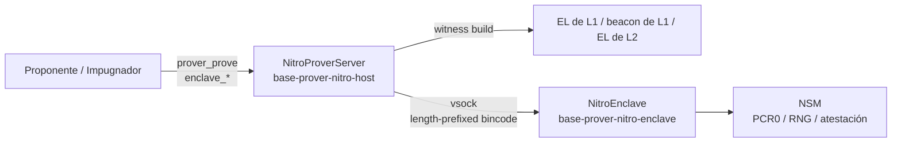

El probador TEE es un servicio offchain que genera material de prueba firmado para los juegos de `AggregateVerifier`
volviendo a derivar y a ejecutar un rango de bloques de L2 dentro de un AWS Nitro Enclave. El mismo
servicio da soporte tanto a la creación de propuestas como a la anulación en disputas: los solicitantes (proponente o impugnador)
envían un rango de bloques, el host recopila los datos de testigo, el enclave verifica el rango y una clave generada aleatoriamente,
que solo existe dentro del enclave, firma el journal resultante.

La firma es autovalidable onchain. `TEEVerifier` recupera el firmante de cada propuesta y
lo contrasta con `TEEProverRegistry` para el `TEE_IMAGE_HASH` de la implementación de juego activa. Un
firmante de otra imagen de enclave, o uno que ya no esté registrado, no puede superar la
verificación. La atestación por instancia del hipervisor Nitro vincula la clave pública del firmante a un
PCR0 concreto, que el [registrador](/es/specifications/base-protocol/proofs/registrar) certifica por separado.

## Responsabilidades {#responsibilities}

Una pila de probador TEE conforme realiza las siguientes tareas:

1. Atender `prover_prove` para rangos de propuestas y disputas mediante JSON-RPC.
2. Recopilar datos de testigo en el host desde los RPC canónicos de L1, de la cadena beacon de L1 y de L2.
3. Reenviar al enclave, a través de vsock, las preimágenes cuyo contenido se ha verificado.
4. Dentro del enclave, volver a derivar y a ejecutar el rango de L2 y validar el output root
   declarado frente al obtenido en la reejecución antes de firmar nada.
5. Firmar journals por bloque y un journal agregado con una clave secp256k1 generada dentro del
   enclave.
6. Exponer `enclave_signerPublicKey` y `enclave_signerAttestation` para el registrador.
7. Opcionalmente, condicionar cada solicitud a la validez del firmante en el registro para fallar de forma cerrada ante enclaves
   dados de baja.
8. Admitir despliegues de varios enclaves en una única instancia EC2 principal, de modo que distintas imágenes PCR0 puedan ejecutarse
   en paralelo durante las rotaciones.

El probador TEE no decide si una propuesta o disputa es correcta. Vuelve a ejecutar el rango,
firma el resultado si la reejecución coincide con lo declarado y responde. Aun así, quienes lo invocan vuelven a comprobar el estado
del juego antes de enviar nada onchain.

## Arquitectura {#architecture}

El servicio se ejecuta como dos procesos en una instancia EC2 principal compatible con Nitro:

* Un binario **host** (`base-prover-nitro-host`) que actúa como terminación de JSON-RPC, recopila los datos de testigo mediante
  HTTP y redirige las solicitudes a uno o más enclaves.
* Un binario **enclave** (`base-prover-nitro-enclave`) empaquetado en un EIF que guarda la clave de firma,
  expone un listener vsock y ejecuta la canalización de pruebas.

Los dos procesos se comunican exclusivamente a través de vsock. El enclave no tiene interfaz de red; toda la conectividad
RPC externa se gestiona en el lado del host.



Cada conexión vsock atiende una única solicitud y después se cierra. El enclave no conserva estado por solicitud
entre conexiones; el único estado persistente dentro del enclave es la clave del firmante y la
medición PCR0 tomada durante el arranque.

Las tramas vsock llevan un prefijo de longitud (longitud `u32` big-endian + carga útil bincode) y tienen un tiempo de espera de lectura de 5 minutos. El transporte limita los fragmentos de escritura a 28 KiB para evitar un error del kernel de Linux en `virtio_vsock` que corrompe los SKB.

## Interfaz JSON-RPC {#json-rpc-interface}

El host expone dos espacios de nombres en un único listener HTTP JSON-RPC, además de un proxy HTTP `GET /healthz`
que redirige al método JSON-RPC `healthz`.

| Método                      | Propósito                                                                                                          |
| --------------------------- | ------------------------------------------------------------------------------------------------------------------ |
| `prover_prove`              | Genera propuestas firmadas, por bloque y agregadas, para un rango de bloques.                                      |
| `enclave_signerPublicKey`   | Devuelve la clave pública secp256k1 sin comprimir de 65 bytes de cada enclave.                                     |
| `enclave_signerAttestation` | Devuelve el documento de atestación COSE&#95;Sign1 de cada enclave.                                                |
| `healthz` / `GET /healthz`  | Comprobación de actividad y, si está habilitada, validez opcional del firmante onchain (con retención del estado). |

Las llamadas `enclave_*` funcionan en modo todo o nada cuando hay varios enclaves: si falla cualquier transporte o
algún enclave devuelve un error, falla toda la respuesta. Quienes realizan las llamadas registran todos los firmantes a la vez, por lo que una
respuesta parcial no serviría de nada.

### Solicitud prover_prove {#prover_prove-request}

Campos de `ProofRequest`:

| Campo                         | Significado                                                                                                                               |
| ----------------------------- | ----------------------------------------------------------------------------------------------------------------------------------------- |
| `l1_head`                     | Hash del bloque cabeza de L1 que ancla la ventana de derivación.                                                                          |
| `l1_head_number`              | Número del bloque cabeza de L1.                                                                                                           |
| `agreed_l2_head_hash`         | Hash del bloque de L2 correspondiente al padre del rango.                                                                                 |
| `agreed_l2_output_root`       | Output root en el padre. Se usa como estado inicial.                                                                                      |
| `claimed_l2_output_root`      | Output root declarado en el objetivo. Crítico para la confianza: el enclave solo firma si el resultado de la reejecución coincide con él. |
| `claimed_l2_block_number`     | Número del bloque de L2 objetivo (bloque final del rango).                                                                                |
| `proposer`                    | Dirección de L1 que enviará la prueba. Se incluye como compromiso en el journal, por lo que el `msg.sender` onchain debe coincidir.       |
| `intermediate_block_interval` | Intervalo de muestreo de los roots intermedios en la propuesta agregada.                                                                  |
| `image_hash`                  | `keccak256(PCR0)` que espera el llamante. Actualmente es solo informativo; el enrutamiento se basa en la validez del firmante onchain.    |

### Respuesta de prover_prove {#prover_prove-response}

`ProofResult::Tee` contiene:

| Campo                | Significado                                                                                                |
| -------------------- | ---------------------------------------------------------------------------------------------------------- |
| `aggregate_proposal` | Un único `Proposal` que abarca todo el rango, con raíces intermedias muestreadas.                          |
| `proposals`          | `Proposal`s por bloque, en orden; cada uno encadena su `prev_output_root` con la raíz del bloque anterior. |

Cada `Proposal`:

| Campo              | Significado                                                              |   |   |   |                                     |
| ------------------ | ------------------------------------------------------------------------ | - | - | - | ----------------------------------- |
| `output_root`      | Output root en el bloque final de esta propuesta.                        |   |   |   |                                     |
| `signature`        | Firma ECDSA secp256k1 de 65 bytes (&#96;r                                |   | s |   | v`) sobre `keccak256(journal)&#96;. |
| `l1_origin_hash`   | Hash de la cabeza de L1 utilizado durante la derivación.                     |   |   |   |                                     |
| `l1_origin_number` | Número de bloque de la cabeza de L1.                                         |   |   |   |                                     |
| `l2_block_number`  | Número del bloque final de L2 de esta propuesta.                         |   |   |   |                                     |
| `prev_output_root` | Output root anterior al rango de esta propuesta.                         |   |   |   |                                     |
| `config_hash`      | Hash de configuración por cadena, integrado de forma fija en el enclave. |   |   |   |                                     |

Cuando el rango contiene exactamente un bloque, la propuesta agregada es idéntica a la única
propuesta por bloque. De lo contrario, la propuesta agregada incluye su propia firma sobre un journal cuyo
`prev_output_root` es el `agreed_l2_output_root` de la solicitud, cuyas `intermediate_roots` se
muestrean cada `intermediate_block_interval` bloques y cuyo `ending_l2_block` es el último bloque del
rango.

### enclave_signerAttestation {#enclave_signerattestation}

Acepta los argumentos opcionales de tipo bytes `user_data` y `nonce`. El hardware NSM limita ambos a 512 bytes,
y la capa RPC del host rechaza los valores que superen ese límite antes de la llamada vsock. El host devuelve un documento
`COSE_Sign1` sin procesar por cada enclave configurado, en el mismo orden que `enclave_signerPublicKey`. El
registrador utiliza este endpoint para vincular el firmante de cada enclave a una atestación nueva antes
de registrarlo onchain.

## Canalización de pruebas {#proof-pipeline}

Una única solicitud `prover_prove` sigue el recorrido host → vsock → enclave → host:

1. **Host**: `ProverService::prove_block` construye un `Host` a partir de la configuración del probador y luego llama a
   `Host::build_witness` para recorrer el EL de L1, el beacon de L1 y el EL de L2, y rellenar un `Oracle` con
   preimágenes indexadas por hash.
2. **Host**: `NitroBackend::prove` aplana el oráculo en pares `(PreimageKey, Vec<u8>)` y
   `NitroTransport::prove` los envía por vsock en una única trama `EnclaveRequest::Prove(...)`.
3. **Enclave**: `Oracle::new` verifica el contenido de cada preimagen indexada por `Keccak256` o `Sha256`, de modo que el
   hash del valor almacenado coincida realmente con su clave.
4. **Enclave**: `BootInfo::load` extrae de las preimágenes locales el proponente, la cabeza de L1, las raíces acordada y reclamada,
   el intervalo de bloques intermedios y el ID de cadena.
5. **Enclave**: `config_hash_for_chain` busca en
   `CONFIG_HASHES` (calculado en el primer acceso a partir de `ChainConfig::all()`) un hash de configuración fijado en el código para cada cadena. Con un ID de cadena desconocido, se devuelve
   `UnsupportedChain` y se rechaza generar la prueba.
6. **Enclave**: el prólogo de la prueba dirige la derivación y la ejecución mediante
   `driver.execute_with_intermediates()`. El `validate()` del epílogo es el control crítico para la confianza:
   confirma que la output root final obtenida al reejecutar coincide con la `claimed_l2_output_root` de la
   solicitud. Solo se firma después de superar esta comprobación.
7. **Enclave**: para cada resultado de bloque, construye un `ProofJournal` con `intermediate_roots` vacío y
   lo firma; encadena `prev_output_root` a lo largo del bucle. Después, construye y firma el journal agregado
   con raíces intermedias muestreadas.
8. **Enclave**: devuelve `EnclaveResponse::Prove(ProofResult::Tee { aggregate_proposal, proposals })`.
9. **Host**: devuelve el resultado al llamador JSON-RPC, aplicando el tiempo de espera configurado para las solicitudes de prueba
   (1740 s por defecto, unos 29 minutos).

El proponente utiliza tanto la propuesta agregada como las propuestas por bloque: las raíces por bloque alimentan
`proposeOutputRoots` y la firma agregada satisface `AggregateVerifier`. El impugnador
utiliza solo la firma agregada y la reempaqueta para `nullify()` mediante
`ProofEncoder::encode_dispute_proof_bytes`. El enclave ni sabe ni le importa a qué llamador está
atendiendo.

## Journal firmado {#signed-journal}

Cada firma se calcula como `secp256k1.sign(keccak256(journal))` y se serializa en 65 bytes
(`r || s || v`). El journal se empaqueta (sin codificación ABI) y ocupa `196 + 32·N` bytes, donde `N` es el
número de raíces intermedias:

```text Signed Journal Layout
proposer(20)        || l1OriginHash(32)   || prevOutputRoot(32)
startingL2Block(8)  || outputRoot(32)     || endingL2Block(8)
intermediateRoots(32 × N)                 || configHash(32)
teeImageHash(32)
```

Las propuestas por bloque tienen `N == 0` y `startingL2Block == endingL2Block - 1`. Las propuestas agregadas
tienen `startingL2Block == firstBlock - 1`, `endingL2Block == lastBlock` y `N == lastBlock /
intermediate_block_interval`.

`teeImageHash` es el `keccak256(PCR0)` obtenido durante el arranque del enclave. Se incluye en cada journal para que una
firma recuperada onchain quede comprometida de forma transitiva con la medición exacta del EIF que la generó. En
modo local (sin NSM, solo para desarrollo y pruebas), `teeImageHash` es cero.

El byte `v` de la firma se codifica como el identificador de recuperación de secp256k1 (`0` o `1`); los llamadores deben normalizarlo
a la forma EIP-155 que necesiten antes de enviarlo a L1.

## Enrutamiento entre múltiples enclaves {#multi-enclave-routing}

`--vsock-cid` acepta uno o más CID, de modo que un único proceso anfitrión puede conectarse a varios enclaves
que se ejecutan en la misma instancia principal de EC2. Cada CID es un endpoint vsock independiente que puede ejecutar un
EIF distinto: un PCR0 diferente, un `tee_image_hash` diferente y un firmante registrado diferente.

La CLI exige `--tee-prover-registry-address` siempre que se configure más de un CID. Sin
el registro no hay forma de elegir entre enclaves de manera determinista, por lo que los despliegues
con múltiples enclaves solo pueden operar en modo de fallo cerrado (fail-closed).

El enrutamiento por solicitud recorre los CID configurados en orden y elige el primer enclave cuyo firmante sea
válido en ese momento en `TEEProverRegistry`:

1. Obtener la clave pública del firmante desde el enclave (si falla, se omite ese transporte).
2. Llamar a `isValidSigner(signer)` en `TEEProverRegistry`.
3. Si es válido, enrutar la solicitud a este enclave. Si no, registrarlo en el log y continuar.
4. Si ningún enclave de la lista tiene un firmante válido, la solicitud falla con `NoValidSigner`.

El caso de uso operativo más habitual es la rotación de imágenes. Ejecuta los EIF antiguo y nuevo en paralelo: durante la ventana de solapamiento,
ambos firmantes están registrados para el `TEE_IMAGE_HASH` de la implementación activa del juego;
una vez que el registro cambia al nuevo hash de imagen, solo el firmante del nuevo enclave es válido y todas
las solicitudes nuevas se enrutan hacia él.

Las llamadas `enclave_*` se envían a todos los enclaves configurados para que el registrador pueda registrar a todos los firmantes
en un solo ciclo.

## Control de acceso por registro y estado de salud {#registration-gating-and-health}

Cuando se establece `--tee-prover-registry-address`, el host habilita dos comportamientos basados en el registro:

* `GET /healthz` indica un estado saludable solo después de que se haya confirmado onchain que el firmante de al menos un
  enclave es válido. El indicador de salud se mantiene fijo: una vez que se ha comprobado que un enclave es válido, `/healthz` sigue
  informando un estado saludable aunque el RPC del registro falle más adelante o se dé de baja al firmante. Así, los balanceadores
  de carga se mantienen estables durante interrupciones breves.
* Cada solicitud `prover_prove` consulta `RegistrationChecker::select_valid_enclave` antes de
  reenviarse. Se omite cualquier enclave dado de baja o cuya clave no se pueda obtener. Si ningún enclave es
  válido, la solicitud se rechaza con el código de error JSON-RPC `-32001`.

Sin el indicador del registro, el host es permisivo: `/healthz` indica un estado saludable mientras el
servidor esté en ejecución, y `prover_prove` enruta las solicitudes al primer enclave configurado.

## Atestación {#attestation}

La clave del firmante se genera dentro del enclave durante el arranque y nunca sale del proceso del enclave.
El constructor `Server::new_enclave`:

1. Abre una sesión NSM (`nsm_init`).
2. Lee PCR0 (SHA-384 de 48 bytes). Si la longitud es incorrecta, se aborta el arranque.
3. Calcula `tee_image_hash = keccak256(PCR0)` y lo almacena para incluirlo en cada journal firmado.
4. Genera una clave ECDSA secp256k1 con `NsmRng`, que llama a
   `nsm_process_request(Request::GetRandom)`.
5. Registra en el log la dirección del firmante (sin material de clave).

No se realiza ninguna atestación durante el arranque ni de forma periódica. Las atestaciones solo se generan cuando el registrador
llama a `enclave_signerAttestation`. Cada llamada:

1. Abre una nueva sesión NSM.
2. Llama a `nsm_process_request(Request::Attestation { public_key, user_data, nonce })`.
3. Devuelve los bytes COSE&#95;Sign1 sin procesar.

El documento de atestación incluye la clave pública sin comprimir de 65 bytes, todos los PCR con valor asignado, la
cadena de certificados emitida por AWS, la marca de tiempo y los `user_data`/`nonce` proporcionados, todo ello firmado con
la clave del hipervisor Nitro propia de cada instancia. Este sistema solo utiliza PCR0: es el valor
vinculado a cada journal firmado mediante `teeImageHash = keccak256(PCR0)`. Consulta la especificación del
[registrador](/es/specifications/base-protocol/proofs/registrar) para ver cómo se verifican las atestaciones y cómo se envían onchain.

## Ciclo de vida del servicio {#service-lifecycle}

La secuencia de arranque del host (`ServerArgs::run`):

1. Analizar la CLI; inicializar el registro y las métricas mediante `base_cli_utils`.
2. Resolver el `RollupConfig` y la configuración de la cadena L1 a partir de `--l2-chain-id`. Fallar si la cadena es desconocida.
3. Construir un `NitroTransport::vsock(cid, 8000)` por cada `--vsock-cid`.
4. Construir `NitroProverServer::new_multi(prover_config, transports, timeout)` y, si
   `--tee-prover-registry-address` está definido, envolverlo con `RegistrationHealthConfig`.
5. Construir un servidor HTTP de jsonrpsee con una capa de proxy `/healthz`, combinar `ProverApiServer`,
   `EnclaveApiServer` y uno de los módulos de healthz, e iniciar el servidor.
6. Bloquear en el handle del servidor; salir con ctrl-C.

La secuencia de arranque del enclave (`NitroEnclave::new`):

1. `Server::new()` abre NSM, deriva `tee_image_hash` y genera la clave del firmante.
2. Vincular un `VsockListener` en `VMADDR_CID_ANY:8000`.
3. Por cada conexión, lanzar un manejador que lee una `EnclaveRequest` en trama, la despacha a
   `Server::prove`, `signer_public_key` o `signer_attestation`, escribe la respuesta y cierra
   la conexión.

Flujo de cada solicitud en el host:

1. (Opcional) `select_valid_enclave` elige un enclave registrado.
2. `tokio::time::timeout(proof_request_timeout, enclave.service.prove_block(request))`.
3. Si se agota el tiempo de espera, devolver el error JSON-RPC `-32000` con el número del bloque L2 que lo provocó.
4. Si el enclave devuelve un error, devolver el error JSON-RPC `-32000` con el mensaje de error subyacente.

El apagado se inicia con ctrl-C, que gestiona `RuntimeManager`. El servidor jsonrpsee se detiene, las
solicitudes en curso se completan y el runtime finaliza. El enclave no tiene un mecanismo de apagado ordenado; al
terminar el proceso, `Drop` libera los descriptores de archivo de NSM.

## Entradas del operador {#operator-inputs}

Un host de probador TEE necesita:

* URL de RPC de ejecución de L1.
* URL de RPC de la beacon chain de L1.
* URL de RPC de ejecución de L2.
* ID de cadena de L2 (se usa para seleccionar la configuración del rollup y el hash de configuración por cadena).
* Dirección de escucha de JSON-RPC.
* Uno o más CID de vsock, cada uno respaldado por un Nitro Enclave que ejecuta el EIF del probador.
* Tiempo de espera de las solicitudes de prueba (1740 segundos de forma predeterminada).
* Filtro de logs y configuración de métricas de Prometheus.

Opcional:

* Dirección de `TEEProverRegistry`. Obligatoria cuando se configura más de un CID de vsock. Habilita
  la comprobación de estado supeditada al registro y la validación del firmante en cada solicitud.
* Flag experimental del endpoint de witness para hosts que exponen `debug_executePayload`.

El enclave no necesita ninguna entrada del operador aparte de la imagen EIF y el canal vsock. PCR0 se lee
de NSM durante el arranque; la clave del firmante se genera con el RNG de hardware.

## Requisitos de seguridad {#safety-requirements}

Una implementación de probador TEE debe preservar estas propiedades de seguridad:

* Generar la clave de firma dentro del enclave a partir del RNG de hardware del NSM y nunca serializarla fuera
  del proceso del enclave.
* Validar el output root final reejecutado con respecto al `claimed_l2_output_root` de la solicitud antes
  de firmar nada, y negarse a firmar si la comprobación falla.
* Incrustar `tee_image_hash = keccak256(PCR0)` en cada journal firmado para que las firmas queden vinculadas a una única medición
  de EIF.
* Verificar el contenido de cada preimagen indexada por hash en el momento en que entra en el enclave, para que la derivación no pueda consumir
  preimágenes cuyos valores no coincidan con sus claves.
* Negarse a generar pruebas para chain IDs que no figuren en la tabla codificada de forma fija `CONFIG_HASHES`.
* Limitar `user_data` y `nonce` a 512 bytes, el máximo del NSM, en la frontera RPC del host, para que las solicitudes de
  atestación de tamaño excesivo no puedan llegar al enclave.
* Atender como máximo una solicitud por conexión vsock y no conservar ningún estado mutable entre solicitudes, para que una
  solicitud malformada no pueda influir en otra posterior.
* Cuando `--tee-prover-registry-address` esté configurado, aplicar un criterio de fallo cerrado (fail closed) a la validez del firmante en cada solicitud
  y rechazar la solicitud si ningún enclave configurado tiene actualmente un firmante válido onchain.