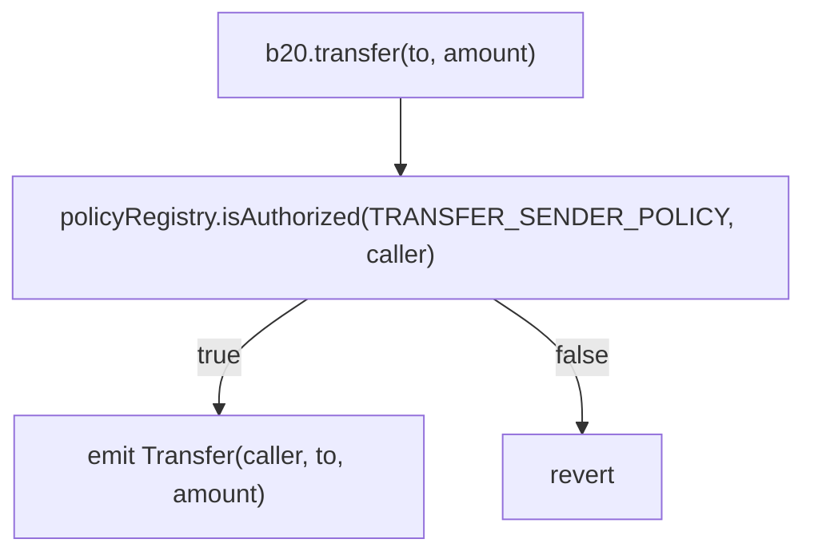
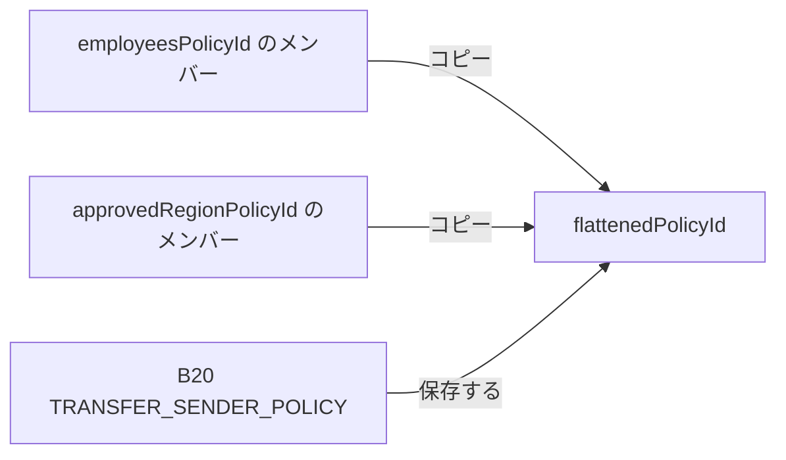

## 概要 {#summary}

[Cobalt](/ja/upgrades/cobalt/overview) では、`PolicyRegistry` にコンポジットポリシーが追加されます。コンポジットは、既存のシンプルな `ALLOWLIST` または `BLOCKLIST` ポリシーを 2〜4 個、`UNION` (OR) または
`INTERSECT` (AND) ゲートで組み合わせたものです。コンポジットは `createCompositePolicy` で作成し、子ポリシーのセット全体を
`updateComposite` で置き換えます。

この変更は追加のみで、既存の機能には影響しません。既存の Beryl のセレクター、イベント、エラー、およびシンプルなポリシーの動作は、Cobalt 以降も引き続き
呼び出し可能です。`createPolicy` と `createPolicyWithAccounts` には、リバートするケースが 1 つ追加されます。
コンポジットの `policyType` を指定して呼び出すと、`IncompatiblePolicyType` でリバートします。

## 動機 {#motivation}

アセット発行者は、KYC 許可リストや制裁対象ブロックリストなどの認可ポリシーを、複数のアセットで使い回すことがよくあります。Cobalt 以前は、複数のポリシーを組み合わせるには、各ポリシーのメンバーを
1 つのフラットなポリシーにコピーしたうえで、ソース側の更新をすべて同期するオフチェーンインフラストラクチャを運用する必要がありました。
こうして複製したデータは、最新の状態から乖離するおそれがあります。コピーしたリストが更新されるまでの間、有効なアカウントが拒否されたり、削除済みのアカウントが
認可されたままになったりする可能性があります。

また、認可には明示的な OR や AND の関係が求められる場合もあります。たとえば、共有の許可リストとトークン固有の許可リストのどちらかに含まれるアカウントを
許可するポリシーや、KYC 認証済みで、かつ Pro User 許可リストにも含まれていることをアカウントに
要求するポリシーが考えられます。コンポジットポリシーを使えば、メンバーシップデータをコピーせずにこうした関係を表現できます。各認可チェックでは、評価対象となる
すべての子ポリシーの現在の状態が参照されます。

## 変更点 {#what-changed}

### ポリシーコンテキスト {#policy-context}

B20 は、制限対象の操作ごとに `PolicyRegistry` のポリシー ID を保持します。操作が
実行されようとすると、B20 は `isAuthorized(policyId, account)` を呼び出し、アカウントが
認可されていなければその操作を拒否します。



`BLOCKLIST` と `ALLOWLIST` は、引き続きシンプルポリシーのままです。コンポジットポリシーの子として有効なのは、この 2 つのポリシーのみです。

### インターフェースの変更 {#interface-changes}

`PolicyType` は追記のみ可能 (append-only) です。`UNION = 2` と `INTERSECT = 3` は、既存の `BLOCKLIST = 0` および
`ALLOWLIST = 1` の後ろに追加されます。これにより、既存のパック済みポリシー ID のエンコーディングとの互換性が保たれます。

```solidity IPolicyRegistry.sol lines expandable wrap highlight={13-22}
enum PolicyType {
    BLOCKLIST,
    ALLOWLIST,
    UNION,
    INTERSECT
}

error ChildPoliciesOutsideOfRange();
error InvalidChildPolicy(uint64 childPolicyId);

event CompositePolicyUpdated(uint64 indexed policyId, address indexed updater, uint64[] childPolicyIds);

function createCompositePolicy(address admin, PolicyType policyType, uint64[] calldata childPolicyIds)
    external
    returns (uint64 newPolicyId);

function updateComposite(uint64 policyId, uint64[] calldata childPolicyIds) external;

function compositePolicyChildIds(uint64 policyId) external view returns (uint64[] memory);

function MIN_COMPOSITE_CHILD_POLICIES() external view returns (uint256);
function MAX_COMPOSITE_CHILD_POLICIES() external view returns (uint256);
```

| シンボル                                                | セレクター / Topic0                                                       | ステータス  | 動作                                                                              |
| --------------------------------------------------- | -------------------------------------------------------------------- | ------ | ------------------------------------------------------------------------------- |
| `createCompositePolicy(address,uint8,uint64[])`     | `0x6fdd1491`                                                         | 新規     | `UNION` または `INTERSECT` のコンポジットを作成します。`PolicyType` は `uint8` として ABI エンコードされます。 |
| `updateComposite(uint64,uint64[])`                  | `0xbfe142c0`                                                         | 新規     | 子ポリシーのセット全体を置き換えます。                                                             |
| `compositePolicyChildIds(uint64)`                   | `0x7c40df74`                                                         | 新規ビュー  | 子 ID を保存順に返します。コンポジット以外の場合は空の配列を返します。                                           |
| `MIN_COMPOSITE_CHILD_POLICIES()`                    | `0xb3ae29f7`                                                         | 新規ビュー  | `2` を返します。                                                                      |
| `MAX_COMPOSITE_CHILD_POLICIES()`                    | `0x54309870`                                                         | 新規ビュー  | `4` を返します。                                                                      |
| `ChildPoliciesOutsideOfRange()`                     | `0x697ec868`                                                         | 新規エラー  | 子の数が `[2, 4]` の範囲外です。64 アカウントを上限とする `BatchSizeTooLarge` とは別の制限です。               |
| `InvalidChildPolicy(uint64)`                        | `0x46508ef6`                                                         | 新規エラー  | 子がコンポジットまたは組み込みのセンチネルです。                                                        |
| `CompositePolicyUpdated(uint64,address,uint64[])`   | `0x4ff6adaab31b0df87aa7b8b7320c52b8b3b5eede3bf28a6baaaa8b8b7e1d6363` | 新規イベント | コンポジットの作成時および更新のたびに、更新後のセット全体を含めて発行されます。                                        |
| `isAuthorized(uint64,address)`                      | `0x55a1179e`                                                         | 拡張     | コンポジットポリシーを処理し、子ポリシーをその時点の状態で評価します。                                             |
| `createPolicy(address,uint8)`                       | `0xca5d55f6`                                                         | 拡張     | `UNION` と `INTERSECT` を `IncompatiblePolicyType` で拒否します。                        |
| `createPolicyWithAccounts(address,uint8,address[])` | `0xa2d3044f`                                                         | 拡張     | `UNION` と `INTERSECT` を `IncompatiblePolicyType` で拒否します。                        |

現在のインターフェース全体については、[IPolicyRegistry リファレンス](/specifications/b20/reference/interfaces/i-policy-registry/index)を参照してください。

#### 複合ポリシーの作成 {#composite-policy-creation}

`createCompositePolicy(admin, policyType, childPolicyIds)` は `UNION` または `INTERSECT` ポリシーを作成し、
`admin` を初期管理者に設定して、新しいポリシー ID を返します。複合ポリシーは子ポリシーのメンバーシップをコピーせず、
子ポリシーへの参照を保持します。

子ポリシーのセットには、既存のシンプルポリシーを 2 ～ 4 個含める必要があります。複合ポリシーや、
組み込みのセンチネルである `ALWAYS_ALLOW` および `ALWAYS_BLOCK` は子ポリシーに指定できません。子ポリシーを 1 つ評価するたびに
メンバーシップのストレージ読み取りが発生するため、評価する子ポリシーの数に応じてガス消費量が増加します。

検証は次の順序で実行されます。

1. `ZeroAddress` — `admin` が `address(0)` である。
2. `IncompatiblePolicyType` — `policyType` が `UNION` でも `INTERSECT` でもない。
3. `ChildPoliciesOutsideOfRange` — 子ポリシーの数が `[2, 4]` の範囲外である。
4. `PolicyNotFound` — 1 つ以上の子ポリシーが存在しない。レジストリは、このチェックをすべて完了してから
   子ポリシーの種類を確認します。
5. `InvalidChildPolicy` — 子ポリシーが複合ポリシーまたは組み込みのセンチネルである。

成功すると、レジストリは `PolicyCreated(policyId, creator, policyType)`、
`PolicyAdminUpdated(policyId, address(0), admin)`、
`CompositePolicyUpdated(policyId, creator, childPolicyIds)` をこの順序で発行します。

#### 複合ポリシーの更新 {#composite-policy-updates}

`updateComposite(policyId, childPolicyIds)` は、複合ポリシーの子ポリシー集合全体をアトミックに置き換えます。
部分的な更新や、子ポリシー集合を空にすることはできません。成功するとイベント
`CompositePolicyUpdated(policyId, updater, childPolicyIds)` が発行されます。更新しても管理者は変わらないため、
`PolicyAdminUpdated` は発行されません。

検証は次の順序で行われます。

1. `PolicyNotFound` — `policyId` が存在しない。
2. `IncompatiblePolicyType` — `policyId` が `UNION` または `INTERSECT` ポリシーではない。
3. `Unauthorized` — 呼び出し元が現在の管理者ではない。管理権限が放棄された複合ポリシーは
   更新できません。
4. `ChildPoliciesOutsideOfRange` — 新しい子ポリシーの数が `[2, 4]` の範囲外である。
5. `PolicyNotFound` — 新しい子ポリシーのうち 1 つ以上が存在しない。
6. `InvalidChildPolicy` — 新しい子ポリシーが複合ポリシーまたは組み込みのセンチネルである。

### 動作の変更点 {#behavioral-changes}

#### 既存コンストラクタでのリバート {#existing-constructor-reverts}

`createPolicy` と `createPolicyWithAccounts` は、引き続きシンプルポリシーのみを作成します。いずれも、
`policyType` が `UNION` または `INTERSECT` の場合は `IncompatiblePolicyType` でリバートするようになりました。

#### 認可の評価 {#authorization-evaluation}

`isAuthorized` は、コンポジットを次のように評価します。

```text Authorization Evaluation lines expandable wrap highlight={1-12}
isAuthorized(policyId, account):
    if policy is ALLOWLIST:
        return account is in the policy

    if policy is BLOCKLIST:
        return account is not in the policy

    if policy is UNION:
        return true when any child authorizes the account

    if policy is INTERSECT:
        return false when any child does not authorize the account
```

コンポジットの子はシンプルポリシーでなければならないため、評価の最大深度は 1 となり、再帰や循環が発生することはありません。
認可はメンバーシップのスナップショットではなく、その時点の状態に基づいて行われます。子ポリシーへの変更は、
それを参照するすべてのコンポジットで、次回の認可チェック時から反映されます。

評価は短絡的に行われます。`UNION` は最初に認可した子の時点で、`INTERSECT` は最初に認可しなかった子の時点で評価を停止します。
子の順序によって認可結果が変わることはありませんが、ガス使用量は変わる可能性があります。
短絡する可能性が最も高い子を先頭に配置してください。

レジストリは子の順序を保持し、子 ID の重複も許容します。ソートや重複排除は行いません。
子は、その管理者が管理権限を放棄した後も引き続き有効です。放棄すると以降のメンバーシップ更新は凍結されますが、
ポリシーが削除されることはなく、現在の認可結果も変わりません。

形式としては正しいものの一度も作成されていない `UNION` ID は子を持たないため、`false` を返します。同様に、形式としては正しいものの
一度も作成されていない `INTERSECT` ID は子を持たないため、`true` を返します。ポリシー ID を保存するコンシューマーは、
保存前に `policyExists(policyId)` を呼び出さなければなりません (MUST) 。これを怠ると、無効な `INTERSECT` ID が
`ALWAYS_ALLOW` と同様に振る舞うおそれがあります。

#### 状態の変更 {#state-changes}

この変更により、`base.policy_registry` ERC-7201 名前空間のオフセット `4` に `children` マッピングが追加されます。
これは追加のみの変更であり、既存のオフセット `0` 〜 `3` は変更されず、ストレージの移行も不要です。
このオフセットは名前空間の位置を基準とした相対値であり、EVM ストレージスロット `4` そのものを指すわけではありません。

| フィールド   | 値                                                                    |
| ------- | -------------------------------------------------------------------- |
| 名前空間の位置 | `0x00503aeb06982fa1fe3151dc68f90b3946c55c449dfd447e49dcaece71ba4a00` |
| オフセット   | `CHILDREN_OFFSET = 4`                                                |
| フィールドの型 | `mapping(uint64 policyId => uint64[] childPolicyIds) children`       |

各マッピングエントリには動的配列の長さが格納されます。配列の要素はそのエントリのハッシュ位置から始まり、
4 つの `uint64` 子 ID が 1 つの 256 ビットストレージスロットにパックされるため、子の数の上限である 2〜4 個に対応できます。

| ビット       | 配列インデックス | フィールド               |
| --------- | -------- | ------------------- |
| `0–63`    | `0`      | `childPolicyIds[0]` |
| `64–127`  | `1`      | `childPolicyIds[1]` |
| `128–191` | `2`      | `childPolicyIds[2]` |
| `192–255` | `3`      | `childPolicyIds[3]` |

シンプルポリシーとコンポジットポリシーは、グローバルな `nextCounter` を共有します。`0` と
`1` は `ALWAYS_ALLOW` と `ALWAYS_BLOCK` 用に予約されているため、このカウンターは `2` から始まります。コンポジットポリシー ID では、最上位バイトに
`PolicyType` が、下位 56 ビットに次のカウンター値が格納されます。コンポジットポリシー用の
別個のカウンターはありません。

## 例 {#examples}

`employeesPolicyId` と `approvedRegionPolicyId` は、既存の `ALLOWLIST` ポリシーであるとします。どちらの
例でも、いずれかのリストに含まれるアカウントに転送を許可します。

### 変更前：フラット化されたポリシー {#before-flattened-policy}

B20 はスコープごとに 1 つのポリシー ID しか保存できないため、両方のソースリストの内容を、フラット化した単一の許可リストにコピーする必要があります。
さらに、オフチェーンのインフラストラクチャで両方のソースを監視し、メンバーシップの変更をコピー先に反映させます。

```solidity Flattened Policy
uint64 flattenedPolicyId = policyRegistry.createPolicyWithAccounts(
    admin,
    PolicyType.ALLOWLIST,
    /* 従業員アドレスと承認済み地域アドレスの和集合 */
);

b20.updatePolicy(TRANSFER_SENDER_POLICY, flattenedPolicyId);
```



```mermaid Flattened Policy Synchronization lines expandable wrap highlight={1-12}
sequenceDiagram
    participant SourceAdmin
    participant Employees as employeesPolicyId
    participant Listener as Sync infrastructure
    participant Flat as flattenedPolicyId
    participant B20

    SourceAdmin->>Employees: updateAllowlist(true, [Alice])
    Employees-->>Listener: AllowlistUpdated(..., true, [Alice])
    Note over B20,Flat: Alice cannot transfer yet
    Listener->>Flat: updateAllowlist(true, [Alice])
    Note over B20,Flat: Alice can transfer
```

### 変更後: 複合ポリシー {#after-composite-policy}

ソースポリシーを参照する `UNION` 複合ポリシーを作成し、その ID を B20 に割り当てます。B20 側には
複合ポリシー固有のロジックは必要ありません。これまでどおり、保存されているポリシー ID を `PolicyRegistry` に渡すだけです。

```solidity Composite Policy
uint64 compositePolicyId = policyRegistry.createCompositePolicy(
    admin,
    PolicyType.UNION,
    [employeesPolicyId, approvedRegionPolicyId]
);

b20.updatePolicy(TRANSFER_SENDER_POLICY, compositePolicyId);
```

作成呼び出しでは、まず `PolicyCreated(policyId, admin, UNION)` が発行され、次に
`PolicyAdminUpdated(policyId, address(0), admin)`、最後に
`CompositePolicyUpdated(policyId, admin, childPolicyIds)` が発行されます。Alice を `employeesPolicyId` に追加すると、
メンバーを別のポリシーにコピーしなくても、次回のチェックから Alice は認可されます。

```mermaid Composite Policy Authorization lines expandable wrap highlight={1-15}
sequenceDiagram
    participant Admin
    participant Employees as employeesPolicyId
    participant Region as approvedRegionPolicyId
    participant Union as UNION composite
    participant B20

    Admin->>Union: createCompositePolicy(UNION, [employees, approvedRegion])
    Admin->>B20: updatePolicy(TRANSFER_SENDER_POLICY, compositePolicyId)

    Note over Employees: Alice added to employeesPolicyId
    B20->>Union: isAuthorized(compositePolicyId, Alice)
    Union->>Employees: isAuthorized(employeesPolicyId, Alice)
    Employees-->>Union: true
    Union-->>B20: true
```

## 設計上の決定事項と検討した代替案 {#design-decisions-and-alternatives-considered}

Cobalt では、明示的な 2 種類のポリシー型、単一の `createCompositePolicy` 関数、および `updateComposite` による完全な置き換えを採用しています。

### 単一の汎用複合型 {#one-generic-composite-type}

AND、OR、NOT、XOR などの演算子を別途格納する汎用複合型を採用すると、追加の演算子が求められていないにもかかわらず、
ストレージと認可の仕組みが複雑になります。明示的な
`UNION` 型と `INTERSECT` 型を用いれば、ポリシー ID のエンコーディング、ガスプロファイル、監査対象範囲をより小さく抑えられます。

### トークンレベルのポリシーグループ {#token-level-policy-groups}

各 B20 トークンに複数のポリシー ID とオペレーターを保存する方式では、複合ポリシーを再利用できなくなるうえ、
変更がトークンのバリアント、ファクトリー、認可のホットパスにまで波及します。再利用可能な
PolicyRegistry ポリシーを使えば、B20 のポリシースロットは不透明な `uint64` ID のまま維持されます。

### 子のインクリメンタルな更新 {#incremental-child-updates}

追加と削除を個別の操作として設けると、配列の変更、長さ、重複排除に関する挙動を定義する必要が生じます。
コンポジットが持つ子は最大 4 つであるため、アトミックに全体を置き換えるほうがシンプルで、コストも低く抑えられます。

### 作成関数の分離 {#separate-creator-functions}

`createUnionPolicy` 関数と `createIntersectPolicy` 関数を別々に用意すると、作成 API が重複してしまいます。
単一の `createCompositePolicy` であれば、両方の演算子を一貫した形でサポートできます。

### ネストされたコンポジット {#nested-composites}

コンポジットから別のコンポジットを参照できるようにすると、深さの制限や循環参照への対策が必要になるうえ、認可の走査が
際限なく続くおそれもあります。子をシンプルなポリシーに限定すれば、評価の深さは常に 1 となり、
最悪ケースのガス消費にも上限を設けられます。

## 移行 {#migration}

この変更は破壊的変更ではありません。既存のシンプルな `ALLOWLIST` および `BLOCKLIST` ポリシーは引き続き動作するため、
複合的な動作を必要としないインテグレーションでは対応は不要です。

フラット化されたポリシーを置き換えるには、次の手順に従います。

1. 組み合わせる既存のシンプルポリシーを特定します。
2. `createCompositePolicy` を使用して、`UNION` または `INTERSECT` の複合ポリシーを作成します。
3. `b20.updatePolicy` を使用して、該当する B20 ポリシースコープに複合ポリシーの ID を書き込みます。
4. 古いフラット化されたポリシーが不要になった場合は削除します。

B20 は複合ポリシーの ID を、シンプルポリシーと同じく不透明な `uint64` ポリシー ID として扱うため、
B20 コントラクトを変更する必要はありません。