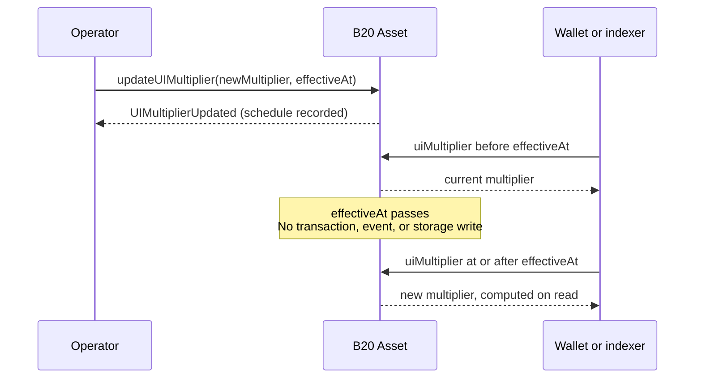

*B20 Asset の UI 乗数 ([ERC-8056](https://eips.ethereum.org/EIPS/eip-8056)) の基本的な考え方を説明します。使い方、イベント、エラーについては [`updateUIMultiplier`](/specifications/b20/reference/interfaces/ib20-asset/update-ui-multiplier) を参照してください。この機能は Asset 専用で、Stablecoin には乗数がありません。詳しくは[トークンの種類](/ja/specifications/b20/concepts/token-types)を参照してください。*

対象読者：インテグレーター、インデクサー

***

## 乗数が存在する理由 {#why-multipliers-exist}

発行体には、表示上の株式数を変更する株式分割の仕組みが必要です。分割のたびにすべての保有者の生の ERC-20 残高を書き換えると、`balanceOf` や `transfer` を呼び出すボールトなどの DeFi プロトコルから見て、トークンが一切移動していないにもかかわらず残高が変化してしまいます。

B20 Asset は、保有者の残高を生の ERC-20 単位で保存します。乗数はこれらの残高を書き換えずに表示上のスケールだけを変更するため、ERC-20 のインターフェースには影響しません。

ウォレットやインデクサーは、派生した UI ビューを読み取ることで、分割後の株式数を表示できます。

株式併合 (リバーススプリット) も同じプリミティブで実現でき、`multiplier < 1e18` を指定するだけです。

## 仕組み {#how-they-work}

### UIの仕組み {#how-the-ui-works}

各保有者は2種類の数量を持ちます。保存されている**raw**残高と、そこから導出される**UI**残高です。UI残高は、ウォレットやインデクサーが株式数として表示する値で、`raw * multiplier / WAD_PRECISION` で求められます。

この式は `WAD_PRECISION` (`1e18`) で除算するため、乗数も同じ倍率でスケーリングする必要があります。スケール `1.0` は `1 * 1e18` です。これがデフォルトで、このときUIはrawと等しくなります。保存値が `0` の場合は `WAD_PRECISION` として読み取られます。

2対1の株式分割はスケール `2.0` なので、乗数は `2 * 1e18`、つまり `2e18` です。raw残高が `100` なら、UIは `200` になります。ここで `2` を渡すと `raw * 2 / 1e18` が計算され、同じ残高が切り捨てられて `0` になってしまいます。

株式併合も同じエンコーディングを使います。1対2の併合はスケール `0.5` なので、乗数は `0.5 * 1e18`、つまり `5e17` です。raw残高が `100` なら、UIは `50` になります。

オペレーターは、このスケーリング済みの値を、現在の乗数に対する比率ではなく**絶対値**の乗数として書き込みます。2回目の2対1分割は `4e18` であり、「もう一度×2を適用する」わけではありません。比率で指定すると現在のスケールが把握しにくくなり、分割を重ねたときに誤った値を設定しやすくなります。

また、この除算は整数演算で、端数は切り捨てられます。`multiplier != WAD_PRECISION` の場合、`toUIAmount` から `fromUIAmount` へ往復変換すると、最終桁の1単位 (ULP) が失われることがあります。この影響を小さく抑えるため、株式には小数点以下18桁 (decimals) を推奨します。丸めの詳細については、Asset仕様および株式分割ガイドを参照してください。

### 乗数の変更の確認と読み取り {#viewing-and-reading-multiplier-changes}

インデクサーやインテグレーターはこれらのビューを読み取るだけで、乗数を書き込むことはありません。ERC-8056 の名前は B20 の名前のエイリアスです。ERC-8056 の名前を優先して使用してください。

現在のスケールは `uiMultiplier()` (`multiplier()`) で取得できます。これは `block.timestamp` 時点で有効な乗数を返します。

保留中の変更は `newUIMultiplier()` と `effectiveAt()` で確認できます。`effectiveAt() > block.timestamp` である間、変更は保留状態のままです。切り替わった後は、`uiMultiplier()` が新しい値を返します。切り替え時に 2 回目のイベントは発行されません。

保有者の UI 上のシェア数は `balanceOfUI(account)` (`scaledBalanceOf`) で取得でき、`balanceOf(account) * uiMultiplier() / WAD_PRECISION` として計算されます。`totalSupplyUI()` は、同じ式を `totalSupply()` に適用したものです。

個々の数量は、その時点で有効な乗数に基づき、`toUIAmount(raw)` と `fromUIAmount(ui)` で変換します。`toScaledBalance` と `toRawBalance` は、これら 2 つの関数の非推奨エイリアスです。

### 変わらないもの {#what-it-preserves}

`balanceOf`、`transfer` の金額、`totalSupply`、およびアローワンスは、生の値のまま保持されます。この ERC-20 インターフェースを利用するプロトコルからは、分割は見えません。

上記の UI 向けビューはオプトインです。`balanceOfUI`、`scaledBalanceOf`、`totalSupplyUI` のいずれかを呼び出すプロトコルからは、分割が見えます。

### スケジューリング {#scheduling}

オペレーターは通常、スケジュール設定を `announce` でラップし、分割を開示済みのコーポレートアクションとして扱います。[`announce`](/specifications/b20/reference/interfaces/ib20-asset/announce) を参照してください。

ただし、このラップによって 2 つの概念が統合されるわけではありません。乗数イベントは、スケール変更が記録されたことを示します。一方、アナウンスは、オペレーターがコーポレートアクションを開示したことを示します。

標準的な方法は、即時セッターではなく `updateUIMultiplier(newMultiplier, effectiveAt)` を使うことです。`OPERATOR_ROLE` を持つアカウントが、保留中の乗数と将来の `effectiveAt` を記録します。アセットが一度に保持できる有効な保留中の更新は 1 つだけです。

`effectiveAt() > block.timestamp` の間は、`uiMultiplier()` は引き続き現在の乗数を返します。`newUIMultiplier()` はスケジュールされた値を、`effectiveAt()` は切り替え時刻を返します。

`block.timestamp >= effectiveAt` になると、読み取り結果は新しい乗数になります。有効化の時点ではイベントは発行されず、ストレージへの書き込みも行われません。インデクサーは、`effectiveAt` の時点で「分割が発生した」ことを示すログを待ってはなりません (MUST NOT) 。`UIMultiplierUpdated` は、更新が**記録された**時点で発行されます。

切り替え後に有効な保留中の更新があるかどうかは、`effectiveAt() > block.timestamp` で判定してください。`effectiveAt() == 0` で判定してはいけません。

`cancelUIMultiplierUpdate` を使うと、`effectiveAt` より前であれば有効な保留中の更新を取り消せます。詳細は株式分割ガイドを参照してください。

非推奨の `updateMultiplier` は値を即座に適用し、保留中の更新をすべて取り消します。緊急時のオーバーライド専用です。通常の分割には `updateUIMultiplier` を使用してください。詳細は株式分割ガイドを参照してください。

## 例 {#example}

2対1の分割では、ウォレットに表示される値が2倍になります。raw単位は変わらず、切り替え時にイベントも発行されません。

保有者の初期状態が raw `100`、乗数 `1e18` だとすると、UI 上の値は `100` です。オペレーターが `updateUIMultiplier(2e18, T)` をスケジュールします。

`T` までは何も切り替わりません。raw は `100` のまま、`uiMultiplier()` も `1e18` のままです。予定されている分割は `newUIMultiplier()` (`2e18`) と `effectiveAt()` (`T`) で確認できます。

`T` を過ぎると、UI 上の値は `200` になります。raw は `100` のままで、2回目のイベントも発行されません。

株式併合も同じ仕組みで行います。1対2の併合には `5e17` を使用します。

## 関連項目 {#related}

* [トークンの種類](/ja/specifications/b20/concepts/token-types) — Asset と Stablecoin の違い。乗数は Asset のみが対象です。
* [ロールと一時停止](/ja/specifications/b20/concepts/roles-and-pause) — `OPERATOR_ROLE`。
* [`updateUIMultiplier`](/specifications/b20/reference/interfaces/ib20-asset/update-ui-multiplier) — スケジュールの設定・キャンセル・上書きの方法、およびイベントとエラー。
* [`announce`](/specifications/b20/reference/interfaces/ib20-asset/announce) — スケジュール設定に開示機能を加えたラッパー。