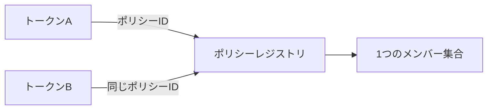
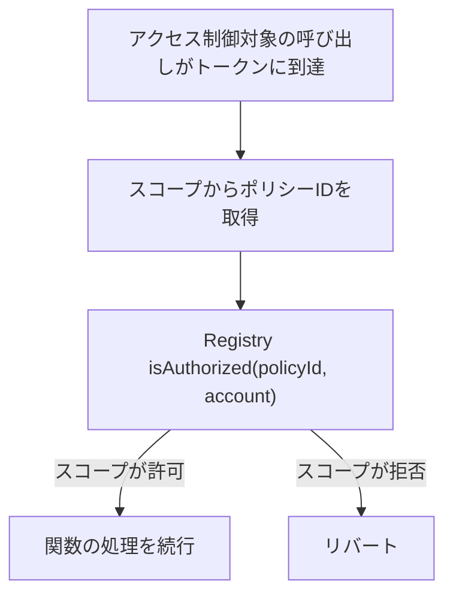
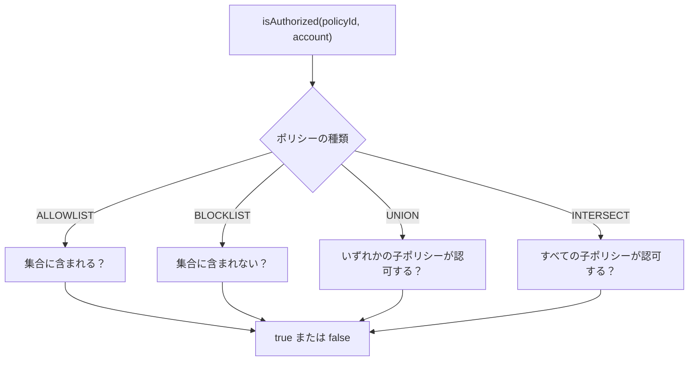
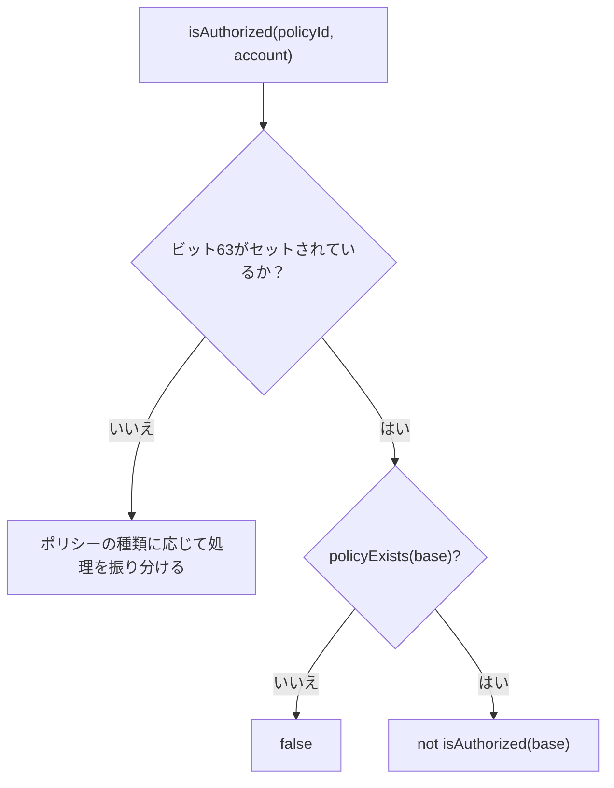
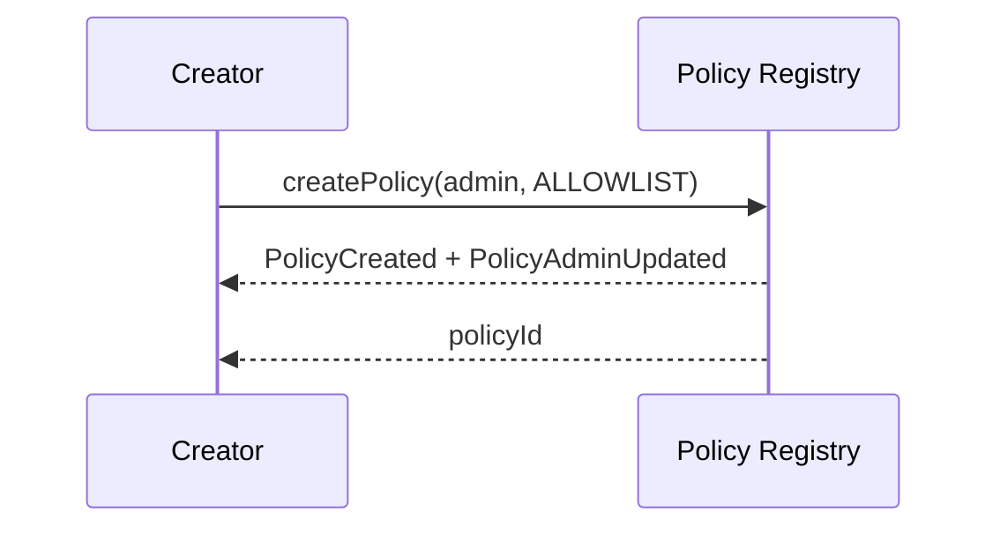
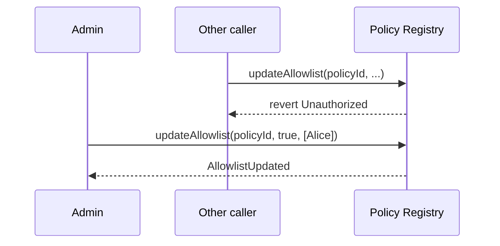
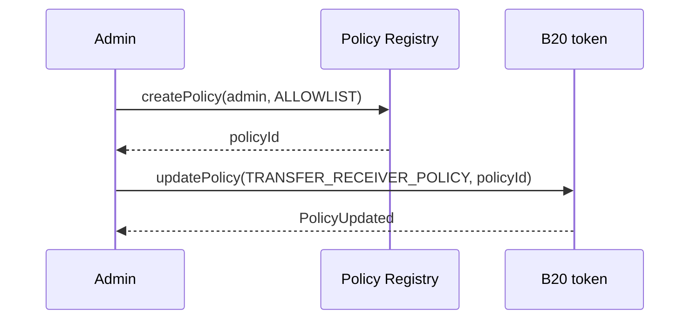
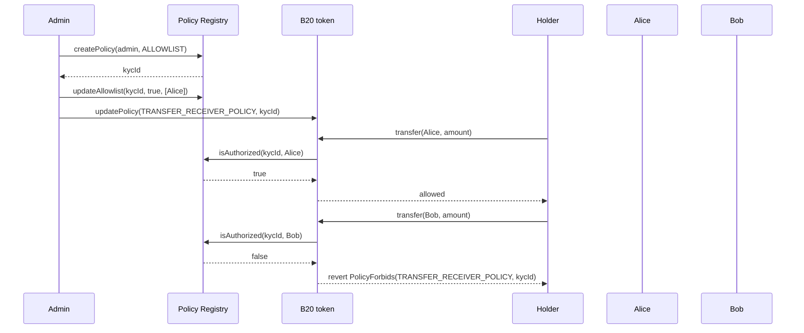

*B20 が共有の許可リストとブロックリストをコンプライアンスチェックにどのように再利用するかを説明します。ロールと一時停止はこれとは別の認可レイヤーです。詳しくは[ロールと一時停止](/ja/specifications/b20/concepts/roles-and-pause)を参照してください。*

## 1. ポリシーが存在する理由 {#1-why-policies-exist}

トークンのコンプライアンスの大半は、結局のところアドレスリストに対するメンバーシップチェックに行き着きます。つまり、「このアカウントは送信、受信、またはミントの受け取りを許可されているか」という確認です。発行者は同じリストを多数のトークンで繰り返し使います。同じ KYC 許可リストや制裁ブロックリストをトークンごとにコピーすると、リスト間で内容のずれが生じます。リストを 1 回更新するたびに、すべてのコピーへ反映しなければならないからです。

ポリシーを使うと、リストを 1 か所に集約できます。Policy Registry はシングルトンのプリコンパイルで、各リストを、そのリストに対して実行されるメンバーシップロジックとともに 1 度だけ保存します。トークン側はスロットにポリシー ID を保存するだけです。ゲート付き関数の実行前に、トークンはレジストリに対して、該当するアドレスが認可されているかどうかを問い合わせます。1 つのポリシーを複数のトークンで共有でき、ポリシーを更新すると、それを参照するすべてのトークンに反映されます。



ロールは、誰が特権関数を呼び出せるかを決めます。一時停止は、その種類の操作が現在有効かどうかを決めます。ポリシーは、特定のアドレスがその操作を実行する権限を認可されているかどうかを決めます。1 つの呼び出しに、これら 3 つすべてが同時に適用されることもあります。

## 2. ポリシーの仕組み {#2-how-policies-work}

### 2.1 レジストリとトークン {#21-the-registry-and-the-token}

Policy Registry は、メンバーセットとコンポジットゲートを所有します。作成はパーミッションレスです。各ポリシーには管理者がおり、メンバーシップの更新、コンポジットポリシーの子の置き換え、管理権限の移譲を行います。トークンがこれらのリストに書き込むことはありません。トークンは [スコープ](#32-policy-scopes) ごとに `uint64` のポリシー ID を保存し、そのスコープの実行時に `isAuthorized(policyId, account)` を呼び出します。

`isAuthorized` がリバートすることはありません。この関数は、アカウントがそのポリシーのもとで認可されているかどうかを返します。`false` (1 つのスコープでは `true`) が何を意味するかは、トークン側が決定します。ほとんどのスコープでは、結果が `false` の場合に `PolicyForbids` でリバートし、関数は実行されません。



### 2.2 ポリシーの種類 {#22-policy-types}

ポリシーには、シンプルポリシーとコンポジットポリシーの2種類があります。

**シンプル**ポリシーは、1つのアドレスセットに基づいて判定します。

| 種類          | 認可される条件           |
| ----------- | ----------------- |
| `ALLOWLIST` | アカウントがセットに含まれている  |
| `BLOCKLIST` | アカウントがセットに含まれていない |

空の許可リストはどのアカウントも認可しません。空のブロックリストはすべてのアカウントを認可します。

**コンポジット**ポリシーは、既存のシンプルポリシーを2〜4個組み合わせたものです。子ポリシーのメンバーはコピーされず、`isAuthorized` が呼び出されるたびに、各子ポリシーの現在のセットが読み取られます。

| 種類          | 認可される条件                 |
| ----------- | ----------------------- |
| `UNION`     | いずれかの子ポリシーがアカウントを認可している |
| `INTERSECT` | すべての子ポリシーがアカウントを認可している  |

子ポリシーは、既存の `ALLOWLIST` または `BLOCKLIST` ポリシーである必要があります。別のコンポジットポリシーを子ポリシーにすることはできません。[§2.5](#25-built-in-sentinels) の組み込みセンチネルも同様に、子ポリシーにはできません。子ポリシーのメンバーを更新すると、それを参照するすべてのコンポジットポリシーに変更が反映されます。平坦化してコピーする処理は行われません。また、これらの種類はいずれも反転できます。詳しくは [§2.3](#23-inverting-a-policy) を参照してください。



### 2.3 ポリシーの反転 {#23-inverting-a-policy}

発行者が、2つ目のメンバーセットを用意せずに、既存のポリシーとは逆の効果を得たい場合があります。ポリシーIDのビット63は反転 (NOT) フラグです。これは新しいポリシータイプではなく、作成手段でもありません。メンバーは元のポリシー (ベース) に保持されたままで、ベースを更新すると反転側にも反映されます。

このビットを設定またはクリアするには、`invertedPolicyId(policyId)` を呼び出します。ビット63を直接設定することもできます。反転IDはトークンスコープにバインドすることも、コンポジットポリシーの子として渡すこともできます (&quot;A AND NOT X&quot;) 。このフラグは `ALLOWLIST`、`BLOCKLIST`、`UNION`、`INTERSECT` のすべてのタイプに適用されます。

反転IDに対して `isAuthorized` を呼び出すと、ベースとは逆の結果が返されます。ベースが存在しない場合、結果は `false` になります。このフェイルクローズのガードにより、反転IDを誤入力しても全員を許可する状態にはなりません。

読み取り用のビューはビット63を除去してからベースを読み込みます。反転IDに対する `policyExists` と `policyAdmin` はベースと同じ結果を返します。反転IDは独自のレコードを持ちません。



コンポジットポリシーの子 ID には、反転ビットが付いている場合があります。レジストリは、反転ビットを除いたベース ID に対して、存在確認とシンプル型かどうかの確認を行います。反転されたシンプル型の子は有効です。反転されたコンポジット型の子は `InvalidChildPolicy` でリバートします。子の集合全体においても、`PolicyNotFound` は引き続き `InvalidChildPolicy` より優先されます。

### 2.4 作成と更新 {#24-creating-and-updating}

ポリシーは誰でも作成できます。作成時の呼び出しでは、`admin` を 1 つだけ指定します。後からメンバーシップの変更、コンポジットの子ポリシーの置き換え、管理権限の移譲、または権限の放棄を行えるのは、このアドレスだけです。作成者自身が admin である必要はありません。`admin` に `address(0)` は指定できません。

新たに作成せず、既存のポリシーを再利用することもできます。必要なリストを別の発行者がすでに管理している場合は、そのポリシー ID を自分のトークンに紐付けてください。ただし、ポリシーを紐付けても、そのポリシーの admin になるわけではありません。

#### 2.4.1 ポリシーの作成 {#241-creating-a-policy}

シンプルなポリシーは、`ALLOWLIST` または `BLOCKLIST` として作成します。`createPolicy(admin, ALLOWLIST)` または `createPolicy(admin, BLOCKLIST)` を呼び出してください。レジストリは新しいポリシー ID を割り当てて返します。作成直後のメンバーセットは空です。`createPolicyWithAccounts(admin, policyType, accounts)` も同様に動作しますが、同じ呼び出しの中でセットに初期メンバーを登録します。メンバーシップのバッチは最大 64 アカウントまでです。

コンポジットポリシーは、既存のポリシーを組み合わせて作成します。`createCompositePolicy(admin, UNION | INTERSECT, childPolicyIds)` を呼び出してください。子ポリシーの数は `[MIN_COMPOSITE_CHILD_POLICIES, MAX_COMPOSITE_CHILD_POLICIES]` (`2` ～ `4`) の範囲内でなければなりません。レジストリが保存するのは子ポリシーへの参照であり、子ポリシーのメンバーのスナップショットではありません。子 ID は反転させることもできます。その場合、レジストリはベースとなるポリシーを検証したうえで、反転ビットを設定した子 ID を保存します。詳しくは [§2.3](#23-inverting-a-policy) を参照してください。

どちらの方法でも、`PolicyCreated` と `PolicyAdminUpdated(policyId, address(0), admin)` が発行されます。以降、`policyAdmin(policyId)` はその管理者を返します。



#### 2.4.2 ポリシーの更新 {#242-updating-a-policy}

作成後にポリシーを変更できるのは、現在の管理者のみです。それ以外の呼び出し元による呼び出しは `Unauthorized` でリバートします。更新内容はポリシーのタイプと一致している必要があり、一致しない場合は `IncompatiblePolicyType` でリバートします。

許可リストの管理者は、`updateAllowlist(policyId, allowed, accounts)` を呼び出してメンバーを追加または削除します。ブロックリストの管理者は `updateBlocklist(policyId, blocked, accounts)` を呼び出します。コンポジットポリシーの管理者は `updateComposite(policyId, childPolicyIds)` を呼び出して、子ポリシーの集合を丸ごと置き換えます。子ポリシーの一部だけを編集することはできません。

これらの書き込みを行うと、次回以降のクエリで `isAuthorized` が返す結果が変わります。このポリシー ID をすでに保存しているトークンには、すべて新しい結果が反映されます。トークン側で改めて `updatePolicy` を呼び出す必要はありません。



#### 2.4.3 管理者の変更 {#243-changing-the-admin}

ポリシーの管理者は常に1人です。管理者を引き継ぐには、現在の管理者が `stageUpdateAdmin(policyId, newAdmin)` を呼び出します。この時点では、ポリシーを更新できるアカウントはまだ変わりません。`policyAdmin` は引き続き現在の管理者を返し、`pendingPolicyAdmin` は `newAdmin` を返します。`address(0)` を渡すと、まだ確定していない指名を取り消せます。

次に、保留中の管理者が `finalizeUpdateAdmin(policyId)` を呼び出します。呼び出し元はステージングされたアドレスである必要があり、それ以外のアドレスから呼び出すと `Unauthorized` でリバートします。何もステージングされていない場合は `NoPendingAdmin` でリバートします。呼び出しが成功すると、保留中の管理者が現在の管理者になり、保留スロットはクリアされます。以降、以前の管理者はポリシーを更新できなくなります。

```mermaid 3 Changing the admin Diagram lines wrap expandable highlight={1}
sequenceDiagram
    participant Admin
    participant Next as nextAdmin
    participant Registry as Policy Registry

    Admin->>Registry: stageUpdateAdmin(policyId, nextAdmin)
    Registry-->>Admin: PolicyAdminStaged
    Admin->>Registry: updateAllowlist(policyId, ...)
    Registry-->>Admin: AllowlistUpdated
    Next->>Registry: finalizeUpdateAdmin(policyId)
    Registry-->>Next: PolicyAdminUpdated
    Admin->>Registry: updateAllowlist(policyId, ...)
    Registry-->>Admin: revert Unauthorized
    Next->>Registry: updateAllowlist(policyId, ...)
    Registry-->>Next: AllowlistUpdated
```

ポリシーを引き継がずに凍結するには、現在の管理者が `renounceAdmin(policyId)` を呼び出します。これにより管理権限は永久に失われ、メンバーシップと子セットは変更できなくなります。一方、`isAuthorized` は引き続き機能します。管理者を放棄した後に新しい管理者を割り当てる手段はありません。

### 2.5 組み込みのセンチネル {#25-built-in-sentinels}

次の 2 つのポリシー ID は、作成しなくても最初から存在します。

| ID                   | `isAuthorized`     | 主な用途                                  |
| -------------------- | ------------------ | ------------------------------------- |
| `ALWAYS_ALLOW` (`0`) | すべてのアカウントで `true`  | そのスコープではコンプライアンスを適用しません。未設定時のデフォルトです。 |
| `ALWAYS_BLOCK`       | すべてのアカウントで `false` | そのスコープですべてのアカウントを拒否します。               |

## 3. ポリシーをトークンに紐付ける仕組み {#3-how-policies-attach-to-a-token}

スコープとは、特定の関数で実行されるポリシーを指す識別子で、フックのような役割を果たします。その関数が呼び出されると、トークンはスコープに紐付けられたポリシー ID を読み取り、スコープのチェック対象となるアドレスについて、レジストリに `isAuthorized` で問い合わせます。リスト自体は引き続きレジストリが保持し、トークンが保存するのは ID だけです。

### 3.1 スコープの更新 {#31-updating-a-scope}

`updatePolicy(policyScope, newPolicyId)` は、ポリシー ID をスコープに紐付けます。呼び出しには `DEFAULT_ADMIN_ROLE` が必要です。ID は組み込みのセンチネル値か、レジストリに存在するポリシーでなければなりません。それ以外の場合、呼び出しは `PolicyNotFound` でリバートします。反転された ID も、元の ID が存在すれば有効です。`policyExists` がビット 63 を除去して判定するためです。トークンは ID を不透明な `uint64` として扱います。未知の `policyScope` を指定すると `UnsupportedPolicyType` でリバートします。

書き込みは、そのスコープを参照する次の呼び出しから反映され、`PolicyUpdated` が発行されます。一度も更新していないスコープは `0` (`ALWAYS_ALLOW`) として読み取られるため、どのアドレスでもチェックを通過します。同じポリシー ID を複数のスコープや複数のトークンに設定することもできます。現在の紐付けは `policyId(policyScope)` で確認できます。

`createB20` の `initCalls` でポリシーを紐付けることもできます。この場合、トークンの作成と同じトランザクション内で紐付けが行われます。



### 3.2 ポリシースコープ {#32-policy-scopes}

ほとんどのスコープは、`isAuthorized` が `false` の場合に拒否し、`PolicyForbids` でリバートします。一方、`SEIZE_EXEMPT_POLICY` は `isAuthorized` が `true` の場合に拒否し、`AccountNotSeizable` でリバートします。つまり、認可されたアカウントは差し押さえの対象外となります。

| スコープ                       | 適用対象                                                                                    | チェック対象のアカウント                           | 拒否となる `isAuthorized` の値 | エラー                  |
| -------------------------- | --------------------------------------------------------------------------------------- | -------------------------------------- | ----------------------- | -------------------- |
| `TRANSFER_SENDER_POLICY`   | `transfer`、`transferFrom`、およびそれらのメモ付きバリアント。ファクトリーの `initCalls` による転送ではスキップされます。         | `from` (`transfer` の場合は `msg.sender`)  | `false`                 | `PolicyForbids`      |
| `TRANSFER_RECEIVER_POLICY` | `transfer`、`transferFrom`、およびそれらのメモ付きバリアント。ファクトリーの `initCalls` による転送ではスキップされます。         | `to`                                   | `false`                 | `PolicyForbids`      |
| `TRANSFER_EXECUTOR_POLICY` | `transfer`、`transferFrom`、およびそれらのメモ付きバリアント。ファクトリーの `initCalls` による転送ではスキップされます。         | `msg.sender`                           | `false`                 | `PolicyForbids`      |
| `MINT_RECEIVER_POLICY`     | `mint`、`mintWithMemo`、および Asset の `batchMint`。ファクトリーの `initCalls` によるミントも含め、常にチェックされます。 | `to`                                   | `false`                 | `PolicyForbids`      |
| `SEIZE_EXEMPT_POLICY`      | `seizeWithMemo`。未設定 (`ALWAYS_ALLOW`) の場合はすべてのアカウントが差し押さえ対象外となり、差し押さえ可能なアカウントは存在しません。    | `from`                                 | `true`                  | `AccountNotSeizable` |
| `SEIZE_RECEIVER_POLICY`    | `seizeWithMemo`。未設定 (`ALWAYS_ALLOW`) の場合、差し押さえた資産を任意の宛先に送信できます。                         | `to`                                   | `false`                 | `PolicyForbids`      |

## 4. 例 {#4-example}

まず、受信者の許可リストを用意します。次に、これを制裁対象のブロックリストと組み合わせ、転送時に両方の条件を満たすよう要求します。さらに、除外用の許可リストを反転させれば、2つ目のメンバーセットを用意しなくても、同じゲートで「KYC済みであり、かつそのリストに含まれていない」という条件を表現できます。

### 4.1 単一の許可リスト {#41-one-allowlist}

許可リストを作成し、KYC済みのアカウントを追加して、`TRANSFER_RECEIVER_POLICY` にバインドします。Alice はリストに含まれていますが、Bob は含まれていません。保有者は Alice には送金できますが、Bob への送金はリバートされます。



後から Bob を許可リストに追加すると、すでに `kycId` を参照しているすべてのトークンで Bob が承認されます。トークン側への追加の書き込みは発生しません。

### 4.2 コンポジットポリシー：KYC と制裁 {#42-composite-kyc-and-sanctions}

KYC リストと制裁リストが別々に管理されている場合、単一の許可リストでは「KYC リストに含まれ、かつ制裁リストに含まれない」という条件を表現できません。まず両方のシンプルなポリシーを作成し、次にそれらを組み合わせた `INTERSECT` コンポジットポリシーを作成します。最後に、そのコンポジットポリシーを transfer スコープと mint スコープにバインドします。

```mermaid 2 Composite KYC and sanctions Diagram lines wrap expandable highlight={1}
flowchart TD
    C["INTERSECT の組み合わせ"] --> K[KYC 許可リスト]
    C --> S[制裁対象者のブロックリスト]
    K --> A1[Alice: リストに登録済み]
    K --> A2[Bob: リストに未登録]
    K --> A3[Carol: リストに登録済み]
    S --> B1[Alice: リストに記載なし]
    S --> B2[Bob: リストに記載なし]
    S --> B3[Carol: リストに記載あり]
```

```mermaid 2 Composite KYC and sanctions Diagram lines wrap expandable highlight={1}
sequenceDiagram
    participant Admin
    participant Registry as Policy Registry
    participant Token as B20 token
    participant Alice
    participant Dave
    participant Carol

    Admin->>Registry: createPolicy(admin, ALLOWLIST)
    Registry-->>Admin: kycId
    Admin->>Registry: updateAllowlist(kycId, true, [Alice, Dave, Carol])
    Admin->>Registry: createPolicy(admin, BLOCKLIST)
    Registry-->>Admin: sanctionsId
    Admin->>Registry: updateBlocklist(sanctionsId, true, [Carol])
    Admin->>Registry: createCompositePolicy(admin, INTERSECT, [kycId, sanctionsId])
    Registry-->>Admin: gateId
    Admin->>Token: updatePolicy(TRANSFER_SENDER_POLICY, gateId)
    Admin->>Token: updatePolicy(TRANSFER_RECEIVER_POLICY, gateId)
    Admin->>Token: updatePolicy(MINT_RECEIVER_POLICY, gateId)

    Alice->>Token: transfer(Dave, amount)
    Token->>Registry: isAuthorized(gateId, Alice)
    Registry-->>Token: true
    Token->>Registry: isAuthorized(gateId, Dave)
    Registry-->>Token: true
    Token-->>Alice: allowed

    Alice->>Token: transfer(Carol, amount)
    Token->>Registry: isAuthorized(gateId, Carol)
    Registry-->>Token: false
    Token-->>Alice: revert PolicyForbids(TRANSFER_RECEIVER_POLICY, gateId)
```

Alice と Dave は KYC リストに登録されており、制裁リストには登録されていないため、両方の子ポリシーが承認し、`INTERSECT` は `true` を返します。Carol は KYC 済みですが制裁対象です。ブロックリストが `false` を返すためコンポジットポリシーも `false` を返し、送金はリバートされます。Bob は KYC リストに登録されていないため、制裁対象でなくても拒否されます。

後から `updateBlocklist` で Carol を追加または削除すると、次回の呼び出しからコンポジットポリシーの結果に反映されます。トークンは引き続き同じ `gateId` を保持しているため、発行者が `updatePolicy` を再度呼び出す必要はありません。

後になって、同じ KYC リストとトークン固有のパートナー許可リストの OR 条件が必要になった場合は、代わりにこの 2 つの許可リストの `UNION` を作成します。トークンへのバインド手順は変わりません。

### 4.3 Invert: KYC 済みかつ除外用許可リストに含まれない {#43-invert-kyc-and-not-on-an-exclusion-allowlist}

セクション 4.2 では制裁対象アドレスを `BLOCKLIST` として保存しているため、「制裁対象ではない」という判定はブロックリストの認可結果としてすでに得られます。Invert が必要になるのは、もう一方のケースです。つまり、除外リストが締め出したいアドレスを登録した `ALLOWLIST` であり、そのリストをブロックリストにコピーすることなく、その逆の判定を得たい場合です。

KYC 用の許可リストと除外用の許可リストを作成し、除外用リストの ID を反転 (Invert) します。そのうえで、両方を `INTERSECT` コンポジットに渡します。

```mermaid 3 Invert KYC and not on an exclusion allowlist Diagram lines wrap expandable highlight={1}
flowchart TD
    C["INTERSECTによる合成"] --> K[KYC ALLOWLIST]
    C --> N["反転した除外用ALLOWLIST"]
    N --> X[除外用ALLOWLIST]
    K --> A1[Alice: メンバー]
    K --> A2[Bob: メンバーではない]
    K --> A3[Carol: メンバー]
    X --> B1[Alice: リストに記載なし]
    X --> B2[Bob: リストに記載なし]
    X --> B3[Carol: リストに記載あり]
```

```mermaid 3 Invert KYC and not on an exclusion allowlist Diagram lines wrap expandable highlight={1}
sequenceDiagram
    participant Admin
    participant Registry as Policy Registry
    participant Token as B20 token
    participant Alice
    participant Dave
    participant Carol

    Admin->>Registry: createPolicy(admin, ALLOWLIST)
    Registry-->>Admin: kycId
    Admin->>Registry: updateAllowlist(kycId, true, [Alice, Dave, Carol])
    Admin->>Registry: createPolicy(admin, ALLOWLIST)
    Registry-->>Admin: exclusionId
    Admin->>Registry: updateAllowlist(exclusionId, true, [Carol])
    Admin->>Registry: invertedPolicyId(exclusionId)
    Registry-->>Admin: notExcluded
    Admin->>Registry: createCompositePolicy(admin, INTERSECT, [kycId, notExcluded])
    Registry-->>Admin: gateId
    Admin->>Token: updatePolicy(TRANSFER_RECEIVER_POLICY, gateId)

    Alice->>Token: transfer(Dave, amount)
    Token->>Registry: isAuthorized(gateId, Dave)
    Registry-->>Token: true
    Token-->>Alice: allowed

    Alice->>Token: transfer(Carol, amount)
    Token->>Registry: isAuthorized(gateId, Carol)
    Registry-->>Token: false
    Token-->>Alice: revert PolicyForbids(TRANSFER_RECEIVER_POLICY, gateId)
```

Alice と Dave は KYC リストに登録されており、除外リストには登録されていません。反転された子ポリシーは両者を承認するため、`INTERSECT` は `true` を返します。Carol は KYC 済みですが、除外リストに登録されています。反転された子ポリシーが `false` を返すため、コンポジットポリシーも `false` を返し、転送はリバートされます。Bob は KYC リストに登録されていないため、除外対象ではないものの拒否されます。

その後 `updateAllowlist` で `exclusionId` に Carol を追加または削除すると、次回の呼び出しから反転された子ポリシーの結果に反映されます。トークンが保持するのは引き続き `gateId` であり、発行者が `updatePolicy` を再度呼び出す必要はありません。

## イベントとエラー {#events-and-errors}

### Token {#token}

| イベント                                                   | 発行元                                             |
| ------------------------------------------------------ | ----------------------------------------------- |
| `PolicyUpdated(policyScope, oldPolicyId, newPolicyId)` | `updatePolicy`、およびトークン作成時 (`oldPolicyId == 0`)  |

| エラー                                    | 発生条件                                                                           |
| -------------------------------------- | ------------------------------------------------------------------------------ |
| `PolicyForbids(policyScope, policyId)` | deny-on-false (false の場合に拒否) のスコープによってアカウントが拒否された                              |
| `PolicyNotFound(policyId)`             | センチネル値でもなく、レジストリにも存在しない ID が `updatePolicy` に渡された                              |
| `UnsupportedPolicyType(policyScope)`   | `policyScope` が、このトークンがサポートしていないスロットである                                        |
| `AccountNotSeizable(account)`          | `seizeWithMemo` の `from` が、`SEIZE_EXEMPT_POLICY` の下でまだ認可されている (差し押さえ免除の対象である)  |
| `AccountNotBlocked(account)`           | 非推奨の `burnBlocked` の `from` が、`TRANSFER_SENDER_POLICY` の下でまだ認可されている            |

### Policy Registry {#policy-registry}

| イベント                                                        | 発行元                                                               |
| ----------------------------------------------------------- | ----------------------------------------------------------------- |
| `PolicyCreated(policyId, creator, policyType)`              | `createPolicy`、`createPolicyWithAccounts`、`createCompositePolicy` |
| `PolicyAdminStaged(policyId, currentAdmin, pendingAdmin)`   | `stageUpdateAdmin`                                                |
| `PolicyAdminUpdated(policyId, previousAdmin, newAdmin)`     | `finalizeUpdateAdmin`、`renounceAdmin`、およびポリシー作成時                  |
| `AllowlistUpdated(policyId, updater, allowed, accounts)`    | `updateAllowlist`                                                 |
| `BlocklistUpdated(policyId, updater, blocked, accounts)`    | `updateBlocklist`                                                 |
| `CompositePolicyUpdated(policyId, updater, childPolicyIds)` | `createCompositePolicy`、`updateComposite`                         |

| エラー                                 | スローされる条件                                                 |
| ----------------------------------- | -------------------------------------------------------- |
| `Unauthorized()`                    | 呼び出し元がポリシー管理者でない (`finalizeUpdateAdmin` の場合は保留中の管理者でない)  |
| `PolicyNotFound()`                  | 指定されたポリシー ID が存在しない                                      |
| `IncompatiblePolicyType()`          | 呼び出しがポリシーのタイプに対応していない                                    |
| `ZeroAddress()`                     | 必須のアドレス引数に `address(0)` が指定された                           |
| `BatchSizeTooLarge(maxBatchSize)`   | メンバーシップのバッチが 64 アカウントを超えている                              |
| `NoPendingAdmin()`                  | 管理者がステージングされていない状態で `finalizeUpdateAdmin` が呼び出された        |
| `ChildPoliciesOutsideOfRange()`     | コンポジットポリシーの子ポリシー数が `[2, 4]` の範囲外である                      |
| `InvalidChildPolicy(childPolicyId)` | コンポジットポリシーの子ポリシーが既存のシンプルポリシーではない                         |
| `NonPayable()`                      | レジストリの呼び出しに ETH が送付された                                   |