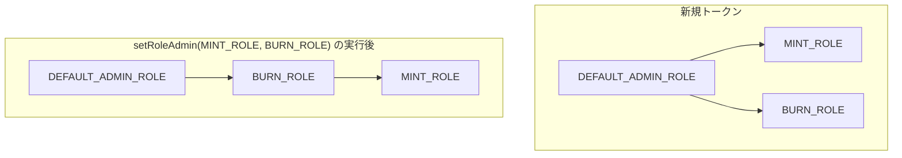
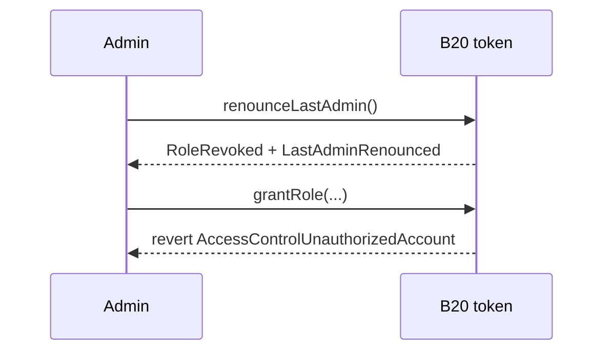
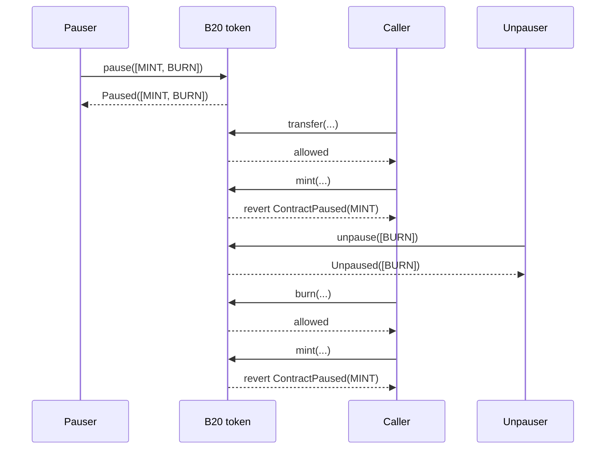

*B20 がロールによって特権操作をどのように制限するか、また一時停止によって、トークンのほかの機能を止めずに特定の種類の操作だけをどのように凍結するかを説明します。ポリシーチェックはこれとは別の認可レイヤーです。詳しくは [Policies](/ja/specifications/b20/concepts/policies) を参照してください。*

## 1. ロールと一時停止が存在する理由 {#1-why-roles-and-pause-exist}

ロールを使うと、発行者は特権操作ごとに特定のアカウントを割り当てることができます。ミント、差し押さえ、一時停止はそれぞれ異なる職務であるため、別々のロールとして扱われます。各ロールは、特定の管理関数群をゲートします。対応関係は [§2](#2-roles) を参照してください。

一時停止は、ロールとは独立した 2 つ目の制御手段です。ロールは「誰がその関数を呼び出せるか」を決めるのに対し、`PausableFeature` は「その種類の操作が現在有効かどうか」を決めます。発行者は、トークンの他の部分を止めることなく、特定の機能だけを一時停止できます。各機能については [§3](#3-pause) を参照してください。

## 2. ロール {#2-roles}

B20 では、トークンコントラクト自体に [OpenZeppelin AccessControl](https://docs.openzeppelin.com/contracts/5.x/access-control) を組み込んでロールを実装しています。別個のロールレジストリはありません。

### 2.1 デフォルト管理者 {#21-the-default-admin}

`createB20` は `initialAdmin` に `DEFAULT_ADMIN_ROLE` を付与します。このロールの保有者がルート管理者です。ルート管理者は、運用ロール (minter、burner、pauser、metadata editor) を付与して、各特権操作を他のアカウントに割り当てます。`DEFAULT_ADMIN_ROLE` 自体を付与することもできるため、複数のアドレスでルート権限を共有できます。

同じロールは、任意の数のアドレスが保有できます。`hasRole` はメンバーシップを確認するものであり、単一の保有者を格納するスロットではありません。

`updatePolicy` と `updateSupplyCap` の2つの関数は、常に `DEFAULT_ADMIN_ROLE` を必要とします。これらのチェックは、管理者が再割り当てされても、その管理者に追従しません。

### 2.2 利用可能なロール {#22-available-roles}

| ロール                  | 制御対象                                                                                        |
| -------------------- | ------------------------------------------------------------------------------------------- |
| `DEFAULT_ADMIN_ROLE` | `updatePolicy`、`updateSupplyCap`、`renounceLastAdmin`。他のすべてのロールのデフォルト管理者                     |
| `MINT_ROLE`          | `mint`、`mintWithMemo`。Asset では `batchMint` も制御                                              |
| `BURN_ROLE`          | `burn`、`burnWithMemo`                                                                       |
| `BURN_BLOCKED_ROLE`  | `burnBlocked` (非推奨)                                                                         |
| `SEIZE_ROLE`         | `seizeWithMemo`                                                                             |
| `PAUSE_ROLE`         | `pause`                                                                                     |
| `UNPAUSE_ROLE`       | `unpause`                                                                                   |
| `METADATA_ROLE`      | `updateName`、`updateSymbol`、`updateContractURI`。Asset では `updateExtraMetadata` も制御          |
| `OPERATOR_ROLE`      | Asset のみ：`announce`、`updateUIMultiplier`、`cancelUIMultiplierUpdate`、非推奨の `updateMultiplier` |

`OPERATOR_ROLE` は Asset にのみ存在します。詳しくは[トークンタイプ](/ja/specifications/b20/concepts/token-types)を参照してください。`approve` はロールによる制御の対象外です。保有者による `transfer` も同様に、ロールによる制御の対象外です。保有者は、一時停止とポリシーによる制約を受ける場合を除き、いつでも自身の残高を移動できます。

### 2.3 ロールの付与と取り消し {#23-granting-and-revoking}

すべてのロールには管理者ロールがあり、`getRoleAdmin(role)` で取得できます。新規のトークンでは、すべてのロールの管理者ロールは `DEFAULT_ADMIN_ROLE` です。現在の管理者は `grantRole(role, account)` を呼び出して保有者を追加し、`revokeRole(role, account)` を呼び出して保有者を削除します。保有者は `renounceRole(role, callerConfirmation)` を使って自らロールを放棄することもできます。`callerConfirmation` は `msg.sender` と一致している必要があり、一致しない場合、呼び出しは `AccessControlBadConfirmation` でリバートします。

`grantRole` と `revokeRole` は冪等です。メンバーシップが変化しない呼び出しでは、イベントは発行されません。`RoleGranted` と `RoleRevoked` は、メンバーシップが実際に変化した場合にのみ発行されます。

`DEFAULT_ADMIN_ROLE` に対する `revokeRole` および `renounceRole` では、最後のデフォルト管理者を削除することはできず、`LastAdminCannotRenounce` でリバートします。最後の管理者を解除する方法については、[§2.6.1](#261-all-admin) を参照してください。

### 2.4 管理権限の委任 {#24-delegating-administration}

ロールの管理者は固定されていません。`setRoleAdmin(role, newAdminRole)` を使用すると、カスタムロールを含む任意の別のロールに管理者を再割り当てできます。この呼び出し以降、`grantRole` と `revokeRole` の権限チェックは新しい管理者に基づいて行われます。これらは `DEFAULT_ADMIN_ROLE` に固定されているわけではありません。たとえば発行者は、`DEFAULT_ADMIN_ROLE` を変更することなく、`BURN_ROLE` の保有者を `MINT_ROLE` の管理者にできます。`setRoleAdmin` を呼び出せるのは、そのロールの現在の管理者のみです。この呼び出しでは `RoleAdminChanged(role, previousAdminRole, newAdminRole)` イベントが発行されます。



### 2.5 例 {#25-example}

#### 2.5.1 デフォルト管理者によるロールの付与と取り消し {#251-default-admin-grants-and-revokes}

デフォルト管理者が `minterA` に `MINT_ROLE` を付与すると、`minterA` はミントできるようになります。管理者がこのロールを取り消すと、それ以降の `mint` 呼び出しはリバートします。

```mermaid 1 Default admin grants and revokes Diagram lines wrap expandable highlight={1}
sequenceDiagram
    participant Admin
    participant Token as B20 token
    participant Minter as minterA

    Admin->>Token: grantRole(MINT_ROLE, minterA)
    Token-->>Admin: RoleGranted
    Minter->>Token: mint(...)
    Token-->>Minter: allowed
    Admin->>Token: revokeRole(MINT_ROLE, minterA)
    Token-->>Admin: RoleRevoked
    Minter->>Token: mint(...)
    Token-->>Minter: revert AccessControlUnauthorizedAccount(minterA, MINT_ROLE)
```

#### 2.5.2 委任された管理者による付与 {#252-a-delegated-admin-grants}

デフォルト管理者は `BURN_ROLE` を `MINT_ROLE` の管理者ロールに設定したうえで、`BURN_ROLE` を `burnAdmin` に付与します。その後、`burnAdmin` が `MINT_ROLE` を `minterA` に付与します。デフォルト管理者自身がこの付与を行う必要はありません。

```mermaid 2 A delegated admin grants Diagram lines wrap expandable highlight={1}
sequenceDiagram
    participant Admin
    participant Token as B20 token
    participant BurnAdmin as burnAdmin
    participant Minter as minterA

    Admin->>Token: setRoleAdmin(MINT_ROLE, BURN_ROLE)
    Token-->>Admin: RoleAdminChanged
    Admin->>Token: grantRole(BURN_ROLE, burnAdmin)
    Token-->>Admin: RoleGranted
    BurnAdmin->>Token: grantRole(MINT_ROLE, minterA)
    Token-->>BurnAdmin: RoleGranted
    Minter->>Token: mint(...)
    Token-->>Minter: allowed
```

### 2.6 管理者権限の放棄 {#26-giving-up-admin}

`renounceLastAdmin` は、一部だけを選んで実行することはできない操作です。すべてのロールのルート管理権限がまとめて削除されます。特定の機能だけを廃止したい場合 (たとえば、ミントを永久に停止する場合) は、`DEFAULT_ADMIN_ROLE` を保持したまま、対象のロールだけをロックしてください。

#### 2.6.1 すべての管理者権限の放棄 {#261-all-admin}

トークンの管理者をゼロにする方法は2つあります。

作成時にゼロにするには、`createB20` に `initialAdmin = address(0)` を渡します。この場合、Factory は初期付与を行わず、トークンは作成時点から管理者不在となります。

作成後に管理者をゼロにする唯一の方法は `renounceLastAdmin()` です。呼び出し元は、`DEFAULT_ADMIN_ROLE` の唯一の残存保有者でなければなりません。そうでない場合、呼び出しは `NotSoleAdmin` でリバートします。この呼び出しは `RoleRevoked(DEFAULT_ADMIN_ROLE, admin, admin)` と `LastAdminRenounced(admin)` を発行します。

`DEFAULT_ADMIN_ROLE` が内部で保有者数を追跡するのは、こうした最終管理者に関するガードを適用するためだけです。この数によってメンバー数に上限が設けられることはありません。また、`DEFAULT_ADMIN_ROLE` を `address(0)` に割り当てるセッターは存在しません。



管理者が 0 人になると、`grantRole`、`revokeRole`、`setRoleAdmin` はすべてのロールでリバートするようになります。カスタムの管理者チェーンも凍結されます。`updatePolicy` と `updateSupplyCap` は永久に呼び出せなくなります。ただし、`METADATA_ROLE` の保有者は引き続き名前、シンボル、URI を更新できます。

#### 2.6.2 単一の権限 {#262-a-single-capability}

ミントを永久に停止するには、`revokeRole` と `setRoleAdmin` を組み合わせます。

1. 現在 `MINT_ROLE` を保有しているすべてのアカウントに対して、`revokeRole(MINT_ROLE, holder)` を呼び出します。
2. `setRoleAdmin(MINT_ROLE, MINT_ROLE)` を呼び出します。これにより、このロールは自身の管理者ロールになります。

保有者が 1 つでも残っていると、その保有者は引き続きミントでき、他者に `MINT_ROLE` を付与することもできます。この場合、そのロールを管理できるのはその保有者だけになります。

同じ 2 つの手順で、任意の運用ロールを廃止できます。この呼び出しでは `RoleAdminChanged(role, previousAdminRole, role)` が発行されます。`newAdminRole == role` となるイベントを監視してください。

```mermaid 2 A single capability Diagram lines wrap expandable highlight={1}
sequenceDiagram
    participant Admin
    participant Token as B20 token

    Admin->>Token: revokeRole(MINT_ROLE, 保有者) for every holder
    Token-->>Admin: RoleRevoked
    Admin->>Token: setRoleAdmin(MINT_ROLE, MINT_ROLE)
    Token-->>Admin: RoleAdminChanged(MINT_ROLE, DEFAULT_ADMIN_ROLE, MINT_ROLE)
```

## 3. 一時停止 {#3-pause}

一時停止を使うと、トークン全体を凍結することなく、特定の種類の操作だけを凍結できます。`pause` と `unpause` は `PausableFeature[]` を引数に取ります。`PausableFeature` は enum で、`TRANSFER`、`MINT`、`BURN`、`SEIZE` の 4 つの値を持ちます。各値はそれぞれ独立した操作の種類を表します。

`MINT` が一時停止されている間は、`MINT_ROLE` を保持している呼び出し元であってもミントできません。`pause` には `PAUSE_ROLE` が、`unpause` には `UNPAUSE_ROLE` が必要です。これらは別個のロールであるため、一時停止するアカウントと再開するアカウントを同一にする必要はありません。

### 3.1 対象機能 {#31-the-features}

| 機能         | 制御対象                                           | 導入     |
| ---------- | ---------------------------------------------- | ------ |
| `TRANSFER` | `transfer`、`transferFrom`、およびそれらの Memo 付きバリアント | Beryl  |
| `MINT`     | `mint`、`mintWithMemo`、および Asset の `batchMint`  | Beryl  |
| `BURN`     | `burn`、`burnWithMemo`、および非推奨の `burnBlocked`    | Beryl  |
| `SEIZE`    | `seizeWithMemo`                                | Cobalt |

一時停止中の機能の集合は、単一のストレージワード内に機能ごとに 1 ビットずつ格納されます。各ビットの位置は `PausableFeature` の序数に対応します。

```solidity 1 The features Diagram
enum PausableFeature {
    TRANSFER, // ビット 0
    MINT,     // ビット 1
    BURN,     // ビット 2
    SEIZE     // ビット 3
}
```

`ALL_FEATURES_PAUSED` (`15`) は、4つのビットがすべてオンであることを示します。

### 3.2 一時停止と再開 {#32-pausing-and-unpausing}

1つ以上の機能を一時停止するには、`pause(PausableFeature[] features)` を呼び出します。再開するには、`unpause(PausableFeature[] features)` を呼び出します。空の配列を渡すと `EmptyFeatureSet` でリバートします。

すでに要求された状態にある機能に対しては、何も行われません (no-op) 。配列内の重複も同様に無視されます。いずれの場合も、呼び出しはリバートしません。

この呼び出しは、渡した配列をそのまま含む `Paused(updater, features)` または `Unpaused(updater, features)` を発行します。この配列は、呼び出し後に一時停止されている機能の集合を表すものではありません。現在の集合を確認するには、`isPaused(feature)` または `pausedFeatures()` を参照してください。

その後の操作が一時停止中の機能に該当した場合、その操作は `ContractPaused(feature)` でリバートします。このエラーが示すのは、呼び出しをブロックした機能1つだけです。

### 3.3 例 {#33-example}

1回の呼び出しで `MINT` と `BURN` を一時停止します。この状態でも `transfer` は成功しますが、`mint` と `burn` は `ContractPaused` でリバートします。

次に、`BURN` だけ一時停止を解除します。これでバーンは再び実行できるようになります。`MINT` は一時停止されたままなので、`mint` は引き続きリバートします。



## イベントとエラー {#events-and-errors}

| イベント                                                      | 発行元                                             |
| --------------------------------------------------------- | ----------------------------------------------- |
| `RoleGranted(role, account, sender)`                      | `grantRole`、作成時の初期管理者への付与                       |
| `RoleRevoked(role, account, sender)`                      | `revokeRole`、`renounceRole`、`renounceLastAdmin` |
| `RoleAdminChanged(role, previousAdminRole, newAdminRole)` | `setRoleAdmin`                                  |
| `LastAdminRenounced(previousAdmin)`                       | `renounceLastAdmin`                             |
| `Paused(updater, features)`                               | `pause`                                         |
| `Unpaused(updater, features)`                             | `unpause`                                       |

| エラー                                                     | スローされる条件                                                              |
| ------------------------------------------------------- | --------------------------------------------------------------------- |
| `AccessControlUnauthorizedAccount(account, neededRole)` | 呼び出し元が、その呼び出しに必要なロールを保有していない                                          |
| `AccessControlBadConfirmation()`                        | `renounceRole` の確認用引数が呼び出し元と一致しない                                     |
| `ContractPaused(feature)`                               | 実行しようとした操作が属する機能が一時停止中である                                             |
| `EmptyFeatureSet()`                                     | `pause`/`unpause` が空の配列を指定して呼び出された                                    |
| `LastAdminCannotRenounce()`                             | `revokeRole`/`renounceRole` を実行すると、最後の `DEFAULT_ADMIN_ROLE` 保有者がいなくなる |
| `NotSoleAdmin()`                                        | 他の管理者がまだ存在する状態で `renounceLastAdmin` が呼び出された                           |