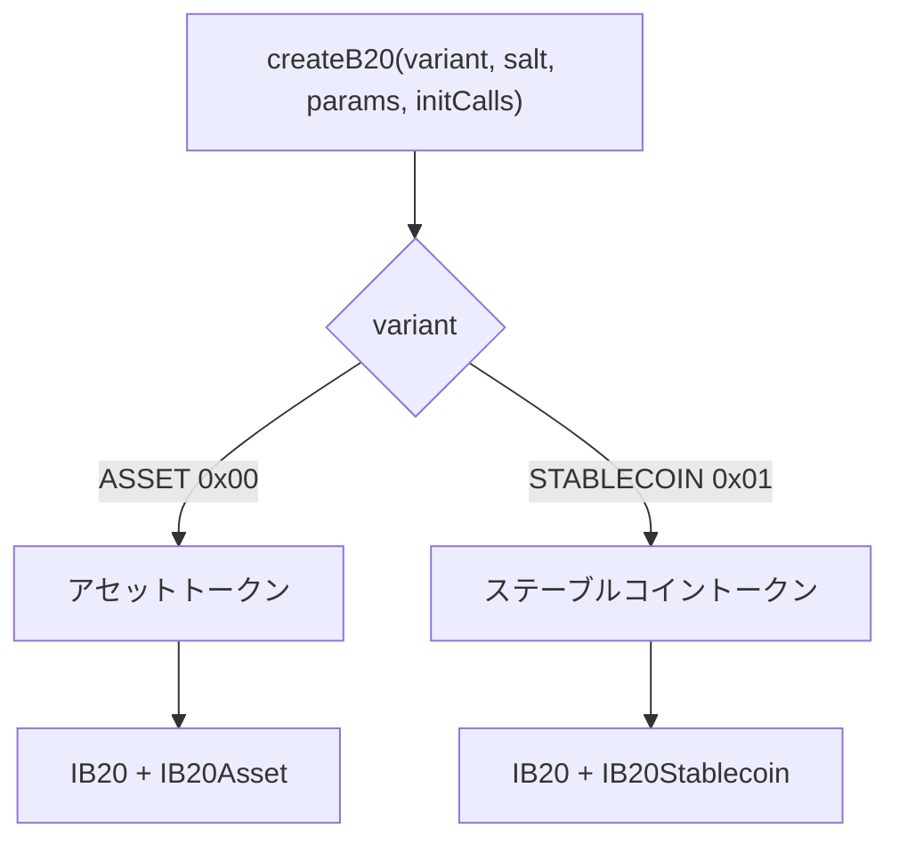
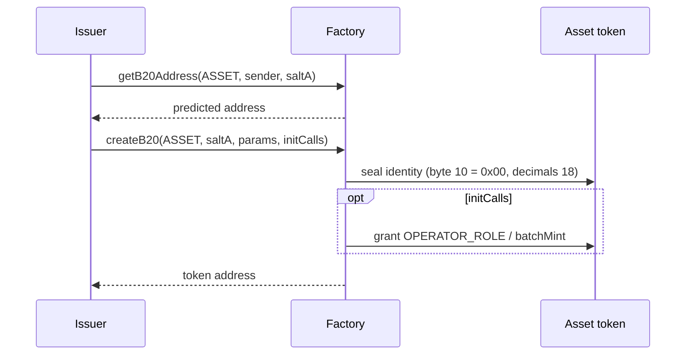
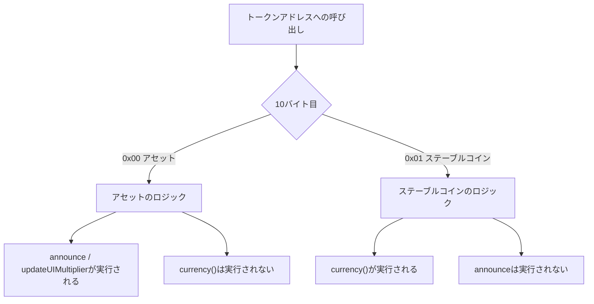

*AssetとStablecoinの概要、`createB20`によって種類がアドレスにどのように固定されるか、そして各種類が`IB20`に追加する機能について説明します。ロールとポリシーは種類を問わず共通です。詳しくは[ロールと一時停止](/ja/specifications/b20/concepts/roles-and-pause)および[ポリシー](/ja/specifications/b20/concepts/policies)を参照してください。*

## 1. トークンタイプとは {#1-what-a-token-type-is}

B20 トークンタイプとは、作成時に選択するバリアントのことです。ABI での名前は `B20Variant` です。提供されるバリアントは次の 2 つです。

| バリアント                     | アドレスのバイト `[10]` | トークンアドレスで提供されるインターフェース    |
| ------------------------- | --------------- | ------------------------- |
| Asset (`ASSET`)           | `0x00`          | `IB20` と `IB20Asset`      |
| Stablecoin (`STABLECOIN`) | `0x01`          | `IB20` と `IB20Stablecoin` |

どちらのバリアントも `IB20` (ERC-20、ロール、一時停止、ポリシー、ミント、バーン、差し押さえ) を実装します。そのうえで、各バリアントは互いに重複しない機能セットをそれぞれ追加します。タイプ固有の状態には、互いに重複しない [ERC-7201](https://eips.ethereum.org/EIPS/eip-7201) 名前空間 (`base.b20.asset` または `base.b20.stablecoin`) を使用します。そのため、これらのフィールドが共有の `base.b20` スロットや、もう一方のタイプのフィールドと衝突することはありません。

タイプを選択できるのは一度だけです。`createB20` がタイプをトークンアドレスに書き込み、この呼び出しが返った後はタイプを変更できません。



## 2. 2種類ある理由 {#2-why-there-are-two}

RWAを含む汎用トークンと法定通貨ペッグ型トークンでは、クラスを定義するフィールドが異なります。サーフェスを1つに統合すると、すべてのAssetに通貨コードが、すべてのStablecoinにアナウンスが付くことになります。そこでB20はサーフェスを分割しています。Assetは設定可能なdecimals、アナウンス、スケジュール設定可能なUI乗数、追加メタデータ、バッチmintを備えます。Stablecoinは変更不可能な通貨コードと、decimalsを`6`に固定する規約を備えます。

これらの追加機能を1つのバイナリ上のオプションフラグとして実装した場合、クラスのルールは実行時チェックに頼ることになります。そうなると、StablecoinのアドレスでAssetのセレクタを実行できてしまいます。B20では、各バリアントを個別のネイティブ実装としてコンパイルします。ノードはアドレスのバイト`[10]`を読み取り、該当するバリアントのロジックを実行します。StablecoinのアドレスがAssetのセレクタを実行することはなく、AssetのアドレスがStablecoinのセレクタを実行することもありません。

一方で、ウォレット、インデクサー、発行者にとっては、単一のFactory、単一のポリシーモデル、単一のERC-20サーフェスが必要です。このスタックを種類ごとに複製すると、あらゆる統合が分断されてしまいます。そのため、Factory、Policy Registry、Activation Registry、`IB20`といった共通インフラは引き続き共有されます。残高、送金、ロール、ポリシーのみを扱う呼び出し元は`IB20`を使用します。種類固有の呼び出しには、同じアドレスに対して`IB20Asset`または`IB20Stablecoin`を使用します。

## 3. タイプの選択方法 {#3-how-the-type-is-chosen}

発行者がバリアントを選択できるのは、Factory の `createB20(variant, salt, params, initCalls)` を呼び出すときだけです。Factory はこの選択をトークンアドレスにエンコードします。具体的には、`(variant, sender, salt)` からアドレスを導出し、バイト `[0]` に `0xB2` を、バイト `[10]` に識別子 (Asset は `0x00`、Stablecoin は `0x01`) を書き込みます。`getB20Address(variant, sender, salt)` を使うと、作成前にそのアドレスを取得できます。アドレスがすでに使用されている場合、`createB20` は `TokenAlreadyExists` でリバートします。関数から戻った後はタイプを変更できません。タイプはアドレスそのものに保持されているためです。

`params` は識別情報を保持します。name、symbol、`initialAdmin` は共通です。これに加えて、Asset では `decimals`、Stablecoin では `currency` を指定します。この blob は、先頭に `version` バイト (現在は `1`) を付けて ABI エンコードした `B20AssetCreateParams` または `B20StablecoinCreateParams` です。オプションの `initCalls` は、同一トランザクション内で新しいトークンに対して実行されます。その後、Factory はアクセス権を放棄します。該当するバリアント (`B20Asset` / `B20Stablecoin`) が有効化されていない場合、`createB20` は `FeatureNotActivated` でリバートします。バリアントを無効化すると新規作成はできなくなりますが、既存のトークンは引き続き動作します。

作成後、ノードはアドレス内のバリアントバイトを読み取り、そのバリアントのロジックを実行します。呼び出し元が稼働中のトークンを判別する方法については、[`isB20`](/specifications/b20/reference/interfaces/ib20-factory/is-b20) および [`isB20Initialized`](/specifications/b20/reference/interfaces/ib20-factory/is-b20-initialized) を参照してください。

## 4. Asset {#4-asset}

Asset は汎用のバリアントです。現実資産 (RWA) も対象に含まれますが、RWA 専用の型ではありません。型固有のインターフェースは [`IB20Asset`](/specifications/b20/reference/interfaces/ib20-asset) で、同じアドレス上で `IB20` を拡張します。

作成時に、`[6, 18]` の範囲内で不変の `decimals` を設定します。範囲外の値を指定すると `InvalidDecimals` でリバートします。Asset には `currency()` はありません。

Asset では、次の Asset 専用の呼び出しが追加されます。1 回限り使用可能な `id` と任意の内部呼び出しを伴うコーポレートアクション開示用の `announce`、予約制の `updateUIMultiplier` / `cancelUIMultiplierUpdate` ([ERC-8056](https://eips.ethereum.org/EIPS/eip-8056)) 、追加メタデータ用のキー／値ストア、および `batchMint` です。`OPERATOR_ROLE` は Asset 専用のロールで、`announce` と乗数の更新を制御します。名前、シンボル、コントラクト URI、追加メタデータについては、引き続き継承された `METADATA_ROLE` が使用されます。

Asset 固有の状態は `base.b20.asset` に格納されます。対象は `decimals`、`multiplier`、使用済みのアナウンス ID、追加メタデータ、および保留中の乗数です。共通の ERC-20、ロール、ポリシー、一時停止の状態は、引き続き `base.b20` に保持されます。

## 5. Stablecoin {#5-stablecoin}

Stablecoin は法定通貨にペッグされたバリアントです。

`currency` は必須かつ変更不可です。大文字の ASCII `A`–`Z` のみで構成する必要があります (例: `"USD"`) 。コードが空の場合は `MissingRequiredField` でリバートします。それ以外のバイトが含まれる場合は `InvalidCurrency` でリバートします。

`decimals` は `6` にハードコードされています。発行者が decimals を指定する必要はありません。

`IB20` に対して追加されるインターフェースは `currency()` のみです。Stablecoin には announce、multiplier、追加メタデータ、`batchMint`、`OPERATOR_ROLE` はありません。

Stablecoin 固有の状態は `base.b20.stablecoin` に格納されます (`currency` のみ) 。共通の ERC-20、ロール、ポリシー、一時停止の状態は引き続き `base.b20` に保持されます。

`B20Created.variantEventParams` には、Stablecoin の場合は ABI エンコードされた `currency` が格納されます。Asset の場合は空です。

## 6. 例 {#6-example}

同一の発行者が両方のタイプを作成できます。ソルトが異なれば、生成されるアドレスも異なります。タイプはバイト `[10]` で判別できます。タイプ固有のセレクタを別のタイプで使用することはできません。同じ `(variant, sender, salt)` を再利用すると、`TokenAlreadyExists` でリバートします。

### 6.1 Stablecoin の作成 {#61-creating-a-stablecoin}

まず、`getB20Address(STABLECOIN, sender, saltB)` でアドレスを予測します。次に、`B20StablecoinCreateParams` を渡して `createB20` を呼び出します。パラメータには、`version` `1`、名前、シンボル、`initialAdmin`、`currency: "USD"` を指定します。

```mermaid 1 Creating a Stablecoin Diagram lines wrap expandable highlight={1}
sequenceDiagram
    participant Issuer
    participant Factory
    participant Token as Stablecoin token

    Issuer->>Factory: getB20Address(STABLECOIN, sender, saltB)
    Factory-->>Issuer: predicted address
    Issuer->>Factory: createB20(STABLECOIN, saltB, params, [])
    Factory->>Token: seal identity (byte 10 = 0x01, currency USD, decimals 6)
    Factory-->>Issuer: token address
```

呼び出しから戻った後、アドレスのバイト `[10]` は `0x01` になります。`decimals()` は `6`、`currency()` は `"USD"` を返します。型固有のインターフェースは [`IB20Stablecoin`](/specifications/b20/reference/interfaces/ib20-stablecoin) です。このアドレスに対して `announce` を呼び出しても、Asset のロジックは実行されません。

### 6.2 Assetの作成 {#62-creating-an-asset}

`getB20Address(ASSET, sender, saltA)` でアドレスを事前に算出します。次に、`B20AssetCreateParams` を渡して `createB20` を呼び出します。指定する値は、`version` `1`、名前、シンボル、`initialAdmin`、`decimals: 18` です。オプションの `initCalls` を使うと、同じトランザクション内で `OPERATOR_ROLE` を付与したり、`batchMint` を呼び出したりできます。



呼び出しから戻った時点で、アドレスのバイト `[10]` は `0x00` です。`decimals()` は `18` を返します。[`IB20Asset`](/specifications/b20/reference/interfaces/ib20-asset) の `announce` と `updateUIMultiplier` は利用可能な状態です。`currency()` は存在しません。

### 6.3 後続の呼び出し {#63-a-later-call}

トークンアドレスを呼び出す際に、型が再度選択されることはありません。ノードはバイト `[10]` を読み取り、そのバリアントのロジックを実行します。

