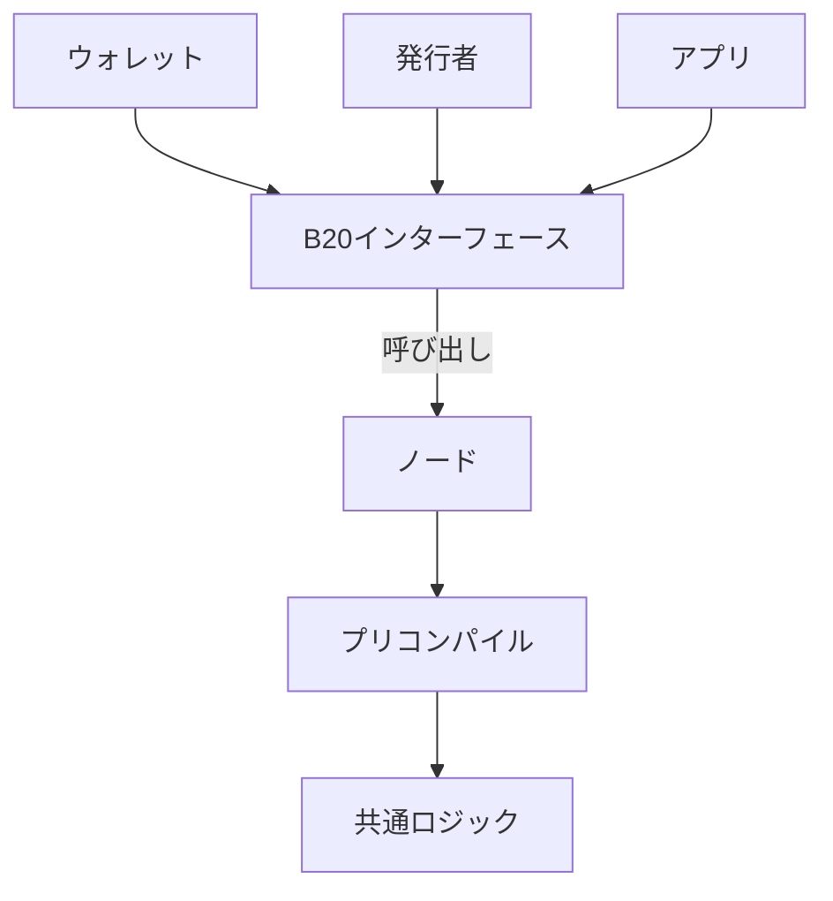
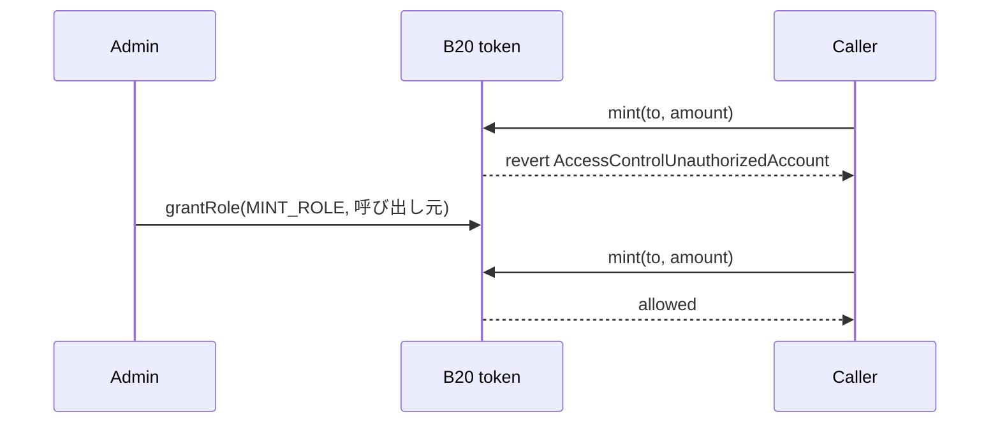
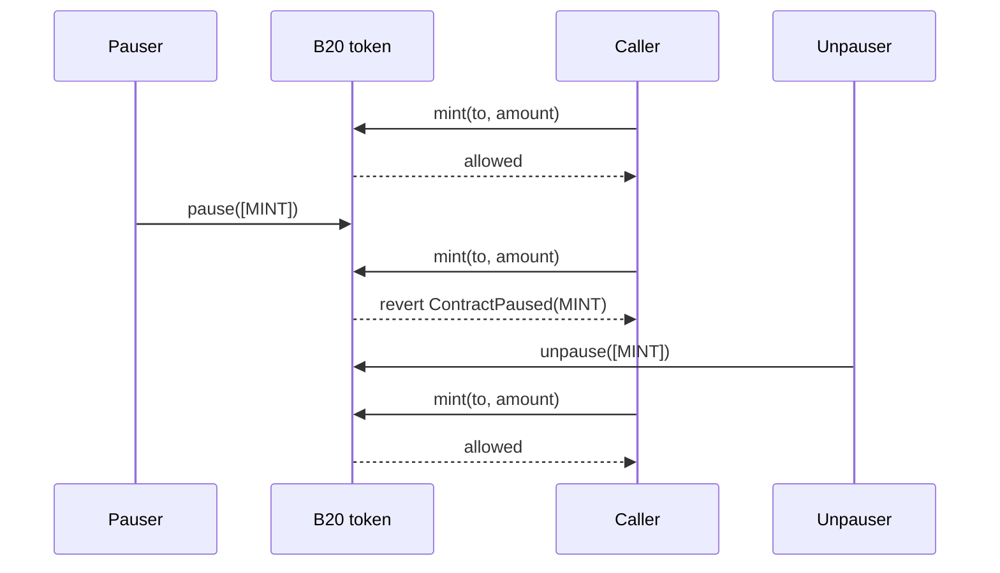

B20 は、プログラム可能なアセットをオンチェーンで発行・管理するための、Base のネイティブトークン標準です。

このドキュメントでは、B20 の概要として、B20 とは何か、B20 が作られた理由、B20 が提供する中核的なプリミティブ、そしてそれらがどのように組み合わさって機能するのかを説明します。

## コンセプト {#concepts}

<CardGroup cols={2}>
  <Card title="トークンの種類" icon="coins" href="/ja/specifications/b20/concepts/token-types">
    Asset と Stablecoin の各バリアントと、それぞれの機能を比較します。
  </Card>

  <Card title="ポリシー" icon="shield-check" href="/ja/specifications/b20/concepts/policies">
    許可リスト、ブロックリスト、複合ポリシー、ポリシースコープを設定します。
  </Card>

  <Card title="ロールと一時停止" icon="user-lock" href="/ja/specifications/b20/concepts/roles-and-pause">
    運用権限を割り当て、トークンの機能を個別に一時停止します。
  </Card>

  <Card title="UI 乗数" icon="chart-column" href="/ja/specifications/b20/concepts/multipliers">
    Asset の乗数の動作と ERC-8056 の UI 残高について説明します。
  </Card>
</CardGroup>

## Build on Base {#build-on-base}

以下の Build on Base デモを使って、B20 トークンを作成・運用できます。

<CardGroup cols={2}>
  <Card title="アセットトークンを作成する" icon="building-columns" href="/ja/build-on-base/issue-rwa/create-an-asset-token">
    ファクトリーによる決定論的デプロイで B20 Asset トークンを作成します。
  </Card>

  <Card title="Stablecoin を発行する" icon="coins" href="/ja/build-on-base/issue-stablecoins/issue-your-stablecoin">
    変更不可の通貨コードを持つ B20 Stablecoin を作成します。
  </Card>

  <Card title="保有者を適格者に制限する" icon="user-check" href="/ja/build-on-base/issue-rwa/restrict-eligible-holders">
    アセットの保有を適格なアカウントに限定するポリシーを適用します。
  </Card>

  <Card title="乗数を適用する" icon="chart-column" href="/ja/build-on-base/issue-rwa/apply-a-multiplier">
    コーポレートアクションに合わせて Asset UI 乗数を予約または適用します。
  </Card>
</CardGroup>

## リファレンス {#reference}

技術的な詳細については、[B20 インターフェース](/ja/specifications/b20/reference/interfaces)と[B20 定数](/ja/specifications/b20/reference/constants)を参照してください。

<CardGroup cols={2}>
  <Card title="インターフェース" icon="file-contract" href="/ja/specifications/b20/reference/interfaces">
    B20 のインターフェース、正規の Solidity ソース、そのままコピーして使えるインポート文を確認できます。
  </Card>

  <Card title="定数" icon="table" href="/ja/specifications/b20/reference/constants">
    プリコンパイルアドレス、ロール識別子、ポリシースコープ、検証の上限・下限を確認できます。
  </Card>

  <Card title="エラー" icon="bug" href="/ja/specifications/b20/reference/errors">
    カスタムエラー、セレクター、および各エラーが発生する条件を確認できます。
  </Card>

  <Card title="イベント" icon="bolt" href="/ja/specifications/b20/reference/events">
    B20 のイベントと、各インターフェースがそれらを発行するタイミングを確認できます。
  </Card>
</CardGroup>

## 変更履歴 {#changelog}

<Card title="変更履歴" href="/ja/specifications/b20/changelog">
  B20 のアップデートやプロトコルの変更をこれまでの経緯とあわせて確認できます。
</Card>

***

## B20とは？ {#what-is-b20}

B20は、プログラム可能な資産をオンチェーンで発行・管理するための、Baseネイティブのトークン標準です。Baseは、現実資産 (RWA) とステーブルコインの発行を標準化する目的でこの規格を策定しました。B20はERC-20のスーパーセットです。残高、送金、承認はERC-20と同様に機能します。また、発行者ごとに独自のトークン実装をデプロイするのではなく、すべてのB20資産が共通の追加インターフェースとプロトコルロジックを共有します。

この規格には、コンプライアンス機能と管理機能も含まれています。発行者は、ロールと権限の設定、ポリシーの適用、供給量のミントとバーン、操作の一時停止など、規制対象資産のワークフローで通常必要となるさまざまな管理操作を実行できます。

B20は、トークンごとのSolidityコードではなく、Baseノード内のプリコンパイルとして動作します。ウォレット、発行者、アプリはERC-20形式のインターフェースを呼び出し、ノードが共通のB20ロジックをネイティブに実行します。Baseはこのロジックをハードフォークを通じてアップグレードします。そのため、どの呼び出し元に対しても、すべてのB20資産で一貫した動作とネイティブ実行が保証されます。

### 概要 {#at-a-glance}



B20 アセットは、他のコントラクトと同じ方法で呼び出せます。具体的には、アセットのアドレスにあるインターフェースを介して呼び出します。すべての B20 アセットは同じインターフェースと同じプリコンパイルロジックを使用するため、インテグレーターは単一の信頼できる情報源 (single source of truth) を参照できます。

***

## なぜ B20 なのか？ {#why-b20}

現実資産 (RWA) をオンチェーンで発行するには、コンプライアンス機能を資産自体に組み込んだ共通のトークン標準が必要です。ERC-20 が扱うのは残高、送金、承認です。一方、規制対象の資産には、適格性チェック、ロール、ミントとバーン、一時停止といった管理機能も求められます。現状では、発行者はトークン化する資産のほぼすべてについて、こうした基本機能を一から作り直しています。

発行者がこうした仕組みを独自に実装すると、同じロジックを何度も書くことになり、挙動にもばらつきが生じます。さらに、すべてのウォレットやアプリが独自トークンへの個別対応を強いられます。B20 はこの問題を解決します。単発のトークンを自前で作成・保守する代わりに、B20 資産を作成し、そのロールとポリシーを設定するだけです。コンプライアンスは、発行者ごとに送金処理の周りへ後付けで設計するものではなく、ファーストクラスの基本機能として組み込まれています。

標準が 1 つに統一されることは、インテグレーターと発行者の双方にとってメリットがあります。ウォレットやアプリは 1 つのインターフェースに対応するだけで済みます。発行者は、資産ごとに新たな連携を設計しなくても、オラクルなどの共有サービスを利用できます。

***

## B20 Assetの作成 {#creating-a-b20-asset}

B20トークンはすべて、シングルトンのプリコンパイルであるFactoryを通じて作成されます。`createB20`は、他のコントラクト呼び出しと同じ方法でBaseノードに送信できます。

```mermaid Creating a B20 Asset Diagram lines wrap expandable highlight={1}
sequenceDiagram
    participant Issuer
    participant Factory
    participant Token as B20 token

    Issuer->>Factory: createB20(variant, salt, params, initCalls)
    Factory->>Token: seal identity
    Factory->>Token: initCalls (grantRole, updatePolicy, mint)
    Factory-->>Issuer: token address
```

1. 発行者は、バリアント、ソルト、および作成パラメーター (名前、シンボル、初期管理者、バリアント固有のフィールド) を指定して `createB20` を呼び出します。
2. Factory は `(variant, sender, salt)` から決定論的にアドレスを割り当て、トークンのアイデンティティを確定します。
3. 任意で指定した `initCalls` が新しいトークン上で実行されるため、発行者は同一トランザクション内でロールの付与、ポリシーの設定、ミントを行えます。
4. `createB20` の処理が完了します。以降、Factory がトークンに継続的にアクセスすることはありません。

RWA を含む汎用的な発行には **Asset** を、固定の通貨コードを持つ法定通貨ペッグ型トークンには **Stablecoin** を選択してください。どちらのバリアントも、ロール、ポリシー、および ERC-20 インターフェースは共通です。詳しくは[トークンの種類](/ja/specifications/b20/concepts/token-types)を参照してください。

Activation Registry は、Factory およびトークンの機能を有効化するための、Base が運用する安全スイッチです。発行者やアプリが操作するものではありません。

***

## ロールの設定 {#configuring-roles}

ロールを使うと、発行者は特権操作ごとに特定のアカウントを割り当てられます。管理者は、ミント権限をミンターに、差し押さえ(seize)権限をコンプライアンス担当者に付与できます。また、トークン全体を一時停止することなく、単一の機能(`TRANSFER`、`MINT`、`BURN`、または `SEIZE`)だけを一時停止する権限を付与することもできます。

B20 は、トークン上の [OpenZeppelin AccessControl](https://docs.openzeppelin.com/contracts/5.x/access-control) によってこれを実装しています。ロールは独立したレジストリとして存在するわけではありません。単一の `DEFAULT_ADMIN_ROLE` 保有者が、運用ロールの付与と取り消しを行います。特権呼び出しでは、まずロールがチェックされ、次に対応する一時停止ベクターがチェックされます。保有者による `transfer` ではロールチェックは行われませんが、`TRANSFER` 一時停止ベクターとポリシーのチェックは適用されます。

ロールの全一覧と、各ロールが制御する操作については、[ロールと一時停止](/ja/specifications/b20/concepts/roles-and-pause)を参照してください。ロールゲートが適用された呼び出しの例は次のとおりです。



1. 作成時点では、`initialAdmin` が `DEFAULT_ADMIN_ROLE` を保持します。
2. この管理者が、`MINT_ROLE` や `PAUSE_ROLE` などの運用ロールを付与します。
3. 必要なロールを持たない呼び出し元からの呼び出しは、`AccessControlUnauthorizedAccount` で拒否されます。

***

## 一時停止ベクター {#pause-vectors}

一時停止ベクターを使うと、アセット全体を停止せずに、トークンに対する特定の種類の操作だけを停止できます。発行者がこれを使用するのは、オフチェーンのワークフロー上で特定の機能を凍結する必要がある場合 (決済期間中など) や、脆弱性が見つかり、その経路を直ちに止めなければならない場合です。

一時停止はグローバルではなく、機能単位で行います。ベクターは `TRANSFER`、`MINT`、`BURN`、`SEIZE` の4つです。`MINT` を一時停止すると新規発行は止まりますが、転送は引き続き可能です。`approve` は一時停止の対象外です。

`pause` には `PAUSE_ROLE` が、`unpause` には `UNPAUSE_ROLE` が必要です。これらのロールは別々に管理されるため、一時停止するアカウントと再開するアカウントを同じにする必要はありません。

一時停止中の呼び出しは次のようになります。



1. `MINT_ROLE` を保持する呼び出し元は、`MINT` が一時停止されていなければミントできます。
2. `PAUSE_ROLE` を持つアカウントが `MINT` を一時停止します。他の機能は引き続き利用できます。
3. 以降の `mint` は、呼び出し元が `MINT_ROLE` を保持したままであっても、`ContractPaused(MINT)` でリバートします。
4. `UNPAUSE_ROLE` を持つアカウントが `MINT` の一時停止を解除すると、再びミントできるようになります。

***

## コンプライアンスチェックの統合 {#integrating-compliance-checks}

ほとんどのコンプライアンスチェックは、アドレスの集合と、特定の関数に対する許可か拒否かの判定に帰着します。B20 はトークンごとのフックではなく、このモデルを採用しています。許可リストまたはブロックリストを管理してトークンの関数に紐付けると、呼び出しは続行されるか、リバートされます。

これらのリストはトークン上ではなく、グローバルなシングルトンのプリコンパイルである Policy Registry に保存されます。許可リスト、ブロックリスト、および複合ポリシー (和集合または積集合) はそこに格納され、ポリシー ID で参照されます。レジストリは共有されているため、1 つのリストを多数のトークンで利用できます。メンバーシップを一度管理するだけで、紐付けられたすべてのトークンに同じ結果が反映されます。

トークン管理者は `updatePolicy` を使って、ポリシー ID をポリシースコープに紐付けます。スコープはフックに近い役割を持ち、特定の関数で実行されます。その関数が実行されると、トークンはレジストリに `isAuthorized(policyId, account)` を問い合わせ、チェックに失敗した場合は `PolicyForbids` でリバートします。どのスコープがどの関数で実行されるかについては、[Policies](/ja/specifications/b20/concepts/policies) を参照してください。

ポリシーで制御される転送は、次のようになります。

```mermaid Integrating Compliance Checks Diagram lines wrap expandable highlight={1}
sequenceDiagram
    participant Admin
    participant Registry as Policy Registry
    participant Token as B20 token
    participant Alice

    Admin->>Registry: createPolicy(許可リスト)
    Admin->>Token: updatePolicy(TRANSFER_RECEIVER_POLICY, id)
    Alice->>Token: transfer(Bob)
    Token->>Registry: isAuthorized(id, Bob)
    Registry-->>Token: false
    Token-->>Alice: revert PolicyForbids

    Admin->>Registry: updateAllowlist(Bob)
    Alice->>Token: transfer(Bob)
    Token->>Registry: isAuthorized(id, Bob)
    Registry-->>Token: true
    Token-->>Alice: allowed
```

1. レジストリ上で許可リストまたはブロックリストを作成します。
2. トークン管理者が、そのポリシー ID をスコープに紐付けます。
3. `transfer` の実行時に、トークンは受信者が認可されているかどうかをレジストリに問い合わせます。
4. 認可された場合は、呼び出しがそのまま続行されます。拒否された場合は、呼び出しが `PolicyForbids` でリバートされます。
5. 未設定のスコープは、デフォルトで常に許可されます。`approve` はポリシーによる制御の対象外です。