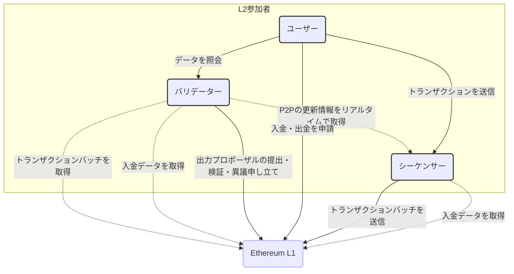
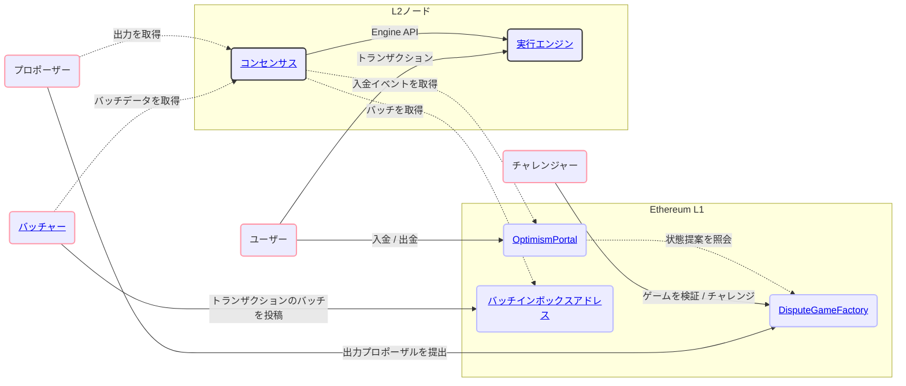
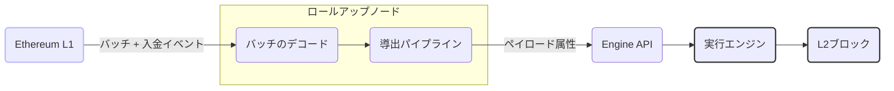
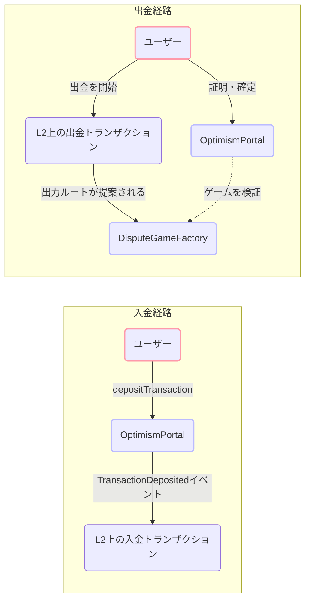
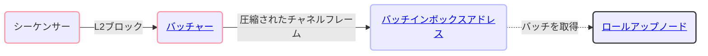
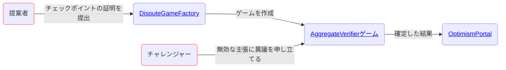
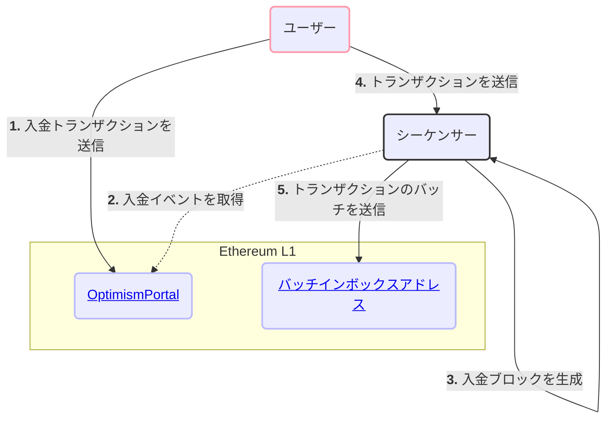
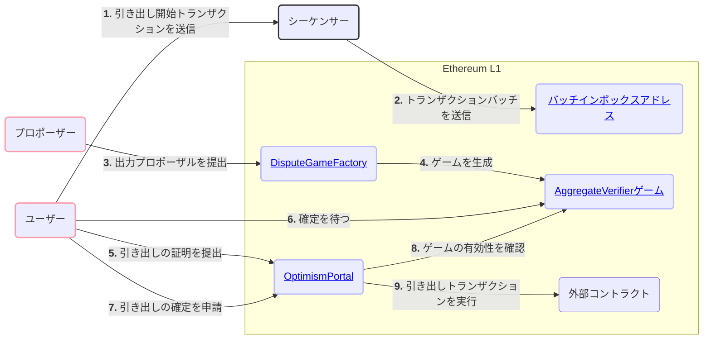

Base は Ethereum 上に構築されたロールアップです。L2 のトランザクションデータはデータ可用性を確保するために Ethereum に投稿され、
証明を用いることで、誰でも不正な状態遷移に異議を申し立てることができます。このページでは、
プロトコルを構成するコンポーネントと主要なユーザーフローの全体像を紹介します。

## ネットワーク参加者 {#network-participants}

Base とやり取りする主要なアクターには、ユーザー、シーケンサー、バリデーターの3種類があります。

### ユーザー {#users}

ユーザーとは、次のことを行うネットワーク参加者全般を指します。

* シーケンサー経由で、またはEthereum上のコントラクトを操作して、トランザクションを送信する。
* バリデーターが運用するインターフェースからトランザクションデータを照会する。

### シーケンサー {#sequencers}

シーケンサーは、Base におけるブロック生成者の役割を担います。現在、Base ではアクティブなシーケンサーが 1 つだけ稼働しています。

シーケンサーは次の処理を行います。

* ユーザーから直接トランザクションを受け付けます。
* Ethereum 上で生成された「デポジット」トランザクションを監視します。
* これら 2 つのトランザクションストリームを統合し、順序付けられた L2 ブロックにまとめます。
* それらの L2 ブロックを完全に再現できるだけの情報を L1 に送信します。
* L1 上でまだ確定していない保留中の L2 ブロックへのリアルタイムアクセスを提供します。
* 200ms ごとに Flashblocks を生成し、構築中のブロック内におけるトランザクションの順序を確約します。

シーケンサーは L2 チェーンの運用において重要な役割を果たしますが、信頼される主体ではありません。シーケンサーの主な役割は、
ユーザーがすべてのトランザクションを直接 L1 に送信する現状の方法と比べて、はるかに高速かつ低コストでトランザクションを順序付けることで、
ユーザーエクスペリエンスを向上させることです。

### バリデーター {#validators}

バリデーターは、シーケンサーとは独立して L2 の状態遷移関数を実行します。バリデーターはネットワークの
完全性の維持に寄与し、ユーザーにブロックチェーンデータを提供します。

バリデーターは一般的に次の役割を担います。

* L1 およびシーケンサーからロールアップデータを同期する。
* ロールアップデータを使用して L2 の状態遷移関数を実行する。
* ロールアップデータと、計算した L2 の状態情報をユーザーに提供する。

バリデーターは、プロポーザーやチャレンジャーを兼ねることもでき、その場合は次の役割を担います。

* L2 の状態に関するアサーションを L1 上のスマートコントラクトに提出する。
* 他の参加者が行ったアサーションを検証する。
* 他の参加者が行った無効なアサーションに異議を申し立てる。

## システム概要図 {#high-level-system-diagram}

次の図は、主要なプロトコルコンポーネントが L1 と L2 をまたいでどのように連携するかを示しています。

## プロトコルの構成要素 {#protocol-components}

### コンセンサス {#consensus}

コンセンサスは、L1 のデータから正規の L2 チェーンを導出する役割を担います。Batch Inbox からトランザクションバッチを、
OptimismPortal からデポジットイベントを読み取ってペイロード属性を構築し、Engine API を介して
実行エンジンを駆動します。Unsafe (未確認) ブロックは専用の P2P ネットワーク経由で他のノードにゴシップ配信されます。
これにより、バリデーターはバッチが L1 に取り込まれる前に、低レイテンシでブロックにアクセスできます。

[コンセンサス →](/ja/specifications/base-protocol/consensus/specification)

### 実行 {#execution}

実行エンジンは Reth ベースのランタイムです。標準の Ethereum JSON-RPC API を公開し、
コンセンサスが生成したブロックを処理します。プリデプロイ (固定の L2 アドレスに配置されたシステムコントラクト) 、プリコンパイル、
プリインストールによって EVM が拡張され、手数料の分配、L1 ブロック属性の
注入、クロスドメインメッセージングといったロールアップ固有の機能が実現されます。

[実行 →](/ja/specifications/base-protocol/execution/l2-execution-engine)

### ブリッジング {#bridging}

デポジットは、L1 上の `OptimismPortal` コントラクトから L2 へ送られ、各 L2 ブロックの先頭に含まれる特殊なデポジットトランザクションとして
取り込まれます。出金はこれと逆方向の流れになります。まず L2 上で出金トランザクションが開始され、
プロポーザーが `DisputeGameFactory` に出力ルートを提出します。チャレンジ期間の経過後、ユーザーは `OptimismPortal` を介して L1 上で出金を証明し、
ファイナライズします。

[ブリッジング →](/ja/specifications/base-protocol/bridging/deposits)

### バッチャー {#batcher}

バッチャーはシーケンサーが運用するサービスで、L2 のトランザクションデータを圧縮してチャネルフレームにまとめ、
calldata (または blob) として L1 上の バッチインボックスアドレス に送信します。これがデータ可用性レイヤーとなり、
どのバリデーターでも L1 から L2 チェーンを独立して再構築できます。

[バッチャー →](/ja/specifications/base-protocol/batcher)

### 証明 {#proofs}

出力プロポーザルと証明によって、L2 の状態を検証できます。プロポーザーは `DisputeGameFactory` を通じてチェックポイントゲームを作成し、証明データはオンチェーンの検証コントラクトで検証されます。チャレンジャーは無効な主張に対して異議を申し立てることができます。有効な出金は、関連するゲームがプロポーザー側の勝利として解決された後にのみ、`OptimismPortal` を通じてファイナライズできます。

[証明 →](/ja/specifications/base-protocol/proofs/overview)

## 主要なユーザーフロー {#core-user-flows}

### Base への ETH の入金 {#depositing-eth-to-base}

ユーザーはまず、L1 から ETH を入金して L2 の利用を始めるのが一般的です。
手数料の支払いに必要な ETH を用意できたら、L2 でトランザクションを送信し始めます。
次の図は、この一連のやり取りと Base プロトコルの主要なコンポーネントを示しています。

### Base でのトランザクション送信 {#sending-transactions-on-base}

Base でのトランザクション送信は、Ethereum の場合と同じです。ユーザーはトランザクションに署名し、
`eth_sendRawTransaction` を使って任意のノードの JSON-RPC エンドポイントに送信します。シーケンサーはメモリプールからトランザクションを取得して順序付け、
L2 ブロックにまとめたうえで、最終的にそのバッチを L1 に投稿します。

### Base からの出金 {#withdrawing-from-base}

ユーザーが ETH や ERC20 トークンを Base から Ethereum に戻したい場合もあります。出金は L2 上の通常のトランザクションとして開始され、
その後 L1 上のトランザクションによって完了します。出金時には、特定の時点における L2 の状態を提案する有効な
プルーフゲームコントラクトを参照しなければなりません。

