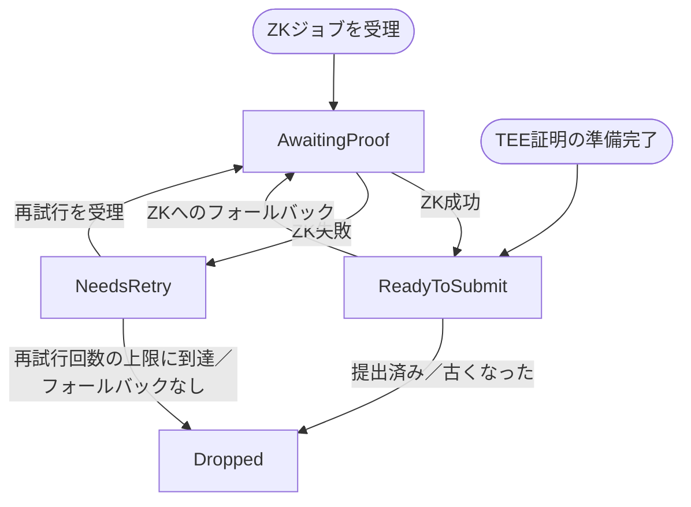

チャレンジャーは、進行中の `AggregateVerifier` ゲームを正規の L2 状態と照合して独立に検証し、証明システムを保護するオフチェーンサービスです。無効なチェックポイントルートを検出すると、ゲームコントラクトが要求する証明データを取得し、L1 上で異議申し立てトランザクションを送信します。

ZK パスにおいて、チャレンジャーはパーミッションレスです。正規の L1 および L2 の RPC、ZK 証明サービス、L1 トランザクション署名者にアクセスできるオペレーターであれば、誰でも実行できます。また、Base が TEE 証明エンドポイントにアクセスできるチャレンジャーを運用することもあります。これにより、TEE に裏付けられた無効なゲームを、ZK へのフォールバックより前に、より高速な経路で無効化できます。

## 責務 {#responsibilities}

準拠するチャレンジャーは、次の処理を行います。

1. 最近の `DisputeGameFactory` ゲームをスキャンする。
2. まだ `IN_PROGRESS` 状態で、対応が必要となる可能性のある証明状態を持つゲームを選択する。
3. L2 ノードから、該当するチェックポイントの出力ルートを再計算する。
4. 最初の無効なチェックポイントルートを特定する。または、ZK チャレンジが有効な
   チェックポイントを対象にしていたかどうかを判定する。
5. 証明が必要なチェックポイント区間について、TEE 証明または ZK 証明を取得する。
6. ゲームコントラクトに `nullify()` または `challenge()` を送信する。
7. ボンドを請求するよう設定されている場合は、その後のボンドのライフサイクルを追跡する。

チャレンジャーは、ゲームを信頼して正規の L2 状態を判断するわけではありません。L2 ヘッダーとアカウント証明から
ルートを再計算し、ゲームはあくまで検証対象の入力として扱います。

## ゲームの選択 {#game-selection}

チャレンジャーは現在の `AnchorStateRegistry.anchorGame()` を読み取り、ファクトリのインデックス配列内でそのゲームの位置を特定したうえで、それ以降のすべてのファクトリインデックスを走査します。レジストリがまだ初期アンカーのままである場合、またはアンカーゲームがファクトリ内に見つからない場合は、インデックス `0` から走査を開始します。`IN_PROGRESS` として観測されたゲームは、解決されるか完全に無効化されるまで追跡され続けるため、メトリクスにはアンカー以降の稼働中のゲーム群が反映されます。各走査ではアンカー以降の範囲全体を再評価するため、新たな証明、チャレンジ、または無効化がオンチェーンに投稿されるたびに、ゲームが別のカテゴリへ移ることがあります。個々のゲームに対するクエリが失敗した場合はログに記録され、次回の走査で再試行されます。その失敗によって走査全体が中断されることはありません。

ゲームが選択されるのは `status() == IN_PROGRESS` の場合のみです。選択後、チャレンジャーは以下を読み取ります。

* `teeProver()`
* `zkProver()`
* `counteredByIntermediateRootIndexPlusOne()`
* `rootClaim()`
* `l2SequenceNumber()`
* `startingBlockNumber()`
* `l1Head()`
* ゲームタイプに対応するゲーム実装の `INTERMEDIATE_BLOCK_INTERVAL()`

`(teeProver, zkProver, countered index)` の組み合わせによって候補カテゴリが決まります。

| TEE プルーバー | ZK プルーバー | チャレンジ済みインデックス | カテゴリ         | チャレンジャーの動作                                                                            |
| --------- | -------- | ------------- | ------------ | ------------------------------------------------------------------------------------- |
| 非ゼロ       | ゼロ       | `0`           | 無効な TEE 提案   | すべてのチェックポイントルートを検証します。無効な場合は TEE による無効化を優先し、それができなければ ZK の `challenge()` にフォールバックします。 |
| 非ゼロ       | 非ゼロ      | `> 0`         | 不正な ZK チャレンジ | チャレンジされたチェックポイントのみを検証します。チャレンジされたルートが正しい場合は、ZK の `nullify()` を送信します。                  |
| ゼロ        | 非ゼロ      | `0`           | 無効な ZK 提案    | すべてのチェックポイントルートを検証します。無効な場合は ZK の `nullify()` を送信します。                                 |
| 非ゼロ       | 非ゼロ      | `0`           | 無効なデュアル提案    | すべてのチェックポイントルートを検証します。無効な場合は、まず TEE 証明を無効化し、その後再走査して残りの ZK 証明を処理します。                  |

両方のプルーバーアドレスがゼロのゲームは、すでに完全に無効化されているためスキップされます。TEE のみ、または ZK のみのゲームでチャレンジ済みインデックスが非ゼロのものは想定外の状態であるため、スキップされます。

## 出力ルートの検証 {#output-root-validation}

チャレンジされていない提案については、チャレンジャーが提出済みの中間ルートを検証します。インデックス
`i` のチェックポイントブロックは次のとおりです。

```text Checkpoint Block Formula
startingBlockNumber + INTERMEDIATE_BLOCK_INTERVAL * (i + 1)
```

提出されるルートの数は、次の値と一致しなければなりません (MUST) ：

```text Submitted Root Count
(l2SequenceNumber - startingBlockNumber) / INTERMEDIATE_BLOCK_INTERVAL
```

間隔はゼロ以外である必要があり、開始ブロックは提案された L2 シーケンス
番号より小さくなければなりません。算術オーバーフローやチェックポイント数の不一致が発生した場合、そのスキャンティックでの検証は失敗します。

チャレンジャーは、各チェックポイントブロックについて次の手順で期待される出力ルートを計算します。

1. ブロック番号を指定して L2 ブロックのヘッダーを取得します。
2. RPC から返されたヘッダーハッシュが、コンセンサスヘッダーから計算したハッシュと一致することを検証します。
3. そのブロックハッシュ時点の `L2ToL1MessagePasser` のアカウント証明を `eth_getProof` で取得します。
4. ヘッダーのステートルートに対してアカウント証明を検証します。
5. L2 のステートルート、`L2ToL1MessagePasser` のストレージルート、および L2 ブロック
   ハッシュから出力ルートを構築します。
6. 計算したルートを、ゲームに保存されているルートと比較します。

中間ルートは並行して検証されますが、結果はチェックポイント順に処理されます。
最初に検出された不一致に基づいて、異議申し立てトランザクションで使用する `intermediateRootIndex` と `intermediateRootToProve` が決まります。`intermediateRootToProve` は、不正な
チェックポイントについてローカルで計算した正しいルートです。

要求された L2 ブロックがまだ利用できない場合、チャレンジャーはそのスキャンティックではそのゲームをスキップします。
ゲームは引き続き対象として残り、次回のスキャンで再試行されます。

## 不正な ZK チャレンジの検証 {#fraudulent-zk-challenge-validation}

TEE 提案が ZK 証明によってチャレンジされると、ゲームは 1 始まりのチャレンジ済みインデックスを保存します。
チャレンジャーはこれを 0 始まりのチェックポイントインデックスに変換し、そのチェックポイントのみを検証します。

チャレンジされたインデックスのオンチェーンルートがローカルで計算したルートと一致しない場合、その ZK
チャレンジは正当であり、チャレンジャーは何もしません。オンチェーンルートがローカルの
ルートと一致する場合、その ZK チャレンジは正しいチェックポイントを対象としているため、不正なものです。この場合、チャレンジャーは
そのチェックポイント区間の ZK 証明を取得し、`nullify()` を送信します。

この検証は、意図的にチャレンジされたインデックスのみを対象としています。それより前に無効なルートがあったとしても、
後続の有効なルートに対するチャレンジが正当になるわけではありません。

## 証明の取得 {#proof-sourcing}

チャレンジャーは、無効なチェックポイントを含む区間のみを証明します。信頼されたアンカーは直前のチェックポイントルートです。ただし、無効なチェックポイントがインデックス `0` の場合は、ゲームの `startingBlockNumber` 時点の状態がアンカーとなります。

ZK 証明リクエストの場合:

* `start_block_number` は、無効なチェックポイント区間の開始ブロックです。
* `number_of_blocks_to_prove` は `INTERMEDIATE_BLOCK_INTERVAL` です。
* `proof_type` は Groth16 SNARK です。
* `session_id` は `(game address, invalid checkpoint index)` から決定論的に導出されます。
* `prover_address` は、トランザクションを送信する L1 アドレスです。
* `l1_head` は、ゲーム作成時にゲームに保存された L1 ヘッドハッシュです。

セッション ID は決定論的に導出されるため、証明リクエストは再試行しても冪等性が保たれます。

TEE による証明の取得が設定されており、かつゲームに TEE プルーバーが存在する場合、チャレンジャーは無効な TEE 提案および無効なデュアル提案に対して、まず TEE 経路を試行します。TEE リクエストでは、ゲームの `l1Head`、それに対応する L1 ブロック番号、区間の開始時点においてローカルで計算した合意済みの L2 出力、そして無効なチェックポイントにおける期待される出力ルートを使用します。チャレンジャーは、エンクレーブが返した出力ルートがローカルで計算した期待ルートと一致する場合にのみ TEE の結果を受け入れ、そのうえで `nullify()` 用の TEE 異議申し立て証明バイトをエンコードします。

TEE リクエストが失敗またはタイムアウトした場合、チャレンジャーは ZK にフォールバックします。TEE 証明は取得できたものの TEE の `nullify()` トランザクションが失敗した場合は、同じ TEE トランザクションを無期限に再試行するのではなく、保留中のエントリを ZK 証明リクエストに移行します。

## 異議申し立てトランザクション {#dispute-transactions}

チャレンジャーは、次の 2 つのゲーム呼び出しのいずれかを送信します。

| 目的        | コントラクト呼び出し                                                              | 使用する場面                                          |
| --------- | ----------------------------------------------------------------------- | ----------------------------------------------- |
| Nullify   | `nullify(proofBytes, intermediateRootIndex, intermediateRootToProve)`   | 無効な TEE 証明の除去、無効な ZK 証明の除去、または不正な ZK チャレンジへの反証。 |
| Challenge | `challenge(proofBytes, intermediateRootIndex, intermediateRootToProve)` | 無効な TEE 提案に対する ZK 証明を用いたチャレンジ。                  |

TEE 証明は常に `nullify()` を呼び出し先とします。ZK 証明は、候補のカテゴリに応じて `challenge()` と `nullify()` のいずれかを呼び出し先とします。

証明を送信する前、または失敗した証明を再送信する前に、チャレンジャーはゲームのステータスとプルーバースロットを再確認します。ゲームがすでに解決済みである場合、すでにチャレンジされている場合、または対象のプルーバースロットがすでにゼロ化されている場合、保留中の証明は破棄されます。これにより、別のアクターがすでにゲームを処理済みの場合に、トランザクションが重複して送信されるのを防ぎます。

## 保留中の証明のライフサイクル {#pending-proof-lifecycle}

保留中の各証明はゲームアドレスをキーとして管理され、以下の情報を保持します。

* プルーフの種類：TEE または ZK
* 無効なチェックポイントのインデックス
* そのチェックポイントで期待されるルート
* ディスピュートの意図
* リトライ回数
* フェーズ

フェーズの状態遷移は次のとおりです。



ZK証明については、ジョブが成功、失敗、または保留状態のいずれかになるまで、証明サービスへのポーリングが行われます。
成功したZKレシートには、送信前にZK証明タイプのバイトがプレフィックスとして付加されます。失敗した証明ジョブは
最大3回まで再試行されます。TEE証明は取得後ただちに `ReadyToSubmit` に移行します。
そのトランザクションが失敗した場合、事前に構築されたZKフォールバック証明が利用可能であれば、チャレンジャーは
ただちにそれを要求します。フォールバックリクエストが存在しない場合、エントリは破棄されます。フォールバックの `prove_block`
呼び出しが失敗した場合、エントリは次のティックまで `NeedsRetry` のままとなります。証明が保留状態のままである場合、
ZKトランザクションが失敗した場合、または `prove_block` の再試行が失敗した場合は、いずれも次のティックまで証明は現在のフェーズに
留まります。保留中の証明がある場合、そのティックではそのゲームに対するコントラクトの読み取りは行われません。

## ボンドの請求 {#bond-claiming}

ボンドの請求は任意の機能で、請求先アドレスを設定すると有効になります。有効にすると、チャレンジャーは
`bondRecipient()` または解決前の `zkProver()` が設定済みアドレスのいずれかと一致するゲームを追跡します。
これにより、チャレンジャーは再起動後も請求可能なゲームを復元できるほか、
他のアクターが処理したゲームも検出できます。

ボンドのライフサイクルは次のとおりです。

1. `NeedsResolve`: `gameOver()` を待ってから、`resolve()` を送信します。
2. `NeedsUnlock`: 1 回目の `claimCredit()` を送信して、`DelayedWETH` のクレジットをアンロックします。
3. `AwaitingDelay`: `DelayedWETH` の遅延期間が経過するまで待ちます。
4. `NeedsWithdraw`: 2 回目の `claimCredit()` を送信して、クレジットを引き出します。

解決後、チャレンジャーは `bondRecipient()` を再度読み取り、設定済みのアドレスでボンドを請求できなくなっていれば
そのゲームの追跡を停止します。`DEFENDER_WINS` として解決されたゲームについては、ベストエフォートで
`AnchorStateRegistry.setAnchorState(game)` による更新も試みます。このレジストリ呼び出しは
パーミッションレスかつ自己検証型です。時期尚早な呼び出しや条件を満たさない呼び出しはリバートすることがありますが、再試行できます。

## サービスのライフサイクル {#service-lifecycle}

起動時に、チャレンジャーは次の処理を行います。

1. L1 および L2 の RPC クライアントを作成します。
2. 設定された署名者を使用して L1 トランザクションマネージャーを作成します。
3. `DisputeGameFactory` および `AggregateVerifier` のクライアントを作成します。
4. ZK 証明クライアントと、オプションの TEE 証明クライアントを作成します。
5. ヘルスサーバーを起動します。
6. ドライバーループを開始します。

ドライバーの各ティックでは、次の処理を行います。

1. 保留中の証明セッションをポーリングし、準備が整った異議申し立てを提出します。
2. 請求可能なボンドを検出し、追跡中のボンド請求を進行させます。
3. 進行中の候補ゲームをスキャンします。
4. 新しい候補を検証し、その証明を開始します。

ヘルスエンドポイントは、ドライバーの最初のステップが成功するまで準備完了を報告しません。シャットダウンは
キャンセルトークンによって制御されるため、ドライバーとヘルスサーバーは同時に停止します。

## オペレーターの入力項目 {#operator-inputs}

チャレンジャーには以下が必要です。

* L1 RPC エンドポイント
* L2 実行 RPC エンドポイント
* `DisputeGameFactory` のアドレス
* `AnchorStateRegistry` のアドレス
* ZK 証明 RPC エンドポイント
* L1 トランザクション署名者
* ポーリング間隔

オプションの入力項目:

* TEE 証明 RPC エンドポイントとタイムアウト。指定すると、TEE ベースのゲームに対して TEE 優先の無効化が有効になります。
* ボンド請求アドレス、ボンド検出間隔、ボンド検出のルックバック期間。指定すると、
  ボンドの自動回収と請求が有効になります。
* メトリクスサーバーおよびヘルスサーバーの設定。

## 安全性要件 {#safety-requirements}

チャレンジャーの実装は、以下の安全性を維持しなければなりません。

* ゲーム自体が主張するルートだけを根拠にゲームに異議を申し立ててはなりません。L2 ヘッダーと
  検証済みの `L2ToL1MessagePasser` アカウント証明からルートを再計算してください。
* 異議申し立て用の証明を要求する際は、ゲームに保存されている L1 ヘッドを使用してください。これにより、証明ジャーナルがオンチェーンで検証された
  ゲームのコンテキストと一致します。
* 不正な ZK チャレンジについては、提案全体で最初に無効となるチェックポイントではなく、
  チャレンジ対象のチェックポイントそのものを検証してください。
* 準備が整った証明を送信する前に、ゲームの状態を再確認してください。別のチャレンジャーやプルーバーがすでに
  ゲームの状態を変更している可能性があります。
* L2 ブロックを取得できない場合や一時的な RPC 障害は、最終的な検証結果ではなく、
  再試行可能なスキャン状態として扱ってください。