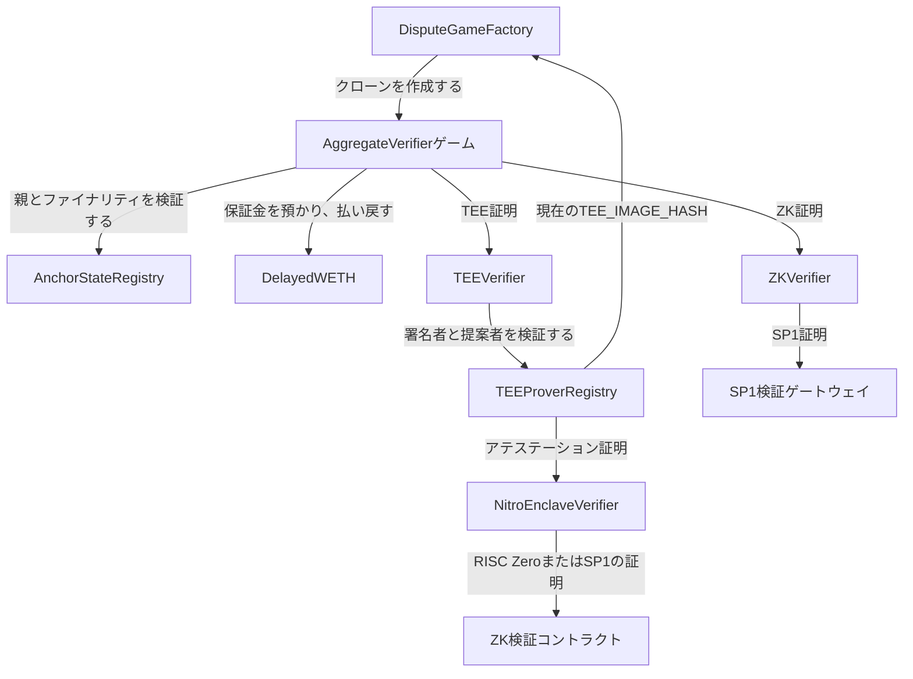

証明コントラクトは、オフチェーンの証明データをオンチェーンのチェックポイントゲームに変換します。各ゲームは、固定のブロック区間に対する
L2 の出力ルートを主張します。コントラクトは初期証明を検証し、任意で
2 つ目の証明を受け付けます。また、無効な証明データへの異議申し立てや無効化を可能にし、所定の遅延期間の経過後にゲームを解決して、
アンカー状態を前進させ、初期化ボンドを解放します。

このページでは、証明システムで使用される以下のコントラクトの動作を規定します。

* `AnchorStateRegistry`
* `DelayedWETH`
* `DisputeGameFactory`
* `AggregateVerifier`
* `ZKVerifier`
* `TEEVerifier`
* `TEEProverRegistry`
* `NitroEnclaveVerifier`

## コントラクトグラフ {#contract-graph}



`DisputeGameFactory`、`AnchorStateRegistry`、`DelayedWETH` は、プロキシを介してデプロイされるシステムコントラクトです。
`AggregateVerifier` は実装コントラクトとしてデプロイされ、ファクトリーによってイミュータブル引数付きで
クローンされます。`TEEVerifier`、`ZKVerifier`、`TEEProverRegistry`、`NitroEnclaveVerifier` は、
ゲーム実装から参照される独立した検証コントラクトおよびレジストリコントラクトです。

## データモデル {#data-model}

これらのコントラクトは、共通のディスピュートゲーム型を使用します。

| 型            | 意味                                                                     |
| ------------ | ---------------------------------------------------------------------- |
| `GameType`   | ディスピュートゲーム実装を識別する `uint32` 型の識別子。                                      |
| `Claim`      | 32 バイトのルートクレーム。このプルーフシステムでは L2 の出力ルートを表します。                            |
| `Hash`       | 32 バイトのハッシュのラッパー。                                                      |
| `Timestamp`  | `uint64` 型のタイムスタンプのラッパー。                                               |
| `Proposal`   | `(root, l2SequenceNumber)`。`l2SequenceNumber` はそのルートに対応する L2 ブロック番号です。 |
| `GameStatus` | `IN_PROGRESS`、`CHALLENGER_WINS`、`DEFENDER_WINS` のいずれか。                 |
| `ProofType`  | `AggregateVerifier` 内で使用される `TEE` または `ZK`。                            |

`AggregateVerifier` ゲームでは、2 種類のブロック間隔を使用します。

```text Block Intervals
BLOCK_INTERVAL
INTERMEDIATE_BLOCK_INTERVAL
```

`BLOCK_INTERVAL` は、親の出力ルートと提案される出力ルートとの間の距離です。
`INTERMEDIATE_BLOCK_INTERVAL` は、その範囲内における中間ルートの間隔です。
`BLOCK_INTERVAL` と `INTERMEDIATE_BLOCK_INTERVAL` は 0 以外でなければならず、`BLOCK_INTERVAL` は
`INTERMEDIATE_BLOCK_INTERVAL` で割り切れなければなりません。

各ゲームにおける中間ルートの数は次のとおりです。

```text Intermediate Root Count
BLOCK_INTERVAL / INTERMEDIATE_BLOCK_INTERVAL
```

最後の中間ルートは、ゲームの `rootClaim` と一致しなければなりません (MUST) 。

## ゲームのライフサイクル {#game-lifecycle}

1. ファクトリーのオーナーが、`AggregateVerifier` の実装と初期化ボンドを指定してゲームタイプを設定します。
2. TEE オペレーターは、ZK で検証された Nitro アテステーションを用いて、エンクレーブの署名者アドレスを
   `TEEProverRegistry` に登録します。
3. プロポーザーは `DisputeGameFactory.createWithInitData()` を通じてゲームを作成します。その際、初期化ボンドをちょうどの額で
   支払い、初期の TEE 証明または ZK 証明を提出します。
4. ゲームは、親ゲーム、L2 ブロック番号、中間ルート、L1 origin、および証明ジャーナルを検証します。
   ボンドは `DelayedWETH` に預け入れられます。
5. `verifyProposalProof()` を通じて 2 つ目の証明を提出することもできます。プロポーザルが無効な場合、
   チャレンジャーは中間ルートに対する証明データを添えて `challenge()` または `nullify()` を呼び出せます。
6. 想定される解決時間が経過すると、誰でも `resolve()` を呼び出せます。結果は、チャレンジされなかった有効なゲームでは
   `DEFENDER_WINS`、チャレンジが成功した場合や親ゲームが無効な場合は `CHALLENGER_WINS` となります。
7. 解決後、さらにレジストリのファイナリティ遅延が経過すると、誰でも `closeGame()` を呼び出して、
   ベストエフォートでアンカーを更新できます。
8. ボンドの受取人は `claimCredit()` を 2 回呼び出します。1 回目で `DelayedWETH` のクレジットをアンロックし、
   `DelayedWETH` の遅延期間が経過した後に 2 回目を呼び出して引き出しを行い、ETH を受け取ります。

## DisputeGameFactory {#disputegamefactory}

`DisputeGameFactory` は、ディスピュートゲームのクローンを作成してインデックス化します。各ゲームは、次の要素の組み合わせによって一意に識別されます。

```text Game UUID
keccak256(abi.encode(gameType, rootClaim, extraData))
```

ファクトリーはその UUID を `_disputeGames` に格納するとともに、インデックスによる検索ができるよう、パックされた `GameId` を
`_disputeGameList` に追加します。オフチェーンサービスは、`DisputeGameCreated`、
`gameAtIndex()`、`findLatestGames()` を使用してゲームを検出します。

### 設定 {#configuration}

ファクトリーのオーナーのみが次の操作を実行できます。

* `setImplementation(gameType, impl)` でゲーム実装を設定する
* `setImplementation(gameType, impl, args)` でゲーム実装と不透明な実装引数をまとめて
  設定する
* `setInitBond(gameType, initBond)` で作成時に必要なボンドの正確な額を設定する

実装が未設定の場合、支払われた値が `initBonds` と一致しない場合、または同じ UUID のゲームが
すでに存在する場合、作成はリバートされます。

### クローン引数 {#clone-arguments}

実装引数が設定されていない場合、clone-with-immutable-args のペイロードは次のとおりです。

| バイト            | 説明                  |
| -------------- | ------------------- |
| `[0, 20)`      | ゲーム作成者のアドレス         |
| `[20, 52)`     | ルートクレーム             |
| `[52, 84)`     | 作成時点の親 L1 ブロックハッシュ  |
| `[84, 84 + n)` | 不透明なゲーム `extraData` |

実装引数が設定されている場合、ペイロードは次のとおりです。

| バイト                    | 説明                  |
| ---------------------- | ------------------- |
| `[0, 20)`              | ゲーム作成者のアドレス         |
| `[20, 52)`             | ルートクレーム             |
| `[52, 84)`             | 作成時点の親 L1 ブロックハッシュ  |
| `[84, 88)`             | ゲームタイプ              |
| `[88, 88 + n)`         | 不透明なゲーム `extraData` |
| `[88 + n, 88 + n + m)` | 不透明な実装引数            |

`AggregateVerifier` は標準レイアウトを使用します。その `extraData` の仕様は、後述の
`AggregateVerifier` セクションで定義します。

## AnchorStateRegistry {#anchorstateregistry}

`AnchorStateRegistry` は、ディスピュートゲームをプルーフシステムが信頼できるかどうかを判断するための、信頼できる唯一の情報源です。以下の情報を保持します。

* `SystemConfig`
* `DisputeGameFactory`
* 初期アンカールート
* 現在のアンカーゲーム(承認済みのものがある場合)
* 現在の採用するゲームタイプ
* ゲームのブラックリスト
* リタイアメントタイムスタンプ
* ディスピュートゲームのファイナリティ遅延

リタイアメントタイムスタンプの初期値は、初回の初期化時に設定されます。リタイアメントタイムスタンプ以前(同時刻を含む)に作成されたゲームはリタイア済みとして扱われます。

### ゲーム述語 {#game-predicates}

レジストリは次の述語を公開しています。

| 述語                        | 真となる条件                                                                              |
| ------------------------- | ----------------------------------------------------------------------------------- |
| `isGameRegistered(game)`  | ファクトリーがゲームの `(gameType, rootClaim, extraData)` から同じアドレスを逆引きでき、かつゲームがこのレジストリを参照している。 |
| `isGameRespected(game)`   | ゲーム作成時にそのゲームタイプがrespectedであったと、ゲーム自身が報告している。                                        |
| `isGameBlacklisted(game)` | ガーディアンがそのゲームアドレスをブラックリストに登録している。                                                    |
| `isGameRetired(game)`     | `game.createdAt() <= retirementTimestamp`。                                          |
| `isGameResolved(game)`    | ゲームの `resolvedAt` が 0 以外であり、`DEFENDER_WINS` または `CHALLENGER_WINS` で終了している。          |
| `isGameProper(game)`      | ゲームが登録済みで、ブラックリストに登録されておらず、リタイアしておらず、かつシステムが一時停止されていない。                             |
| `isGameFinalized(game)`   | ゲームが解決済みであり、`resolvedAt` から `disputeGameFinalityDelaySeconds` を超える時間が経過している。        |
| `isGameClaimValid(game)`  | ゲームがproperかつrespectedであり、ファイナライズ済みで、`DEFENDER_WINS` で解決されている。                       |

`isGameProper()` は、ルートクレームが正しいことを証明するものではありません。ゲームがレジストリレベルの制御によって
無効化されていないことを示すにすぎません。クレームの有効性を確認する必要があるコンシューマーは、
`isGameClaimValid()` を使用しなければなりません。

### Guardian による制御 {#guardian-controls}

`SystemConfig.guardian()` は次の操作を実行できます。

* 採用するゲームタイプを設定する
* retirement timestamp (リタイアメントタイムスタンプ) を現在のブロックタイムスタンプに更新する
* 個々のゲームをブラックリストに登録する

これらの制御は、ゲームが有効なクレームになる前に無効化するための、オンチェーンの安全弁です。

### アンカーの更新 {#anchor-updates}

`getAnchorRoot()` は、アンカーゲームが受理されるまでは初期アンカールートを返します。受理後は、
`anchorGame` のルートクレームと L2 ブロック番号を返します。

`setAnchorState(game)` は、次の条件をすべて満たす場合にのみ、新しいアンカーゲームを受理します。

* `isGameClaimValid(game)` が true である
* ゲームの L2 シーケンス番号が、現在のアンカールートのシーケンス番号より大きい

この更新はパーミッションレスで、呼び出し時に自ら条件を検証します。

## DelayedWETH {#delayedweth}

`DelayedWETH` は、引き出しに遅延が設けられた WETH です。ゲームのボンドをエスクローとして保管し、クレジットの請求を
2 段階で行うことを強制します。

1. ゲームが、ボンドの受取人を対象に `unlock(subAccount, amount)` を呼び出します。
2. `delay()` 秒が経過すると、ゲームが `withdraw(subAccount, amount)` を呼び出し、ETH を
   受取人に送金します。

アンロックは次のキーで管理されます。

```text Withdrawal Request Key
withdrawals[msg.sender][subAccount]
```

証明ゲームの場合、`msg.sender` は `AggregateVerifier` ゲームコントラクト、`subAccount` は
現在の `bondRecipient` となります。

システムが一時停止している間、出金はリバートされます。また、プロキシ管理者のオーナーには緊急時の資金回収
権限もあります。

* `recover(amount)` は、コントラクトから最大 `amount` ETH をオーナーに送金します。
* `hold(account)` または `hold(account, amount)` は、アカウントの WETH をオーナーのアドレスへ引き出します。

## AggregateVerifier {#aggregateverifier}

`AggregateVerifier` は、チェックポイント証明向けのディスピュートゲーム実装です。ファクトリーが作成する
ゲームはすべて、イミュータブルなゲームデータを持つクローンです。この実装は、クローンのストレージを除き、
ゲームごとのストレージを一切持ちません。

### コンストラクタの設定 {#constructor-configuration}

実装は、そのゲームタイプのすべてのクローンに共通する以下の値を固定します。

| 値                             | 用途                                 |
| ----------------------------- | ---------------------------------- |
| `GAME_TYPE`                   | この実装が担当するディスピュートゲームのタイプ。           |
| `ANCHOR_STATE_REGISTRY`       | 親の検証、クレームの有効性判定、およびアンカーの更新。        |
| `DISPUTE_GAME_FACTORY`        | コンストラクト時にレジストリから読み取られます。           |
| `DELAYED_WETH`                | ボンドのエスクロー。                         |
| `TEE_VERIFIER`                | TEE 署名のベリファイア。                     |
| `TEE_IMAGE_HASH`              | TEE ジャーナルにコミットされる、想定 TEE イメージハッシュ。 |
| `ZK_VERIFIER`                 | ZK 証明のベリファイア。                      |
| `ZK_RANGE_HASH`               | ZK ジャーナルにコミットされるレンジプログラムのハッシュ。     |
| `ZK_AGGREGATE_HASH`           | ZK ベリファイアに渡される集約プログラムのハッシュ。        |
| `CONFIG_HASH`                 | 証明ジャーナルにコミットされるロールアップ設定のハッシュ。      |
| `L2_CHAIN_ID`                 | ゲームの対象となる L2 チェーン。                 |
| `BLOCK_INTERVAL`              | 親ブロックから提案ブロックまでの距離。                |
| `INTERMEDIATE_BLOCK_INTERVAL` | 中間チェックポイントのルート間の距離。                |
| `PROOF_THRESHOLD`             | 解決に必要な証明の数 (`1` または `2`) 。         |

`PROOF_THRESHOLD` が制御するのは解決であり、証明の提出ではありません。ゲームには TEE 証明 1 つ、
ZK 証明 1 つ、またはその両方を保存できます。

### ゲームの追加データ {#game-extra-data}

`AggregateVerifier.extraData()` は次のようにエンコードされます。

| バイト                 | 説明                                                |
| ------------------- | ------------------------------------------------- |
| `[0, 32)`           | 提案される L2 ブロック番号。                                  |
| `[32, 52)`          | 親アドレス。最初のゲームでは `AnchorStateRegistry` のアドレスを使用します。 |
| `[52, 52 + 32 * n)` | 順序付けされた中間出力ルート。                                   |

ここで、

```text Extra Data Root Count
n = BLOCK_INTERVAL / INTERMEDIATE_BLOCK_INTERVAL
```

最後の中間出力ルートは `rootClaim` と一致しなければなりません。

### 初期化 {#initialization}

`initializeWithInitData(proof)` は一度しか実行できません。未使用のバイトによって同一の論理的なプロポーザルに対して複数のファクトリー UUID が
生成されることを防ぐため、calldata のサイズが検証されます。

初期化の際、ゲームは次の処理を行います。

1. 最後の中間ルートが `rootClaim` と一致することを確認します。

2. 開始ルートを解決します。`parentAddress` がレジストリのアドレスである場合、開始ルートは
   `AnchorStateRegistry.getStartingAnchorRoot()` となります。それ以外の場合、親は有効な登録済み
   ゲームでなければなりません。

3. 次の条件を満たす必要があります。

   ```text
   l2SequenceNumber == startingL2SequenceNumber + BLOCK_INTERVAL
   ```

4. `createdAt`、`wasRespectedGameTypeWhenCreated`、および初期の `expectedResolution` を記録します。

5. 初期化プルーフに含まれる L1 origin のハッシュを、`blockhash()` または
   EIP-2935 の履歴と照合して検証します。

6. 提出された TEE プルーフまたは ZK プルーフを検証します。

7. 最初のプルーバーを記録し、`bondRecipient` を `gameCreator` に設定したうえで、ボンドを
   `DelayedWETH` に預け入れます。

初期化プルーフのフォーマットは次のとおりです。

| バイト         | 説明                                    |
| ----------- | ------------------------------------- |
| `[0, 1)`    | `ProofType`：TEE の場合は `0`、ZK の場合は `1`。 |
| `[1, 33)`   | L1 origin のハッシュ。                      |
| `[33, 65)`  | L1 origin のブロック番号。                    |
| `[65, end)` | 選択されたベリファイア向けのプルーフのバイト列。                 |

L1 origin のブロックは過去のブロックでなければなりません。経過ブロック数が 256 以内であればネイティブの `blockhash()` が使用され、
8191 以内であれば EIP-2935 の履歴が使用されます。それより古い L1 origin のブロック、または利用できない L1 origin のブロックが指定された場合はリバートします。

### 追加の証明 {#additional-proofs}

`verifyProposalProof(proofBytes)` は、ゲームが進行中で終了していない間に、不足している種類の証明を追加します。この関数は calldata から新たな L1 origin を読み取り直すことはせず、クローン作成時にファクトリーが取得した `l1Head()` を使用します。

追加の証明のフォーマットは次のとおりです。

| バイト        | 説明                                    |
| ---------- | ------------------------------------- |
| `[0, 1)`   | `ProofType`：TEE の場合は `0`、ZK の場合は `1`。 |
| `[1, end)` | 選択したベリファイア向けの証明バイト。                   |

1 つのゲームに同じ種類の証明を複数保存することはできません。

### 証明ジャーナル {#proof-journals}

TEE 証明と ZK 証明は、同じ形式の状態遷移にコミットします。

```text Proof Journal Fields lines wrap expandable
proposer
l1OriginHash
startingRoot
startingL2SequenceNumber
endingRoot
endingL2SequenceNumber
intermediateRoots
CONFIG_HASH
証明システム固有のハッシュ
```

TEE 証明の場合、最後のフィールドは `TEE_IMAGE_HASH` となり、ジャーナルは `TEEVerifier` によって検証されます。
ゲームは以下を呼び出します。

```text TEE Journal Verification Call
TEE_VERIFIER.verify(proposer || signature, TEE_IMAGE_HASH, keccak256(journal))
```

ZK証明の場合、最後のフィールドは `ZK_RANGE_HASH` となり、証明は `ZKVerifier` によって検証されます。
ゲームは以下を呼び出します：

```text ZK Journal Verification Call
ZK_VERIFIER.verify(proofBytes, ZK_AGGREGATE_HASH, keccak256(journal))
```

### 解決遅延 {#resolution-delay}

`expectedResolution` は、現在受理されている証明の数に基づいて決まります。

| 証明数 | 遅延                                   |
| --- | ------------------------------------ |
| `0` | 解決不可。                                |
| `1` | `SLOW_FINALIZATION_DELAY` (7 日に固定) 。 |
| `2` | `FAST_FINALIZATION_DELAY` (1 日に固定) 。 |

証明を追加した場合、`expectedResolution` は早まる方向にしか変化しません。一方、証明が無効化されると、遅くなる場合があります。
ZK 証明によるチャレンジでは、そのチャレンジ自体も無効化できるよう、`expectedResolution` がチャレンジ時点から 7 日後に設定されます。

### Challenge {#challenge}

`challenge(proofBytes, intermediateRootIndex, intermediateRootToProve)` は、1 つの中間区間に対する ZK 証明を用いて、TEE に裏付けられた
プロポーザルにチャレンジします。

この呼び出しは、次の条件をすべて満たす場合にのみ受け付けられます。

* ゲームがまだ `IN_PROGRESS` である
* レジストリ上でゲーム自体が有効である
* 親ゲームが `CHALLENGER_WINS` で解決されていない
* ゲームに TEE 証明がある
* ゲームにまだ ZK 証明がない
* 提出された証明の種類が ZK である
* チャレンジ対象のインデックスが範囲内である
* 提出されたルートが、現在提案されている中間ルートと異なる

ZK 証明の検証に成功すると、ゲームは ZK プルーバーを記録し、`proofCount` をインクリメントし、
反証した中間インデックス (1 始まり) を保存して、`Challenged` を発行します。ゲームが解決されると、チャレンジャーが
ボンドを受け取り、ゲームのステータスは `CHALLENGER_WINS` になります。

### 無効化 (Nullification) {#nullification} 

`nullify(proofBytes, intermediateRootIndex, intermediateRootToProve)` は、矛盾する中間ルートを証明することで、
すでに受理された証明を取り消します。

チャレンジされていないゲームでは、対象のルートが提案された中間ルートと異なっている必要があります。
チャレンジされたゲームでは、無効化できるのはチャレンジされたインデックスのみで、ZK 証明によってのみ行えます。また、指定する
ルートは当初提案された中間ルートと一致している必要があります。

無効化が成功すると、次の処理が行われます。

* その証明タイプの プルーバー スロットが削除される
* `proofCount` が減少する
* `expectedResolution` が再計算される
* ZK チャレンジが無効化された場合、反証されたインデックスがクリアされる
* 対応する ベリファイア コントラクトが無効化される

ベリファイア の無効化は、グローバルな安全停止措置です。`TEE_VERIFIER.nullify()` または
`ZK_VERIFIER.nullify()` が成功すると、システムがアップグレードまたは再構成されるまで、その ベリファイア を介した以降の証明検証はすべて
revert します。

### Resolve、Close、およびボンド {#resolve-close-and-bonds}

`resolve()` は誰でも呼び出すことができます。親がレジストリ自体である場合を除き、親は解決済みでなければなりません。親が `CHALLENGER_WINS` で解決された場合、またはその後ブラックリストに登録されたかリタイアした場合は、子も `CHALLENGER_WINS` で解決されます。それ以外の場合、ゲームは終了していなければならず、かつ受理済みの証明を少なくとも
`PROOF_THRESHOLD` 個持っていなければなりません。

ゲームがチャレンジされていた場合、`resolve()` は `CHALLENGER_WINS` を設定し、ボンドの受取人を
ZK プルーバーに変更します。それ以外の場合は `DEFENDER_WINS` を設定します。

`closeGame()` はパーミッションレスです。レジストリが一時停止中の場合はリバートします。また、ゲームが解決済みで、かつレジストリによってファイナライズされている必要があり、これらを満たすと `AnchorStateRegistry.setAnchorState()` の呼び出しを試みます。
アンカーの更新はベストエフォートです。ゲームがすでに最新の有効なクレームではないためにレジストリがゲームを拒否した場合、`closeGame()` はそのレジストリのリバートを握りつぶします。

`claimCredit()` は 2 つのフェーズで構成されます。

1. `DelayedWETH` 内のボンドをアンロックします。
2. `DelayedWETH` の遅延期間が経過した後、WETH を引き出し、ETH を `bondRecipient` に送金します。

受理済みの証明が無効化され、`expectedResolution` が「解決不可能」を表すセンチネル値にリセットされた場合、`claimCredit()` は `createdAt` から 14 日が経過するまでブロックされます。これにより、スタックしたゲームによってボンドが永久にロックされることを防ぎます。

## ZKVerifier {#zkverifier}

`ZKVerifier` は、Succinct SP1 ベリファイア ゲートウェイを、
`AggregateVerifier` が使用する共通の `IVerifier` インターフェースに適合させるアダプターです。

呼び出しの内容は次のとおりです。

```text ZKVerifier Verify Call
verify(proofBytes, imageId, journal)
```

以下の処理を実行します:

```text SP1 Verification Call
SP1_VERIFIER.verifyProof(imageId, abi.encodePacked(journal), proofBytes)
```

SP1 ゲートウェイがリバートしなければ `true` を返します。`imageId` はゲームから渡される集約プログラムの
検証鍵であり、`journal` はゲームが組み立てた公開入力の
ハッシュです。

`ZKVerifier` はベリファイアの無効化機能を継承しています。適切な respected ゲームによってベリファイアが無効化されると、
以降の `verify()` 呼び出しはすべてリバートします。

## TEEVerifier {#teeverifier}

`TEEVerifier` は、`TEEProverRegistry` を参照して TEE 証明の署名を検証します。

`TEEVerifier` に渡される証明のバイト列は次のとおりです。

| バイト        | 説明                |
| ---------- | ----------------- |
| `[0, 20)`  | プロポーザーのアドレス。      |
| `[20, 85)` | 65 バイトの ECDSA 署名。 |

署名はジャーナルハッシュから直接リカバリされます。Ethereum の署名付きメッセージのプレフィックスでラップされることはありません。

TEE 証明は、次の条件をすべて満たす場合にのみ有効です。

* 証明が 85 バイト以上である
* 署名を正常にリカバリできる
* プロポーザーが `TEEProverRegistry` の許可リストに登録されている
* リカバリされた署名者が `TEEProverRegistry` に登録されている
* 署名者の登録済みイメージハッシュが、呼び出し元のゲームから渡された `imageId` と一致する

イメージハッシュのチェックにより、あるイメージ用に登録されたエンクレーブが、別のイメージを前提とするゲームタイプやアップグレードで受理される証明を生成することを防ぎます。

`TEEVerifier` は、ベリファイアの無効化機能も継承しています。

## TEEProverRegistry {#teeproverregistry}

`TEEProverRegistry` は、TEE 署名者の登録とプロポーザーの許可リストを管理します。

レジストリは以下を保持します。

* オーナー
* マネージャー
* `NitroEnclaveVerifier`
* `DisputeGameFactory`
* 設定可能な `gameType`
* 登録済み署名者の状態
* プロポーザー許可リストの状態

オーナーは、プロポーザーのアドレスの設定と `gameType` の更新を行えます。オーナーまたはマネージャーは、署名者の登録
および登録解除を行えます。

### 期待されるイメージハッシュ {#expected-image-hash}

レジストリは、現在のゲーム実装から期待される TEE イメージハッシュを読み取ります：

```text Expected Image Hash Lookup
DisputeGameFactory.gameImpls(gameType).TEE_IMAGE_HASH()
```

`setGameType()` は、この呼び出しが成功し、ゼロ以外のハッシュが返されることを検証します。`isValidSigner()`
は、署名者が登録済みで、かつ保存されているイメージハッシュが現在の
期待されるハッシュと一致する場合にのみ true を返します。

署名者の登録自体は PCR0 に依存しません。そのため、オペレーターはゲームタイプの移行に先立って、将来の
イメージ用の署名者を事前に登録しておくことができます。ただし、これらの署名者は、ゲーム実装の `TEE_IMAGE_HASH` が登録済みのイメージハッシュと一致するまで、証明の提出に使用できる有効な署名者にはなりません。

### 署名者の登録 {#signer-registration}

`registerSigner(output, proofBytes)` は次の関数を呼び出します：

```text Attestation Verification Call
NITRO_VERIFIER.verify(output, ZkCoProcessorType.RiscZero, proofBytes)
```

返されるジャーナルは `VerificationResult.Success` でなければなりません。アテステーションのタイムスタンプは、`MAX_AGE` (60 分に固定) より
古いものであってはなりません。公開鍵は、非圧縮の ANSI X9.62 形式で
厳密に 65 バイトでなければなりません。

```text Uncompressed Public Key Layout
0x04 || x || y
```

レジストリは、署名者アドレスを次のように導出します。

```text Signer Address Derivation
address(uint160(uint256(keccak256(x || y))))
```

レジストリはジャーナルからPCR0を抽出し、次の情報を保存します：

```text Signer Image Hash
signerImageHash[signer] = keccak256(pcr0.first || pcr0.second)
```

その後、署名者を登録済みとしてマークし、列挙可能な署名者セットに追加します。

### 登録解除 {#deregistration}

`deregisterSigner(signer)` は、署名者の登録情報とイメージハッシュを削除し、署名者を
列挙可能なセットから削除したうえで、`SignerDeregistered` イベントを発行します。

`getRegisteredSigners()` は、現在の列挙可能なセットを返します。順序は保証されません。

## NitroEnclaveVerifier {#nitroenclaveverifier}

`NitroEnclaveVerifier` は、AWS Nitro Enclave のアテステーションドキュメントに対する ZK 証明を検証します。
`TEEProverRegistry` が使用するアテステーションベリファイアです。

このコントラクトは以下の機能をサポートしています。

* 単一アテステーションの検証
* アテステーションの一括検証
* RISC Zero および Succinct SP1 の証明システム
* ルート証明書の設定
* 信頼済み中間証明書のキャッシュ
* 証明書の失効
* 経路ごとのベリファイアの選択
* 恒久的に凍結された証明経路

### ロールと設定 {#roles-and-configuration}

オーナーは以下を管理します。

* `rootCert`
* `maxTimeDiff`
* `proofSubmitter`
* `revoker`
* ZK ベリファイアの設定
* ベリファイアのプログラム ID
* アグリゲーターのプログラム ID
* ルートごとのベリファイアのオーバーライド
* ルートの凍結

`revoker` は、信頼済みの中間証明書を失効させることもできます。`verify()` または `batchVerify()` を呼び出せるのは
`proofSubmitter` のアドレスのみです。

`zkConfig[zkCoProcessor]` には以下が格納されます。

| フィールド          | 用途                       |
| -------------- | ------------------------ |
| `verifierId`   | 単一アテステーション検証用のプログラム ID。  |
| `aggregatorId` | バッチ検証用のプログラム ID。         |
| `zkVerifier`   | デフォルトのベリファイアコントラクトのアドレス。 |

ルートごとのベリファイアのオーバーライドは `(zkCoProcessor, selector)` をキーとします。ここで `selector` は
`proofBytes` の先頭 4 バイトです。ルートが凍結されると、そのルートを経由する検証は
恒久的にリバートします。

### 単一検証 {#single-verification}

`verify(output, zkCoprocessor, proofBytes)`:

1. `msg.sender == proofSubmitter` であることを要求します。
2. 証明セレクターからベリファイアのルートを解決します。
3. `zkConfig[zkCoprocessor].verifierId` を用いて ZK 証明を検証します。
4. `output` を `VerifierJournal` としてデコードします。
5. ジャーナルの妥当性を確認します。
6. `AttestationSubmitted` をエミットします。
7. 最終的な検証結果を含むジャーナルを返します。

RISC Zero の場合、証明の検証には以下を使用します:

```text RISC Zero Verification Call
IRiscZeroVerifier.verify(proofBytes, programId, sha256(output))
```

Succinct の場合、証明の検証には以下を使用します。

```text Succinct Verification Call
ISP1Verifier.verifyProof(programId, output, proofBytes)
```

### バッチ検証 {#batch-verification}

`batchVerify(output, zkCoprocessor, proofBytes)`:

1. `msg.sender == proofSubmitter` であることを要求します。
2. `zkConfig[zkCoprocessor].aggregatorId` を用いて ZK 証明を検証します。
3. `output` を `BatchVerifierJournal` としてデコードします。
4. `batchJournal.verifierVk == getVerifierProofId(zkCoprocessor)` であることを要求します。
5. 埋め込まれた各 `VerifierJournal` をすべて検証します。
6. `BatchAttestationSubmitted` イベントを発行します。
7. 検証済みのジャーナルを返します。

### ジャーナルの検証 {#journal-validation}

成功を示すジャーナルが有効な成功として扱われるのは、以下の条件をすべて満たす場合に限られます。

* 信頼済み証明書プレフィックスの長さがゼロでない
* 最初の証明書が `rootCert` と一致する
* 信頼済みの中間証明書がすべて引き続き信頼されており、有効期限内である
* 新たに提供された証明書がすべて有効期限内である
* アテステーションのタイムスタンプが古すぎない
* アテステーションのタイムスタンプが未来の時刻ではない

アテステーションのタイムスタンプはミリ秒単位で提供され、秒単位に変換されます。タイムスタンプが有効となるのは、以下の条件を満たす場合に限られます。

```text Timestamp Validity Conditions
timestamp + maxTimeDiff > block.timestamp
timestamp < block.timestamp
```

信頼済みプレフィックスより後ろにある新しい証明書は、検証に成功すると、有効期限のタイムスタンプとともにキャッシュされます。
失効した証明書が再び信頼されるのは、その証明書が後続の成功したアテステーション証明に含まれ、再度キャッシュされた場合に限られます。

## コントラクト間の安全性プロパティ {#cross-contract-safety-properties}

証明コントラクトは、以下のコントラクト間プロパティを前提としています。

* ファクトリーの一意性: 論理的に同一の `(gameType, rootClaim, extraData)` から作成できるゲームは最大 1 つです。
* 親の有効性: アンカー以外のゲームは、登録済みかつ respected であり、リタイアしておらず、
  ブラックリストに登録されておらず、敗北していない親からのみ開始できます。
* 単調なチェックポイント: 各子ゲームは、開始ルートからちょうど `BLOCK_INTERVAL` 個分の L2 ブロックを
  進めなければなりません。
* 中間ルートの説明責任: すべてのプロポーザルはすべての中間ルートにコミットするため、チャレンジャーは
  最初の無効なチェックポイント区間を狙って異議を申し立てられます。
* ベリファイアの分離: TEE 証明と ZK 証明では、使用するベリファイアコントラクトもジャーナルの
  ドメインセパレーター (`TEE_IMAGE_HASH` と `ZK_RANGE_HASH`) も異なります。
* 高速なファイナリティには多様性が必要: 2 種類の証明が受理されたゲームは 1 日後に解決できる一方、
  証明が 1 種類のみのゲームは 7 日間待つ必要があります。
* レジストリのファイナリティとゲームの解決は別物: ゲームが解決されても、
  `AnchorStateRegistry` が有効なクレームとして受理しているとは限りません。
* 安全制御はフェイルクローズ: 一時停止、ブラックリスト、リタイア、ベリファイアの無効化、ルートの
  凍結、証明書の失効はいずれも、信頼範囲を広げるのではなく受理を阻止する方向に働きます。

## 管理操作の対象範囲 {#administrative-surfaces}

| コントラクト                 | 特権ロール                          | 特権操作                                                |
| ---------------------- | ------------------------------ | --------------------------------------------------- |
| `DisputeGameFactory`   | オーナー                           | ゲーム実装、実装引数、初期化ボンドを設定します。                            |
| `AnchorStateRegistry`  | `SystemConfig` で指定された Guardian | 採用するゲームタイプの設定、ゲームのブラックリスト登録、リタイアメントタイムスタンプの更新を行います。 |
| `DelayedWETH`          | プロキシ管理者のオーナー                   | ETH を回収し、アカウントの WETH を保留します。                        |
| `TEEProverRegistry`    | オーナー                           | プロポーザーの設定、ゲームタイプの更新、所有権または管理権の移転を行います。              |
| `TEEProverRegistry`    | オーナーまたはマネージャー                  | TEE 署名者の登録および登録解除を行います。                             |
| `NitroEnclaveVerifier` | オーナー                           | ルート証明書、時刻の許容誤差、証明提出者、失効者、ZK ルート、プログラム ID を設定します。    |
| `NitroEnclaveVerifier` | オーナーまたは失効者                     | 信頼済み中間証明書を失効させます。                                   |

これらの管理操作は意図的に最小限に絞られていますが、その影響は重大です。運用上の変更を加えると、
どのゲームが採用されるか、どの証明が検証を通過するか、どのアテステーションで新しい TEE
署名者を登録できるかが変わる可能性があります。