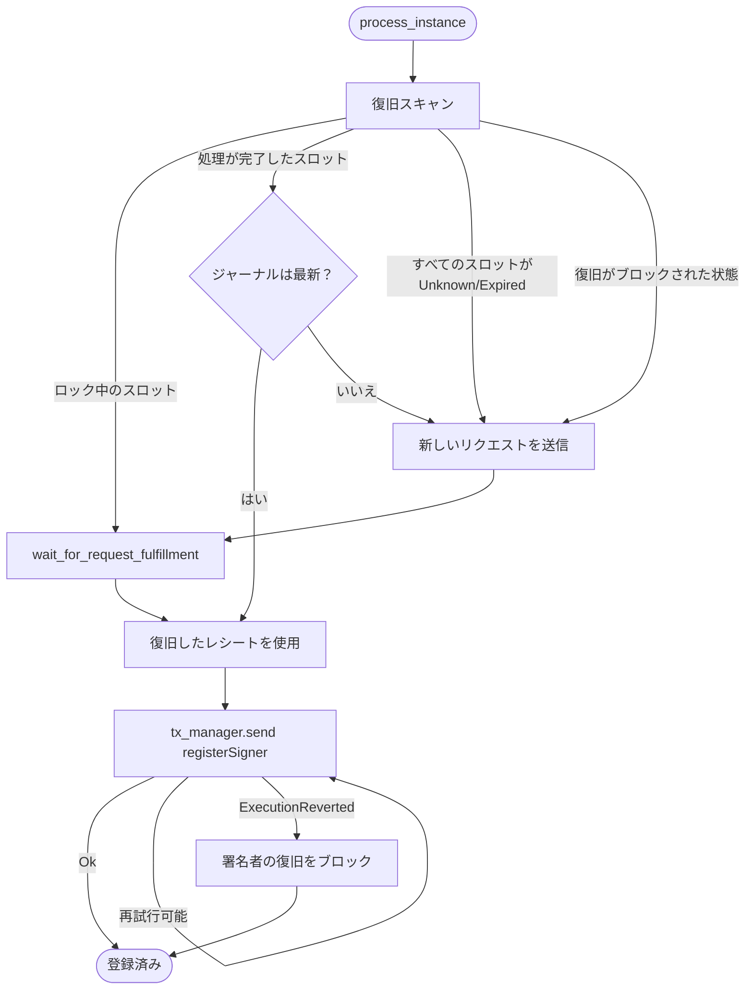

レジストラは、承認済み TEE 署名者 ID のオンチェーンレジストリを管理するオフチェーンサービスです。
稼働中の TEE プルーバーインスタンスを検出し、各エンクレーブから AWS Nitro Enclave のアテステーション
ドキュメントを取得します。次に、そのアテステーションが正しい形式であることを示す ZK 証明を生成し、
その結果得られた署名者登録を L1 上の [`TEEProverRegistry`](https://github.com/base/contracts/blob/main/src/L1/proofs/tee/TEEProverRegistry.sol)
に送信します。また、対応するインスタンスに到達できなくなった署名者の登録を解除するほか、AWS が取り下げた
中間証明書を失効させます。

レジストラは Base が運用しています。証明システムはこのレジストラが登録した署名者のみを信頼するため、
オンチェーンで TEE 証明を受け入れるには、レジストラが正しく動作していることが前提となります。とはいえ、その出力は
自己検証可能です。署名者が有効になる前に、アテステーションの ZK 証明、エンクレーブの PCR0 測定値、署名者の
公開鍵はいずれも `TEEProverRegistry` と [`NitroEnclaveVerifier`](https://github.com/base/contracts/blob/main/src/L1/proofs/tee/NitroEnclaveVerifier.sol)
によって検証されます。

## 責務 {#responsibilities}

準拠するレジストラは、次の処理を行います。

1. 本番環境のロードバランサー配下にある、現在の TEE プルーバーインスタンス群を検出する。
2. 各インスタンスから、エンクレーブごとの署名者公開鍵と Nitro アテステーションドキュメントを取得する。
3. 必要に応じて、アテステーションの証明書チェーンを AWS が公開する CRL および
   オンチェーンの永続的な失効セットと照合する。
4. 未登録のすべてのエンクレーブについて、アテステーションの正当性を示す ZK 証明を生成する。
5. 新たにアテステーションされた署名者について `TEEProverRegistry.registerSigner()` を送信する。
6. インスタンスが消滅したオンチェーンの署名者について `TEEProverRegistry.deregisterSigner()` を送信する。
7. 失効していることが判明した中間証明書について `NitroEnclaveVerifier.revokeCert()` を
   送信する。
8. プロセスが再起動しても処理中の証明リクエストを復旧し、証明処理が重複して実行されないようにする。

レジストラは、どの PCR0 測定値を受け入れるかを制御しません。ハードフォークに先立って次のイメージの署名者を事前登録できるよう、
登録は PCR0 に依存しない設計になっています。特定の署名者が生成した証明を受け入れるかどうかは、オンチェーンの [`TEEVerifier`](https://github.com/base/contracts/blob/main/src/L1/proofs/tee/TEEVerifier.sol)
が、アクティブなゲーム実装の現在の `TEE_IMAGE_HASH` に基づいて強制します。

また、レジストラはプロポーザルの作成、プロポーザルや紛争のための証明データの生成、
無効な状態遷移への異議申し立ては行いません。これらはそれぞれ、プロポーザー、TEE
プルーバー、チャレンジャーの責務です。

## 起動時の設定 {#startup-configuration}

起動時、レジストラは以下に接続します。

* コントラクトの読み取りとトランザクション送信に使用する L1 実行 RPC
* ELBv2 ターゲットのヘルス状態と EC2 インスタンスのメタデータを取得するための AWS API
* 検出された各 TEE プルーバーインスタンス上の JSON-RPC エンドポイント
* 証明バックエンド (Boundless マーケットプレイスまたはセルフホストの RISC Zero プルーバー) 
* `TEEProverRegistry`
* `NitroEnclaveVerifier` (オプション。CRL チェックが有効な場合にのみ必要) 

レジストラは起動時、オペレーターが指定したレジストリとベリファイアのアドレス以外には、コントラクトの設定を一切読み込みません。
また、自身のインスタンスセット内で確認されていないオンチェーンの署名者はすべて孤立候補として扱うため、
特定のレジストリに書き込むレジストラは 1 つだけでなければなりません。

## ドライバーループ {#driver-loop}

レジストラは単一のドライバーループを実行します。

1. 現在のインスタンスセットを検出します。
2. `max_concurrency` を上限として、すべてのインスタンスを並行処理します。
3. オンチェーンの署名者セットを読み取ります。
4. 孤立した署名者の登録を解除します。
5. `poll_interval` 秒間スリープします。キャンセルされた場合は終了します。

ループは起動時、スリープに入る前に `step()` を1回実行します。キャンセルはティックの合間だけでなく、長時間に及ぶトランザクションの
リトライ中にも速やかに検知されます。そのため、サービスは中途半端な状態を残すことなく
シャットダウンできます。

## インスタンスの検出 {#instance-discovery}

レジストラは AWS ALB ターゲットグループのポーリングを使用します。DNS、SRV、Kubernetes による検出は
サポートされていません。

各検出サイクルでは、次の処理を行います。

1. `elasticloadbalancingv2.DescribeTargetHealth(target_group_arn)` を呼び出します。
2. インスタンス以外のターゲット (ターゲット ID が `i-` で始まらないもの) を除外します。
3. 複数のポートに現れるインスタンス ID の重複を排除します。
4. `ec2.DescribeInstances(instance_ids)` を呼び出し、各インスタンスのプライベート IP と起動時刻を取得します。
5. `http://{private_ip}:{prover_port}` 形式の JSON-RPC エンドポイント URL を構築し、それぞれを
   ALB が報告したヘルス状態と対応付けます。

ヘルス状態は次のように対応付けられます。

| AWS の状態    | 内部状態        | `should_register()` |
| ---------- | ----------- | ------------------- |
| `initial`  | `Initial`   | true                |
| `healthy`  | `Healthy`   | true                |
| `draining` | `Draining`  | false               |
| その他すべて     | `Unhealthy` | false               |

`Unhealthy` のインスタンスであっても、`launch_time` から `unhealthy_registration_window` 秒以内であれば
登録が許可されます。これはウォームアップのための猶予期間です。JSON-RPC エンドポイントの応答が一時的に遅い新しいインスタンスでも、
次の ALB ヘルスチェックで登録解除される前に、エンクレーブのアテステーションと登録を完了できます。
開始済みの証明がインスタンスが対象外になる前に完了できるよう、このウィンドウは Boundless の証明タイムアウトより
短く設定する必要があります。

検出に失敗した場合、そのティックは中止され、孤立エントリのクリーンアップもスキップされます。稼働中の署名者が登録解除されることはありません。

## インスタンスごとの処理 {#per-instance-processing}

検出された各インスタンスについて、レジストラは次の処理を行います。

1. `enclave_signerPublicKey` を呼び出し、エンクレーブごとの SEC1 公開鍵を取得します。各インスタンスは
   複数のエンクレーブをホストでき、エンクレーブごとに固有の署名者鍵を持ちます。
2. 各公開鍵から、
   `keccak256(uncompressed_pubkey_xy)` の末尾 20 バイトを Ethereum の署名者アドレスとして導出します。
3. 署名者が 1 つも報告されなかった場合は、ただちに処理を終了します。この場合もアドレスセットには何も追加されず、
   呼び出しは実質的に何も行いません (no-op) 。
4. インスタンスが現時点で登録可能かどうかを判定します。
   * `Initial` および `Healthy` のインスタンスは処理を続行します。
   * ウォームアップ期間内の `Unhealthy` インスタンスは処理を続行します。
   * それ以外のインスタンスは、自身のアドレスをアクティブセットに追加しますが、新たな
     証明やトランザクションは生成しません。
5. 32 バイトのランダムな nonce を 1 つ生成し、その nonce を指定して `enclave_signerAttestation` を 1 回だけ呼び出します。
   この nonce によって、返されたバッチ内のエンクレーブごとのアテステーションはすべて同一の
   鮮度コミットメントに紐付けられます。
6. CRL チェックが有効な場合は、バッチごとに 1 回だけ CRL チェックを実行します。署名鍵はエンクレーブごとに異なりますが、
   AWS Nitro のアテステーションは親 EC2 インスタンスの Nitro
   Hypervisor によって署名され、その署名鍵はインスタンスごとに AWS が発行する証明書チェーンによって保証されています。
   そのため、同じインスタンス上のエンクレーブはすべて同一の親チェーンの下でアテステーションを生成することになり、
   CRL チェックはインスタンスごとに 1 回で十分です。
7. 各署名者アドレスについて、登録パイプラインを実行します。

`Draining` や `Unhealthy` のインスタンスも含め、到達可能なすべてのインスタンスがアクティブな署名者セットに含まれます。
これにより、ローテーションによる追加中または除外中のインスタンスが、早すぎるタイミングで登録解除されるのを防ぎます。

## アテステーション証明の生成 {#attestation-proof-generation}

レジストラは、まだオンチェーンに登録されていない各署名者について、
`AttestationProofProvider` を呼び出して証明データを生成します。プロバイダーは以下を返します。

```text Attestation Proof Provider Output
output      // ABIエンコード済みのVerifierJournal（PCR、公開鍵、タイムスタンプ、証明書ハッシュ）
proofBytes  // Groth16のseal
```

`output` は、`registerSigner()` の実行中に `NitroEnclaveVerifier.verify()` が消費する `VerifierJournal` です。`proofBytes` は、このジャーナルが有効な Nitro アテステーションドキュメントに対応することを証明する Groth16 SNARK です。

レジストラは次の 2 つのバックエンドをサポートしています。

| バックエンド      | 説明                                                                                                              |
| ----------- | --------------------------------------------------------------------------------------------------------------- |
| `boundless` | 専用のウォレットを使用して、証明ジョブを Boundless マーケットプレイスに送信します。                                                                 |
| `direct`    | ゲスト ELF をローカルで読み込み、`risc0_zkvm::default_prover()` で証明を行います。RISC Zero の環境変数に応じて、Bonsai またはローカルのプルーバーにルーティングされます。 |

どちらのバックエンドも本番環境で使用できます。主な本番用バックエンドは `boundless` です。
`direct` はローカル開発やテストにも使用されますが、Boundless で障害が発生した場合やプライベートデプロイのシナリオなど、オペレーターがマーケットプレイスを経由せずに証明を行う必要がある場合の本番用フォールバックとしても利用できます。

Boundless の場合、レジストラはプログラム URL、アテステーション入力、期待される `image_id`、および `prefix_match(image_id)` 要件を含む `RequestParams` を送信します。これにより、履行済みのリクエストを別のプログラムに対してリプレイできないようにしています。オンチェーンでの Boundless への送信は、ウォレットの nonce の競合を避けるため、ミューテックスによって直列化されます。

### 再起動時の復旧 {#restart-recovery}

レジストラプロセス自体もエフェメラルです。再起動をまたいでも、証明作業を重複して行ってはならず (MUST NOT) 、
古い証明を送信してもなりません (MUST NOT) 。Boundless の `RequestId` スロットは決定論的に導出されます。

```text Request Index Derivation
request_index(signer, attempt) = u32::from_be_bytes(keccak256(signer || attempt)[..4])
```

各署名者について、レジストラは新しいリクエストを送信する前に、`max_recovery_attempts` 個の連続した決定論的スロットを調べます。
実行されるアクションはスロットのステータスによって異なります。

| スロットのステータス  | レジストラのアクション                                         |
| ----------- | --------------------------------------------------- |
| `Unknown`   | 最初に該当したスロットを新規送信用の候補スロットとして記録し、スキャンを続行します。          |
| `Locked`    | `wait_for_request_fulfillment` を再開し、得られたレシートを使用します。 |
| `Fulfilled` | レシートを取得し、ジャーナルの鮮度を確認してから受け入れます。                     |
| `Expired`   | そのスロットを以後は常にスキップし、スキャンを続行します。                       |

スキャン中に `RequestIsNotLocked` のリバートが発生した場合は処理中とみなし、スキャンを打ち切ってそのスロットでの待機に移行します。

復元したレシートのアテステーションタイムスタンプが `max_attestation_age` より古い場合、レジストラはそのレシートを破棄し、候補スロットで新しいリクエストを送信します。デフォルトの鮮度ウィンドウは 3300 秒で、オンチェーンの `MAX_AGE` (3600 秒) を確実に下回るように設定されています。これにより、復元した証明をオンチェーンで期限切れになる前に送信できます。

`registerSigner()` から `ExecutionReverted` が返されると、その署名者はプロセスごとの `recovery_blocked` セットに追加されます。次のサイクルではその署名者の復旧スキャンをスキップして新しいリクエストを送信するため、不正と判明している復元済みの証明が再試行されることはありません。このセットは再起動時にクリアされるため、以前ブロックされた署名者であっても、プロセスごとに一度は新規リクエストを試行できます。

## 登録トランザクション {#registration-transactions}

未登録の各署名者について、レジストラは次の処理を行います。

1. `TEEProverRegistry.isRegisteredSigner(signer)` を呼び出します。true の場合、その署名者はスキップされます。
2. 前述のとおり、証明データを生成または復元します。
3. `registerSigner(output, proofBytes)` を ABI エンコードします。
4. L1 トランザクションマネージャーを介してトランザクションを送信します。
5. 送信に失敗した場合は、以下のルールに従って再試行します。
6. 成功したレシートを受け取ったら、登録カウンターをインクリメントします。

トランザクションの再試行ルールは次のとおりです。

| 失敗                       | 必須の動作                                                              |
| ------------------------ | ------------------------------------------------------------------ |
| 再試行可能なエラー                | `tx_retry_delay` の間スリープしてから再試行します。試行回数は合計で最大 `max_tx_retries` 回です。 |
| `ExecutionReverted` リバート | 次のサイクルで新しい証明が生成されるよう、この署名者の復元をブロックしたうえで、エラーを返します。                  |
| 残高不足、手数料上限               | 再試行不可として扱います。エラーを通知し、現在のサイクルではこの署名者に対する試行を停止します。                   |
| リバートされたレシート              | 送信自体が成功していても、トランザクションの失敗として扱います。                                   |
| マイニング後に報告されたエラー          | `isRegisteredSigner(signer)` を再度読み取ります。true の場合、その試行を成功として扱います。    |

エラー後の照合が必要なのは、手数料の引き上げや nonce の競合によって、実際のトランザクションがすでにマイニングされていてもエラーが返される場合があるためです。この再確認を行わないと、レジストラは登録済みの署名者のために新しい証明を生成することになり、証明処理が無駄になります。

トランザクションの送信はキャンセルに対応しています。実行中の送信も試行間のスリープも、シャットダウン時には正常に中断されます。そのため、部分的なトランザクションがコミットされることはなく、次のプロセスはクリーンな nonce の状態から開始できます。

## 孤立した署名者の登録解除 {#orphan-deregistration}

すべてのインスタンスを処理した後、レジストラはオンチェーンの署名者セットをアクティブセットと
照合します。

1. このティックでディスカバリーが失敗した場合は、クリーンアップをスキップします。
2. キャンセルが要求された場合は、クリーンアップをスキップします。
3. 到達可能なインスタンス数を、検出されたインスタンスの総数と比較します。
   `reachable_instances * 2 <= total_instances` の場合は、クリーンアップをスキップします。
4. `TEEProverRegistry.getRegisteredSigners()` でオンチェーンのセットを読み取ります。
5. `orphans = onchain_signers \ active_signers` を計算します。
6. 孤立した各署名者について、順に次の処理を行います。
   1. `isRegisteredSigner(signer)` を再確認します。false が返された場合はスキップします。
   2. `deregisterSigner(signer)` を ABI エンコードし、トランザクションマネージャー経由で送信します。

過半数到達のガードは、AWS や VPC の一時的な障害によってプルーバー群の大部分が
一斉に登録解除されるのを防ぎます。孤立署名者ごとに行う `isRegisteredSigner` の再確認は、競合状態に対するガードです。
`getRegisteredSigners()` が返すセットはサイクルごとに一度しか読み取られないため、その読み取りから
このトランザクションまでの間に、別の書き込み元が署名者を登録解除している可能性があります。
登録解除済みのアドレスをスキップすることで、何の効果もないトランザクションにガスを浪費せずに済みます。

この手順は、1 つの `TEEProverRegistry` につきレジストラが 1 つだけであることを前提としています。
2 つのレジストラが同じレジストリを共有すると、互いに相手の署名者を孤立署名者とみなしてしまいます。

## 証明書の失効 {#certificate-revocation}

オペレーターが CRL チェックを有効にすると、レジストラは 2 つのレイヤーを順に用いて失効を適用します。CRL を安全に扱うには、
この両方のレイヤーが欠かせません。

### レイヤー1: オンチェーンの永続的な失効事前チェック {#layer-1-onchain-durable-revocation-pre-check}

レジストラは、アテステーションチェーン内の各中間証明書について
`NitroEnclaveVerifier.revokedCerts(certPathDigest)` を読み取ります。1件でも該当すれば、そのバッチの登録はブロックされ、
レイヤー2は完全にスキップされます。

このレイヤーは、キャッシュ済み証明書のパスに対する既知の攻撃を防ぎます。一度オンチェーンで失効した中間証明書でも、
その後 AWS によって CRL エントリが削除されると、後続の `_cacheNewCert` による書き込みを通じて再登録されてしまう可能性があります。
永続的なマッピングを先に読み取ることで、失効済みの証明書が気付かれないまま復活するのを防ぎます。

`revokedCerts` に対する RPC エラーはフェイルオープンとして扱われ、レイヤー2にフォールスルーしますが、
失効チェックエラーとしてカウントされます。`RegistrationDriver::new` は、CRL チェックが有効な場合は
`NitroEnclaveVerifier` クライアントを必須とし、設定ミスがあれば起動時に拒否します。

### Layer 2: AWS CRL 配布ポイント {#layer-2-aws-crl-distribution-points}

Layer 1 を通過した中間証明書について、レジストラは次の処理を行います。

1. チェーンから各 CRL 配布ポイントを解析します。
2. URL のホストを許可リストと照合して検証します。許可リストでは、`.amazonaws.com` サフィックスと
   `nitro-enclave` キーワードの両方を必須としています。HTTP リダイレクトは無効化され、レスポンスサイズの上限は 10 MiB です。
3. 設定可能なタイムアウトを適用して CRL を取得します。
4. 証明書のシリアル番号を検索します。
5. 失効している中間証明書ごとに、`NitroEnclaveVerifier.revokeCert(certPathDigest)` を送信します。
6. いずれかの中間証明書が失効していれば true を返し、そのバッチの登録をブロックします。

`revokeCert` の失敗はカウントされますが、同じ
ティック内の他のインスタンスの登録は中断されません。送信された失効情報により、次のサイクルからは Layer 1 でヒットするようになるため、以降の
登録では CRL を再取得せずに処理をショートサーキットできます。

## 保留中の登録のライフサイクル {#pending-registration-lifecycle}

署名者ごとの各パイプラインは、Ethereum の署名者アドレスをキーとして管理されます。署名者の Boundless 証明スロットは、
次の状態を順に遷移します。



保留中のリカバリー状態、履行済みだが古くなったレシート、`ExecutionReverted` によるリバートは、いずれも署名者を停止させることなく、
次のティックで新規送信へと戻されます。

## オンチェーンでのやり取り {#onchain-interactions}

レジストラは以下のコントラクト呼び出しを使用します。`TEEProverRegistry.isValidSigner()` は、
意図的にレジストラからは呼び出しません。この述語はプルーフ提出時に `TEEVerifier` によって強制されるものであり、
レジストラ単独では満たせないイメージハッシュの一致条件を含むためです。

| コントラクト                                                                                                           | メソッド                            | 呼び出し経路                       |
| ---------------------------------------------------------------------------------------------------------------- | ------------------------------- | ---------------------------- |
| [`TEEProverRegistry`](https://github.com/base/contracts/blob/main/src/L1/proofs/tee/TEEProverRegistry.sol)       | `registerSigner(output, proof)` | 署名者ごとの登録トランザクション。            |
| [`TEEProverRegistry`](https://github.com/base/contracts/blob/main/src/L1/proofs/tee/TEEProverRegistry.sol)       | `deregisterSigner(signer)`      | 孤立署名者ごとの登録解除トランザクション。        |
| [`TEEProverRegistry`](https://github.com/base/contracts/blob/main/src/L1/proofs/tee/TEEProverRegistry.sol)       | `isRegisteredSigner(signer)`    | 事前チェック、エラー後の状態照合、孤立署名者の競合防止。 |
| [`TEEProverRegistry`](https://github.com/base/contracts/blob/main/src/L1/proofs/tee/TEEProverRegistry.sol)       | `getRegisteredSigners()`        | 孤立署名者を算出するため、サイクルごとに1回。      |
| [`NitroEnclaveVerifier`](https://github.com/base/contracts/blob/main/src/L1/proofs/tee/NitroEnclaveVerifier.sol) | `revokeCert(certHash)`          | AWS CRL で中間証明書が失効したとき。       |
| [`NitroEnclaveVerifier`](https://github.com/base/contracts/blob/main/src/L1/proofs/tee/NitroEnclaveVerifier.sol) | `revokedCerts(certHash)`        | L1 オンチェーンに永続化された失効状態の事前チェック。 |

PCR0 の強制は登録時ではなく、プルーフ提出時にオンチェーンで行われます。レジストラは、
Nitro アテステーションの検証に成功したエンクレーブであれば、PCR0 にかかわらず登録します。これにより、
ハードフォークに先立って次のイメージのフリートを起動し、事前登録しておくことができます。ただしこれらの署名者は、
有効なゲーム実装の `TEE_IMAGE_HASH` が自身の登録済みイメージハッシュと一致するまで、
受理される提案を生成できません。

## サービスのライフサイクル {#service-lifecycle}

起動時、レジストラは次の処理を行います。

1. CLI 設定を解析して検証します。
2. トレーシングを初期化し、`rustls` の ring 暗号プロバイダーをインストールします。
3. キャンセルトークンを発火させるシグナルハンドラーをインストールします。
4. L1 ウォレットと Boundless ウォレットの残高監視を含む Prometheus メトリクスを初期化します。
5. L1 プロバイダー、トランザクションマネージャー、AWS SDK クライアント、ディスカバリークライアントを構築します。
6. レジストリクライアントと、オプションの Nitro 検証クライアントを構築します。
7. 設定されたバックエンド用の証明プロバイダーを構築します。
8. ヘルスサーバーを起動し、レディネス状態を設定します。
9. ドライバーループを開始します。

ヘルスエンドポイントは、各コンポーネントの結線が完了した時点で準備完了を報告します。レジストラはアウトバウンド通信のみを行うため、
接続性に基づくゲーティングは意図的に省いています。

ドライバーは各ティックで次の処理を行います。

1. インスタンスを検出します。
2. インスタンスを並行して処理します。
3. 過半数到達可能ガードの条件下で、孤立インスタンスを算出します。
4. 孤立が確定したインスタンスに対して、登録解除トランザクションを送信します。

シャットダウンはキャンセルトークンによって行われます。ドライバーループが終了すると、実行中のインスタンスごとの future
が破棄され、レディネスフラグがクリアされ、`up` メトリクスが 0 に設定され、ヘルスサーバーが
join されます。

## オペレーターが指定する入力 {#operator-inputs}

レジストラには以下が必要です。

* L1 RPC エンドポイントとチェーン ID。
* `TEEProverRegistry` のアドレス。
* AWS リージョンと ALB ターゲットグループの ARN。
* フリート全体で共有されるプルーバーの JSON-RPC ポート。
* L1 トランザクションの署名者 (ローカルキー、またはリモート署名エンドポイントと想定されるアドレスの組み合わせ) 。
* 証明バックエンドの選択：`boundless` または `direct`。
* `boundless` の場合：マーケットプレイスの RPC URL、専用ウォレットキー、ゲストプログラムの URL、ポーリング間隔、
  証明のタイムアウト、リカバリ試行回数の上限、およびアテステーションの有効期間 (鮮度ウィンドウ) 。
* `direct` の場合：ゲスト ELF へのパス。
* ポーリング間隔、プルーバー JSON-RPC のタイムアウト、最大同時実行数、トランザクションの最大リトライ回数、トランザクションの
  リトライ間隔、および異常な登録に対するウォームアップ期間。

任意の入力：

* CRL チェックを有効にするフラグ。
* `NitroEnclaveVerifier` のアドレス (CRL チェックを有効にする場合は必須) 。
* CRL 取得のタイムアウト。
* ヘルスサーバーのバインドアドレスとポート。
* ログフィルターと Prometheus メトリクスの設定。

## 安全性要件 {#safety-requirements}

レジストラの実装は、以下の安全性特性を維持しなければなりません。

* AWS または VPC の一時的な障害を理由に、稼働中の署名者の登録を解除してはなりません。登録解除を行う前には必ず、
  過半数に到達可能であることを確認するガードを適用してください。
* `Draining` および `Unhealthy` のインスタンスは、JSON-RPC エンドポイントが応答する限りアクティブセットの一部として扱ってください。
  これにより、ローテーションと登録解除の競合を防ぎます。
* インスタンスバッチごとに新しいランダムな nonce を使用し、それをエンクレーブのアテステーション要求に渡してください。
  これにより、検証者のジャーナルに推測不可能な鮮度コミットメントが含まれるようになります。
* Boundless のリクエストスロットは署名者アドレスから決定論的に導出してください。これにより、再起動したプロセスが
  新たな証明コストをかけずに、処理中の証明作業を復旧できます。
* アテステーションのタイムスタンプが `max_attestation_age` より古い復旧済み証明は拒否し、
  復旧済み証明がオンチェーンの `MAX_AGE` ウィンドウ内に確実に収まるようにしてください。
* `ExecutionReverted` が発生した署名者については復旧をブロックし、次のサイクルで同じ不正な証明を再送信するのではなく、
  新たに証明を生成するようにしてください。
* トランザクションエラーの後には `isRegisteredSigner` を再確認し、手数料の引き上げや nonce の競合に起因する偽陰性を
  吸収してください。
* 登録解除を送信する直前に、すべての孤立候補について `isRegisteredSigner` を再確認してください。これにより、
  並行する書き込み元や先行する処理中のトランザクションが原因で、冗長な登録解除トランザクションが発生するのを防ぎます。
* CRL チェックが有効な場合は、ネットワークから CRL を取得する前にオンチェーンの永続的な失効事前チェックを実行し、
  以前に失効した中間証明書が気付かれないまま復権するのを防いでください。
* CRL の取得先は許可リストに登録されたホストに限定し、レスポンスサイズに上限を設けて、SSRF 攻撃および
  リソース枯渇攻撃を防いでください。
* AWS API の利用不可、プルーバーエンドポイントへの到達不能、一時的な RPC エラー、Boundless の
  ポーリング失敗は、登録解除や障害のシグナルとしてではなく、次のティックで再試行可能な状態として扱ってください。