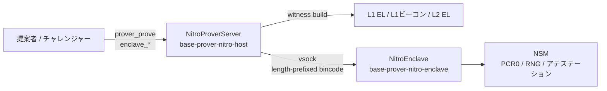

TEE プローバーは、AWS Nitro Enclave内でL2ブロック範囲を再導出・再実行し、`AggregateVerifier`
ゲーム向けの署名付き証明データを生成するオフチェーンサービスです。提案の作成と紛争時の無効化は、
いずれも同じサービスが担います。呼び出し元 (プロポーザーまたはチャレンジャー) が
ブロック範囲を送信すると、ホストがウィットネスデータを収集し、エンクレーブがその範囲を検証します。そして、
エンクレーブ内にのみ保持されるランダム生成の鍵で、得られたジャーナルに署名します。

この署名はオンチェーンで自己検証が可能です。`TEEVerifier`は各提案から署名者を復元し、
アクティブなゲーム実装の`TEE_IMAGE_HASH`に対応する`TEEProverRegistry`の登録内容と照合します。
異なるエンクレーブイメージの署名者や、登録が解除された署名者では検証を
通過できません。Nitroハイパーバイザーによるインスタンスごとのアテステーションによって、署名者の公開鍵は
特定のPCR0に紐付けられます。このPCR0は、[registrar](/ja/specifications/base-protocol/proofs/registrar)が別途認証します。

## 責務 {#responsibilities}

準拠する TEE プローバースタックは、以下の処理を行います。

1. 提案範囲および紛争範囲に対する `prover_prove` を JSON-RPC 経由で提供する。
2. ホスト上で、正規の L1、L1 ビーコン、および L2 の RPC からウィットネスデータを収集する。
3. 内容の検証が済んだプリイメージを vsock 経由でエンクレーブに転送する。
4. エンクレーブ内で L2 の範囲を再導出・再実行し、いかなる署名も行う前に、主張された出力ルートを
   再実行で得られた出力ルートと照合して検証する。
5. エンクレーブ内で生成した secp256k1 鍵を用いて、ブロックごとのジャーナルと集約ジャーナルに
   署名する。
6. レジストラ向けに `enclave_signerPublicKey` と `enclave_signerAttestation` を公開する。
7. オプションとして、すべてのリクエストの受け付けをレジストリ上の署名者の有効性で制限し、登録解除された
   エンクレーブに対してフェイルクローズにする。
8. 単一の EC2 親インスタンス上でのマルチエンクレーブ構成をサポートし、ローテーション時に
   異なる PCR0 イメージを並行稼働できるようにする。

TEE プローバーは、提案や紛争の正否を判断しません。範囲を再実行し、その結果が主張と一致すれば
署名して返すだけです。呼び出し元は、オンチェーンに送信する前に改めてゲームの状態を確認します。

## アーキテクチャ {#architecture}

このサービスは、Nitro 対応の EC2 親インスタンス上で 2 つのプロセスとして動作します。

* **ホスト**バイナリ (`base-prover-nitro-host`) : JSON-RPC を終端し、HTTP 経由でウィットネスデータを収集して、
  1 つ以上のエンクレーブにリクエストをプロキシします。
* **エンクレーブ**バイナリ (`base-prover-nitro-enclave`) : EIF にパッケージ化されており、署名鍵を保持し、
  vsock リスナーを公開して、証明パイプラインを実行します。

2 つのプロセス間の通信は vsock のみで行われます。エンクレーブにはネットワークインターフェースがなく、外部との
RPC 接続はすべてホスト側で処理されます。



各 vsock 接続は 1 つのリクエストを処理した後にクローズされます。エンクレーブは接続をまたいでリクエストごとの状態を保持しません。エンクレーブ内で永続する状態は、署名者の鍵と
起動時の PCR0 測定値のみです。

vsock のフレームは長さプレフィックス付き (`u32` ビッグエンディアンの長さ + bincode ペイロード) で、読み取りタイムアウトは 5 分です。
トランスポートは、Linux カーネルの `virtio_vsock` に存在する SKB 破損バグを回避するため、書き込みチャンクの上限を 28 KiB としています。

## JSON-RPC インターフェース {#json-rpc-interface}

ホストは単一の HTTP JSON-RPC リスナー上で 2 つの名前空間を公開します。さらに、JSON-RPC の `healthz` メソッドへルーティングする HTTP `GET /healthz`
プロキシも提供します。

| メソッド                        | 用途                                                   |
| --------------------------- | ---------------------------------------------------- |
| `prover_prove`              | 指定したブロック範囲について、ブロックごとの署名付きプロポーザルと集約署名付きプロポーザルを生成します。 |
| `enclave_signerPublicKey`   | 各エンクレーブの 65 バイトの非圧縮 secp256k1 公開鍵を返します。              |
| `enclave_signerAttestation` | 各エンクレーブの COSE&#95;Sign1 アテステーションドキュメントを返します。         |
| `healthz` / `GET /healthz`  | 死活状態を返します。有効化されている場合は、オンチェーン上の署名者の有効性 (ラッチ方式) も返します。 |

`enclave_*` 呼び出しは、複数のエンクレーブに対してオールオアナッシングで動作します。いずれかのトランスポートが失敗した場合、またはいずれかの
エンクレーブがエラーを返した場合は、レスポンス全体が失敗となります。呼び出し側はすべての署名者を一括で登録するため、
一部だけのレスポンスでは役に立たないためです。

### prover_prove リクエスト {#prover_prove-request}

`ProofRequest` のフィールド:

| フィールド                         | 意味                                                                          |
| ----------------------------- | --------------------------------------------------------------------------- |
| `l1_head`                     | 導出ウィンドウの基準となる L1 ヘッドブロックのハッシュ。                                              |
| `l1_head_number`              | L1 ヘッドブロックの番号。                                                              |
| `agreed_l2_head_hash`         | 範囲の親にあたる L2 ブロックのハッシュ。                                                      |
| `agreed_l2_output_root`       | 親ブロック時点の出力ルート。開始状態として使用されます。                                                |
| `claimed_l2_output_root`      | ターゲットブロック時点の出力ルートとして主張される値。信頼性の要: エンクレーブは再実行の結果がこの値と一致する場合にのみ署名します。         |
| `claimed_l2_block_number`     | ターゲットの L2 ブロック番号 (範囲の終了ブロック) 。                                              |
| `proposer`                    | 証明を提出する L1 アドレス。ジャーナルにコミットされるため、オンチェーンの `msg.sender` はこのアドレスと一致する必要があります。   |
| `intermediate_block_interval` | 集約プロポーザルに含める中間ルートのサンプリング間隔。                                                 |
| `image_hash`                  | 呼び出し元が想定する `keccak256(PCR0)`。現時点では参考情報にすぎず、ルーティングはオンチェーンの署名者の有効性に基づいて行われます。 |

### prover_prove Response {#prover_prove-response}

`ProofResult::Tee` には以下が含まれます:

| Field                | Meaning                                                                              |
| -------------------- | ------------------------------------------------------------------------------------ |
| `aggregate_proposal` | 範囲全体をカバーし、サンプリングされた中間ルートを含む単一の `Proposal`。                                           |
| `proposals`          | ブロックごとの `Proposal` を順に並べたもの。各 `Proposal` は `prev_output_root` によって前のブロックのルートに連結されます。 |

各 `Proposal`:

| Field              | Meaning                                                      |   |   |   |           |
| ------------------ | ------------------------------------------------------------ | - | - | - | --------- |
| `output_root`      | このプロポーザルの終了ブロックにおける出力ルート。                                    |   |   |   |           |
| `signature`        | `keccak256(journal)` に対する 65 バイトの secp256k1 ECDSA 署名 (&#96;r |   | s |   | v&#96;) 。 |
| `l1_origin_hash`   | 導出時に使用された L1 ヘッドのハッシュ。                                       |   |   |   |           |
| `l1_origin_number` | L1 ヘッドのブロック番号。                                               |   |   |   |           |
| `l2_block_number`  | このプロポーザルの終了 L2 ブロック番号。                                       |   |   |   |           |
| `prev_output_root` | このプロポーザルの範囲の直前の出力ルート。                                        |   |   |   |           |
| `config_hash`      | エンクレーブにハードコードされたチェーンごとの設定ハッシュ。                               |   |   |   |           |

範囲に含まれるブロックが 1 つだけの場合、集約プロポーザルはその 1 ブロック分のプロポーザルと同一になります。
それ以外の場合、集約プロポーザルは独自の署名を持ちます。この署名の対象となるジャーナルでは、
`prev_output_root` がリクエストの `agreed_l2_output_root` となり、`intermediate_roots` は
`intermediate_block_interval` ごとにサンプリングされ、`ending_l2_block` は範囲内の
最後のブロックとなります。

### enclave_signerAttestation {#enclave_signerattestation}

オプションのバイト引数 `user_data` と `nonce` を受け取ります。どちらも NSM
ハードウェアにより上限が 512 バイトに制限されており、上限を超える値は vsock 呼び出しの前にホストの RPC レイヤーで拒否されます。ホストは、設定されたエンクレーブごとに生の
`COSE_Sign1` ドキュメントを 1 つずつ、`enclave_signerPublicKey` と同じ順序で返します。
レジストラはこのエンドポイントを使用して、各エンクレーブの署名者を新たに取得したアテステーションに紐付けたうえで、
オンチェーンに送信します。

## 証明パイプライン {#proof-pipeline}

1 つの `prover_prove` リクエストは、ホスト → vsock → エンクレーブ → ホストの順に処理されます。

1. **ホスト**: `ProverService::prove_block` がプルーバー設定から `Host` を構築し、続いて
   `Host::build_witness` を呼び出して L1 EL、L1 ビーコン、L2 EL を走査し、ハッシュをキーとする
   プリイメージを `Oracle` に格納します。
2. **ホスト**: `NitroBackend::prove` がオラクルを `(PreimageKey, Vec<u8>)` のペアに平坦化し、
   `NitroTransport::prove` がそれらを 1 つの `EnclaveRequest::Prove(...)` フレームとして vsock 経由で送信します。
3. **エンクレーブ**: `Oracle::new` が `Keccak256` または `Sha256` をキーとするすべてのプリイメージの内容を検証し、
   格納された値のハッシュが実際にキーと一致することを確認します。
4. **エンクレーブ**: `BootInfo::load` がローカルプリイメージから、プロポーザー、L1 ヘッド、合意済み/主張されたルート、
   中間ブロック間隔、チェーン ID を抽出します。
5. **エンクレーブ**: `config_hash_for_chain` が `CONFIG_HASHES` (初回アクセス時に `ChainConfig::all()` から計算) から、
   ハードコードされたチェーンごとの設定ハッシュを検索します。未知のチェーン ID の場合は
   `UnsupportedChain` を返し、証明を拒否します。
6. **エンクレーブ**: 証明のプロローグが `driver.execute_with_intermediates()` を通じて導出と実行を進めます。
   エピローグの `validate()` は、信頼性を左右する重要なゲートです。
   再実行して得られた最終的な出力ルートが、リクエストの `claimed_l2_output_root` と一致することを確認します。
   署名は、このチェックに合格して初めて行われます。
7. **エンクレーブ**: 各ブロックの結果について、`intermediate_roots` を空にした `ProofJournal` を構築して
   署名し、ループ内で `prev_output_root` を順に引き継ぎます。その後、サンプリングした中間ルートを含む
   集約ジャーナルを構築して署名します。
8. **エンクレーブ**: `EnclaveResponse::Prove(ProofResult::Tee { aggregate_proposal, proposals })` を返します。
9. **ホスト**: 設定された証明リクエストのタイムアウト (デフォルトは 1740 秒、約 29 分) を適用したうえで、
   結果を JSON-RPC の呼び出し元に返します。

プロポーザーは集約プロポーザルとブロックごとのプロポーザルの両方を使用します。ブロックごとのルートは
`proposeOutputRoots` に渡され、集約署名は `AggregateVerifier` の検証に用いられます。チャレンジャーは
集約署名のみを使用し、`ProofEncoder::encode_dispute_proof_bytes` によって `nullify()` 用に再パックします。
エンクレーブ自身は、どの呼び出し元に対して処理しているかを把握しておらず、その必要もありません。

## 署名付きジャーナル {#signed-journal}

各署名は `secp256k1.sign(keccak256(journal))` で計算され、65 バイト
(`r || s || v`) にシリアライズされます。ジャーナルは ABI エンコードではなくパック形式で格納され、サイズは `196 + 32·N` バイトです (`N` は
中間ルートの数) 。

```text Signed Journal Layout
proposer(20)        || l1OriginHash(32)   || prevOutputRoot(32)
startingL2Block(8)  || outputRoot(32)     || endingL2Block(8)
intermediateRoots(32 × N)                 || configHash(32)
teeImageHash(32)
```

ブロック単位のプロポーザルでは、`N == 0` かつ `startingL2Block == endingL2Block - 1` です。集約プロポーザルでは、
`startingL2Block == firstBlock - 1`、`endingL2Block == lastBlock`、`N == lastBlock /
intermediate_block_interval` となります。

`teeImageHash` は、エンクレーブ起動時に取得した `keccak256(PCR0)` です。この値はすべてのジャーナルに埋め込まれるため、
オンチェーンで復元された署名は、その署名を生成した EIF の測定値そのものに推移的にコミットします。
ローカルモード (NSM なし、開発およびテスト専用) では、`teeImageHash` はゼロです。

署名の `v` バイトは secp256k1 のリカバリー ID (`0` または `1`) としてエンコードされます。呼び出し側は、
L1 に送信する前に、必要な EIP-155 形式に正規化します。

## マルチエンクレーブルーティング {#multi-enclave-routing}

`--vsock-cid` には 1 つ以上の CID を指定できるため、1 つのホストプロセスを、同じ EC2 親インスタンス上で稼働する複数のエンクレーブに接続できます。
各 CID は独立した vsock エンドポイントであり、それぞれ異なる
EIF (異なる PCR0、異なる `tee_image_hash`、異なる登録済み署名者) を実行できます。

複数の CID を設定する場合、CLI では `--tee-prover-registry-address` の指定が必須です。
レジストリがなければエンクレーブを決定論的に選択する手段がないため、マルチエンクレーブ構成は
フェイルクローズ方式でのみ動作します。

リクエストごとのルーティングでは、設定された CID を順に走査し、署名者が
`TEEProverRegistry` で現在有効である最初のエンクレーブを選択します。

1. エンクレーブから署名者の公開鍵を取得します (失敗した場合はそのトランスポートをスキップします) 。
2. `TEEProverRegistry` の `isValidSigner(signer)` を呼び出します。
3. 有効であれば、リクエストをそのエンクレーブにルーティングします。無効であれば、ログを出力して次のエンクレーブへ進みます。
4. リスト内に有効な署名者を持つエンクレーブが 1 つもない場合、リクエストは `NoValidSigner` で失敗します。

運用上の代表的なユースケースはイメージのローテーションです。旧 EIF と新 EIF を並行稼働させ、移行期間中は両方の署名者を
アクティブなゲーム実装の `TEE_IMAGE_HASH` に対して登録しておきます。
レジストリが新しいイメージハッシュに切り替わると、新しいエンクレーブの署名者だけが有効になり、以降の
新規リクエストはすべてそちらにルーティングされます。

`enclave_*` の呼び出しは設定済みのすべてのエンクレーブにファンアウトされるため、レジストラは 1 回のサイクルで
すべての署名者を登録できます。

## 登録によるゲーティングとヘルスチェック {#registration-gating-and-health}

`--tee-prover-registry-address` が設定されている場合、ホストはレジストリに基づく次の 2 つの動作を有効にします。

* `GET /healthz` は、少なくとも 1 つのエンクレーブの署名者がオンチェーンで有効と確認されてはじめて、
  正常を返します。このヘルスフラグはラッチされます。つまり、いったんエンクレーブが有効と確認されれば、その後レジストリの RPC が失敗したり
  署名者が登録解除されたりしても、`/healthz` は正常を返し続けます。これにより、短時間の障害が発生してもロードバランサーの動作が安定します。
* すべての `prover_prove` リクエストは、転送前に `RegistrationChecker::select_valid_enclave` で確認されます。
  登録解除されたエンクレーブや、鍵の取得に失敗したエンクレーブはスキップされます。有効なエンクレーブが 1 つもない場合、
  リクエストは JSON-RPC エラーコード `-32001` で拒否されます。

レジストリフラグを指定しない場合、ホストは制限の緩い動作になります。`/healthz` はサーバーが稼働している限り正常を返し、
`prover_prove` は設定済みの最初のエンクレーブにルーティングされます。

## アテステーション {#attestation}

署名鍵は起動時にエンクレーブ内で生成され、エンクレーブプロセスの外に出ることはありません。
`Server::new_enclave` コンストラクタは次の処理を行います。

1. NSM セッションを開きます (`nsm_init`) 。
2. PCR0 (48 バイトの SHA-384) を読み取ります。長さが不正な場合は起動を中止します。
3. `tee_image_hash = keccak256(PCR0)` を計算し、すべての署名付きジャーナルに含めるために保持します。
4. `NsmRng` を使用して secp256k1 ECDSA 鍵を生成します。`NsmRng` は内部で
   `nsm_process_request(Request::GetRandom)` を呼び出します。
5. 署名者アドレスをログに出力します (鍵素材は出力しません) 。

起動時のアテステーションや定期的なアテステーションは行われません。アテステーションが生成されるのは、レジストラが
`enclave_signerAttestation` を呼び出したときのみです。呼び出しのたびに次の処理が行われます。

1. 新しい NSM セッションを開きます。
2. `nsm_process_request(Request::Attestation { public_key, user_data, nonce })` を呼び出します。
3. COSE&#95;Sign1 の生バイト列を返します。

アテステーションドキュメントには、65 バイトの非圧縮公開鍵、値が設定されているすべての PCR、
AWS が発行した証明書チェーン、タイムスタンプ、および呼び出し時に渡された `user_data`/`nonce` が含まれ、これらすべてが
インスタンスごとの Nitro ハイパーバイザー鍵で署名されます。本システムが利用するのは PCR0 のみです。PCR0 は
`teeImageHash = keccak256(PCR0)` として、すべての署名付きジャーナルにバインドされます。アテステーションの検証方法とオンチェーンへの送信方法については、
[レジストラ](/ja/specifications/base-protocol/proofs/registrar)の仕様を参照してください。

## サービスのライフサイクル {#service-lifecycle}

ホストの起動シーケンス (`ServerArgs::run`) :

1. CLI を解析し、`base_cli_utils` を使用してロギングとメトリクスを初期化します。
2. `--l2-chain-id` から `RollupConfig` と L1 チェーン設定を解決します。未知のチェーンの場合はエラーになります。
3. `--vsock-cid` ごとに `NitroTransport::vsock(cid, 8000)` を 1 つずつ構築します。
4. `NitroProverServer::new_multi(prover_config, transports, timeout)` を構築し、
   `--tee-prover-registry-address` が設定されている場合は `RegistrationHealthConfig` でラップします。
5. `/healthz` プロキシレイヤーを備えた jsonrpsee HTTP サーバーを構築し、`ProverApiServer`、
   `EnclaveApiServer`、およびいずれか 1 つの healthz モジュールをマージしてサーバーを起動します。
6. サーバーハンドルでブロックし、ctrl-C で終了します。

エンクレーブの起動シーケンス (`NitroEnclave::new`) :

1. `Server::new()` が NSM を開き、`tee_image_hash` を導出して署名者キーを生成します。
2. `VMADDR_CID_ANY:8000` で `VsockListener` をバインドします。
3. 接続ごとにハンドラーを生成します。ハンドラーはフレーム化された `EnclaveRequest` を 1 つ読み取り、
   `Server::prove`、`signer_public_key`、`signer_attestation` のいずれかにディスパッチし、レスポンスを書き込んでから
   接続を閉じます。

ホスト上でのリクエストごとの処理フロー:

1. (オプション) `select_valid_enclave` が登録済みのエンクレーブを選択します。
2. `tokio::time::timeout(proof_request_timeout, enclave.service.prove_block(request))` を実行します。
3. タイムアウトした場合は、対象の L2 ブロック番号を含めて JSON-RPC `-32000` を返します。
4. エンクレーブがエラーを返した場合は、元のエラーメッセージを含めて JSON-RPC `-32000` を返します。

シャットダウンは、`RuntimeManager` が ctrl-C を処理することで開始されます。jsonrpsee サーバーが停止し、処理中の
リクエストが完了した後、ランタイムが終了します。エンクレーブにはグレースフルシャットダウンの仕組みがなく、プロセスの
終了時に `Drop` によって NSM のファイルディスクリプタが解放されます。

## オペレーターの入力 {#operator-inputs}

TEE プローバーホストには以下が必要です。

* L1 実行レイヤーの RPC URL。
* L1 ビーコンの RPC URL。
* L2 実行レイヤーの RPC URL。
* L2 チェーン ID (ロールアップ設定とチェーンごとの設定ハッシュの選択に使用) 。
* JSON-RPC のリッスンアドレス。
* 1 つ以上の vsock CID (それぞれにプローバー EIF を実行する Nitro Enclave が対応) 。
* 証明リクエストのタイムアウト (デフォルトは 1740 秒) 。
* ログフィルターおよび Prometheus メトリクスの設定。

オプション:

* `TEEProverRegistry` アドレス。複数の vsock CID を設定する場合は必須です。登録状態に基づくヘルスチェックと、
  リクエストごとの署名者検証が有効になります。
* `debug_executePayload` を公開するホスト向けの実験的な witness エンドポイントフラグ。

エンクレーブには、EIF イメージと vsock チャネル以外にオペレーターからの入力は不要です。PCR0 は起動時に
NSM から読み取られ、署名者の鍵はハードウェア RNG によって生成されます。

## 安全性要件 {#safety-requirements}

TEE プローバーの実装は、以下の安全性特性を維持しなければなりません (MUST) 。

* 署名鍵はエンクレーブ内で NSM ハードウェア RNG を用いて生成し、シリアライズしてエンクレーブプロセスの外部へ
  持ち出してはなりません。
* 署名を行う前に、再実行で得た最終出力ルートをリクエストの `claimed_l2_output_root` と照合し、
  一致しない場合は署名を拒否しなければなりません。
* 署名するすべてのジャーナルに `tee_image_hash = keccak256(PCR0)` を埋め込み、署名が単一の EIF
  測定値に紐付くようにしなければなりません。
* ハッシュをキーとするすべてのプリイメージについて、エンクレーブへの取り込み時に内容を検証し、値がキーと一致しない
  プリイメージが導出処理で使用されないようにしなければなりません。
* ハードコードされた `CONFIG_HASHES` テーブルに存在しないチェーン ID については、証明を拒否しなければなりません。
* ホストの RPC 境界で `user_data` と `nonce` のサイズを NSM の上限である 512 バイトに制限し、サイズ超過の
  アテステーションリクエストがエンクレーブに到達しないようにしなければなりません。
* 1 つの vsock 接続で処理するリクエストは最大 1 件とし、リクエスト間で可変状態を保持しないことで、
  不正な形式のリクエストが後続のリクエストに影響を及ぼさないようにしなければなりません。
* `--tee-prover-registry-address` が設定されている場合は、リクエストごとの署名者の有効性確認をフェイルクローズで行い、
  設定されたどのエンクレーブの署名者も現時点でオンチェーン上有効でなければ、リクエストを拒否しなければなりません。