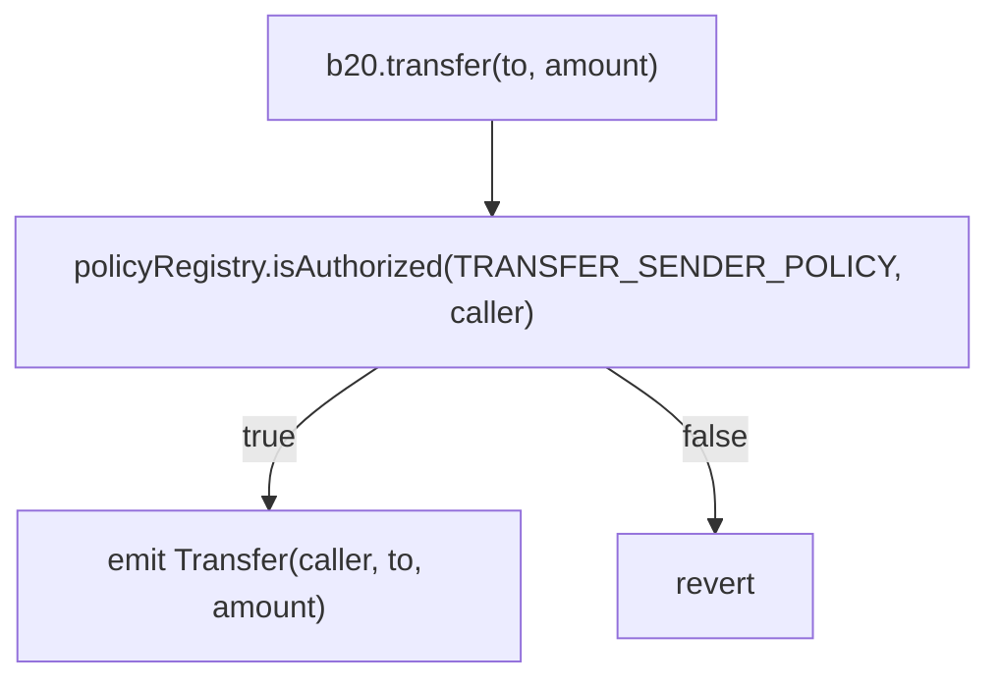
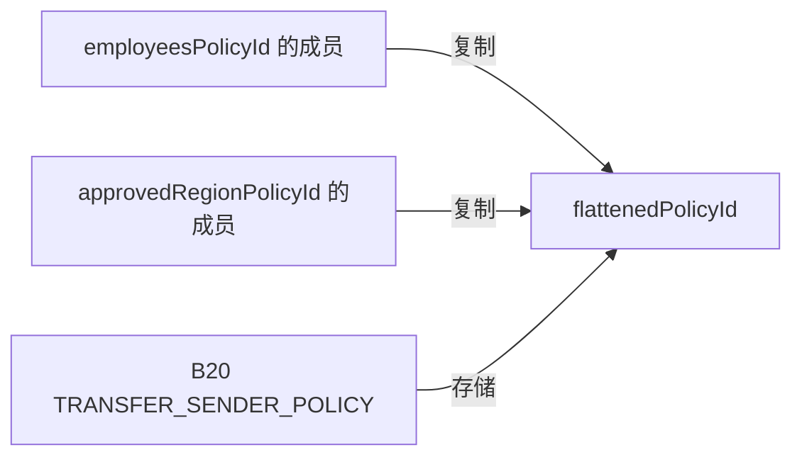

## 概述 {#summary}

[Cobalt](/zh/upgrades/cobalt/overview) 为 `PolicyRegistry` 新增了组合策略。组合策略通过 `UNION` (OR) 或
`INTERSECT` (AND) 逻辑门，将两到四个现有的简单 `ALLOWLIST` 或 `BLOCKLIST` 策略组合起来。使用 `createCompositePolicy` 创建组合策略，使用 `updateComposite` 整体替换其
子策略集合。

此变更为增量式变更，在 Cobalt 中，现有的 Beryl 选择器、事件、错误以及简单策略行为仍然
可以正常调用。`createPolicy` 和 `createPolicyWithAccounts` 新增了一条回滚路径：
若传入组合类型的 `policyType`，将以 `IncompatiblePolicyType` 回滚。

## 动机 {#motivation}

资产发行方经常在多个资产之间复用授权策略，例如 KYC 允许列表或制裁阻止列表。在 Cobalt 之前，若要组合多个策略，就必须把各策略的成员复制到一个扁平化策略中，并运行链下基础设施，同步每个来源的所有更新。
这种重复数据可能会过时：在复制的列表完成更新之前，有效账户可能遭到拒绝，已移除的账户则可能仍处于授权状态。

授权还可能需要明确的 OR 或 AND 关系。例如，策略可以允许位于共享允许列表或代币专属允许列表任意一个中的账户，也可以要求账户既已通过 KYC 验证，又在 Pro User 允许列表中。组合策略无需复制成员数据，即可表达这些关系。每次授权检查都会使用每个被评估子策略的当前状态。

## 变更内容 {#what-changed}

### 策略上下文 {#policy-context}

B20 为每个受限操作存储一个 `PolicyRegistry` 策略 ID。每当有人尝试执行某项操作时，B20 会调用 `isAuthorized(policyId, account)`；若该账户未获授权，则拒绝执行该操作。



`BLOCKLIST` 和 `ALLOWLIST` 仍为简单策略，也是组合策略中唯一有效的子策略。

### 接口变更 {#interface-changes}

`PolicyType` 只能追加新值：`UNION = 2` 和 `INTERSECT = 3` 紧接在 `BLOCKLIST = 0` 和
`ALLOWLIST = 1` 之后。这样可以保持现有的打包策略 ID 编码不变。

```solidity IPolicyRegistry.sol lines expandable wrap highlight={13-22}
enum PolicyType {
    BLOCKLIST,
    ALLOWLIST,
    UNION,
    INTERSECT
}

error ChildPoliciesOutsideOfRange();
error InvalidChildPolicy(uint64 childPolicyId);

event CompositePolicyUpdated(uint64 indexed policyId, address indexed updater, uint64[] childPolicyIds);

function createCompositePolicy(address admin, PolicyType policyType, uint64[] calldata childPolicyIds)
    external
    returns (uint64 newPolicyId);

function updateComposite(uint64 policyId, uint64[] calldata childPolicyIds) external;

function compositePolicyChildIds(uint64 policyId) external view returns (uint64[] memory);

function MIN_COMPOSITE_CHILD_POLICIES() external view returns (uint256);
function MAX_COMPOSITE_CHILD_POLICIES() external view returns (uint256);
```

| 符号                                                  | 选择器 / Topic0                                                         | 状态      | 行为                                                              |
| --------------------------------------------------- | -------------------------------------------------------------------- | ------- | --------------------------------------------------------------- |
| `createCompositePolicy(address,uint8,uint64[])`     | `0x6fdd1491`                                                         | 新增      | 创建 `UNION` 或 `INTERSECT` 组合策略。`PolicyType` 按 `uint8` 进行 ABI 编码。 |
| `updateComposite(uint64,uint64[])`                  | `0xbfe142c0`                                                         | 新增      | 整体替换子策略集合。                                                      |
| `compositePolicyChildIds(uint64)`                   | `0x7c40df74`                                                         | 新增 view | 按存储顺序返回子策略 ID；若为非组合策略，则返回空数组。                                   |
| `MIN_COMPOSITE_CHILD_POLICIES()`                    | `0xb3ae29f7`                                                         | 新增 view | 返回 `2`。                                                         |
| `MAX_COMPOSITE_CHILD_POLICIES()`                    | `0x54309870`                                                         | 新增 view | 返回 `4`。                                                         |
| `ChildPoliciesOutsideOfRange()`                     | `0x697ec868`                                                         | 新增错误    | 子策略数量超出 `[2, 4]` 范围；该限制有别于 `BatchSizeTooLarge` 的 64 个账户上限。      |
| `InvalidChildPolicy(uint64)`                        | `0x46508ef6`                                                         | 新增错误    | 某个子策略为组合策略或内置哨兵值。                                               |
| `CompositePolicyUpdated(uint64,address,uint64[])`   | `0x4ff6adaab31b0df87aa7b8b7320c52b8b3b5eede3bf28a6baaaa8b8b7e1d6363` | 新增事件    | 在创建组合策略及每次更新时触发，并携带更新后的完整子策略集合。                                 |
| `isAuthorized(uint64,address)`                      | `0x55a1179e`                                                         | 扩展      | 对组合策略进行分派，并实时评估其子策略。                                            |
| `createPolicy(address,uint8)`                       | `0xca5d55f6`                                                         | 扩展      | 拒绝 `UNION` 和 `INTERSECT`，并抛出 `IncompatiblePolicyType`。          |
| `createPolicyWithAccounts(address,uint8,address[])` | `0xa2d3044f`                                                         | 扩展      | 拒绝 `UNION` 和 `INTERSECT`，并抛出 `IncompatiblePolicyType`。          |

如需查看当前完整接口，请参阅 [IPolicyRegistry 参考](/specifications/b20/reference/interfaces/i-policy-registry/index)。

#### 组合策略创建 {#composite-policy-creation}

`createCompositePolicy(admin, policyType, childPolicyIds)` 用于创建 `UNION` 或 `INTERSECT` 策略，
将 `admin` 设为其初始管理员，并返回新的策略 ID。该策略仅存储对各子策略的引用，
不会复制子策略的成员关系。

子策略集合必须包含 2 到 4 个已存在的简单策略。子策略不能是组合策略，
也不能是内置哨兵策略 `ALWAYS_ALLOW` 或 `ALWAYS_BLOCK`。每评估一个子策略都需要读取一次
成员关系存储，因此 gas 消耗会随所评估子策略数量的增加而增加。

校验按以下顺序执行：

1. `ZeroAddress` — `admin` 为 `address(0)`。
2. `IncompatiblePolicyType` — `policyType` 不是 `UNION` 或 `INTERSECT`。
3. `ChildPoliciesOutsideOfRange` — 子策略数量不在 `[2, 4]` 范围内。
4. `PolicyNotFound` — 一个或多个子策略不存在；注册表会先完成这一轮检查，
   再检查子策略类型。
5. `InvalidChildPolicy` — 某个子策略是组合策略或内置哨兵策略。

创建成功后，注册表会依次触发 `PolicyCreated(policyId, creator, policyType)`、
`PolicyAdminUpdated(policyId, address(0), admin)` 和
`CompositePolicyUpdated(policyId, creator, childPolicyIds)` 事件。

#### 组合策略更新 {#composite-policy-updates}

`updateComposite(policyId, childPolicyIds)` 以原子方式替换组合策略的全部子策略集合。
它不支持部分更新，也不允许子策略集合为空。成功时会触发事件
`CompositePolicyUpdated(policyId, updater, childPolicyIds)`；由于管理员并未变更，更新操作
不会触发 `PolicyAdminUpdated`。

验证按以下顺序执行：

1. `PolicyNotFound` — `policyId` 不存在。
2. `IncompatiblePolicyType` — `policyId` 不是 `UNION` 或 `INTERSECT` 策略。
3. `Unauthorized` — 调用者不是当前管理员。已放弃管理权的组合策略无法
   更新。
4. `ChildPoliciesOutsideOfRange` — 新的子策略数量不在 `[2, 4]` 范围内。
5. `PolicyNotFound` — 有一个或多个新子策略不存在。
6. `InvalidChildPolicy` — 某个新子策略是组合策略或内置哨兵策略。

### 行为变更 {#behavioral-changes}

#### 现有构造函数的回滚行为 {#existing-constructor-reverts}

`createPolicy` 和 `createPolicyWithAccounts` 仍然只能创建简单策略。现在，如果传入的 `policyType` 为 `UNION` 或 `INTERSECT`，
这两个函数都会回滚并抛出 `IncompatiblePolicyType` 错误。

#### 授权评估 {#authorization-evaluation}

`isAuthorized` 对组合项的评估规则如下：

```text Authorization Evaluation lines expandable wrap highlight={1-12}
isAuthorized(policyId, account):
    if policy is ALLOWLIST:
        return account is in the policy

    if policy is BLOCKLIST:
        return account is not in the policy

    if policy is UNION:
        return true when any child authorizes the account

    if policy is INTERSECT:
        return false when any child does not authorize the account
```

组合策略的子策略必须是简单策略，因此求值的最大深度为一，不会递归，也不会形成循环。授权是实时判定的，而非基于成员快照：子策略发生变更后，所有引用它的组合策略都会在下一次授权检查时应用该变更。

求值采用短路机制。`UNION` 遇到第一个授权通过的子策略即停止，`INTERSECT` 遇到第一个授权不通过的子策略即停止。子策略的顺序不会改变授权结果，但会影响 gas 消耗；应将最可能触发短路的子策略放在首位。

注册表会保留子策略的顺序，并允许子策略 ID 重复，既不排序也不去重。子策略的管理员放弃管理权后，该子策略依然有效：放弃管理权会冻结后续的成员更新，但不会删除该策略，也不会改变其当前的授权结果。

格式正确但从未创建的 `UNION` ID 没有子策略，返回 `false`；格式正确但从未创建的 `INTERSECT` ID 没有子策略，返回 `true`。需要存储策略 ID 的调用方必须先调用 `policyExists(policyId)` 再进行存储，否则无效的 `INTERSECT` ID 可能会表现得与 `ALWAYS_ALLOW` 无异。

#### 状态变更 {#state-changes}

此变更在 `base.policy_registry` ERC-7201 命名空间的偏移量 `4` 处新增了一个 `children` 映射。
该变更为纯增量式：现有偏移量 `0` 至 `3` 保持不变，无需迁移存储。
此偏移量是相对于命名空间位置的，而非字面意义上的 EVM 存储槽 `4`。

| 字段     | 值                                                                    |
| ------ | -------------------------------------------------------------------- |
| 命名空间位置 | `0x00503aeb06982fa1fe3151dc68f90b3946c55c449dfd447e49dcaece71ba4a00` |
| 偏移量    | `CHILDREN_OFFSET = 4`                                                |
| 字段类型   | `mapping(uint64 policyId => uint64[] childPolicyIds) children`       |

每个映射条目存储动态数组的长度。数组元素从该条目的哈希位置开始存放，
每个 256 位存储槽可打包四个 `uint64` 子 ID，足以满足两到四个子策略的数量限制。

| 位         | 数组索引 | 字段                  |
| --------- | ---- | ------------------- |
| `0–63`    | `0`  | `childPolicyIds[0]` |
| `64–127`  | `1`  | `childPolicyIds[1]` |
| `128–191` | `2`  | `childPolicyIds[2]` |
| `192–255` | `3`  | `childPolicyIds[3]` |

简单策略和组合策略共用全局 `nextCounter`，其起始值为 `2`，因为 `0` 和
`1` 分别保留给 `ALWAYS_ALLOW` 和 `ALWAYS_BLOCK`。组合策略 ID 的最高字节存储其
`PolicyType`，低 56 位存储下一个计数器值；组合策略不使用
单独的计数器。

## 示例 {#examples}

假设 `employeesPolicyId` 和 `approvedRegionPolicyId` 是现有的 `ALLOWLIST` 策略。以下两个
示例都会授权出现在任一列表中的账户进行转账。

### 之前：扁平化策略 {#before-flattened-policy}

B20 在每个作用域中只存储一个策略 ID，因此必须将两个来源列表都复制到一个扁平化的允许列表中。
随后，由链下基础设施监听这两个来源，并将成员变更同步到该副本。

```solidity Flattened Policy
uint64 flattenedPolicyId = policyRegistry.createPolicyWithAccounts(
    admin,
    PolicyType.ALLOWLIST,
    /* 员工地址与获批地区地址的并集 */
);

b20.updatePolicy(TRANSFER_SENDER_POLICY, flattenedPolicyId);
```



```mermaid Flattened Policy Synchronization lines expandable wrap highlight={1-12}
sequenceDiagram
    participant SourceAdmin
    participant Employees as employeesPolicyId
    participant Listener as Sync infrastructure
    participant Flat as flattenedPolicyId
    participant B20

    SourceAdmin->>Employees: updateAllowlist(true, [Alice])
    Employees-->>Listener: AllowlistUpdated(..., true, [Alice])
    Note over B20,Flat: Alice cannot transfer yet
    Listener->>Flat: updateAllowlist(true, [Alice])
    Note over B20,Flat: Alice can transfer
```

### 改用后：组合策略 {#after-composite-policy}

创建一个引用各源策略的 `UNION` 组合策略，并将其 ID 分配给 B20。B20 无需任何针对组合策略的专门逻辑：
它仍只需将已存储的策略 ID 传给 `PolicyRegistry`。

```solidity Composite Policy
uint64 compositePolicyId = policyRegistry.createCompositePolicy(
    admin,
    PolicyType.UNION,
    [employeesPolicyId, approvedRegionPolicyId]
);

b20.updatePolicy(TRANSFER_SENDER_POLICY, compositePolicyId);
```

创建调用会依次触发 `PolicyCreated(policyId, admin, UNION)`、
`PolicyAdminUpdated(policyId, address(0), admin)` 和
`CompositePolicyUpdated(policyId, admin, childPolicyIds)` 事件。将 Alice 添加到 `employeesPolicyId`
后，她在下一次检查时即可获得授权，无需再把成员复制到其他策略中。

```mermaid Composite Policy Authorization lines expandable wrap highlight={1-15}
sequenceDiagram
    participant Admin
    participant Employees as employeesPolicyId
    participant Region as approvedRegionPolicyId
    participant Union as UNION composite
    participant B20

    Admin->>Union: createCompositePolicy(UNION, [employees, approvedRegion])
    Admin->>B20: updatePolicy(TRANSFER_SENDER_POLICY, compositePolicyId)

    Note over Employees: Alice added to employeesPolicyId
    B20->>Union: isAuthorized(compositePolicyId, Alice)
    Union->>Employees: isAuthorized(employeesPolicyId, Alice)
    Employees-->>Union: true
    Union-->>B20: true
```

## 设计决策与备选方案考量 {#design-decisions-and-alternatives-considered}

Cobalt 采用两种显式策略类型和单一的 `createCompositePolicy` 函数，并通过 `updateComposite` 进行
整体替换。

### 单一通用组合类型 {#one-generic-composite-type}

若采用通用组合类型，并单独存储 AND、OR、NOT 或 XOR 等运算符，会增加存储和授权方面的复杂性，而目前并不需要支持更多运算符。显式定义
`UNION` 和 `INTERSECT` 类型，可使策略 ID 编码更精简、gas 开销更低、审计面更小。

### 代币级策略组 {#token-level-policy-groups}

若在每个 B20 代币上存储多个策略 ID 和一个运算符，将无法实现可复用的组合策略，
而且改动会波及各代币变体、工厂合约以及授权热路径。改用可复用的
PolicyRegistry 策略，则可让 B20 的策略槽仍保持为一个不透明的 `uint64` ID。

### 增量子项更新 {#incremental-child-updates}

若采用单独的添加/删除操作，则需要额外定义数组变更、长度和去重等行为。由于一个组合最多只有四个子项，
采用原子性的整体替换更为简单，开销也很低。

### 独立的创建函数 {#separate-creator-functions}

若分别提供 `createUnionPolicy` 和 `createIntersectPolicy` 两个函数，会造成创建 API 的重复。
而单个 `createCompositePolicy` 函数即可一致地支持这两种运算符。

### 嵌套组合策略 {#nested-composites}

若允许组合策略引用其他组合策略，就必须引入深度限制和循环保护，并且可能导致无上限的授权遍历。将子策略限定为简单策略，可确保评估深度为 1，
并为最坏情况下的 gas 消耗设定上限。

## 迁移 {#migration}

此变更不会造成破坏性影响。现有的简单 `ALLOWLIST` 和 `BLOCKLIST` 策略仍可正常使用，
不需要组合行为的集成无需做任何调整。

要替换扁平化策略，请按以下步骤操作：

1. 确定需要组合的现有简单策略。
2. 使用 `createCompositePolicy` 创建 `UNION` 或 `INTERSECT` 组合策略。
3. 使用 `b20.updatePolicy` 将组合策略 ID 写入相应的 B20 策略作用域。
4. 如果旧的扁平化策略已不再需要，可将其移除。

B20 会将组合策略 ID 视为与简单策略相同的不透明 `uint64` 策略 ID，因此
B20 合约无需任何改动。