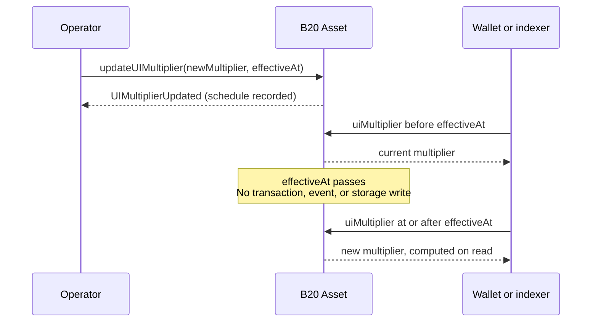

*本文介绍 B20 Asset UI 乘数 ([ERC-8056](https://eips.ethereum.org/EIPS/eip-8056)) 的核心概念模型。操作指南、事件和错误详见 [`updateUIMultiplier`](/specifications/b20/reference/interfaces/ib20-asset/update-ui-multiplier)。此功能仅适用于 Asset，Stablecoin 不支持乘数。另请参阅[代币类型](/zh/specifications/b20/concepts/token-types)。*

目标读者：集成方和索引器开发者。

***

## 为什么需要乘数 {#why-multipliers-exist}

发行方需要通过股票拆分来改变显示的股份数量。如果拆分时改写每个持有人的原始 ERC-20 余额，那么调用 `balanceOf` 和 `transfer` 的金库及其他 DeFi 协议就会发现这些数额发生了变化，而实际上并没有任何代币发生转移。

B20 Asset 以原始 ERC-20 单位存储持有人余额。乘数只改变显示比例，不会改写这些余额，因此 ERC-20 接口保持不变。

钱包和索引器读取派生的 UI 视图，以便在拆分后显示股份数量。

反向拆分使用的是同一原语，只是 `multiplier < 1e18`。

## 工作原理 {#how-they-work}

### UI 余额的工作原理 {#how-the-ui-works}

每个持有者都有两个数额：存储的 **raw** 余额和派生的 **UI** 余额。UI 余额即钱包和索引器所显示的股份数量，计算公式为 `raw * multiplier / WAD_PRECISION`。

由于该公式要除以 `WAD_PRECISION` (`1e18`) ，乘数也必须按同样的倍数放大。缩放比例 `1.0` 对应 `1 * 1e18`，这是默认值，此时 UI 等于 raw。存储值为 `0` 时会按 `WAD_PRECISION` 读取。

1 拆 2 的拆股对应缩放比例 `2.0`，因此乘数为 `2 * 1e18`，即 `2e18`。原始余额为 `100` 时，UI 为 `200`。如果传入 `2`，则会计算 `raw * 2 / 1e18`，同样的余额会被向下取整为 `0`。

反向拆分 (合股) 采用相同的编码方式。2 合 1 对应缩放比例 `0.5`，因此乘数为 `0.5 * 1e18`，即 `5e17`。原始余额为 `100` 时，UI 为 `50`。

运营方写入的缩放值是**绝对**乘数，而非相对于当前乘数的比率。第二次 1 拆 2 应写入 `4e18`，而不是“再乘以 2”。使用比率会掩盖当前的缩放比例，连续拆股时容易设错。

该除法为整数除法，结果向下取整。当 `multiplier != WAD_PRECISION` 时，先调用 `toUIAmount` 再调用 `fromUIAmount` 进行往返转换，可能会损失一个最小精度单位 (ULP) 。股票类资产建议使用 18 位小数 (Decimals) ，以尽量减小这一影响。更多取整细节请参阅 Asset 规范和拆股指南。

### 查看和读取乘数变更 {#viewing-and-reading-multiplier-changes}

索引器和集成方只读取这些视图，不会写入乘数。ERC-8056 名称是 B20 名称的别名，建议优先使用 ERC-8056 名称。

当前比例由 `uiMultiplier()` (`multiplier()`) 给出，它返回 `block.timestamp` 时刻的生效乘数。

待生效的变更可通过 `newUIMultiplier()` 和 `effectiveAt()` 查看。只要 `effectiveAt() > block.timestamp`，该变更就处于待生效状态。切换完成后，`uiMultiplier()` 将返回新值，且不会再触发第二个事件。

持有者的 UI 份额数量为 `balanceOfUI(account)` (`scaledBalanceOf`) ：`balanceOf(account) * uiMultiplier() / WAD_PRECISION`。`totalSupplyUI()` 则是对 `totalSupply()` 应用相同的公式。

如需转换单个数额，可使用 `toUIAmount(raw)` 和 `fromUIAmount(ui)`，按当前生效乘数进行换算。`toScaledBalance` 和 `toRawBalance` 是这两个函数已弃用的别名。

### 保持不变的部分 {#what-it-preserves}

`balanceOf`、`transfer` 金额、`totalSupply` 以及授权额度均保持原始值。依赖这组 ERC-20 接口的协议不会感知到拆分。

上述 UI 视图需主动选用。调用 `balanceOfUI`、`scaledBalanceOf` 或 `totalSupplyUI` 的协议则会感知到拆分。

### 调度 {#scheduling}

运营方通常会将调度操作包装在 `announce` 中，使拆股成为一项已披露的公司行为。参见 [`announce`](/specifications/b20/reference/interfaces/ib20-asset/announce)。

但这种包装并不会将两个概念合二为一。乘数事件表示已记录一次比例变更；公告则表示运营方已披露一项公司行为。

标准做法是调用 `updateUIMultiplier(newMultiplier, effectiveAt)`，而非即时设置方法。拥有 `OPERATOR_ROLE` 的账户会记录一个待生效 (pending) 乘数以及一个未来的 `effectiveAt`。同一资产在同一时间只允许存在一个有效的待生效更新。

当 `effectiveAt() > block.timestamp` 时，`uiMultiplier()` 仍返回当前乘数，`newUIMultiplier()` 返回已调度的值，`effectiveAt()` 返回切换时间。

当 `block.timestamp >= effectiveAt` 时，读取操作将返回新乘数。到期生效时既不会触发事件，也不会写入存储。索引器不得在 `effectiveAt` 时刻等待“拆股已发生”的日志。`UIMultiplierUpdated` 在更新被**记录**时触发。

切换之后，应通过 `effectiveAt() > block.timestamp` 判断是否存在有效的待生效更新，而不要检查 `effectiveAt() == 0`。

`cancelUIMultiplierUpdate` 可在 `effectiveAt` 之前清除有效的待生效更新。详情参见拆股指南。

已弃用的 `updateMultiplier` 会立即应用新值，并清除所有待生效更新，仅限紧急覆盖时使用。常规拆股应优先使用 `updateUIMultiplier`。详情参见拆股指南。

## 示例 {#example}

一拆二 (2-for-1) 拆分会使钱包显示的数值翻倍。原始单位保持不变，切换时也不会触发事件。

某持有者初始的原始值为 `100`，乘数为 `1e18`，因此 UI 显示为 `100`。运营方调度 `updateUIMultiplier(2e18, T)`。

在 `T` 之前，一切都尚未切换：原始值仍为 `100`，`uiMultiplier()` 仍为 `1e18`。待生效的拆分可通过 `newUIMultiplier()` (`2e18`) 和 `effectiveAt()` (`T`) 查看。

`T` 过后，UI 显示变为 `200`，原始值仍为 `100`，也不会产生第二个事件。

反向拆分 (合股) 走相同的流程。二合一 (1-for-2) 使用 `5e17`。

## 相关内容 {#related}

* [代币类型](/zh/specifications/b20/concepts/token-types) — Asset 与 Stablecoin 的区别；乘数仅适用于 Asset。
* [角色与暂停](/zh/specifications/b20/concepts/roles-and-pause) — `OPERATOR_ROLE`。
* [`updateUIMultiplier`](/specifications/b20/reference/interfaces/ib20-asset/update-ui-multiplier) — 如何安排、取消和覆盖调度；相关事件与错误。
* [`announce`](/specifications/b20/reference/interfaces/ib20-asset/announce) — 在调度基础上附加披露信息的封装函数。