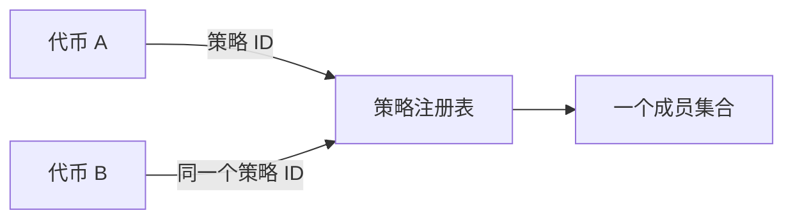
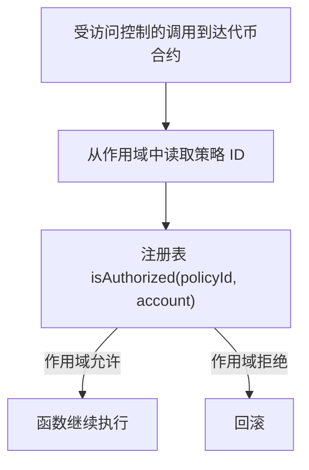
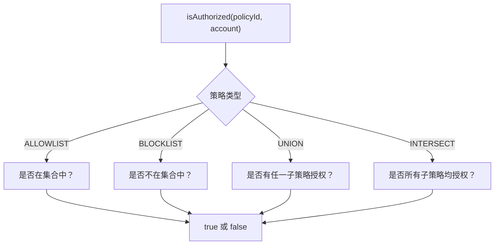
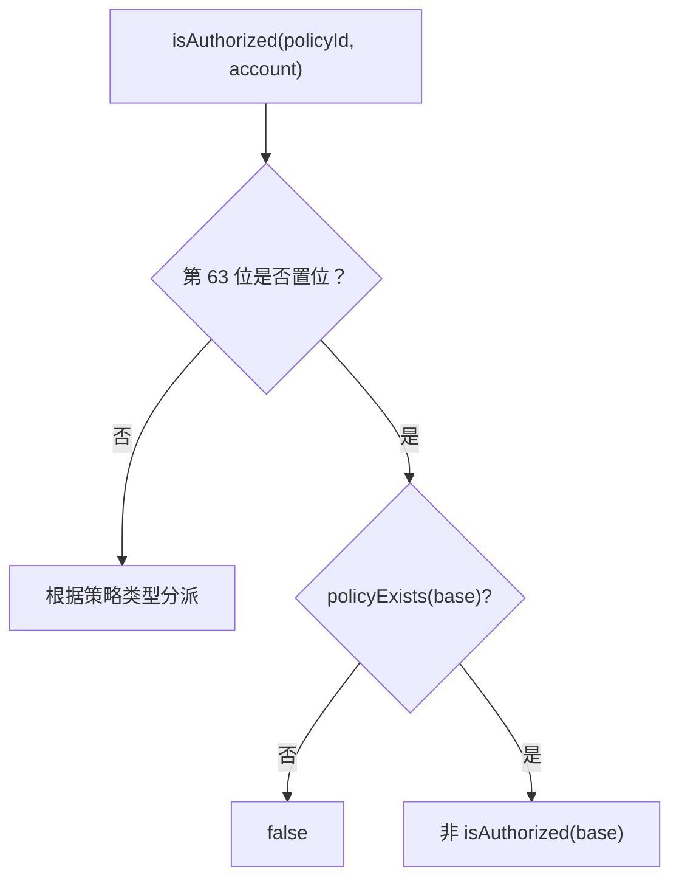
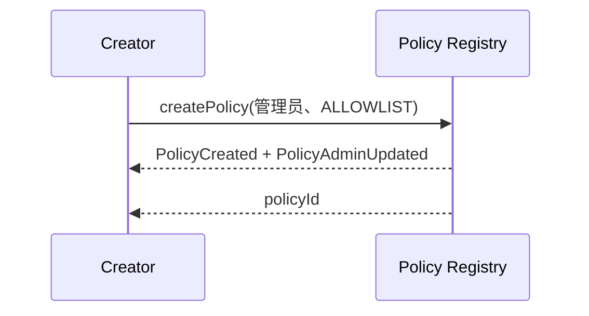
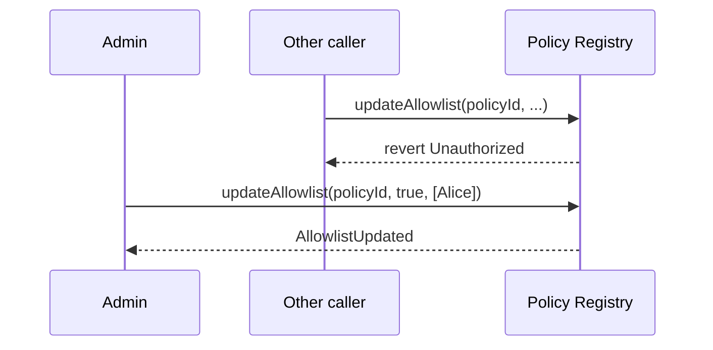
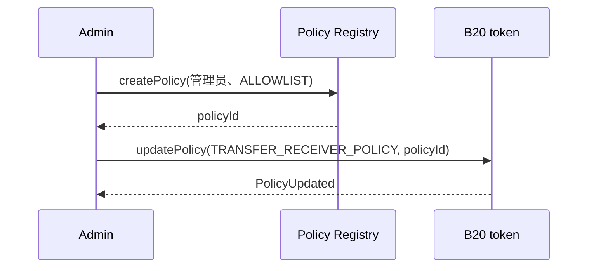
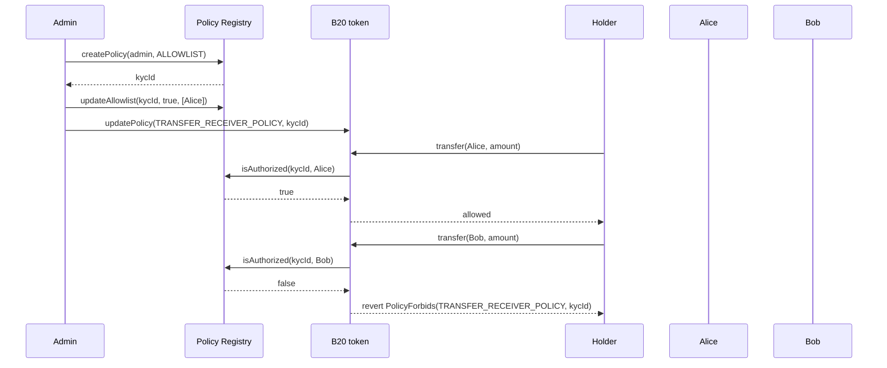

*介绍 B20 如何复用共享的允许列表和阻止列表来执行合规检查。角色与暂停属于独立的授权层，详见[角色与暂停](/zh/specifications/b20/concepts/roles-and-pause)。*

## 1. 为什么需要策略 {#1-why-policies-exist}

大多数代币合规要求最终都可归结为对地址列表的成员资格检查：该账户是否允许发送、接收代币，或被铸造代币？发行方往往要在许多代币上重复维护这些列表。如果把同一份 KYC 允许列表或制裁阻止列表复制到每个代币上，各份列表之间就会逐渐出现偏差：每次更新列表，都必须同步到每一份副本中。

策略将列表集中到一处管理。Policy Registry 是一个单例预编译合约，每个列表只在其中存储一次，并附带作用于该列表的成员资格逻辑。代币只需在一个存储槽中保存策略 ID。在受控函数执行之前，代币会向注册表查询相关地址是否已获授权。多个代币可以共享同一个策略，而对该策略的任何更新，所有引用它的代币都能看到。



角色 (role) 决定谁可以调用特权函数。暂停 (pause) 决定该类操作当前是否可用。策略 (policy) 决定某个特定地址是否已获授权执行该操作。这三者可以同时作用于同一次调用。

## 2. 策略的工作原理 {#2-how-policies-work}

### 2.1 注册表与代币 {#21-the-registry-and-the-token}

Policy Registry 负责管理成员集合和组合门控。任何人都可以创建策略，无需许可。每个策略都有一个管理员，负责更新成员、替换组合策略的子项或转移管理权。代币从不写入这些列表，而是为每个[作用域](#32-policy-scopes)存储一个 `uint64` 策略 ID，并在该作用域执行时调用 `isAuthorized(policyId, account)`。

`isAuthorized` 从不回滚，只返回该账户在该策略下是否已获授权。`false` (或在某一作用域中的 `true`) 代表什么含义，由代币自行决定。大多数作用域在结果为 `false` 时会以 `PolicyForbids` 回滚，函数随即不再执行。



### 2.2 策略类型 {#22-policy-types}

策略分为简单策略和组合策略两种。

**简单**策略依据单个地址集合进行判定：

| 类型          | 授权条件    |
| ----------- | ------- |
| `ALLOWLIST` | 账户在集合中  |
| `BLOCKLIST` | 账户不在集合中 |

空的允许列表不授权任何账户，空的阻止列表则授权所有账户。

**组合**策略由二至四个已有的简单策略组合而成。它不会复制这些策略的成员，每次调用 `isAuthorized` 时都会读取各子策略的当前集合：

| 类型          | 授权条件        |
| ----------- | ----------- |
| `UNION`     | 任一子策略授权该账户  |
| `INTERSECT` | 所有子策略均授权该账户 |

子策略必须是已有的 `ALLOWLIST` 或 `BLOCKLIST` 策略。组合策略不能作为其他组合策略的子策略，[§2.5](#25-built-in-sentinels) 中的内置哨兵策略同样不能作为子策略。更新某个子策略的成员，会同时影响所有引用它的组合策略，而无需经过展开并复制的步骤。上述任一类型的策略均可取反，参见 [§2.3](#23-inverting-a-policy)。



### 2.3 反转策略 {#23-inverting-a-policy}

发行方可能需要与现有策略效果相反的策略，但又不想另建一个成员集合。策略 ID 的第 63 位即为反转 (NOT) 标志。它既不是新的策略类型，也不是一条创建路径。成员仍保留在基础策略上，对基础策略的任何更新都会同步作用于其反转策略。

调用 `invertedPolicyId(policyId)` 可设置或清除该位，你也可以自行设置第 63 位。反转后的 ID 可以绑定到代币作用域，也可以作为组合策略的子项传入 (&quot;A AND NOT X&quot;) 。该标志适用于所有类型：`ALLOWLIST`、`BLOCKLIST`、`UNION` 和 `INTERSECT`。

对反转 ID 调用 `isAuthorized`，返回结果与基础策略相反。如果基础策略不存在，则返回 `false`。这一故障关闭 (fail-closed) 保护机制可防止输错的反转 ID 变成对所有人放行。

只读视图会剥离第 63 位，然后加载基础策略。对反转 ID 调用 `policyExists` 和 `policyAdmin`，结果与基础策略一致。反转 ID 本身没有独立的记录。



复合策略的子策略 ID 可以带有反转位。注册表会根据去除反转位后的基础 ID 检查该策略是否存在、是否为简单类型。反转的简单子策略是有效的；反转的复合子策略则会以 `InvalidChildPolicy` 回滚。就整个子策略集合而言，`PolicyNotFound` 的优先级仍高于 `InvalidChildPolicy`。

### 2.4 创建与更新 {#24-creating-and-updating}

任何人都可以创建策略。创建调用会指定唯一的 `admin`。此后，只有该地址有权变更成员、替换组合策略的子策略、转移管理权或放弃管理权。创建者不一定要是 admin。`admin` 不能为 `address(0)`。

你也可以不创建新策略，直接复用现有策略。如果其他发行方已经在维护你所需的列表，只需将其策略 ID 绑定到你的代币即可。附加该策略并不会让你成为它的 admin。

#### 2.4.1 创建策略 {#241-creating-a-policy}

简单策略在创建时为 `ALLOWLIST` 或 `BLOCKLIST`。调用 `createPolicy(admin, ALLOWLIST)` 或 `createPolicy(admin, BLOCKLIST)`，注册表会分配一个新的策略 ID 并将其返回，此时成员集合为空。`createPolicyWithAccounts(admin, policyType, accounts)` 的作用相同，但会在同一次调用中填充成员集合。每批成员操作最多包含 64 个账户。

组合策略基于已有的策略创建。调用 `createCompositePolicy(admin, UNION | INTERSECT, childPolicyIds)` 即可。子策略数量必须在 `[MIN_COMPOSITE_CHILD_POLICIES, MAX_COMPOSITE_CHILD_POLICIES]` 范围内 (`2` 至 `4`) 。注册表存储的是对子策略的引用，而非其成员的快照。子策略 ID 可以取反：注册表会先验证其基础策略，再存储已设置取反位的子策略 ID。参见 [§2.3](#23-inverting-a-policy)。

两种方式都会触发 `PolicyCreated` 和 `PolicyAdminUpdated(policyId, address(0), admin)` 事件。此后，`policyAdmin(policyId)` 将返回该管理员。



#### 2.4.2 更新策略 {#242-updating-a-policy}

策略创建后，只有当前管理员可以修改该策略，其他任何调用方都会以 `Unauthorized` 回滚。更新操作必须与策略类型相匹配，否则会以 `IncompatiblePolicyType` 回滚。

允许列表的管理员调用 `updateAllowlist(policyId, allowed, accounts)` 来添加或移除成员。阻止列表的管理员调用 `updateBlocklist(policyId, blocked, accounts)`。组合策略的管理员调用 `updateComposite(policyId, childPolicyIds)` 来整体替换子策略集合，不支持仅修改部分子策略。

这些写入操作会改变下一次查询时 `isAuthorized` 的返回结果。所有已存储该策略 ID 的代币都会获得新的结果，无需再次调用 `updatePolicy`。



#### 2.4.3 更换管理员 {#243-changing-the-admin}

一个策略在任一时刻只能有一个管理员。如需移交管理权，由当前管理员调用 `stageUpdateAdmin(policyId, newAdmin)`。此调用并不会立即改变策略的更新权限：`policyAdmin` 仍返回当前管理员，`pendingPolicyAdmin` 则返回 `newAdmin`。传入 `address(0)` 可撤销尚未最终确认的提名。

随后，由待定管理员调用 `finalizeUpdateAdmin(policyId)`。调用者必须是已暂存的地址，否则调用将回滚并报错 `Unauthorized`；若当前没有暂存任何地址，则回滚并报错 `NoPendingAdmin`。调用成功后，待定管理员即成为当前管理员，待定槽位随之清空，原管理员也将无法再更新该策略。

```mermaid 3 Changing the admin Diagram lines wrap expandable highlight={1}
sequenceDiagram
    participant Admin
    participant Next as nextAdmin
    participant Registry as Policy Registry

    Admin->>Registry: stageUpdateAdmin(policyId, nextAdmin)
    Registry-->>Admin: PolicyAdminStaged
    Admin->>Registry: updateAllowlist(policyId, ...)
    Registry-->>Admin: AllowlistUpdated
    Next->>Registry: finalizeUpdateAdmin(policyId)
    Registry-->>Next: PolicyAdminUpdated
    Admin->>Registry: updateAllowlist(policyId, ...)
    Registry-->>Admin: revert Unauthorized
    Next->>Registry: updateAllowlist(policyId, ...)
    Registry-->>Next: AllowlistUpdated
```

若要冻结策略而不是移交管理权，当前管理员可调用 `renounceAdmin(policyId)`。此后管理权将永久失效，成员及子集均无法再更改，但 `isAuthorized` 仍可正常工作。放弃管理权后，没有任何调用能够重新指定管理员。

### 2.5 内置哨兵策略 {#25-built-in-sentinels}

以下两个策略 ID 无需创建即已存在：

| ID                   | `isAuthorized`  | 典型用途                     |
| -------------------- | --------------- | ------------------------ |
| `ALWAYS_ALLOW` (`0`) | 对所有账户均为 `true`  | 不对该作用域施加合规限制。这是未设置时的默认值。 |
| `ALWAYS_BLOCK`       | 对所有账户均为 `false` | 在该作用域内拒绝所有账户。            |

## 3. 策略如何附加到代币上 {#3-how-policies-attach-to-a-token}

作用域 (scope) 是某个特定函数上所运行策略的标识符，作用类似于钩子 (hook) 。调用该函数时，代币会读取绑定到该作用域的策略 ID，并针对该作用域所检查的地址调用注册表的 `isAuthorized`，查询该地址是否已获授权。名单仍由注册表保存，代币只存储策略 ID。

### 3.1 更新作用域 {#31-updating-a-scope}

`updatePolicy(policyScope, newPolicyId)` 用于将策略 ID 绑定到某个作用域，调用方须具备 `DEFAULT_ADMIN_ROLE`。该 ID 必须是内置哨兵值或注册表中已存在的策略，否则调用会回滚并报 `PolicyNotFound`。由于 `policyExists` 会去除第 63 位，只要反转 ID 对应的基础策略存在，该反转 ID 就是有效的。代币将该 ID 视为不透明的 `uint64`。若 `policyScope` 未知，调用会回滚并报 `UnsupportedPolicyType`。

写入会在下一次命中该作用域的调用时生效，并触发 `PolicyUpdated` 事件。在你更新某个作用域之前，其读取值为 `0` (`ALWAYS_ALLOW`) ，因此所有地址都能通过检查。同一个策略 ID 可以同时绑定到多个作用域和多个代币上。调用 `policyId(policyScope)` 可读取当前绑定。

你也可以在 `createB20` 的 `initCalls` 中绑定策略，在创建代币的同一笔交易中一并完成。



### 3.2 策略作用域 {#32-policy-scopes}

大多数作用域在 `isAuthorized` 为 `false` 时拒绝操作，并以 `PolicyForbids` 回滚。`SEIZE_EXEMPT_POLICY` 则相反，在 `isAuthorized` 为 `true` 时拒绝操作，并以 `AccountNotSeizable` 回滚：已授权 (authorized) 的账户即免于扣押。

| 作用域                        | 触发时机                                                                       | 检查的账户                                   | 拒绝条件：`isAuthorized` 为 | 错误                   |
| -------------------------- | -------------------------------------------------------------------------- | --------------------------------------- | --------------------- | -------------------- |
| `TRANSFER_SENDER_POLICY`   | `transfer`、`transferFrom` 及其附带 memo 的变体。工厂 `initCalls` 中的转账跳过此检查。          | `from` (调用 `transfer` 时为 `msg.sender`)  | `false`               | `PolicyForbids`      |
| `TRANSFER_RECEIVER_POLICY` | `transfer`、`transferFrom` 及其附带 memo 的变体。工厂 `initCalls` 中的转账跳过此检查。          | `to`                                    | `false`               | `PolicyForbids`      |
| `TRANSFER_EXECUTOR_POLICY` | `transfer`、`transferFrom` 及其附带 memo 的变体。工厂 `initCalls` 中的转账跳过此检查。          | `msg.sender`                            | `false`               | `PolicyForbids`      |
| `MINT_RECEIVER_POLICY`     | `mint`、`mintWithMemo` 以及 Asset 的 `batchMint`。始终检查，工厂 `initCalls` 中的铸造也不例外。 | `to`                                    | `false`               | `PolicyForbids`      |
| `SEIZE_EXEMPT_POLICY`      | `seizeWithMemo`。未设置 (`ALWAYS_ALLOW`) 时，所有账户均免于扣押，即没有任何账户可被扣押。              | `from`                                  | `true`                | `AccountNotSeizable` |
| `SEIZE_RECEIVER_POLICY`    | `seizeWithMemo`。未设置 (`ALWAYS_ALLOW`) 时，扣押的资产可发送至任意目标地址。                    | `to`                                    | `false`               | `PolicyForbids`      |

## 4. 示例 {#4-example}

先从接收方允许列表入手，再将其与制裁阻止列表组合，使转账必须同时满足这两个条件。接着对一个排除型允许列表取反，这样同一道检查就能表达“已通过 KYC 且不在该列表中”，而无需再维护第二个成员集合。

### 4.1 单个允许列表 {#41-one-allowlist}

创建一个允许列表，将已完成 KYC 的账户加入其中，并将其绑定到 `TRANSFER_RECEIVER_POLICY`。Alice 在名单中，Bob 不在。持有者可以向 Alice 转账，而向 Bob 转账则会回滚 (revert) 。



之后若将 Bob 加入允许列表，他即可在所有已指向 `kycId` 的代币上获得授权，无需再对代币进行额外写入。

### 4.2 组合策略：KYC 与制裁名单 {#42-composite-kyc-and-sanctions}

如果 KYC 名单和制裁名单是分开维护的，单个允许列表就无法表达“位于 KYC 名单中且不在制裁名单中”这一条件。此时应先分别创建两个简单策略，再基于它们创建一个 `INTERSECT` 组合策略，最后将该组合策略绑定到转账和铸造作用域。

```mermaid 2 Composite KYC and sanctions Diagram lines wrap expandable highlight={1}
flowchart TD
    C["INTERSECT 组合"] --> K[KYC 白名单]
    C --> S[制裁黑名单]
    K --> A1[Alice：是成员]
    K --> A2[Bob：不是成员]
    K --> A3[Carol：是成员]
    S --> B1[Alice：未列入名单]
    S --> B2[Bob：未列入名单]
    S --> B3[Carol：已列入名单]
```

```mermaid 2 Composite KYC and sanctions Diagram lines wrap expandable highlight={1}
sequenceDiagram
    participant Admin
    participant Registry as Policy Registry
    participant Token as B20 token
    participant Alice
    participant Dave
    participant Carol

    Admin->>Registry: createPolicy(admin, ALLOWLIST)
    Registry-->>Admin: kycId
    Admin->>Registry: updateAllowlist(kycId, true, [Alice, Dave, Carol])
    Admin->>Registry: createPolicy(admin, BLOCKLIST)
    Registry-->>Admin: sanctionsId
    Admin->>Registry: updateBlocklist(sanctionsId, true, [Carol])
    Admin->>Registry: createCompositePolicy(admin, INTERSECT, [kycId, sanctionsId])
    Registry-->>Admin: gateId
    Admin->>Token: updatePolicy(TRANSFER_SENDER_POLICY, gateId)
    Admin->>Token: updatePolicy(TRANSFER_RECEIVER_POLICY, gateId)
    Admin->>Token: updatePolicy(MINT_RECEIVER_POLICY, gateId)

    Alice->>Token: transfer(Dave, amount)
    Token->>Registry: isAuthorized(gateId, Alice)
    Registry-->>Token: true
    Token->>Registry: isAuthorized(gateId, Dave)
    Registry-->>Token: true
    Token-->>Alice: allowed

    Alice->>Token: transfer(Carol, amount)
    Token->>Registry: isAuthorized(gateId, Carol)
    Registry-->>Token: false
    Token-->>Alice: revert PolicyForbids(TRANSFER_RECEIVER_POLICY, gateId)
```

Alice 和 Dave 在 KYC 名单上且不在制裁名单上，因此两个子策略都会授权他们，`INTERSECT` 返回 `true`。Carol 已通过 KYC 但受到制裁：阻止列表返回 `false`，因此组合策略返回 `false`，转账被回滚。Bob 不在 KYC 名单上，因此即使他未受制裁，也会被拒绝。

之后若调用 `updateBlocklist` 添加或移除 Carol，组合策略的结果会在下一次调用时随之改变。代币持有的仍是 `gateId`，发行方无需再次调用 `updatePolicy`。

如果发行方之后需要将同一份 KYC 名单与某个代币专属的合作伙伴允许列表进行“或”运算，则只需改为创建这两个允许列表的 `UNION`。代币绑定步骤不变。

### 4.3 取反：已通过 KYC 且不在排除允许列表中 {#43-invert-kyc-and-not-on-an-exclusion-allowlist}

4.2 节将受制裁地址存储为 `BLOCKLIST`，因此&quot;未受制裁&quot;本身就是该阻止列表的授权结果。取反 (Invert) 用于另一种情况：排除列表是一个 `ALLOWLIST`，其中存放的是你想要拒之门外的地址；你需要得到与该列表相反的结果，但又不想把它复制成一个阻止列表。

创建一个 KYC 允许列表和一个排除允许列表，对排除列表的 ID 取反，然后将两者一并传入一个 `INTERSECT` 组合策略。

```mermaid 3 Invert KYC and not on an exclusion allowlist Diagram lines wrap expandable highlight={1}
flowchart TD
    C["交集组合"] --> K[KYC 白名单]
    C --> N["取反的排除白名单"]
    N --> X[排除白名单]
    K --> A1[Alice：成员]
    K --> A2[Bob：非成员]
    K --> A3[Carol：成员]
    X --> B1[Alice：不在名单中]
    X --> B2[Bob：不在名单中]
    X --> B3[Carol：在名单中]
```

```mermaid 3 Invert KYC and not on an exclusion allowlist Diagram lines wrap expandable highlight={1}
sequenceDiagram
    participant Admin
    participant Registry as Policy Registry
    participant Token as B20 token
    participant Alice
    participant Dave
    participant Carol

    Admin->>Registry: createPolicy(admin, ALLOWLIST)
    Registry-->>Admin: kycId
    Admin->>Registry: updateAllowlist(kycId, true, [Alice, Dave, Carol])
    Admin->>Registry: createPolicy(admin, ALLOWLIST)
    Registry-->>Admin: exclusionId
    Admin->>Registry: updateAllowlist(exclusionId, true, [Carol])
    Admin->>Registry: invertedPolicyId(exclusionId)
    Registry-->>Admin: notExcluded
    Admin->>Registry: createCompositePolicy(admin, INTERSECT, [kycId, notExcluded])
    Registry-->>Admin: gateId
    Admin->>Token: updatePolicy(TRANSFER_RECEIVER_POLICY, gateId)

    Alice->>Token: transfer(Dave, amount)
    Token->>Registry: isAuthorized(gateId, Dave)
    Registry-->>Token: true
    Token-->>Alice: allowed

    Alice->>Token: transfer(Carol, amount)
    Token->>Registry: isAuthorized(gateId, Carol)
    Registry-->>Token: false
    Token-->>Alice: revert PolicyForbids(TRANSFER_RECEIVER_POLICY, gateId)
```

Alice 和 Dave 在 KYC 列表中，且不在排除列表中。反转子策略对他们予以授权，因此 `INTERSECT` 返回 `true`。Carol 已通过 KYC，但在排除列表中。反转子策略返回 `false`，因此组合策略返回 `false`，转账回滚。Bob 不在 KYC 列表中，因此即使他未被排除，也会被拒绝。

之后若通过 `updateAllowlist` 在 `exclusionId` 上添加或移除 Carol，反转子策略的结果将在下一次调用时随之改变。代币仍持有 `gateId`，发行方无需再次调用 `updatePolicy`。

## 事件与错误 {#events-and-errors}

### Token {#token}

| 事件                                                     | 触发方                                            |
| ------------------------------------------------------ | ---------------------------------------------- |
| `PolicyUpdated(policyScope, oldPolicyId, newPolicyId)` | `updatePolicy`；创建代币时也会触发 (`oldPolicyId == 0`)  |

| 错误                                     | 抛出条件                                                               |
| -------------------------------------- | ------------------------------------------------------------------ |
| `PolicyForbids(policyScope, policyId)` | 某个“结果为 false 即拒绝”的作用域拒绝了该账户                                        |
| `PolicyNotFound(policyId)`             | 传给 `updatePolicy` 的 ID 既不是哨兵值，也不存在于注册表中                            |
| `UnsupportedPolicyType(policyScope)`   | `policyScope` 不是该代币支持的槽位                                           |
| `AccountNotSeizable(account)`          | `seizeWithMemo` 的 `from` 在 `SEIZE_EXEMPT_POLICY` 下仍为已授权状态 (即豁免扣押)  |
| `AccountNotBlocked(account)`           | 已弃用的 `burnBlocked` 的 `from` 在 `TRANSFER_SENDER_POLICY` 下仍为已授权状态    |

### Policy Registry {#policy-registry}

| 事件                                                          | 触发方                                                               |
| ----------------------------------------------------------- | ----------------------------------------------------------------- |
| `PolicyCreated(policyId, creator, policyType)`              | `createPolicy`、`createPolicyWithAccounts`、`createCompositePolicy` |
| `PolicyAdminStaged(policyId, currentAdmin, pendingAdmin)`   | `stageUpdateAdmin`                                                |
| `PolicyAdminUpdated(policyId, previousAdmin, newAdmin)`     | `finalizeUpdateAdmin`、`renounceAdmin`；创建策略时也会触发                   |
| `AllowlistUpdated(policyId, updater, allowed, accounts)`    | `updateAllowlist`                                                 |
| `BlocklistUpdated(policyId, updater, blocked, accounts)`    | `updateBlocklist`                                                 |
| `CompositePolicyUpdated(policyId, updater, childPolicyIds)` | `createCompositePolicy`、`updateComposite`                         |

| 错误                                  | 抛出条件                                                 |
| ----------------------------------- | ---------------------------------------------------- |
| `Unauthorized()`                    | 调用者不是策略管理员 (调用 `finalizeUpdateAdmin` 时则为调用者不是待定管理员)  |
| `PolicyNotFound()`                  | 引用的策略 ID 不存在                                         |
| `IncompatiblePolicyType()`          | 调用与策略类型不匹配                                           |
| `ZeroAddress()`                     | 某个必需的地址参数为 `address(0)`                              |
| `BatchSizeTooLarge(maxBatchSize)`   | 单批成员超过 64 个账户                                        |
| `NoPendingAdmin()`                  | 尚未暂存新管理员时调用了 `finalizeUpdateAdmin`                   |
| `ChildPoliciesOutsideOfRange()`     | 组合策略的子策略数量不在 `[2, 4]` 范围内                            |
| `InvalidChildPolicy(childPolicyId)` | 组合策略的某个子策略不是已存在的简单策略                                 |
| `NonPayable()`                      | 调用注册表时附带了 ETH                                        |