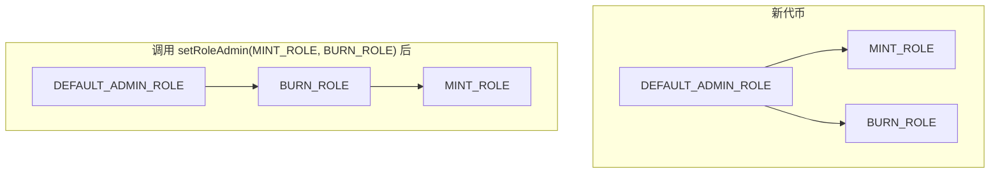
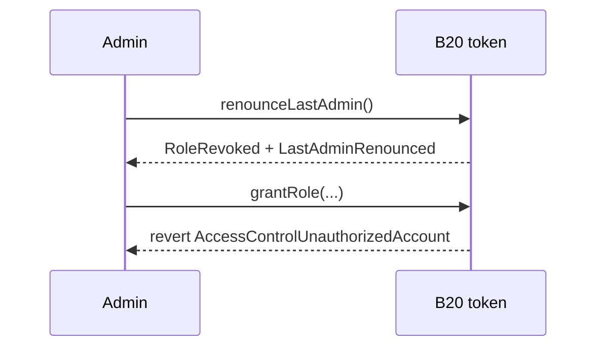
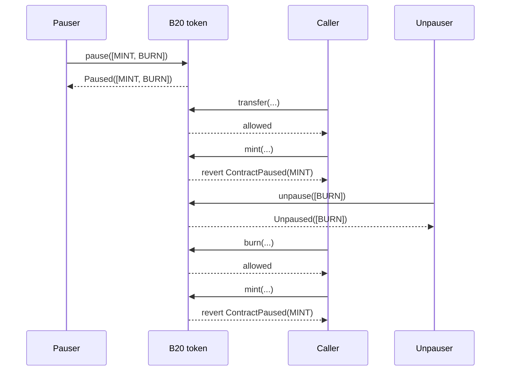

*本文介绍 B20 如何通过角色管控特权操作，以及暂停机制如何冻结某一类操作，而不影响代币的其他功能。策略检查属于独立的授权层，详见[策略](/zh/specifications/b20/concepts/policies)。*

## 1. 为什么需要角色和暂停 {#1-why-roles-and-pause-exist}

借助角色，发行方可以将每项特权操作分配给特定账户。铸造、没收和暂停属于不同的职责，因此对应不同的角色。每个角色控制一组特定管理函数的访问权限，具体映射关系见 [§2](#2-roles)。

暂停是另一种独立的控制机制。角色决定谁可以调用某个函数，而 `PausableFeature` 决定该类操作当前是否启用。发行方可以只暂停某一项功能，而不影响代币的其他部分。各项功能见 [§3](#3-pause)。

## 2. 角色 {#2-roles}

B20 直接在代币合约上通过 [OpenZeppelin AccessControl](https://docs.openzeppelin.com/contracts/5.x/access-control) 实现角色管理，没有单独的角色注册表。

### 2.1 默认管理员 {#21-the-default-admin}

`createB20` 会将 `DEFAULT_ADMIN_ROLE` 授予 `initialAdmin`，该持有者即为根管理员。根管理员通过授予操作角色 (铸造者、销毁者、暂停者、元数据编辑者) ，将各项特权操作分配给其他账户。根管理员也可以授予 `DEFAULT_ADMIN_ROLE` 本身，从而让多个地址共享根控制权。

同一角色可由任意数量的地址持有。`hasRole` 检查的是成员资格，而非单一持有者槽位。

有两个函数始终要求调用者持有 `DEFAULT_ADMIN_ROLE`：`updatePolicy` 和 `updateSupplyCap`。这些检查不会随管理员角色的重新分配而转移。

### 2.2 可用角色 {#22-available-roles}

| 角色                   | 管控的操作                                                                                         |
| -------------------- | --------------------------------------------------------------------------------------------- |
| `DEFAULT_ADMIN_ROLE` | `updatePolicy`、`updateSupplyCap`、`renounceLastAdmin`；同时是其他所有角色的默认管理员                          |
| `MINT_ROLE`          | `mint`、`mintWithMemo`；在 Asset 中还管控 `batchMint`                                                |
| `BURN_ROLE`          | `burn`、`burnWithMemo`                                                                         |
| `BURN_BLOCKED_ROLE`  | `burnBlocked` (已弃用)                                                                           |
| `SEIZE_ROLE`         | `seizeWithMemo`                                                                               |
| `PAUSE_ROLE`         | `pause`                                                                                       |
| `UNPAUSE_ROLE`       | `unpause`                                                                                     |
| `METADATA_ROLE`      | `updateName`、`updateSymbol`、`updateContractURI`；在 Asset 中还管控 `updateExtraMetadata`            |
| `OPERATOR_ROLE`      | 仅限 Asset：`announce`、`updateUIMultiplier`、`cancelUIMultiplierUpdate`，以及已弃用的 `updateMultiplier` |

`OPERATOR_ROLE` 仅存在于 Asset 中，详见[代币类型](/zh/specifications/b20/concepts/token-types)。`approve` 不受角色管控，持有者的 `transfer` 也不受角色管控。持有者始终可以转移自己的余额，但仍受暂停状态和策略的约束。

### 2.3 授予与撤销 {#23-granting-and-revoking}

每个角色都有一个管理员角色，可通过 `getRoleAdmin(role)` 查询。在新部署的代币上，所有角色的管理员均为 `DEFAULT_ADMIN_ROLE`。当前管理员可调用 `grantRole(role, account)` 添加持有者，调用 `revokeRole(role, account)` 移除持有者。持有者也可以通过 `renounceRole(role, callerConfirmation)` 自行放弃角色。`callerConfirmation` 必须等于 `msg.sender`，否则调用将回滚并抛出 `AccessControlBadConfirmation`。

`grantRole` 和 `revokeRole` 具有幂等性。未改变成员关系的调用不会触发任何事件；只有成员关系实际发生变化时，才会触发 `RoleGranted` 或 `RoleRevoked`。

对 `DEFAULT_ADMIN_ROLE` 调用 `revokeRole` 或 `renounceRole` 时，合约会拒绝移除最后一个默认管理员，调用将回滚并抛出 `LastAdminCannotRenounce`。如需清除最后一个管理员，请参见 [§2.6.1](#261-all-admin)。

### 2.4 委托管理权 {#24-delegating-administration}

角色的管理员并非固定不变。`setRoleAdmin(role, newAdminRole)` 可将其重新指派给任意其他角色，包括自定义角色。调用之后，`grantRole` 和 `revokeRole` 将以新的管理员角色为准，并非硬编码为 `DEFAULT_ADMIN_ROLE`。例如，发行方可以让 `BURN_ROLE` 持有者成为 `MINT_ROLE` 的管理员，而无需更改 `DEFAULT_ADMIN_ROLE`。只有该角色的当前管理员才能调用 `setRoleAdmin`。该调用会触发 `RoleAdminChanged(role, previousAdminRole, newAdminRole)` 事件。



### 2.5 示例 {#25-example}

#### 2.5.1 默认管理员授予和撤销角色 {#251-default-admin-grants-and-revokes}

默认管理员将 `MINT_ROLE` 授予 `minterA` 后，`minterA` 即可执行铸造。管理员撤销该角色后，下一次 `mint` 调用将会回滚 (revert) 。

```mermaid 1 Default admin grants and revokes Diagram lines wrap expandable highlight={1}
sequenceDiagram
    participant Admin
    participant Token as B20 token
    participant Minter as minterA

    Admin->>Token: grantRole(MINT_ROLE, minterA)
    Token-->>Admin: RoleGranted
    Minter->>Token: mint(...)
    Token-->>Minter: allowed
    Admin->>Token: revokeRole(MINT_ROLE, minterA)
    Token-->>Admin: RoleRevoked
    Minter->>Token: mint(...)
    Token-->>Minter: revert AccessControlUnauthorizedAccount(minterA, MINT_ROLE)
```

#### 2.5.2 由委托管理员授予角色 {#252-a-delegated-admin-grants}

默认管理员将 `BURN_ROLE` 设为 `MINT_ROLE` 的管理员角色，然后将 `BURN_ROLE` 授予 `burnAdmin`。之后由 `burnAdmin` 将 `MINT_ROLE` 授予 `minterA`，默认管理员无需亲自执行这项授权。

```mermaid 2 A delegated admin grants Diagram lines wrap expandable highlight={1}
sequenceDiagram
    participant Admin
    participant Token as B20 token
    participant BurnAdmin as burnAdmin
    participant Minter as minterA

    Admin->>Token: setRoleAdmin(MINT_ROLE, BURN_ROLE)
    Token-->>Admin: RoleAdminChanged
    Admin->>Token: grantRole(BURN_ROLE, burnAdmin)
    Token-->>Admin: RoleGranted
    BurnAdmin->>Token: grantRole(MINT_ROLE, minterA)
    Token-->>BurnAdmin: RoleGranted
    Minter->>Token: mint(...)
    Token-->>Minter: allowed
```

### 2.6 放弃管理员权限 {#26-giving-up-admin}

`renounceLastAdmin` 是一项“全有或全无”的操作：它会一次性移除所有角色的根管理权限。如果只想停用某一项能力 (例如永久关闭铸造) ，请保留 `DEFAULT_ADMIN_ROLE`，只锁定对应的那个角色。

#### 2.6.1 放弃全部管理员 {#261-all-admin}

代币可通过两种方式进入零管理员状态。

在创建时，向 `createB20` 传入 `initialAdmin = address(0)`。Factory 会跳过初始授权，代币自创建起即无管理员。

创建之后，唯一的途径是调用 `renounceLastAdmin()`。调用者必须是剩余的唯一 `DEFAULT_ADMIN_ROLE` 持有者，否则调用将以 `NotSoleAdmin` 回滚。该调用会触发 `RoleRevoked(DEFAULT_ADMIN_ROLE, admin, admin)` 和 `LastAdminRenounced(admin)` 事件。

`DEFAULT_ADMIN_ROLE` 会维护一个内部持有者计数，仅用于执行上述最后一位管理员的保护检查。该计数并不限制成员数量。此外，不存在任何可将 `DEFAULT_ADMIN_ROLE` 分配给 `address(0)` 的 setter 函数。



一旦管理员数量降为零，`grantRole`、`revokeRole` 和 `setRoleAdmin` 对任何角色的调用都会回滚 (revert) 。自定义的管理员链也会随之冻结。`updatePolicy` 和 `updateSupplyCap` 将永久无法调用。不过，`METADATA_ROLE` 持有者仍可更新名称、符号和 URI。

#### 2.6.2 单一权限 {#262-a-single-capability}

要关闭铸造功能，需组合使用 `revokeRole` 和 `setRoleAdmin`：

1. 对当前每一个 `MINT_ROLE` 持有者调用 `revokeRole(MINT_ROLE, holder)`。
2. 调用 `setRoleAdmin(MINT_ROLE, MINT_ROLE)`，使该角色成为其自身的管理员。

若有持有者未被撤销，其仍可继续铸造，并且仍能将 `MINT_ROLE` 授予他人。此时，他们将成为该角色仅有的管理员。

同样的两个步骤可用于停用任何操作角色。该调用会触发 `RoleAdminChanged(role, previousAdminRole, role)` 事件。请留意 `newAdminRole == role` 的情况。

```mermaid 2 A single capability Diagram lines wrap expandable highlight={1}
sequenceDiagram
    participant Admin
    participant Token as B20 token

    Admin->>Token: revokeRole(MINT_ROLE, 持有者) for every holder
    Token-->>Admin: RoleRevoked
    Admin->>Token: setRoleAdmin(MINT_ROLE, MINT_ROLE)
    Token-->>Admin: RoleAdminChanged(MINT_ROLE, DEFAULT_ADMIN_ROLE, MINT_ROLE)
```

## 3. 暂停 {#3-pause}

暂停功能可以冻结某一类操作，而代币的其余功能不受影响。`pause` 和 `unpause` 接受 `PausableFeature[]` 作为参数。`PausableFeature` 是一个枚举，包含四个值：`TRANSFER`、`MINT`、`BURN` 和 `SEIZE`，每个值各自对应一类独立的操作。

当 `MINT` 处于暂停状态时，即使调用者仍持有 `MINT_ROLE`，也无法铸造代币。调用 `pause` 需要 `PAUSE_ROLE`，调用 `unpause` 则需要 `UNPAUSE_ROLE`。这两个角色相互独立，因此执行暂停的账户与执行恢复的账户可以不同。

### 3.1 功能项 {#31-the-features}

| 功能         | 管控范围                                         | 引入版本   |
| ---------- | -------------------------------------------- | ------ |
| `TRANSFER` | `transfer`、`transferFrom` 及其带 memo 的变体       | Beryl  |
| `MINT`     | `mint`、`mintWithMemo` 以及 Asset 的 `batchMint` | Beryl  |
| `BURN`     | `burn`、`burnWithMemo` 以及已弃用的 `burnBlocked`   | Beryl  |
| `SEIZE`    | `seizeWithMemo`                              | Cobalt |

暂停集合保存在单个存储字中，每个功能对应一位，位索引即 `PausableFeature` 的序数：

```solidity 1 The features Diagram
enum PausableFeature {
    TRANSFER, // 第 0 位
    MINT,     // 第 1 位
    BURN,     // 第 2 位
    SEIZE     // 第 3 位
}
```

`ALL_FEATURES_PAUSED` (`15`) 表示四个位全部置位。

### 3.2 暂停与恢复 {#32-pausing-and-unpausing}

调用 `pause(PausableFeature[] features)` 可暂停一个或多个功能，调用 `unpause(PausableFeature[] features)` 可恢复这些功能。如果传入空数组，调用将以 `EmptyFeatureSet` 回滚。

如果某个功能已处于所请求的状态，则对该功能不做任何操作；数组中的重复项同样会被忽略。这两种情况下调用都不会回滚。

该调用会触发 `Paused(updater, features)` 或 `Unpaused(updater, features)` 事件，其中携带的正是你传入的数组，而非操作后的暂停集合。如需获取当前暂停集合，请读取 `isPaused(feature)` 或 `pausedFeatures()`。

如果后续操作涉及已暂停的功能，将以 `ContractPaused(feature)` 回滚。该错误只会指出导致此次调用被阻止的那一个功能。

### 3.3 示例 {#33-example}

通过一次调用同时暂停 `MINT` 和 `BURN`。此时 `transfer` 仍可成功执行，而 `mint` 和 `burn` 会回滚并抛出 `ContractPaused`。

随后仅恢复 `BURN`，销毁操作即可再次正常执行。`MINT` 仍处于暂停状态，因此 `mint` 依然会回滚。



## 事件与错误 {#events-and-errors}

| 事件                                                        | 触发来源                                            |
| --------------------------------------------------------- | ----------------------------------------------- |
| `RoleGranted(role, account, sender)`                      | `grantRole`、创建时授予初始管理员角色                        |
| `RoleRevoked(role, account, sender)`                      | `revokeRole`、`renounceRole`、`renounceLastAdmin` |
| `RoleAdminChanged(role, previousAdminRole, newAdminRole)` | `setRoleAdmin`                                  |
| `LastAdminRenounced(previousAdmin)`                       | `renounceLastAdmin`                             |
| `Paused(updater, features)`                               | `pause`                                         |
| `Unpaused(updater, features)`                             | `unpause`                                       |

| 错误                                                      | 抛出时机                                                            |
| ------------------------------------------------------- | --------------------------------------------------------------- |
| `AccessControlUnauthorizedAccount(account, neededRole)` | 调用者不具备该调用所需的角色                                                  |
| `AccessControlBadConfirmation()`                        | `renounceRole` 的确认参数与调用者不一致                                     |
| `ContractPaused(feature)`                               | 所尝试操作对应的功能已被暂停                                                  |
| `EmptyFeatureSet()`                                     | 调用 `pause`/`unpause` 时传入了空数组                                    |
| `LastAdminCannotRenounce()`                             | `revokeRole`/`renounceRole` 会导致最后一个 `DEFAULT_ADMIN_ROLE` 持有者被移除 |
| `NotSoleAdmin()`                                        | 仍有其他管理员时调用了 `renounceLastAdmin`                                 |