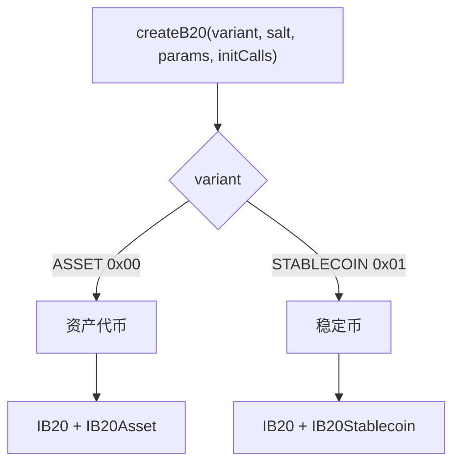
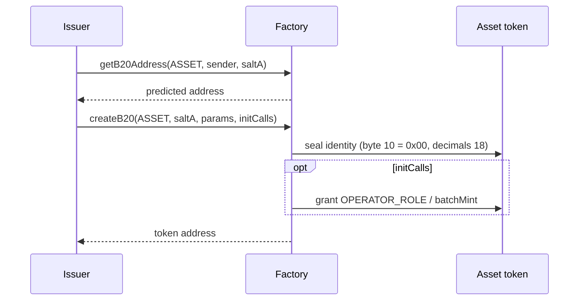
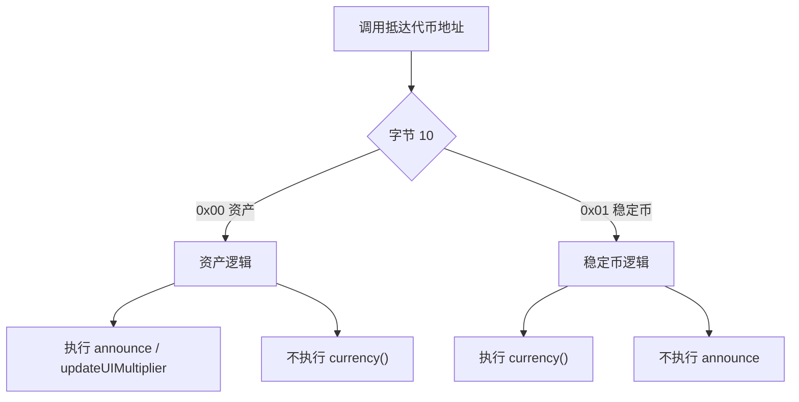

*本文介绍 Asset 和 Stablecoin 分别是什么、`createB20` 如何将类型固化到地址中，以及每种类型在 `IB20` 的基础上新增了哪些功能。角色和策略为各类型所通用，详见[角色与暂停](/zh/specifications/b20/concepts/roles-and-pause)和[策略](/zh/specifications/b20/concepts/policies)。*

## 1. 什么是代币类型 {#1-what-a-token-type-is}

B20 代币类型是在创建代币时选定的变体，其 ABI 名称为 `B20Variant`。目前提供两种变体：

| 变体                         | 地址字节 `[10]` | 代币地址上的接口                  |
| -------------------------- | ----------- | ------------------------- |
| Asset (`ASSET`)            | `0x00`      | `IB20` 和 `IB20Asset`      |
| Stablecoin (`STABLECOIN`)  | `0x01`      | `IB20` 和 `IB20Stablecoin` |

两种变体都实现了 `IB20`，包括 ERC-20、角色、暂停、策略、铸造、销毁和扣押。在此基础上，每种变体各自增加一组互不重叠的功能。类型专属的状态使用独立的 [ERC-7201](https://eips.ethereum.org/EIPS/eip-7201) 命名空间 (`base.b20.asset` 或 `base.b20.stablecoin`) ，因此这些字段既不会与共享的 `base.b20` 存储槽冲突，也不会与另一种类型冲突。

类型只能选择一次。`createB20` 会将其写入代币地址，该调用返回后，类型便无法再更改。



## 2. 为什么有两种变体 {#2-why-there-are-two}

通用代币 (包括 RWA) 与法币锚定代币需要不同的类别定义字段。如果只用一套合并的接口，每个 Asset 都会带上货币代码，每个 Stablecoin 也都会带上公告功能。因此，B20 将接口拆分开来：Asset 提供可配置的小数位数、公告、可定时生效的 UI 乘数、额外元数据以及批量铸造；Stablecoin 则提供不可变的货币代码，并固定采用 `6` 位小数约定。

如果这些额外功能只是同一个二进制实现中的可选标志，类别规则就只能依靠运行时检查，Stablecoin 地址也就有可能执行 Asset 的选择器。为此，B20 将每种变体编译为独立的原生实现。节点读取地址的第 `[10]` 字节，然后运行对应变体的逻辑。Stablecoin 地址绝不会执行 Asset 选择器，Asset 地址也绝不会执行 Stablecoin 选择器。

不过，钱包、索引器和发行方仍然需要统一的 Factory、统一的策略模型和统一的 ERC-20 接口。如果为每种类型各复制一套技术栈，所有集成都会随之割裂。因此，共享的基础设施依然保持共享：Factory、Policy Registry、Activation Registry 以及 `IB20`。只需要余额、转账、角色或策略功能的调用方使用 `IB20` 即可；特定类型的调用则在同一地址上使用 `IB20Asset` 或 `IB20Stablecoin`。

## 3. 类型如何选定 {#3-how-the-type-is-chosen}

发行方只能在调用 Factory 的 `createB20(variant, salt, params, initCalls)` 时选择变体。Factory 会将该选择编码进代币地址：它由 `(variant, sender, salt)` 推导出地址，在字节 `[0]` 处写入 `0xB2`，并在字节 `[10]` 处写入判别值：Asset 为 `0x00`，Stablecoin 为 `0x01`。在创建之前，即可通过 `getB20Address(variant, sender, salt)` 获取该地址。如果该地址已被占用，`createB20` 会回滚并抛出 `TokenAlreadyExists`。调用返回后，类型便无法再更改，因为类型信息就保存在地址本身之中。

`params` 承载代币的身份信息。名称、符号和 `initialAdmin` 为两种变体共用；Asset 额外包含 `decimals`，Stablecoin 额外包含 `currency`。该 blob 采用 ABI 编码，并以一个 `version` 字节开头 (当前为 `1`) ，其后为 `B20AssetCreateParams` 或 `B20StablecoinCreateParams`。可选的 `initCalls` 会在同一笔交易中对新代币执行，随后 Factory 会放弃访问权限。如果该变体尚未激活 (`B20Asset` / `B20Stablecoin`) ，`createB20` 会回滚并抛出 `FeatureNotActivated`。停用某个变体后将无法再创建该类代币，但现有代币仍会继续运行。

创建完成后，节点会读取地址中的变体字节，并执行该变体的逻辑。关于调用方如何检测已上线的代币，请参阅 [`isB20`](/specifications/b20/reference/interfaces/ib20-factory/is-b20) 和 [`isB20Initialized`](/specifications/b20/reference/interfaces/ib20-factory/is-b20-initialized)。

## 4. Asset {#4-asset}

Asset 是通用型变体，涵盖现实世界资产 (RWA) ，但并非 RWA 专用类型。其类型专属接口为 [`IB20Asset`](/specifications/b20/reference/interfaces/ib20-asset)，它在同一地址上扩展了 `IB20`。

创建时须设置不可变的 `decimals`，取值范围为 `[6, 18]`，超出该范围将回滚并返回 `InvalidDecimals`。Asset 没有 `currency()`。

它新增了以下 Asset 专属调用：`announce`，用于发布公司行动披露，附带一次性 `id` 和可选的内部调用；定时执行的 `updateUIMultiplier` / `cancelUIMultiplierUpdate` ([ERC-8056](https://eips.ethereum.org/EIPS/eip-8056)) ；额外元数据键值存储；以及 `batchMint`。`OPERATOR_ROLE` 为 Asset 专属角色，用于管控 `announce` 和乘数更新的权限。名称、符号、合约 URI 和额外元数据仍沿用继承的 `METADATA_ROLE`。

Asset 专属状态存放在 `base.b20.asset` 中，包括 `decimals`、`multiplier`、已使用的公告 ID、额外元数据以及待生效的乘数。共享的 ERC-20、角色、策略和暂停状态仍保留在 `base.b20` 中。

## 5. Stablecoin {#5-stablecoin}

Stablecoin 是锚定法币的变体。

`currency` 为必填项，且不可更改。它只能由大写 ASCII 字母 `A`–`Z` 组成，例如 `"USD"`。代码为空时回滚并抛出 `MissingRequiredField`；包含任何其他字节时回滚并抛出 `InvalidCurrency`。

`decimals` 硬编码为 `6`，发行方无需传入 decimals。

相较于 `IB20`，额外提供的接口只有 `currency()`。Stablecoin 不支持 announce、multiplier、额外元数据、`batchMint` 或 `OPERATOR_ROLE`。

Stablecoin 特有的状态存储在 `base.b20.stablecoin` 中 (仅包含 `currency`) 。共享的 ERC-20、角色、策略和暂停状态仍保存在 `base.b20` 中。

对于 Stablecoin，`B20Created.variantEventParams` 携带经 ABI 编码的 `currency`；对于 Asset，该字段为空。

## 6. 示例 {#6-example}

同一发行方可以同时创建这两种类型。不同的 salt 会生成不同的地址。类型可通过字节 `[10]` 识别。各类型专属的选择器不能跨类型使用。重复使用相同的 `(variant, sender, salt)` 会回滚并抛出 `TokenAlreadyExists`。

### 6.1 创建 Stablecoin {#61-creating-a-stablecoin}

先使用 `getB20Address(STABLECOIN, sender, saltB)` 预测地址，然后传入 `B20StablecoinCreateParams` 调用 `createB20`，参数包括：`version` 设为 `1`、名称、符号、`initialAdmin`，以及 `currency: "USD"`。

```mermaid 1 Creating a Stablecoin Diagram lines wrap expandable highlight={1}
sequenceDiagram
    participant Issuer
    participant Factory
    participant Token as Stablecoin token

    Issuer->>Factory: getB20Address(STABLECOIN, sender, saltB)
    Factory-->>Issuer: predicted address
    Issuer->>Factory: createB20(STABLECOIN, saltB, params, [])
    Factory->>Token: seal identity (byte 10 = 0x01, currency USD, decimals 6)
    Factory-->>Issuer: token address
```

调用返回后，地址字节 `[10]` 为 `0x01`，`decimals()` 为 `6`，`currency()` 为 `"USD"`。其类型专属接口为 [`IB20Stablecoin`](/specifications/b20/reference/interfaces/ib20-stablecoin)。在该地址上调用 `announce` 不会执行 Asset 逻辑。

### 6.2 创建 Asset {#62-creating-an-asset}

先通过 `getB20Address(ASSET, sender, saltA)` 预测地址，然后以 `B20AssetCreateParams` 调用 `createB20`，传入：`version` `1`、名称、符号、`initialAdmin` 以及 `decimals: 18`。还可以通过可选的 `initCalls` 在同一笔交易中授予 `OPERATOR_ROLE` 或调用 `batchMint`。



返回后，地址字节 `[10]` 为 `0x00`，`decimals()` 为 `18`。[`IB20Asset`](/specifications/b20/reference/interfaces/ib20-asset) 的 `announce` 和 `updateUIMultiplier` 已生效。不提供 `currency()`。

### 6.3 后续调用 {#63-a-later-call}

后续调用该代币地址时，不会再次选择类型。节点会读取字节 `[10]`，并执行对应变体的逻辑。

