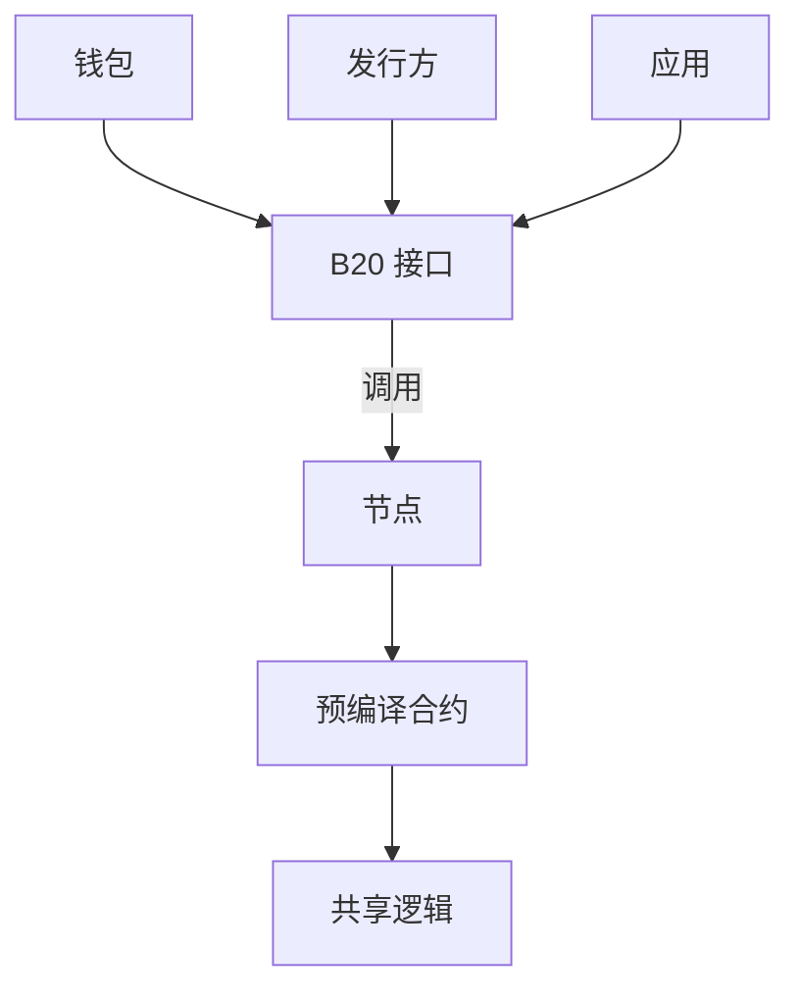
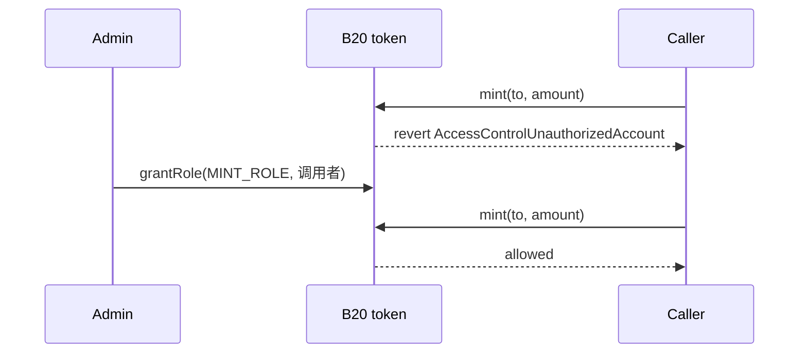
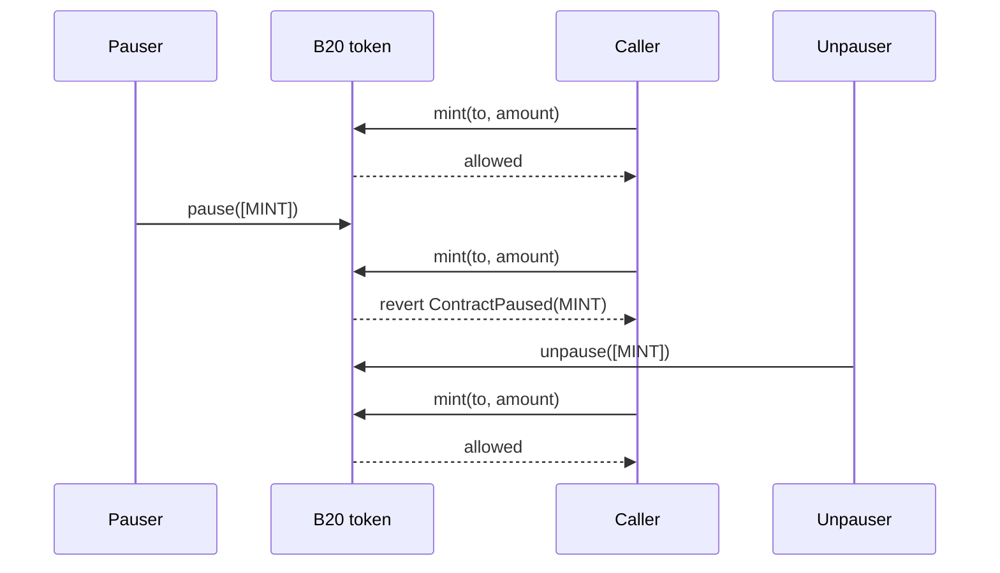

B20 是 Base 的原生代币标准，用于在链上发行和管理可编程资产。

本文档从宏观层面介绍 B20：它是什么、为何而生、提供了哪些核心基础组件，以及这些组件如何协同运作。

## 概念 {#concepts}

<CardGroup cols={2}>
  <Card title="代币类型" icon="coins" href="/zh/specifications/b20/concepts/token-types">
    比较 Asset 和 Stablecoin 两种变体及其各自的功能。
  </Card>

  <Card title="策略" icon="shield-check" href="/zh/specifications/b20/concepts/policies">
    配置允许列表、阻止列表、组合策略以及策略作用域。
  </Card>

  <Card title="角色与暂停" icon="user-lock" href="/zh/specifications/b20/concepts/roles-and-pause">
    分配操作权限，并单独暂停特定的代币功能。
  </Card>

  <Card title="UI 乘数" icon="chart-column" href="/zh/specifications/b20/concepts/multipliers">
    了解 Asset 乘数的运作方式以及 ERC-8056 UI 余额。
  </Card>
</CardGroup>

## 在 Base 上构建 {#build-on-base}

通过以下&quot;在 Base 上构建&quot;演示，了解如何创建和管理 B20 代币。

<CardGroup cols={2}>
  <Card title="创建资产代币" icon="building-columns" href="/zh/build-on-base/issue-rwa/create-an-asset-token">
    通过确定性工厂部署创建 B20 Asset 代币。
  </Card>

  <Card title="发行稳定币" icon="coins" href="/zh/build-on-base/issue-stablecoins/issue-your-stablecoin">
    创建货币代码不可变的 B20 Stablecoin。
  </Card>

  <Card title="限制合格持有人" icon="user-check" href="/zh/build-on-base/issue-rwa/restrict-eligible-holders">
    应用策略，仅允许合格账户持有资产。
  </Card>

  <Card title="应用乘数" icon="chart-column" href="/zh/build-on-base/issue-rwa/apply-a-multiplier">
    针对公司行为安排或应用 Asset UI 乘数。
  </Card>
</CardGroup>

## 参考 {#reference}

有关技术细节，请参阅 [B20 接口](/zh/specifications/b20/reference/interfaces)和 [B20 常量](/zh/specifications/b20/reference/constants)。

<CardGroup cols={2}>
  <Card title="接口" icon="file-contract" href="/zh/specifications/b20/reference/interfaces">
    浏览 B20 接口、标准 Solidity 源码以及可直接复制使用的导入语句。
  </Card>

  <Card title="常量" icon="table" href="/zh/specifications/b20/reference/constants">
    查找预编译合约地址、角色标识符、策略作用域和校验范围。
  </Card>

  <Card title="错误" icon="bug" href="/zh/specifications/b20/reference/errors">
    查看自定义错误、选择器及其触发条件。
  </Card>

  <Card title="事件" icon="bolt" href="/zh/specifications/b20/reference/events">
    查看 B20 事件，以及各接口在何时触发这些事件。
  </Card>
</CardGroup>

## 更新日志 {#changelog}

<Card title="更新日志" href="/zh/specifications/b20/changelog">
  查看 B20 的历次更新与协议变更。
</Card>

***

## 什么是 B20？ {#what-is-b20}

B20 是 Base 的原生代币标准，用于在链上发行和管理可编程资产。Base 推出该标准，旨在统一现实世界资产 (RWA) 和稳定币的发行方式。B20 是 ERC-20 的超集：余额、转账和授权的工作方式与 ERC-20 一致，并且所有 B20 资产共享同一套附加接口和协议逻辑，发行方无需各自部署自定义的代币实现。

该标准还内置了合规与管理控制功能。发行方可以配置角色和权限、附加策略、铸造和销毁代币供应、暂停操作，以及执行受监管资产业务流程通常所需的其他管理操作。

B20 以预编译合约的形式运行在 Base 节点中，而不是为每个代币单独编写 Solidity 合约。钱包、发行方和应用调用 ERC-20 风格的接口，由节点原生运行共享的 B20 逻辑。Base 通过硬分叉升级该逻辑，因此所有调用方在全部 B20 资产上都能获得一致的行为和原生执行。

### 概览 {#at-a-glance}



调用 B20 资产的方式与调用其他任何合约并无二致：通过该资产地址上的接口进行调用。所有 B20 资产都使用同一套接口和同一套预编译逻辑，因此集成方只需依赖唯一的可信来源。

***

## 为什么选择 B20？ {#why-b20}

在链上发行现实世界资产 (RWA) ，需要一个将合规能力内置于资产本身的通用代币标准。ERC-20 涵盖余额、转账和授权，但受监管资产还需要资格校验、角色、铸造与销毁、暂停以及其他管理控制功能。几乎每发行一种代币化资产，发行方都要把这些基础组件重新构建一遍。

发行方若自行实现这一整套功能，就会重复编写相同的逻辑，各自的行为也会出现差异，迫使每个钱包和应用都去集成定制代币。B20 提供了另一种选择：你只需创建一个 B20 资产并配置其角色和策略，无需编写和维护一次性的代币。在 B20 中，合规是一等基础组件，而不是由各个发行方围绕转账自行设计的附加功能。

统一的标准对集成方和发行方同样有利。钱包和应用只需对接一个接口；发行方可以直接使用预言机等共享服务，无需为每种资产单独设计集成方案。

***

## 创建 B20 Asset {#creating-a-b20-asset}

所有 B20 代币都通过 Factory (一个单例预编译合约) 创建。向 Base 节点提交 `createB20` 的方式与提交其他任何合约调用完全相同。

```mermaid Creating a B20 Asset Diagram lines wrap expandable highlight={1}
sequenceDiagram
    participant Issuer
    participant Factory
    participant Token as B20 token

    Issuer->>Factory: createB20(variant, salt, params, initCalls)
    Factory->>Token: seal identity
    Factory->>Token: initCalls (grantRole, updatePolicy, mint)
    Factory-->>Issuer: token address
```

1. 发行方调用 `createB20`，传入变体类型、盐值以及创建参数 (名称、符号、初始管理员及变体特有字段) 。
2. Factory 根据 `(variant, sender, salt)` 分配一个确定性地址，并固化该代币的身份信息。
3. 可选的 `initCalls` 会在新代币上执行，使发行方能够在同一笔交易中授予角色、绑定策略或铸造代币。
4. `createB20` 返回。此后 Factory 不再保留对该代币的任何访问权限。

通用发行 (包括 RWA) 请选择 **Asset**；如需发行具有固定货币代码的法币锚定代币，请选择 **Stablecoin**。两种变体共享角色、策略以及 ERC-20 接口。请参阅[代币类型](/zh/specifications/b20/concepts/token-types)。

Activation Registry 是由 Base 运营的安全开关，用于启用 Factory 和代币功能。发行方和应用不负责操作它。

***

## 配置角色 {#configuring-roles}

借助角色，发行方可以将每项特权操作分配给特定账户。管理员可以将铸造权限授予铸造者，将扣押权限授予合规操作员，也可以将某一项功能 (`TRANSFER`、`MINT`、`BURN` 或 `SEIZE`) 的暂停权限单独授出，而无需暂停代币的其余功能。

B20 在代币合约上通过 [OpenZeppelin AccessControl](https://docs.openzeppelin.com/contracts/5.x/access-control) 实现这一机制，角色并不存放在独立的注册表中。`DEFAULT_ADMIN_ROLE` 持有者负责授予和撤销各项操作角色。特权调用会先检查角色，再检查对应的暂停向量。持有者调用 `transfer` 时会跳过角色检查，但仍受 `TRANSFER` 暂停向量和策略的约束。

完整的角色列表及各角色管控的操作，请参阅[角色与暂停](/zh/specifications/b20/concepts/roles-and-pause)。受角色管控的调用示例如下：



1. 创建时，`initialAdmin` 持有 `DEFAULT_ADMIN_ROLE`。
2. 该管理员负责授予 `MINT_ROLE`、`PAUSE_ROLE` 等操作角色。
3. 若调用者不具备所需角色，调用将被拒绝，并返回 `AccessControlUnauthorizedAccount` 错误。

***

## 暂停向量 {#pause-vectors}

暂停向量用于停止代币上的某一类操作，而不影响该资产的其他功能。当链下工作流需要冻结某项功能时 (例如在结算窗口期内) ，或发现漏洞、必须立即切断相关路径时，发行方即可使用暂停向量。

暂停按功能生效，而非全局生效。四个暂停向量分别为 `TRANSFER`、`MINT`、`BURN` 和 `SEIZE`。暂停 `MINT` 会停止新的发行，但转账仍可正常进行。`approve` 不受暂停控制。

`pause` 需要 `PAUSE_ROLE`，`unpause` 需要 `UNPAUSE_ROLE`。这两个角色相互独立，因此执行暂停的账户与执行恢复的账户可以不同。

被暂停的调用如下所示：



1. 在 `MINT` 未暂停时，持有 `MINT_ROLE` 的调用者可以执行铸造。
2. 拥有 `PAUSE_ROLE` 的账户暂停 `MINT`，其他功能仍正常运行。
3. 此后的 `mint` 调用将回滚并抛出 `ContractPaused(MINT)`，即使调用者仍持有 `MINT_ROLE` 也不例外。
4. 拥有 `UNPAUSE_ROLE` 的账户解除 `MINT` 的暂停，铸造功能随即恢复。

***

## 集成合规检查 {#integrating-compliance-checks}

大多数合规检查都可以归结为一组地址，外加针对某个特定函数的允许或拒绝决策。B20 采用的正是这一模型，而不是为每个代币单独设置钩子：你维护一个允许列表或阻止列表，将其绑定到代币的某个函数上，调用便会据此执行或回滚。

这些列表并不存放在代币上，而是存放在 Policy Registry 中。Policy Registry 是一个全局单例预编译合约，允许列表、阻止列表以及组合策略 (并集或交集) 都存储在这里，并通过策略 ID 引用。由于注册表是共享的，一个列表可以同时为多个代币提供支持：成员名单只需维护一次，所有关联的代币都会得到相同的结果。

代币管理员通过 `updatePolicy` 将策略 ID 绑定到某个策略作用域。作用域的角色与钩子类似：它作用于特定函数。该函数执行时，代币会向注册表查询 `isAuthorized(policyId, account)`，若检查未通过，则以 `PolicyForbids` 回滚。各作用域分别作用于哪个函数，请参阅 [Policies](/zh/specifications/b20/concepts/policies)。

受策略管控的转账如下所示：

```mermaid Integrating Compliance Checks Diagram lines wrap expandable highlight={1}
sequenceDiagram
    participant Admin
    participant Registry as Policy Registry
    participant Token as B20 token
    participant Alice

    Admin->>Registry: createPolicy(允许列表)
    Admin->>Token: updatePolicy(TRANSFER_RECEIVER_POLICY, id)
    Alice->>Token: transfer(Bob)
    Token->>Registry: isAuthorized(id, Bob)
    Registry-->>Token: false
    Token-->>Alice: revert PolicyForbids

    Admin->>Registry: updateAllowlist(Bob)
    Alice->>Token: transfer(Bob)
    Token->>Registry: isAuthorized(id, Bob)
    Registry-->>Token: true
    Token-->>Alice: allowed
```

1. 在注册表上创建允许列表或阻止列表。
2. 代币管理员将该策略 ID 绑定到某个作用域。
3. 执行 `transfer` 时，代币会向注册表查询接收方是否已获授权。
4. 已授权：调用继续执行。被拒绝：调用回滚，并抛出 `PolicyForbids` 错误。
5. 未设置的作用域默认始终放行。`approve` 不受策略管控。