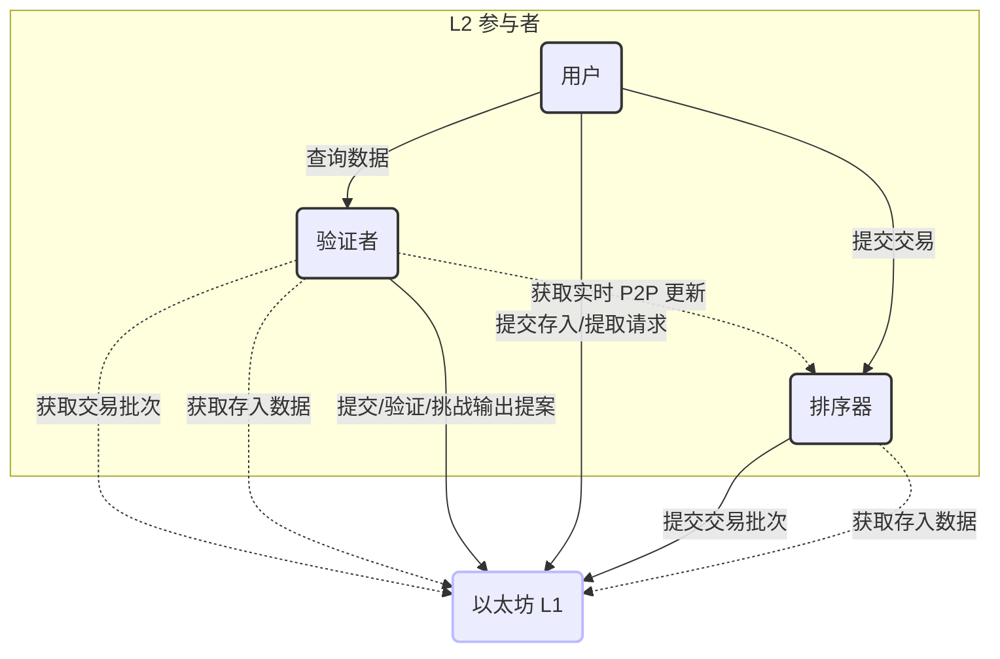
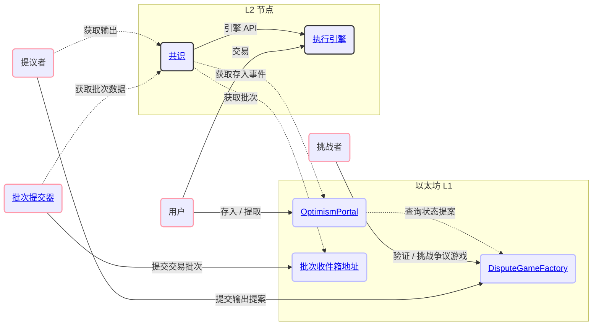
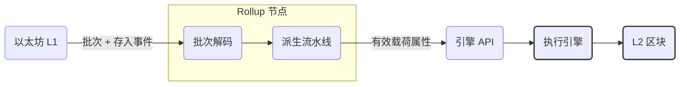
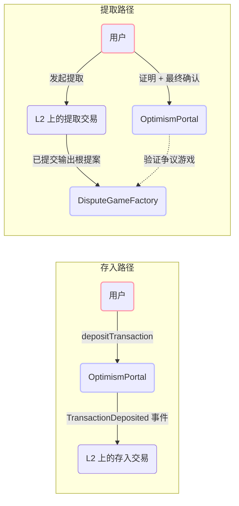
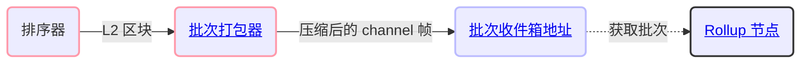
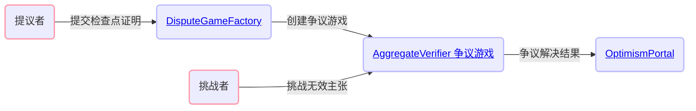
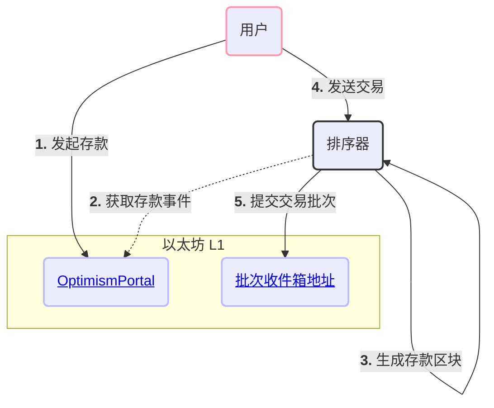
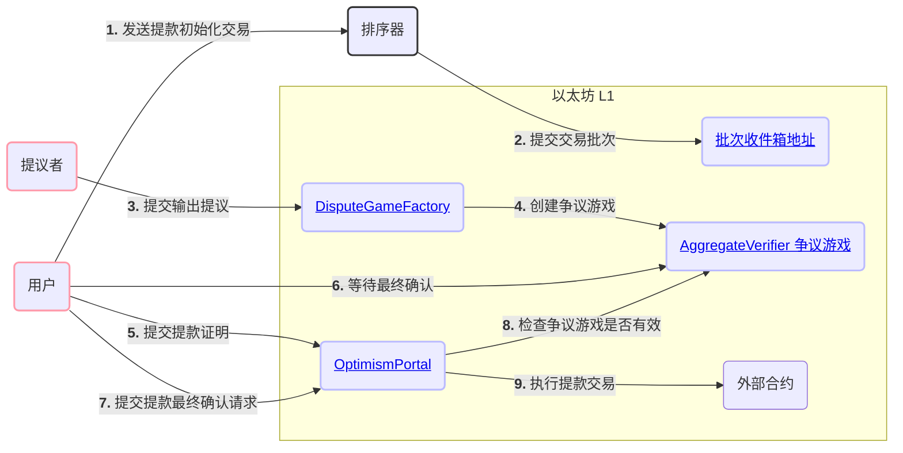

Base 是构建在以太坊之上的 rollup。L2 交易数据会发布到以太坊上以确保数据可用性，
而借助证明机制，任何人都可以对无效的状态转换发起挑战。本页将从宏观层面介绍
协议的各个组件以及核心用户流程。

## 网络参与者 {#network-participants}

与 Base 交互的主要参与者有三类：用户、排序器 (sequencer) 和验证者。

### 用户 {#users}

用户是泛指的一类网络参与者，他们：

* 通过排序器提交交易，或通过与 Ethereum 上的合约交互来提交交易。
* 通过验证者运营的接口查询交易数据。

### 排序器 (Sequencer) {#sequencers}

排序器在 Base 上承担区块生产者的角色。Base 目前只运行一个活跃的排序器。

排序器负责：

* 直接接收来自用户的交易。
* 监听在 Ethereum 上生成的“存入”交易。
* 将这两类交易流整合为有序的 L2 区块。
* 向 L1 提交足以完整重现这些 L2 区块的信息。
* 实时提供尚未在 L1 上确认的待处理 (pending) L2 区块。
* 每 200ms 生成一个 Flashblock，在区块构建过程中即对区块内的交易顺序作出承诺。

排序器对 L2 链的运行至关重要，但它并不是受信任的参与方。排序器的主要作用是改善用户体验：它对交易进行排序的速度和成本
都远优于用户将所有交易直接提交到 L1 的方式，而后者在目前
也无法达到这样的效果。

### 验证者 (Validators) {#validators}

验证者独立于排序器 (Sequencer) 执行 L2 状态转换函数。验证者有助于维护网络的完整性，并向用户提供区块链数据。

验证者通常会：

* 从 L1 和排序器同步 rollup 数据。
* 使用 rollup 数据执行 L2 状态转换函数。
* 向用户提供 rollup 数据以及计算所得的 L2 状态信息。

验证者还可以兼任提议者 (Proposer) 和/或挑战者 (Challenger) ，负责：

* 向 L1 上的智能合约提交关于 L2 状态的断言。
* 验证其他参与者提出的断言。
* 对其他参与者提出的无效断言发起争议。

## 系统总体架构图 {#high-level-system-diagram}

下图展示了各主要协议组件如何跨 L1 和 L2 进行交互。

## 协议组件 {#protocol-components}

### 共识 {#consensus}

共识组件负责从 L1 数据推导出规范 L2 链。它从 Batch Inbox 读取交易批次，
从 OptimismPortal 读取充值事件，构建 payload attributes，并通过 Engine API 驱动
执行引擎。不安全 (未确认) 区块会通过专用 P2P 网络以 gossip 方式广播给其他节点，
使验证者在批次提交到 L1 之前就能以低延迟获取这些区块。

[共识 →](/zh/specifications/base-protocol/consensus/specification)

### 执行 {#execution}

执行引擎是一个基于 Reth 的运行时。它对外提供标准的以太坊 JSON-RPC API，并
处理共识层生成的区块。预部署合约 (部署在固定 L2 地址上的系统合约) 、预编译合约
和预安装合约对 EVM 进行了扩展，以支持 rollup 特有的功能，例如费用分配、L1 区块属性
注入以及跨域消息传递。

[执行 →](/zh/specifications/base-protocol/execution/l2-execution-engine)

### 跨链桥接 {#bridging}

存入从 L1 上的 `OptimismPortal` 合约进入 L2，以特殊存入交易的形式被纳入每个 L2 区块的开头。提款则方向相反：先在 L2 上发起提款交易，再由提议者 (proposer) 向 `DisputeGameFactory` 提交 output root；挑战期结束后，用户通过 `OptimismPortal` 在 L1 上证明并最终完成提款。

[跨链桥接 →](/zh/specifications/base-protocol/bridging/deposits)

### 批次提交器 {#batcher}

批次提交器是由排序器运行的一项服务，负责将 L2 交易数据压缩为 channel frame，并以 calldata (或 blob) 的形式
发布到 L1 上的 Batch Inbox Address。这一机制构成了数据可用性层，使任何验证者都能
仅凭 L1 数据独立重建 L2 链。

[批次提交器 →](/zh/specifications/base-protocol/batcher)

### 证明 {#proofs}

输出提案和证明用于验证 L2 状态。提议者通过 `DisputeGameFactory` 创建检查点博弈，证明材料由链上验证合约进行校验，
挑战者则可以对无效声明提出质疑。只有在相关博弈以有利于提议者的结果裁决后，
有效的提款才能通过 `OptimismPortal` 完成最终确认。

[证明 →](/zh/specifications/base-protocol/proofs/overview)

## 核心用户流程 {#core-user-flows}

### 将 ETH 存入 Base {#depositing-eth-to-base}

用户通常会先从 L1 存入 ETH，以此开启 L2 之旅。
有了可用于支付费用的 ETH 后，他们便会开始在 L2 上发送交易。
下图展示了这一交互流程以及其中涉及的 Base 协议关键组件。

### 在 Base 上发送交易 {#sending-transactions-on-base}

在 Base 上发送交易与在 Ethereum 上完全相同。用户对交易签名后，通过
`eth_sendRawTransaction` 将其提交到任意节点的 JSON-RPC 端点。排序器从其 mempool 中取出这些交易，
对其排序并打包成 L2 区块，最终将批次发布到 L1。

### 从 Base 提款 {#withdrawing-from-base}

用户也可能需要将 ETH 或 ERC20 代币从 Base 提回 Ethereum。提款先在 L2 上以标准交易的形式发起，
再通过 L1 上的交易完成。提款必须引用一个有效的
证明博弈合约，该合约负责提议 L2 在某一时间点的状态。

