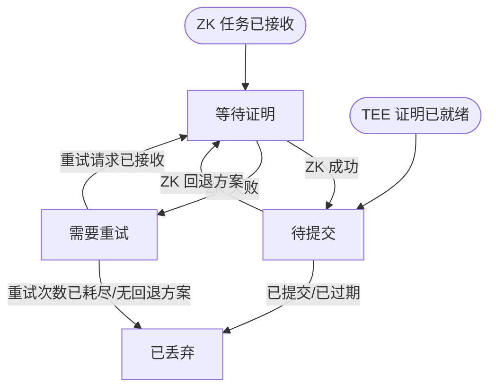

挑战者是一种链下服务，它根据规范 L2 状态独立检查进行中的 `AggregateVerifier` 游戏，以此保护证明系统。一旦发现无效的
检查点根，它会获取游戏合约所需的证明材料，并在 L1 上提交争议
交易。

在 ZK 路径中，挑战者无需许可：任何运营者只要能够访问规范 L1 和 L2
RPC、ZK 证明服务以及 L1 交易签名器，即可运行挑战者。Base 也可能运行一个可访问 TEE 证明端点的挑战者，
以便在回退到 ZK 之前，先通过更快的路径使由 TEE 支撑的无效游戏作废。

## 职责 {#responsibilities}

符合规范的挑战者需执行以下工作：

1. 扫描近期的 `DisputeGameFactory` 游戏。
2. 筛选出仍处于 `IN_PROGRESS` 状态、且证明状态可能需要处理的游戏。
3. 通过 L2 节点重新计算相关检查点的 output root。
4. 找出第一个无效的检查点根，或判断某个 ZK 挑战针对的是否为有效
   检查点。
5. 为需要证明的检查点区间获取 TEE 或 ZK 证明。
6. 向游戏合约提交 `nullify()` 或 `challenge()`。
7. 若配置为领取保证金，则跟踪由此产生的保证金生命周期。

挑战者不会依赖对游戏的信任来确定规范的 L2 状态。它会根据
L2 区块头和账户证明重新计算根，并将游戏视为有待校验的输入。

## 游戏选择 {#game-selection}

挑战者读取当前的 `AnchorStateRegistry.anchorGame()`，在工厂索引数组中定位该游戏，并扫描其后的每一个工厂索引。如果注册表仍处于初始锚点，或者在工厂中找不到锚点游戏，则从索引 `0` 开始扫描。一旦观察到游戏处于 `IN_PROGRESS` 状态，就会持续跟踪，直到其结算或被完全作废，因此指标反映的是锚点之后的实时游戏集合。每次扫描都会重新评估锚点之后的完整范围，因此随着新的证明、挑战或作废操作发布到链上，游戏可能在不同类别之间转换。单个游戏的查询失败会被记录，并在下一次扫描时重试，不会中止整个扫描。

只有当 `status() == IN_PROGRESS` 时，游戏才会被选中。随后挑战者读取：

* `teeProver()`
* `zkProver()`
* `counteredByIntermediateRootIndexPlusOne()`
* `rootClaim()`
* `l2SequenceNumber()`
* `startingBlockNumber()`
* `l1Head()`
* 从该游戏类型对应的游戏实现中读取 `INTERMEDIATE_BLOCK_INTERVAL()`

`(teeProver, zkProver, countered index)` 元组决定候选类别。

| TEE 证明者 | ZK 证明者 | 被挑战索引 | 类别         | 挑战者操作                                             |
| ------- | ------ | ----- | ---------- | ------------------------------------------------- |
| 非零      | 零      | `0`   | 无效的 TEE 提案 | 验证所有检查点根。若无效，优先执行 TEE 作废，失败时回退到 ZK `challenge()`。 |
| 非零      | 非零     | `> 0` | 欺诈性 ZK 挑战  | 仅验证被挑战的检查点。若被挑战的根正确，则提交 ZK `nullify()`。           |
| 零       | 非零     | `0`   | 无效的 ZK 提案  | 验证所有检查点根。若无效，则提交 ZK `nullify()`。                  |
| 非零      | 非零     | `0`   | 无效的双重提案    | 验证所有检查点根。若无效，先作废 TEE 证明，再重新扫描以处理剩余的 ZK 证明。        |

两个证明者地址均为零的游戏已被完全作废，将被跳过。仅含 TEE 或仅含 ZK 证明、且被挑战索引非零的游戏属于意外状态，同样会被跳过。

## output root (Output Root) 验证 {#output-root-validation}

对于未被挑战的提案，挑战者会验证所提交的中间根。对于索引
`i`，其检查点区块为：

```text Checkpoint Block Formula
startingBlockNumber + INTERMEDIATE_BLOCK_INTERVAL * (i + 1)
```

所提交根的数量必须等于：

```text Submitted Root Count
(l2SequenceNumber - startingBlockNumber) / INTERMEDIATE_BLOCK_INTERVAL
```

间隔必须为非零值，且起始区块必须小于所提议的 L2 序列
号。若出现算术溢出或检查点数量不匹配，该扫描周期的验证即告失败。

对于每个检查点区块，挑战者按以下步骤计算预期的 output root：

1. 按区块号获取 L2 区块 header。
2. 验证 RPC 返回的 header 哈希与根据共识 header 计算出的哈希一致。
3. 基于该区块哈希，通过 `eth_getProof` 获取 `L2ToL1MessagePasser` 的账户证明。
4. 使用 header 中的状态根验证该账户证明。
5. 由 L2 状态根、`L2ToL1MessagePasser` 存储根和 L2 区块
   哈希构建 output root。
6. 将计算得到的根与游戏中存储的根进行比较。

中间根以并发方式验证，但结果按检查点顺序处理。
首个不匹配项决定了争议交易中使用的 `intermediateRootIndex` 和 `intermediateRootToProve`。`intermediateRootToProve` 是针对该无效
检查点在本地计算出的正确根。

若所请求的 L2 区块尚不可用，挑战者会在该扫描周期跳过此游戏。
该游戏仍具备处理资格，将在下一次扫描时重试。

## 欺诈性 ZK 挑战验证 {#fraudulent-zk-challenge-validation}

当某个 TEE 提案受到 ZK 证明挑战时，游戏合约会存储一个从 1 开始计数的被反驳索引 (countered index) 。
挑战者会将其转换为从 0 开始计数的检查点索引，并且仅验证该检查点。

如果被挑战索引处的链上根与本地计算出的根不一致，则说明该 ZK
挑战是合法的，挑战者无需采取任何行动。如果链上根与本地
根一致，则说明该 ZK 挑战针对的是一个正确的检查点，属于欺诈性挑战。此时，挑战者会获取该检查点区间的
ZK 证明，并提交 `nullify()`。

此验证被有意限定在被挑战的索引范围内。即使之前存在无效根，针对之后某个有效根发起的
挑战也不会因此变得合法。

## 证明获取 {#proof-sourcing}

挑战者只需证明包含无效检查点的那个区间。可信锚点是
前一个检查点根；若无效检查点的索引为 `0`，则可信锚点为游戏的 `startingBlockNumber` 状态。

对于 ZK 证明请求：

* `start_block_number` 是无效检查点区间的起始区块。
* `number_of_blocks_to_prove` 为 `INTERMEDIATE_BLOCK_INTERVAL`。
* `proof_type` 为 Groth16 SNARK。
* `session_id` 由 `(game address, invalid checkpoint index)` 确定性地生成。
* `prover_address` 是将要提交该交易的 L1 地址。
* `l1_head` 是游戏创建时存储在游戏中的 L1 头部哈希。

由于会话 ID 是确定性的，证明请求在多次重试时具有幂等性。

如果配置了 TEE 证明获取，且游戏设有 TEE 证明者，那么对于无效的 TEE 提案和无效的双重提案，挑战者会优先尝试 TEE
路径。TEE 请求使用游戏的 `l1Head`、对应的 L1 区块号、本地计算出的区间起点处已商定的 L2 输出，
以及无效检查点处的预期 output root。只有当 enclave 输出的 output root 与本地计算的预期根一致时，挑战者才会接受 TEE 结果，并随后为 `nullify()` 编码 TEE 争议
证明字节。

如果 TEE 请求失败或超时，挑战者会回退到 ZK。如果已获得 TEE 证明，
但 TEE `nullify()` 交易失败，该待处理条目会转为 ZK 证明请求，
而不是无限期地重试同一笔 TEE 交易。

## 争议交易 {#dispute-transactions}

挑战者会提交以下两种游戏调用之一：

| 意图        | 合约调用                                                                    | 适用场景                                    |
| --------- | ----------------------------------------------------------------------- | --------------------------------------- |
| Nullify   | `nullify(proofBytes, intermediateRootIndex, intermediateRootToProve)`   | 移除无效的 TEE 证明、移除无效的 ZK 证明，或驳回欺诈性的 ZK 挑战。 |
| Challenge | `challenge(proofBytes, intermediateRootIndex, intermediateRootToProve)` | 使用 ZK 证明挑战无效的 TEE 提案。                   |

TEE 证明始终调用 `nullify()`。ZK 证明则视候选类别而定，调用 `challenge()` 或 `nullify()`。

在提交证明或重试失败的证明之前，挑战者会重新检查游戏状态和证明者槽位。如果游戏已经结算、已被挑战，或目标证明者槽位已被清零，则丢弃该待提交的证明。这样，当其他参与者已处理该游戏时，就不会产生重复交易。

## 待处理证明的生命周期 {#pending-proof-lifecycle}

每个待处理证明以争议游戏地址为键，并记录以下信息：

* 证明类型：TEE 或 ZK
* 无效检查点索引
* 该检查点的预期根
* 争议意图
* 重试次数
* 阶段

阶段状态机如下：



挑战者会从证明服务轮询 ZK 证明，直到任务成功、失败或仍处于待处理状态。
成功的 ZK 收据在提交前会加上 ZK 证明类型字节作为前缀。失败的证明任务
最多重试三次。TEE 证明在获取后会立即进入 `ReadyToSubmit` 状态；
如果其交易失败，且存在预先构建的 ZK 回退证明，挑战者会立即请求该回退证明。
如果不存在回退请求，则丢弃该条目；如果回退的 `prove_block`
调用失败，该条目将保持在 `NeedsRetry` 状态，直到下一个 tick。无论是证明仍处于待处理状态、
ZK 交易失败，还是 `prove_block` 重试失败，证明都会停留在当前阶段，直到
下一个 tick。对于处于待处理状态的证明，挑战者在该 tick 内不会对相应的游戏执行任何合约读取。

## 保证金领取 {#bond-claiming}

保证金领取是可选功能，需通过配置领取地址来启用。启用后，挑战者
会跟踪 `bondRecipient()` 或解决前的 `zkProver()` 与上述任一地址匹配的游戏。
这样，挑战者在重启后仍能恢复可领取的游戏，还能发现由
其他参与者处理的游戏。

保证金的生命周期如下：

1. `NeedsResolve`：等待 `gameOver()`，然后提交 `resolve()`。
2. `NeedsUnlock`：提交第一次 `claimCredit()`，以解锁 `DelayedWETH` 额度。
3. `AwaitingDelay`：等待 `DelayedWETH` 延迟期结束。
4. `NeedsWithdraw`：提交第二次 `claimCredit()`，以提取该额度。

游戏解决后，挑战者会重新读取 `bondRecipient()`；如果该保证金
已无法由任何已配置地址领取，则停止跟踪该游戏。对于解决结果为 `DEFENDER_WINS` 的游戏，它还会
尽力尝试调用 `AnchorStateRegistry.setAnchorState(game)` 进行更新。该注册表调用
无需许可，且会自行校验；过早或不符合条件的调用可能会回滚，之后可重试。

## 服务生命周期 {#service-lifecycle}

启动时，挑战者会依次执行以下操作：

1. 创建 L1 和 L2 RPC 客户端。
2. 使用配置的签名器创建 L1 交易管理器。
3. 创建 `DisputeGameFactory` 和 `AggregateVerifier` 客户端。
4. 创建 ZK 证明客户端，以及可选的 TEE 证明客户端。
5. 启动健康检查服务器。
6. 启动驱动循环。

在每个驱动周期 (tick) 中：

1. 轮询待处理的证明会话，并提交已就绪的争议。
2. 发现可领取的保证金，并推进已跟踪的保证金领取流程。
3. 扫描进行中的候选游戏。
4. 验证新的候选游戏并为其发起证明。

健康检查端点只有在驱动步骤首次成功执行后才会报告就绪。关闭流程由
取消令牌 (cancellation token) 触发，从而确保驱动程序与健康检查服务器同时停止。

## 运营方输入 {#operator-inputs}

挑战者需要：

* L1 RPC 端点。
* L2 执行层 RPC 端点。
* `DisputeGameFactory` 地址。
* `AnchorStateRegistry` 地址。
* ZK 证明 RPC 端点。
* L1 交易签名器。
* 轮询间隔。

可选输入：

* TEE 证明 RPC 端点及超时时间：配置后，对由 TEE 支持的争议游戏启用 TEE 优先的无效化机制。
* 保证金领取地址、保证金发现间隔及保证金发现回溯窗口：配置后，启用
  保证金的自动回收与领取。
* 指标及健康检查服务器设置。

## 安全要求 {#safety-requirements}

挑战者实现必须保证以下安全属性：

* 不得仅凭游戏自身声明的根就对游戏发起争议；应根据 L2 区块头和
  经过验证的 `L2ToL1MessagePasser` 账户证明重新计算根。
* 请求争议证明时，应使用游戏中存储的 L1 头，确保证明日志与链上
  已验证的游戏上下文一致。
* 对于欺诈性 ZK 挑战，应验证被挑战的检查点本身，而非整个提案中第一个
  无效的检查点。
* 提交已就绪的证明前，应重新检查游戏状态，因为其他挑战者或证明者可能
  已经改变了游戏状态。
* 应将 L2 区块不可用和临时性 RPC 故障视为可重试的扫描状态，而非
  最终的验证结果。