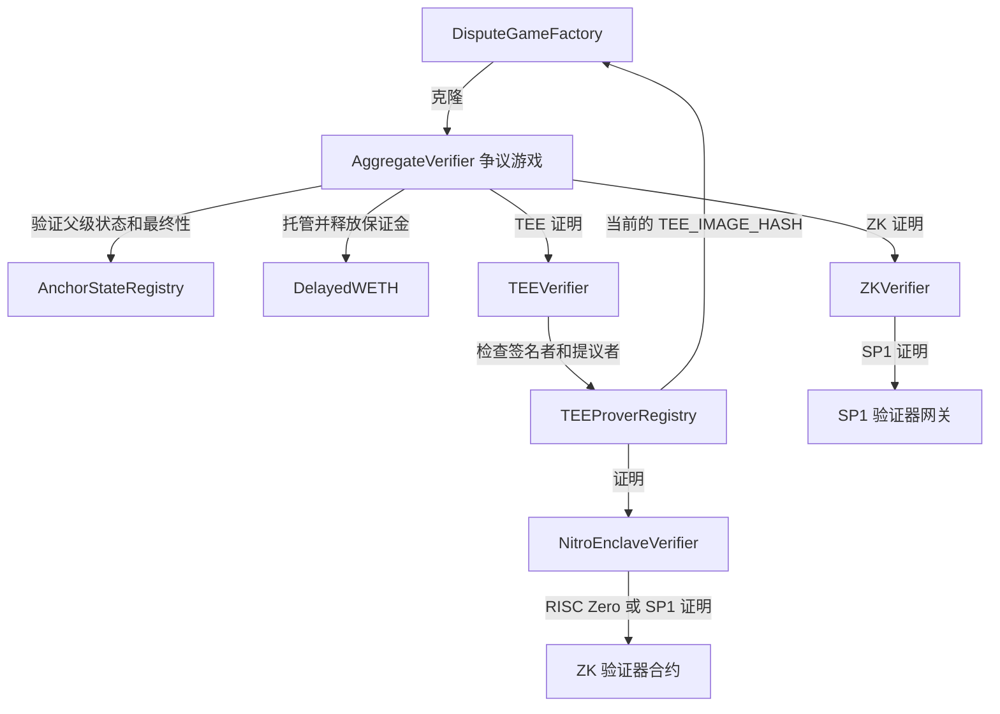

证明合约将链下证明材料转化为链上检查点博弈。每个博弈针对固定的区块区间声明一个
L2 output root。合约会验证初始证明，接受可选的第二个证明，允许对无效的证明材料发起挑战或将其作废，在相应的延迟期满后裁决博弈，
推进锚定状态，并退还初始化保证金。

本页规定了证明系统所用合约的行为，涉及以下合约：

* `AnchorStateRegistry`
* `DelayedWETH`
* `DisputeGameFactory`
* `AggregateVerifier`
* `ZKVerifier`
* `TEEVerifier`
* `TEEProverRegistry`
* `NitroEnclaveVerifier`

## 合约关系图 {#contract-graph}



`DisputeGameFactory`、`AnchorStateRegistry` 和 `DelayedWETH` 是通过代理部署的系统合约。
`AggregateVerifier` 以实现合约的形式部署，由工厂合约附带不可变参数进行克隆。`TEEVerifier`、`ZKVerifier`、`TEEProverRegistry` 和 `NitroEnclaveVerifier`
是独立的验证器合约和注册表合约，供争议游戏实现合约引用。

## 数据模型 {#data-model}

这些合约使用相同的争议游戏类型：

| 类型           | 含义                                                              |
| ------------ | --------------------------------------------------------------- |
| `GameType`   | 标识争议游戏实现的 `uint32` 标识符。                                         |
| `Claim`      | 32 字节的根声明。在本证明系统中，它是一个 L2 output root。                          |
| `Hash`       | 32 字节哈希的包装类型。                                                   |
| `Timestamp`  | `uint64` 时间戳的包装类型。                                              |
| `Proposal`   | `(root, l2SequenceNumber)`，其中 `l2SequenceNumber` 是该根对应的 L2 区块号。 |
| `GameStatus` | `IN_PROGRESS`、`CHALLENGER_WINS` 或 `DEFENDER_WINS`。              |
| `ProofType`  | `AggregateVerifier` 中的 `TEE` 或 `ZK`。                            |

`AggregateVerifier` 游戏使用两种区块间隔：

```text Block Intervals
BLOCK_INTERVAL
INTERMEDIATE_BLOCK_INTERVAL
```

`BLOCK_INTERVAL` 是父 output root 与所提议的 output root 之间的距离。
`INTERMEDIATE_BLOCK_INTERVAL` 是该范围内相邻中间根之间的间隔。
`BLOCK_INTERVAL` 和 `INTERMEDIATE_BLOCK_INTERVAL` 必须为非零值，且 `BLOCK_INTERVAL` 必须能被
`INTERMEDIATE_BLOCK_INTERVAL` 整除。

每个博弈中的中间根数量为：

```text Intermediate Root Count
BLOCK_INTERVAL / INTERMEDIATE_BLOCK_INTERVAL
```

最后一个中间根必须等于该博弈的 `rootClaim`。

## 游戏生命周期 {#game-lifecycle}

1. 工厂所有者为某个游戏类型配置 `AggregateVerifier` 实现和
   初始化保证金。
2. TEE 运营者借助经 ZK 验证的 Nitro
   证明，在 `TEEProverRegistry` 中注册 enclave 签名者地址。
3. 提议者通过 `DisputeGameFactory.createWithInitData()` 创建游戏，支付足额的
   初始化保证金，并提供初始 TEE 或 ZK 证明。
4. 游戏会验证其父游戏、L2 区块号、中间根、L1 origin 以及证明
   日志，保证金则存入 `DelayedWETH`。
5. 可以通过 `verifyProposalProof()` 提交第二份证明。如果提案无效，
   挑战者可以提供针对某个中间根的证明材料，调用 `challenge()` 或 `nullify()`。
6. 达到预期裁决时间后，任何人都可以调用 `resolve()`。有效且未受挑战的游戏，结果为
   `DEFENDER_WINS`；挑战成功
   或父游戏无效时，结果为 `CHALLENGER_WINS`。
7. 游戏裁决完成且注册表最终性延迟期结束后，任何人都可以调用 `closeGame()`，尽力
   更新锚点。
8. 保证金接收方需调用 `claimCredit()` 两次：第一次解锁 `DelayedWETH` 额度，
   待 `DelayedWETH` 延迟期结束后再次调用，提取并接收 ETH。

## DisputeGameFactory {#disputegamefactory}

`DisputeGameFactory` 负责创建争议游戏 (dispute game) 的克隆合约，并为其建立索引。每个游戏均由以下各项唯一标识：

```text Game UUID
keccak256(abi.encode(gameType, rootClaim, extraData))
```

工厂合约将该 UUID 存储在 `_disputeGames` 中，同时还会向 `_disputeGameList` 追加一个打包后的 `GameId`，
以支持按索引查找。链下服务通过 `DisputeGameCreated`、
`gameAtIndex()` 和 `findLatestGames()` 来发现争议游戏。

### 配置 {#configuration}

只有工厂所有者可以：

* 通过 `setImplementation(gameType, impl)` 设置游戏实现
* 通过 `setImplementation(gameType, impl, args)` 设置游戏实现及不透明的实现参数
* 通过 `setInitBond(gameType, initBond)` 设置创建游戏时须支付的确切保证金

若实现未设置、支付金额与 `initBonds` 不符，或已存在相同 UUID 的游戏，则创建操作将回滚 (revert) 。

### 克隆参数 {#clone-arguments}

未配置实现参数 (implementation args) 时，clone-with-immutable-args 负载如下：

| 字节             | 说明                 |
| -------------- | ------------------ |
| `[0, 20)`      | 游戏创建者地址            |
| `[20, 52)`     | 根声明 (root claim)   |
| `[52, 84)`     | 创建时的父 L1 区块哈希      |
| `[84, 84 + n)` | 不透明的游戏 `extraData` |

配置了实现参数时，负载如下：

| 字节                     | 说明                 |
| ---------------------- | ------------------ |
| `[0, 20)`              | 游戏创建者地址            |
| `[20, 52)`             | 根声明 (root claim)   |
| `[52, 84)`             | 创建时的父 L1 区块哈希      |
| `[84, 88)`             | 游戏类型               |
| `[88, 88 + n)`         | 不透明的游戏 `extraData` |
| `[88 + n, 88 + n + m)` | 不透明的实现参数           |

`AggregateVerifier` 采用标准布局，其 `extraData` 的定义见下文
`AggregateVerifier` 一节。

## AnchorStateRegistry {#anchorstateregistry}

`AnchorStateRegistry` 是证明系统判断争议游戏是否可信的权威来源。它存储以下内容：

* `SystemConfig`
* `DisputeGameFactory`
* 初始锚点根
* 当前锚定游戏 (如果已有游戏被接受) 
* 当前受认可的游戏类型
* 游戏黑名单
* 退役时间戳
* 争议游戏最终性延迟

初始退役时间戳在首次初始化时设置。在退役时间戳当时或之前创建的游戏均视为已退役。

### 游戏谓词 {#game-predicates}

该注册表提供以下谓词：

| 谓词                        | 为真的条件                                                             |
| ------------------------- | ----------------------------------------------------------------- |
| `isGameRegistered(game)`  | 工厂根据该游戏的 `(gameType, rootClaim, extraData)` 映射回的是同一地址，且该游戏指向本注册表。 |
| `isGameRespected(game)`   | 该游戏报告其游戏类型在创建时处于受认可状态。                                            |
| `isGameBlacklisted(game)` | guardian 已将该游戏地址列入黑名单。                                            |
| `isGameRetired(game)`     | `game.createdAt() <= retirementTimestamp`。                        |
| `isGameResolved(game)`    | 该游戏的 `resolvedAt` 非零，且结果为 `DEFENDER_WINS` 或 `CHALLENGER_WINS`。    |
| `isGameProper(game)`      | 该游戏已注册、未被列入黑名单、未退役，且系统未暂停。                                        |
| `isGameFinalized(game)`   | 该游戏已解决，且距 `resolvedAt` 已超过 `disputeGameFinalityDelaySeconds`。     |
| `isGameClaimValid(game)`  | 该游戏满足 proper、受认可、已最终确定这三项条件，且以 `DEFENDER_WINS` 解决。                |

`isGameProper()` 并不能证明根声明正确，仅表示该游戏未被注册表层面的控制机制判定为无效。需要确认声明有效性的使用方必须使用
`isGameClaimValid()`。

### Guardian 控制权限 {#guardian-controls}

`SystemConfig.guardian()` 可以：

* 设置受认可的游戏类型 (respected game type) 
* 将退役时间戳更新为当前区块时间戳
* 将单个游戏列入黑名单

这些控制手段是链上的安全阀，可在游戏成为有效声明之前将其作废。

### 锚点更新 {#anchor-updates}

在有锚点游戏被接受之前，`getAnchorRoot()` 返回初始锚点根。此后，它
返回 `anchorGame` 的根声明和 L2 区块号。

`setAnchorState(game)` 仅在满足以下条件时才接受新的锚点游戏：

* `isGameClaimValid(game)` 为 true
* 该游戏的 L2 序列号大于当前锚点根的序列号

该更新无需许可，且能够自我验证。

## DelayedWETH {#delayedweth}

`DelayedWETH` 是一种支持延迟提款的 WETH。它负责托管争议游戏的保证金，并强制采用两步式的额度
领取流程：

1. 游戏为保证金接收方调用 `unlock(subAccount, amount)`。
2. 经过 `delay()` 秒后，游戏调用 `withdraw(subAccount, amount)`，将 ETH 发送给
   接收方。

解锁记录以下列字段作为键：

```text Withdrawal Request Key
withdrawals[msg.sender][subAccount]
```

对于证明博弈，`msg.sender` 是 `AggregateVerifier` 博弈合约，`subAccount` 是
当前的 `bondRecipient`。

系统暂停期间，提款操作会回滚。代理管理员所有者还拥有紧急恢复
权限：

* `recover(amount)` 将合约中至多 `amount` 的 ETH 发送给所有者。
* `hold(account)` 或 `hold(account, amount)` 从指定账户中提取 WETH 并转入所有者地址。

## AggregateVerifier {#aggregateverifier}

`AggregateVerifier` 是针对检查点证明的争议游戏 (dispute game) 实现。每个由工厂创建的
游戏都是一个克隆实例，其游戏数据不可变。除克隆实例自身的存储外，该实现不持有任何
按游戏划分的存储。

### 构造函数配置 {#constructor-configuration}

实现合约会为该游戏类型的所有克隆固定以下值：

| 值                             | 用途                             |
| ----------------------------- | ------------------------------ |
| `GAME_TYPE`                   | 该实现合约所服务的争议游戏类型。               |
| `ANCHOR_STATE_REGISTRY`       | 用于父游戏校验、声明有效性判定及锚点更新。          |
| `DISPUTE_GAME_FACTORY`        | 在构造期间从注册表中读取。                  |
| `DELAYED_WETH`                | 保证金托管。                         |
| `TEE_VERIFIER`                | TEE 签名验证器。                     |
| `TEE_IMAGE_HASH`              | 提交到 TEE journal 中的预期 TEE 镜像哈希。 |
| `ZK_VERIFIER`                 | ZK 证明验证器。                      |
| `ZK_RANGE_HASH`               | 提交到 ZK journal 中的区间程序哈希。       |
| `ZK_AGGREGATE_HASH`           | 传递给 ZK 验证器的聚合程序哈希。             |
| `CONFIG_HASH`                 | 提交到证明 journal 中的 Rollup 配置哈希。  |
| `L2_CHAIN_ID`                 | 该游戏所争议的 L2 链。                  |
| `BLOCK_INTERVAL`              | 父区块与提议区块之间的间隔。                 |
| `INTERMEDIATE_BLOCK_INTERVAL` | 相邻中间检查点根之间的间隔。                 |
| `PROOF_THRESHOLD`             | 结算所需的证明数量，取值为 `1` 或 `2`。       |

`PROOF_THRESHOLD` 控制的是结算，而非证明提交。游戏可以存储一个 TEE 证明、一个
ZK 证明，或同时存储两者。

### 游戏附加数据 {#game-extra-data}

`AggregateVerifier.extraData()` 的编码格式如下：

| 字节                  | 描述                                      |
| ------------------- | --------------------------------------- |
| `[0, 32)`           | 提议的 L2 区块号。                             |
| `[32, 52)`          | 父游戏地址。第一个游戏使用 `AnchorStateRegistry` 地址。 |
| `[52, 52 + 32 * n)` | 按顺序排列的中间 output root。                   |

其中：

```text Extra Data Root Count
n = BLOCK_INTERVAL / INTERMEDIATE_BLOCK_INTERVAL
```

最后一个中间 output root 必须等于 `rootClaim`。

### 初始化 {#initialization}

`initializeWithInitData(proof)` 只能运行一次。它会校验 calldata 的大小，防止未使用的
字节为同一个逻辑提议生成多个工厂 UUID。

初始化期间，游戏会依次：

1. 检查最终的中间根是否与 `rootClaim` 一致。

2. 解析起始根。如果 `parentAddress` 是注册表地址，则起始根为
   `AnchorStateRegistry.getStartingAnchorRoot()`；否则，父游戏必须是有效且已注册的
   游戏。

3. 要求满足：

   ```text
   l2SequenceNumber == startingL2SequenceNumber + BLOCK_INTERVAL
   ```

4. 记录 `createdAt`、`wasRespectedGameTypeWhenCreated` 以及初始的 `expectedResolution`。

5. 通过 `blockhash()` 或 EIP-2935 历史记录，验证初始化证明中声明的 L1 origin 哈希。

6. 验证所提供的 TEE 或 ZK 证明。

7. 记录初始证明者，将 `bondRecipient` 设为 `gameCreator`，并将保证金存入
   `DelayedWETH`。

初始化证明的格式如下：

| 字节          | 描述                                |
| ----------- | --------------------------------- |
| `[0, 1)`    | `ProofType`：`0` 表示 TEE，`1` 表示 ZK。 |
| `[1, 33)`   | L1 origin 哈希。                     |
| `[33, 65)`  | L1 origin 区块号。                    |
| `[65, end)` | 所选验证器对应的证明字节。                     |

L1 origin 区块必须是已产生的历史区块。区块龄在 256 个区块以内时使用原生 `blockhash()`；
在 8191 个区块以内时使用 EIP-2935 历史记录。更早或无法获取的 L1 origin 区块将导致交易回滚 (revert) 。

### 附加证明 {#additional-proofs}

`verifyProposalProof(proofBytes)` 用于在游戏进行中且尚未结束时补充缺失的证明类型。它不会从 calldata 中重新读取新的 L1 origin，而是使用工厂在创建克隆时记录的
`l1Head()`。

附加证明的格式如下：

| 字节         | 说明                                |
| ---------- | --------------------------------- |
| `[0, 1)`   | `ProofType`：`0` 表示 TEE，`1` 表示 ZK。 |
| `[1, end)` | 所选验证器对应的证明字节。                     |

同一游戏中，每种类型的证明最多只能存储一个。

### 证明日志 (Proof Journals) {#proof-journals} 

TEE 证明与 ZK 证明所承诺的状态转换具有相同的结构：

```text Proof Journal Fields lines wrap expandable
proposer
l1OriginHash
startingRoot
startingL2SequenceNumber
endingRoot
endingL2SequenceNumber
intermediateRoots
CONFIG_HASH
特定于证明系统的哈希
```

对于 TEE 证明，最后一个字段为 `TEE_IMAGE_HASH`，journal 由 `TEEVerifier` 校验。
争议游戏合约会调用：

```text TEE Journal Verification Call
TEE_VERIFIER.verify(proposer || signature, TEE_IMAGE_HASH, keccak256(journal))
```

对于 ZK 证明，最后一个字段为 `ZK_RANGE_HASH`，证明由 `ZKVerifier` 校验。
该博弈合约会调用：

```text ZK Journal Verification Call
ZK_VERIFIER.verify(proofBytes, ZK_AGGREGATE_HASH, keccak256(journal))
```

### 裁决延迟 {#resolution-delay}

`expectedResolution` 由当前已接受的证明数量决定：

| 证明数量 | 延迟                                 |
| ---- | ---------------------------------- |
| `0`  | 永远无法裁决。                            |
| `1`  | `SLOW_FINALIZATION_DELAY`，固定为 7 天。 |
| `2`  | `FAST_FINALIZATION_DELAY`，固定为 1 天。 |

添加证明只会缩短 `expectedResolution`，而作废证明则可能使其延长。使用 ZK 证明发起的
挑战会将 `expectedResolution` 设为挑战发起后的 7 天，以便该挑战本身也能
被作废。

### Challenge {#challenge}

`challenge(proofBytes, intermediateRootIndex, intermediateRootToProve)` 针对某一个中间区间提交 ZK 证明，对由 TEE 支持的提案发起挑战。

仅当满足以下全部条件时，该调用才会被接受：

* 游戏仍处于 `IN_PROGRESS` 状态
* 根据注册表，该游戏本身有效
* 父游戏的解决结果不是 `CHALLENGER_WINS`
* 该游戏已有 TEE 证明
* 该游戏尚无 ZK 证明
* 提供的证明类型为 ZK
* 被挑战的索引在有效范围内
* 提供的根与当前提议的中间根不同

如果 ZK 证明验证通过，游戏会记录 ZK 证明者，将 `proofCount` 加一，存储被反驳的中间根索引 (从 1 开始计数) ，并触发 `Challenged` 事件。游戏解决时，保证金归挑战者所有，游戏状态变为 `CHALLENGER_WINS`。

### 作废 (Nullification) {#nullification} 

`nullify(proofBytes, intermediateRootIndex, intermediateRootToProve)` 通过证明一个与之矛盾的中间根，移除一个已被接受的
证明。

对于未被挑战的游戏，目标根必须与所提议的中间根不同。对于
已被挑战的游戏，只能作废被挑战的索引，且只能使用 ZK 证明，同时所提供的
根必须与最初提议的中间根一致。

作废成功后：

* 该证明类型对应的证明者槽位会被删除
* `proofCount` 减少
* `expectedResolution` 会被重新计算
* 如果被作废的是 ZK 挑战，则被反驳的索引会被清除
* 对应的验证者合约会被作废

验证者作废是一种全局性的安全熔断机制。一旦 `TEE_VERIFIER.nullify()` 或
`ZK_VERIFIER.nullify()` 执行成功，此后所有经由该验证者进行的证明验证都会回滚 (revert) ，直至
系统完成升级或重新配置。

### 结算、关闭与保证金 {#resolve-close-and-bonds}

任何人都可以调用 `resolve()`。除非父级就是注册表本身，否则父级必须已完成结算。如果父级以
`CHALLENGER_WINS` 结算，或之后被列入黑名单或被退役，则子级同样以 `CHALLENGER_WINS` 结算。否则，游戏必须已经结束，且已接受的证明数量不得少于
`PROOF_THRESHOLD`。

如果游戏曾被挑战，`resolve()` 会将结果设为 `CHALLENGER_WINS`，并将保证金接收方改为
ZK 证明者；否则，将结果设为 `DEFENDER_WINS`。

`closeGame()` 无需许可即可调用。注册表处于暂停状态时，该函数会回滚；它要求游戏已完成结算且已被注册表确认最终性，随后尝试调用 `AnchorStateRegistry.setAnchorState()`。
锚点更新遵循尽力而为原则：如果注册表因该游戏已不再是最新的有效声明而拒绝更新，`closeGame()` 会吞掉注册表抛出的回滚。

`claimCredit()` 分为两个阶段：

1. 在 `DelayedWETH` 中解锁保证金。
2. `DelayedWETH` 延迟期结束后，提取 WETH 并将 ETH 发送至 `bondRecipient`。

如果已接受的证明被作废，且 `expectedResolution` 被重置为表示永不可结算的哨兵值，则在 `createdAt` 之后满 14 天前，`claimCredit()` 将无法调用。这样可以避免卡住的游戏永久锁定保证金。

## ZKVerifier {#zkverifier}

`ZKVerifier` 将 Succinct SP1 验证器网关适配到
`AggregateVerifier` 所使用的通用 `IVerifier` 接口。

该调用：

```text ZKVerifier Verify Call
verify(proofBytes, imageId, journal)
```

执行以下操作：

```text SP1 Verification Call
SP1_VERIFIER.verifyProof(imageId, abi.encodePacked(journal), proofBytes)
```

如果 SP1 网关未回滚 (revert) ，则返回 `true`。`imageId` 是由争议游戏提供的聚合程序
验证密钥，`journal` 是争议游戏所组装的公共输入的
哈希值。

`ZKVerifier` 继承了验证器作废 (nullification) 机制。一旦某个合规的受认可 (respected) 争议游戏将该验证器作废，
此后所有 `verify()` 调用都将回滚。

## TEEVerifier {#teeverifier}

`TEEVerifier` 依据 `TEEProverRegistry` 验证 TEE 证明签名。

传递给 `TEEVerifier` 的证明字节如下：

| 字节         | 描述               |
| ---------- | ---------------- |
| `[0, 20)`  | 提议者地址。           |
| `[20, 85)` | 65 字节的 ECDSA 签名。 |

签名直接基于 journal 哈希恢复，不会附加以太坊
签名消息前缀。

TEE 证明仅在满足以下所有条件时才有效：

* 证明长度至少为 85 字节
* 签名可以正常恢复
* 提议者已列入 `TEEProverRegistry` 的允许列表
* 恢复出的签名者已在 `TEEProverRegistry` 中注册
* 签名者注册的镜像哈希与调用方博弈提供的 `imageId` 一致

镜像哈希检查可防止针对某一镜像注册的 enclave，为期望使用另一镜像的游戏类型或升级
生成可被接受的证明。

`TEEVerifier` 还继承了验证器作废 (nullification) 功能。

## TEEProverRegistry {#teeproverregistry}

`TEEProverRegistry` 负责管理 TEE 签名者的注册以及提议者白名单。

该注册表包含：

* 一个所有者 (owner) 
* 一个管理者 (manager) 
* 一个 `NitroEnclaveVerifier`
* 一个 `DisputeGameFactory`
* 一个可配置的 `gameType`
* 已注册签名者的状态
* 提议者白名单的状态

所有者可以设置提议者地址并更新 `gameType`。所有者或管理者可以注册和注销签名者。

### 预期镜像哈希 {#expected-image-hash}

注册表从当前的争议游戏实现中读取预期的 TEE 镜像哈希：

```text Expected Image Hash Lookup
DisputeGameFactory.gameImpls(gameType).TEE_IMAGE_HASH()
```

`setGameType()` 会校验此调用是否成功，并确认其返回非零哈希。只有当签名者已注册，且其存储的镜像哈希与当前预期哈希一致时，`isValidSigner()`
才会返回 true。

签名者注册本身与 PCR0 无关。因此，运营者可以在游戏类型迁移之前，预先为未来的镜像注册签名者。但在游戏实现的 `TEE_IMAGE_HASH`
与这些签名者注册的镜像哈希一致之前，它们都不能用于提交证明。

### 签名者注册 {#signer-registration}

`registerSigner(output, proofBytes)` 会调用：

```text Attestation Verification Call
NITRO_VERIFIER.verify(output, ZkCoProcessorType.RiscZero, proofBytes)
```

返回的 journal 必须包含 `VerificationResult.Success`。证明 (attestation) 时间戳距今不得超过 `MAX_AGE` (固定为 60 分钟) 。公钥必须恰好为 65 字节，
并采用未压缩的 ANSI X9.62 格式：

```text Uncompressed Public Key Layout
0x04 || x || y
```

注册表通过以下方式推导签名者地址：

```text Signer Address Derivation
address(uint160(uint256(keccak256(x || y))))
```

注册表从 journal 中提取 PCR0，并存储以下内容：

```text Signer Image Hash
signerImageHash[signer] = keccak256(pcr0.first || pcr0.second)
```

随后，它会将该签名者标记为已注册，并将其加入一个可枚举的签名者集合。

### 注销 {#deregistration}

`deregisterSigner(signer)` 会删除该签名者的注册信息和镜像哈希，将其
从可枚举集合中移除，并触发 `SignerDeregistered` 事件。

`getRegisteredSigners()` 返回当前的可枚举集合，但不保证元素顺序。

## NitroEnclaveVerifier {#nitroenclaveverifier}

`NitroEnclaveVerifier` 用于验证 AWS Nitro Enclave 证明文档 (attestation document) 的 ZK 证明，是
`TEEProverRegistry` 所使用的证明验证器。

该合约支持：

* 单个证明验证
* 批量证明验证
* RISC Zero 和 Succinct SP1 证明系统
* 根证书配置
* 受信任中间证书的缓存
* 证书吊销
* 按路由选择验证器
* 永久冻结证明路由

### 角色与配置 {#roles-and-configuration}

所有者控制以下内容：

* `rootCert`
* `maxTimeDiff`
* `proofSubmitter`
* `revoker`
* ZK 验证器配置
* 验证器程序 ID
* 聚合器程序 ID
* 按路由指定的验证器覆盖配置
* 路由冻结

`revoker` 还可以撤销受信任的中间证书。`proofSubmitter` 是唯一
有权调用 `verify()` 或 `batchVerify()` 的地址。

`zkConfig[zkCoProcessor]` 存储以下内容：

| 字段             | 用途                             |
| -------------- | ------------------------------ |
| `verifierId`   | 用于单个证明 (attestation) 验证的程序 ID。 |
| `aggregatorId` | 用于批量验证的程序 ID。                  |
| `zkVerifier`   | 默认验证器合约地址。                     |

按路由指定的验证器覆盖配置以 `(zkCoProcessor, selector)` 为键，其中 `selector` 为
`proofBytes` 的前四个字节。路由一旦被冻结，通过该路由进行的验证
都将永久回滚 (revert) 。

### 单次验证 {#single-verification}

`verify(output, zkCoprocessor, proofBytes)`：

1. 要求 `msg.sender == proofSubmitter`。
2. 根据证明选择器解析验证器路由。
3. 基于 `zkConfig[zkCoprocessor].verifierId` 验证 ZK 证明。
4. 将 `output` 解码为 `VerifierJournal`。
5. 校验该日志 (journal) 。
6. 触发 `AttestationSubmitted` 事件。
7. 返回日志及其最终验证结果。

对于 RISC Zero，证明验证使用：

```text RISC Zero Verification Call
IRiscZeroVerifier.verify(proofBytes, programId, sha256(output))
```

对于 Succinct，证明验证采用：

```text Succinct Verification Call
ISP1Verifier.verifyProof(programId, output, proofBytes)
```

### 批量验证 {#batch-verification}

`batchVerify(output, zkCoprocessor, proofBytes)`：

1. 要求 `msg.sender == proofSubmitter`。
2. 基于 `zkConfig[zkCoprocessor].aggregatorId` 验证 ZK 证明。
3. 将 `output` 解码为 `BatchVerifierJournal`。
4. 要求 `batchJournal.verifierVk == getVerifierProofId(zkCoprocessor)`。
5. 逐一校验其中嵌入的每个 `VerifierJournal`。
6. 触发 `BatchAttestationSubmitted` 事件。
7. 返回校验通过的 journal。

### Journal 验证 {#journal-validation}

仅当满足以下所有条件时，成功的 journal 才会维持成功状态：

* 受信任证书前缀长度不为零
* 第一个证书等于 `rootCert`
* 每个受信任的中间证书仍受信任且未过期
* 每个新提供的证书均未过期
* 证明时间戳不过旧
* 证明时间戳不晚于当前时间

证明时间戳以毫秒为单位提供，并会被转换为秒。仅当满足以下条件时，该时间戳才
有效：

```text Timestamp Validity Conditions
timestamp + maxTimeDiff > block.timestamp
timestamp < block.timestamp
```

可信前缀之外的新证书在验证成功后，会连同其过期时间戳一并缓存。已吊销的证书只有在后续某次成功的证明 (attestation proof) 中再次出现并被重新缓存，才能重新变为可信。

## 跨合约安全属性 {#cross-contract-safety-properties}

证明合约依赖以下跨合约属性：

* 工厂唯一性：同一个逻辑上的 `(gameType, rootClaim, extraData)` 最多只能创建一个游戏。
* 父游戏有效性：非锚点游戏只能以已注册、受认可、未退役、
  未被列入黑名单且未落败的父游戏为起点。
* 单调检查点：每个子游戏必须从其起始根恰好推进 `BLOCK_INTERVAL` 个 L2
  区块。
* 中间状态可追责：每个提议都会对所有中间根作出承诺，因此挑战者
  可以针对第一个无效的检查点区间发起挑战。
* 验证器分离：TEE 证明和 ZK 证明使用不同的验证器合约，以及不同的日志
  域分隔符 (`TEE_IMAGE_HASH` 与 `ZK_RANGE_HASH`) 。
* 快速最终性依赖证明多样性：拥有两种已接受证明类型的游戏可在一天后结算，
  而只有一种证明的游戏则需等待七天。
* 注册表最终性与游戏结算相互独立：游戏可能在
  `AnchorStateRegistry` 将其认可为有效声明之前就已结算。
* 安全控制遵循故障关闭 (fail-closed) 原则：暂停、黑名单、退役、验证器作废、路由
  冻结和证书吊销都只会阻止接受，而不会扩大信任范围。

## 管理权限面 {#administrative-surfaces}

| 合约                     | 特权角色                         | 特权操作                              |
| ---------------------- | ---------------------------- | --------------------------------- |
| `DisputeGameFactory`   | Owner                        | 设置争议游戏实现、实现参数和初始化保证金。             |
| `AnchorStateRegistry`  | `SystemConfig` 中指定的 Guardian | 设置受认可的游戏类型、将游戏列入黑名单、更新退役时间戳。      |
| `DelayedWETH`          | 代理管理员所有者                     | 回收 ETH，并冻结账户中的 WETH。              |
| `TEEProverRegistry`    | Owner                        | 设置提议者、更新游戏类型、转移所有权或管理权。           |
| `TEEProverRegistry`    | Owner 或 manager              | 注册和注销 TEE 签名者。                    |
| `NitroEnclaveVerifier` | Owner                        | 配置根证书、时间容差、证明提交者、撤销者、ZK 路由和程序 ID。 |
| `NitroEnclaveVerifier` | Owner 或 revoker              | 撤销受信任的中间证书。                       |

这些权限面的范围经过刻意收窄，但影响重大。对其进行的运维变更可能会影响
哪些游戏受到认可、哪些证明能够通过验证，以及哪些证明文件 (attestation) 可以注册新的 TEE
签名者。