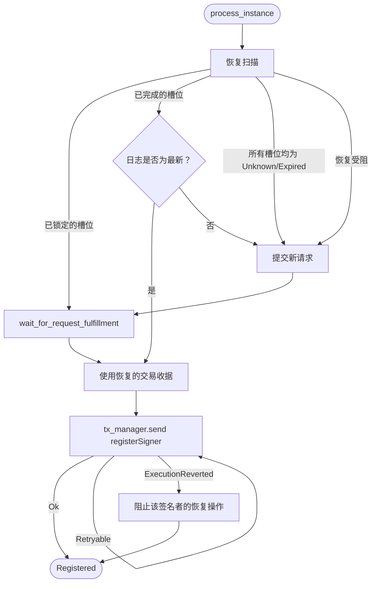

注册器是一项链下服务，负责维护链上已接受的 TEE 签名者身份注册表。它会发现正在运行的 TEE 证明器实例，从每个 enclave 获取 AWS Nitro Enclave 证明文档，为证明文档格式的正确性生成 ZK 证明，然后将得到的签名者注册信息提交到 L1 上的 [`TEEProverRegistry`](https://github.com/base/contracts/blob/main/src/L1/proofs/tee/TEEProverRegistry.sol)。此外，如果某个签名者对应的实例已无法访问，注册器会将其注销；对于 AWS 已撤回的中间证书，注册器也会将其吊销。

注册器由 Base 运营。证明系统只信任由该注册器注册的签名者，因此，注册器的正确性是链上接受 TEE 证明的前提。不过，注册器的输出本身仍可自我验证：签名者生效之前，证明文档的 ZK 证明、enclave 的 PCR0 度量值以及签名者公钥都要经过 `TEEProverRegistry` 和 [`NitroEnclaveVerifier`](https://github.com/base/contracts/blob/main/src/L1/proofs/tee/NitroEnclaveVerifier.sol) 的校验。

## 职责 {#responsibilities}

符合规范的注册器需执行以下工作：

1. 发现生产环境负载均衡器后端当前的 TEE 证明器实例集合。
2. 从每个实例获取各 enclave 的签名者公钥和 Nitro 证明文档。
3.  (可选) 对照 AWS 发布的 CRL 以及
   链上持久吊销集合，检查证明证书链。
4. 为每个尚未注册的 enclave 生成证明其证明文档正确性的 ZK 证明。
5. 为新通过证明的签名者提交 `TEEProverRegistry.registerSigner()`。
6. 为实例已不存在的链上签名者提交 `TEEProverRegistry.deregisterSigner()`。
7. 为经发现已
   被吊销的中间证书提交 `NitroEnclaveVerifier.revokeCert()`。
8. 在进程重启后恢复进行中的证明请求，避免重复消耗证明算力。

注册器不负责把关哪些 PCR0 度量值可被接受。注册过程与 PCR0 无关，因此
可以在硬分叉之前预先注册下一个镜像的签名者。某个签名者生成的证明能否被接受，由 [`TEEVerifier`](https://github.com/base/contracts/blob/main/src/L1/proofs/tee/TEEVerifier.sol)
在链上依据当前活跃游戏实现的 `TEE_IMAGE_HASH` 强制校验。

注册器同样不负责创建提案、为提案或争议生成证明材料，
也不负责对无效状态转换发起争议。这些职责分别由提议者、TEE
证明器和挑战者承担。

## 启动配置 {#startup-configuration}

启动时，注册器会连接以下组件：

* 一个 L1 执行层 RPC，用于读取合约和提交交易
* AWS API，用于获取 ELBv2 目标健康状态和 EC2 实例元数据
* 每个已发现的 TEE 证明器实例上的 JSON-RPC 端点
* 一个证明后端 (Boundless 市场或自托管的 RISC Zero 证明器) 
* `TEEProverRegistry`
* 一个可选的 `NitroEnclaveVerifier`，仅在启用 CRL 检查时需要

除运营者提供的注册表地址和验证器地址外，注册器在启动时不会读取任何其他合约配置。凡是链上存在、但未出现在其自身实例集合中的签名者，注册器一律视为孤立候选项；因此，对于同一个注册表，必须仅由一个注册器作为唯一的写入方。

## 驱动循环 {#driver-loop}

注册器运行单一的驱动循环：

1. 发现当前的实例集合。
2. 并发处理所有实例，并发数上限为 `max_concurrency`。
3. 读取链上签名者集合。
4. 注销孤立的签名者。
5. 休眠 `poll_interval` 秒；若收到取消信号则退出。

该循环在启动时会先执行一次 `step()`，然后再进入休眠。无论是在两次循环之间，还是在长时间运行的交易重试过程中，
都会及时响应取消信号，从而确保服务关闭时不会遗留不完整的
状态。

## 实例发现 {#instance-discovery}

注册器通过轮询 AWS ALB 目标组来发现实例，不支持 DNS、SRV 和 Kubernetes 发现。

每个发现周期会执行以下操作：

1. 调用 `elasticloadbalancingv2.DescribeTargetHealth(target_group_arn)`。
2. 过滤掉非实例目标 (即目标 ID 不以 `i-` 开头的目标) 。
3. 对出现在多个端口上的实例 ID 进行去重。
4. 调用 `ec2.DescribeInstances(instance_ids)`，读取每个实例的私有 IP 和启动时间。
5. 构建形如 `http://{private_ip}:{prover_port}` 的 JSON-RPC 端点 URL，并将每个 URL
   与 ALB 报告的健康状态关联起来。

健康状态的映射关系如下：

| AWS 状态     | 内部状态        | `should_register()` |
| ---------- | ----------- | ------------------- |
| `initial`  | `Initial`   | true                |
| `healthy`  | `Healthy`   | true                |
| `draining` | `Draining`  | false               |
| 其他任何状态     | `Unhealthy` | false               |

处于 `Unhealthy` 状态、但距 `launch_time` 不超过 `unhealthy_registration_window` 秒的实例仍
可注册。这是一个预热宽限期：若新实例的 JSON-RPC 端点暂时响应缓慢，它仍可在下一次 ALB 健康
检查将其注销之前完成 enclave 证明和注册。该窗口必须小于 Boundless 证明超时时间，以确保
已开始的证明能在实例失去资格之前完成。

发现失败时会中止本轮周期并跳过孤立项清理，但不会注销仍在运行的签名者。

## 逐实例处理 {#per-instance-processing}

对于发现的每个实例，注册器会执行以下操作：

1. 调用 `enclave_signerPublicKey`，获取每个 enclave 的 SEC1 公钥。每个实例可以
   托管多个 enclave，且每个 enclave 都有各自的签名者密钥。
2. 从每个公钥推导出以太坊签名者地址，即取
   `keccak256(uncompressed_pubkey_xy)` 的最后 20 个字节。
3. 如果未报告任何签名者，则立即返回。此时该实例不会向地址集添加任何地址，
   本次调用为空操作。
4. 判断该实例当前是否可注册：
   * `Initial` 和 `Healthy` 实例继续处理。
   * 处于预热窗口内的 `Unhealthy` 实例继续处理。
   * 其他所有实例会将其地址加入活跃集合，但不会生成新的
     证明或交易。
5. 生成一个 32 字节的随机 nonce，并使用该 nonce 调用一次 `enclave_signerAttestation`。
   该 nonce 会将返回批次中每个 enclave 的证明绑定到同一个
   新鲜性承诺上。
6. 如果启用了 CRL 检查，则每个批次执行一次 CRL 检查。虽然每个 enclave 都有各自的
   签名密钥，但 AWS Nitro 证明由父 EC2 实例的 Nitro
   Hypervisor 签名，而其签名密钥由 AWS 为每个实例签发的证书链背书。
   因此，同一实例上所有 enclave 生成的证明都基于同一条父证书链，
   每个实例只需执行一次 CRL 检查即可。
7. 对每个签名者地址运行注册流水线。

所有可访问的实例都会将地址加入活跃签名者集合，包括 `Draining` 和 `Unhealthy`
实例。这样可以防止正在轮换加入或退出的实例被过早注销。

## 认证证明 (Attestation Proof) 生成 {#attestation-proof-generation}

对于每个尚未上链的签名者，注册器 (registrar) 会调用
`AttestationProofProvider` 来生成证明材料。该 provider 返回：

```text Attestation Proof Provider Output
output      // ABI 编码的 VerifierJournal（PCR、公钥、时间戳、证书哈希）
proofBytes  // Groth16 seal
```

`output` 是 `registerSigner()` 执行期间由 `NitroEnclaveVerifier.verify()` 使用的 `VerifierJournal`。`proofBytes` 是一个 Groth16 SNARK，用于证明该 journal 对应一份有效的 Nitro 证明文档。

注册器支持两种后端：

| 后端          | 描述                                                                                          |
| ----------- | ------------------------------------------------------------------------------------------- |
| `boundless` | 使用专用钱包将证明任务提交到 Boundless 市场。                                                                |
| `direct`    | 在本地加载 guest ELF，并通过 `risc0_zkvm::default_prover()` 生成证明，根据 RISC Zero 环境变量路由到 Bonsai 或本地证明器。 |

两种后端均可用于生产环境，其中 `boundless` 是主要的生产后端。`direct` 也用于本地开发和测试，但当运维者需要绕过市场时 (例如 Boundless 发生故障，或在私有部署场景中) ，它同样可以作为生产环境的备用方案。

使用 Boundless 时，注册器会提交一个 `RequestParams`，其中包含程序 URL、证明输入、预期的 `image_id`，以及一个 `prefix_match(image_id)` 要求，以确保已完成的请求无法在其他程序上重放。链上 Boundless 提交通过互斥锁串行执行，以避免钱包 nonce 竞争。

### 重启恢复 {#restart-recovery}

注册器进程本身是临时性的。进程重启后，它不得重复花费已完成的证明工作，
也不得提交过期的证明。Boundless `RequestId` 槽位按确定性方式派生：

```text Request Index Derivation
request_index(signer, attempt) = u32::from_be_bytes(keccak256(signer || attempt)[..4])
```

对于每个签名者，注册器在提交新请求之前，会依次探测 `max_recovery_attempts` 个连续的确定性槽位。
具体操作取决于槽位状态：

| 槽位状态        | 注册器操作                                         |
| ----------- | --------------------------------------------- |
| `Unknown`   | 将遇到的第一个此类槽位记为新提交的候选槽位；继续扫描。                   |
| `Locked`    | 继续执行 `wait_for_request_fulfillment`，并使用返回的收据。 |
| `Fulfilled` | 获取收据，并在接受前检查 journal 的新鲜度。                    |
| `Expired`   | 永久跳过该槽位；继续扫描。                                 |

扫描过程中若遇到 `RequestIsNotLocked` 回滚，则视为请求正在处理中，并直接短路，转而
等待该槽位。

如果恢复的收据中的证明时间戳已超过 `max_attestation_age`，注册器会将其
丢弃，并在候选槽位中提交新请求。默认新鲜度窗口为
3300 秒，严格小于链上 3600 秒的 `MAX_AGE`，以确保恢复的证明在链上过期之前
仍能提交。

`registerSigner()` 返回 `ExecutionReverted` 后，该签名者会被加入进程级的
`recovery_blocked` 集合。下一个周期将跳过该签名者的恢复扫描，直接提交新
请求，从而确保已知无效的恢复证明不会被重复尝试。该集合会在重启时清空，
因此即使是先前被阻止的签名者，每个进程中也都有一次重新尝试的机会。

## 注册交易 {#registration-transactions}

对于每个未注册的签名者，注册器会：

1. 调用 `TEEProverRegistry.isRegisteredSigner(signer)`。如果返回 true，则跳过该签名者。
2. 按上文所述生成或恢复证明材料。
3. 对 `registerSigner(output, proofBytes)` 进行 ABI 编码。
4. 通过 L1 交易管理器提交交易。
5. 按照下述规则重试失败的提交。
6. 收到成功的回执后，递增注册计数器。

交易重试规则如下：

| 失败类型                   | 要求的行为                                                  |
| ---------------------- | ------------------------------------------------------ |
| 可重试错误                  | 休眠 `tx_retry_delay` 后重试，总尝试次数最多为 `max_tx_retries`。     |
| `ExecutionReverted` 回滚 | 禁止对该签名者进行恢复，以便下一个周期生成新的证明，然后返回错误。                      |
| 资金不足、超出费用上限            | 视为不可重试。上报错误，并在当前周期内不再尝试该签名者。                           |
| 回执显示已回滚                | 即使提交成功，也视为交易失败。                                        |
| 交易打包后仍报告错误             | 重新读取 `isRegisteredSigner(signer)`。如果返回 true，则视为本次尝试成功。 |

之所以必须在出错后进行状态核对，是因为即使底层交易已被打包，费用提升 (fee-bumping) 和 nonce 竞争仍可能返回错误。
如果不重新检查，注册器就会为已注册的签名者生成新的证明，白白浪费证明计算资源。

交易提交支持感知取消：关闭时，正在进行的发送操作和两次尝试之间的休眠都会干净地中止，
因此下一个进程能够从干净的 nonce 状态启动，而不会提交不完整的交易。

## 孤立签名者注销 {#orphan-deregistration}

处理完所有实例后，注册器会将链上签名者集合与活跃集合进行核对：

1. 如果本轮发现失败，则跳过清理。
2. 如果已请求取消，则跳过清理。
3. 比较可达实例数与已发现的实例总数。如果
   `reachable_instances * 2 <= total_instances`，则跳过清理。
4. 通过 `TEEProverRegistry.getRegisteredSigners()` 读取链上集合。
5. 计算 `orphans = onchain_signers \ active_signers`。
6. 按顺序处理每个孤立签名者：
   1. 重新检查 `isRegisteredSigner(signer)`。如果返回 false，则跳过。
   2. 对 `deregisterSigner(signer)` 进行 ABI 编码，并通过交易管理器提交。

多数可达保护机制可防止因 AWS 或 VPC 短暂故障而一次性注销大部分证明器集群。针对每个孤立签名者的 `isRegisteredSigner` 重新检查用于防范竞态：`getRegisteredSigners()` 返回的集合每个周期只读取一次，而从读取到提交本次交易期间，其他写入方可能已注销了某个签名者。跳过已注销的地址，可避免在无实际作用的交易上浪费 gas。

此流程假定每个 `TEEProverRegistry` 只对应一个注册器。如果两个注册器共用同一个注册表，双方都会将对方的签名者视为孤立签名者。

## 证书吊销 {#certificate-revocation}

当运营者启用 CRL 检查时，注册器会依次通过两层机制执行吊销检查。要确保 CRL 处理的安全性，这两层缺一不可。

### 第 1 层：链上持久化吊销预检查 {#layer-1-onchain-durable-revocation-pre-check}

对于证明链中的每个中间证书，注册器都会读取
`NitroEnclaveVerifier.revokedCerts(certPathDigest)`。只要有任何一项命中，就会阻止该批次的注册，
并完全跳过第 2 层。

该层用于防御一种针对缓存证书路径的已知攻击：某个中间证书即使曾在链上被吊销，如果 AWS 之后清理了其 CRL 条目，
它仍可能通过后续的 `_cacheNewCert` 写入被重新引入。先读取持久化映射，可确保
已吊销的证书无法在不知不觉中被恢复为有效状态。

调用 `revokedCerts` 时若发生 RPC 错误，将采用失败开放 (fail open) 策略，转交第 2 层继续处理，但会计入
吊销检查错误。启用 CRL 检查时，`RegistrationDriver::new` 要求提供 `NitroEnclaveVerifier` 客户端，
并会在启动时拒绝错误的配置。

### 第 2 层：AWS CRL 分发点 {#layer-2-aws-crl-distribution-points}

对于通过第 1 层检查的中间证书，注册器会：

1. 解析证书链中的每个 CRL 分发点。
2. 根据允许列表校验 URL 主机，要求其带有 `.amazonaws.com` 后缀并包含
   `nitro-enclave` 关键字。HTTP 重定向处于禁用状态，响应大小上限为 10 MiB。
3. 在可配置的超时时间内获取 CRL。
4. 查找该证书的序列号。
5. 对每个已吊销的中间证书，提交 `NitroEnclaveVerifier.revokeCert(certPathDigest)`。
6. 只要有任一中间证书已被吊销，即返回 true，从而阻止该批次的注册。

`revokeCert` 调用失败会计入统计，但不会中止同一
tick 内其他实例的注册。提交的吊销会使第 1 层在下一个周期变为命中状态，这样后续
注册即可直接短路，无需重新获取 CRL。

## 待处理注册的生命周期 {#pending-registration-lifecycle}

每个签名者专属的流水线均以以太坊签名者地址为键。签名者的 Boundless 证明槽位会依次经历以下状态：



无论是处于待恢复状态、收据已完成但已过时，还是遇到 `ExecutionReverted` 回滚，都会在下一个 tick
回到重新提交的流程，而不会让签名者卡死。

## 链上交互 {#onchain-interactions}

注册器会使用以下合约调用。注册器有意不调用 `TEEProverRegistry.isValidSigner()`：该判定条件由 `TEEVerifier` 在提交证明时强制执行，
且包含镜像哈希匹配检查，而这是注册器自身无法满足的。

| 合约                                                                                                               | 方法                              | 调用场景                    |
| ---------------------------------------------------------------------------------------------------------------- | ------------------------------- | ----------------------- |
| [`TEEProverRegistry`](https://github.com/base/contracts/blob/main/src/L1/proofs/tee/TEEProverRegistry.sol)       | `registerSigner(output, proof)` | 为每个签名者发送的注册交易。          |
| [`TEEProverRegistry`](https://github.com/base/contracts/blob/main/src/L1/proofs/tee/TEEProverRegistry.sol)       | `deregisterSigner(signer)`      | 为每个孤立签名者发送的注销交易。        |
| [`TEEProverRegistry`](https://github.com/base/contracts/blob/main/src/L1/proofs/tee/TEEProverRegistry.sol)       | `isRegisteredSigner(signer)`    | 预检查、出错后的状态核对、孤立签名者竞态防护。 |
| [`TEEProverRegistry`](https://github.com/base/contracts/blob/main/src/L1/proofs/tee/TEEProverRegistry.sol)       | `getRegisteredSigners()`        | 每个周期调用一次，用于计算孤立签名者。     |
| [`NitroEnclaveVerifier`](https://github.com/base/contracts/blob/main/src/L1/proofs/tee/NitroEnclaveVerifier.sol) | `revokeCert(certHash)`          | 当 AWS CRL 吊销某个中间证书时调用。  |
| [`NitroEnclaveVerifier`](https://github.com/base/contracts/blob/main/src/L1/proofs/tee/NitroEnclaveVerifier.sol) | `revokedCerts(certHash)`        | 基于 L1 链上持久化吊销记录的预检查。    |

PCR0 的强制校验在提交证明时于链上执行，而非在注册时执行。只要 enclave 的 Nitro 证明 (attestation) 验证通过，
无论其 PCR0 为何值，注册器都会为其注册。这样，下一个镜像的节点集群便可在硬分叉之前提前启动并完成预注册；
但在当前生效的博弈实现的 `TEE_IMAGE_HASH` 与这些签名者已注册的镜像哈希一致之前，
它们产生的提案都不会被接受。

## 服务生命周期 {#service-lifecycle}

启动时，注册器会依次执行以下操作：

1. 解析并校验 CLI 配置。
2. 初始化追踪 (tracing) ，并安装 `rustls` ring 加密提供程序。
3. 安装信号处理程序，用于触发取消令牌。
4. 初始化 Prometheus 指标，包括 L1 钱包和 Boundless 钱包的余额监控。
5. 构建 L1 提供程序、交易管理器、AWS SDK 客户端和发现客户端。
6. 构建注册表客户端以及可选的 Nitro 验证器客户端。
7. 为所配置的后端构建证明提供程序。
8. 启动健康检查服务器并标记为就绪。
9. 启动驱动循环。

组件装配一完成，健康检查端点即报告就绪。由于注册器仅发起出站连接，因此有意省略了
连通性检查。

每个驱动周期 (tick) 会：

1. 发现实例。
2. 并发处理各实例。
3. 在多数可达保护机制的约束下计算孤立实例。
4. 为已确认的孤立实例提交注销交易。

关闭过程由取消令牌驱动：驱动循环退出，正在执行的各实例 future 被丢弃，就绪标志被清除，`up` 指标被置为零，
最后等待健康检查服务器结束 (join) 。

## 运营方输入 {#operator-inputs}

注册器需要以下输入：

* L1 RPC 端点和链 ID。
* `TEEProverRegistry` 地址。
* AWS 区域和 ALB 目标组 ARN。
* 整个证明器集群共用的证明器 JSON-RPC 端口。
* L1 交易签名器 (本地密钥，或远程签名端点及预期地址) 。
* 证明后端选择：`boundless` 或 `direct`。
* 使用 `boundless` 时：市场 RPC URL、专用钱包密钥、guest 程序 URL、轮询间隔、
  证明超时时间、恢复尝试次数上限，以及证明 (attestation) 有效期窗口。
* 使用 `direct` 时：guest ELF 文件路径。
* 轮询间隔、证明器 JSON-RPC 超时时间、最大并发数、最大交易重试次数、交易
  重试间隔，以及不健康注册的预热窗口。

可选输入：

* 是否启用 CRL 检查的标志。
* `NitroEnclaveVerifier` 地址，启用 CRL 检查时必填。
* CRL 获取超时时间。
* 健康检查服务器的绑定地址和端口。
* 日志过滤器和 Prometheus 指标设置。

## 安全要求 {#safety-requirements}

注册器 (registrar) 实现必须保证以下安全属性：

* 不得因 AWS 或 VPC 的暂时性故障而注销仍在运行的签名者。在执行任何注销操作之前，
  须先应用多数可达保护机制。
* 只要 `Draining` 和 `Unhealthy` 实例的 JSON-RPC 端点仍有响应，就应将其视为活跃集合的一部分，
  以免轮换操作与注销操作发生竞态。
* 为每个实例批次使用全新的随机 nonce，并将其传入 enclave 证明请求，
  使验证器日志中包含不可猜测的新鲜性承诺。
* 根据签名者地址确定性地派生 Boundless 请求槽位，使重启后的进程
  无需再次支付证明费用即可恢复进行中的证明工作。
* 拒绝证明时间戳早于 `max_attestation_age` 的已恢复证明，以确保
  已恢复的证明严格处于链上 `MAX_AGE` 时间窗口之内。
* 签名者出现 `ExecutionReverted` 后，禁止对其执行恢复，使下一个周期重新生成证明，
  而不是再次提交同一个无效证明。
* 交易出错后重新检查 `isRegisteredSigner`，以排除因手续费提升和 nonce 竞争
  导致的假阴性。
* 在提交注销之前，立即对每个孤立候选项重新检查 `isRegisteredSigner`，
  以免并发写入方或先前仍在处理中的交易导致重复的
  注销交易。
* 启用 CRL 检查时，应先执行链上持久化吊销预检查，再获取
  网络 CRL，以防先前已被吊销的中间证书在无人察觉的情况下重新生效。
* 仅允许从白名单主机获取 CRL，并限制响应大小，以防御 SSRF 和
  资源耗尽攻击。
* 将 AWS API 不可用、证明器端点不可达、暂时性 RPC 错误以及 Boundless
  轮询失败视为可在下一个周期重试的情况，而不应视为注销或
  失败信号。