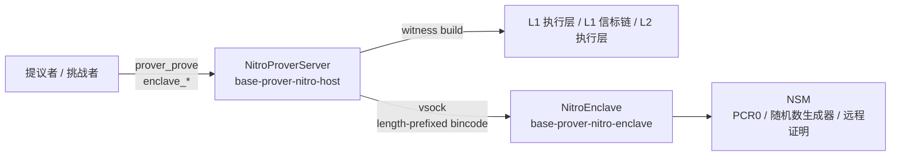

TEE 证明器是一项链下服务，它在 AWS Nitro Enclave 内重新推导并重新执行某个 L2 区块范围，从而为 `AggregateVerifier`
博弈生成已签名的证明材料。提案创建和争议作废
均由同一服务支撑：调用方 (提议者或挑战者)
提交一个区块范围，主机收集见证数据，飞地验证该范围，最后由一个随机生成、
仅保存在飞地内部的密钥对所得的日志 (journal) 进行签名。

该签名可在链上自证有效。`TEEVerifier` 从每个提案中恢复出签名者，并
根据当前活跃博弈实现的 `TEE_IMAGE_HASH`，在 `TEEProverRegistry` 中对其进行核验。
来自其他飞地镜像的签名者，或已被注销的签名者，均无法通过
验证。Nitro 虚拟机管理程序为每个实例生成的证明会将签名者的公钥绑定到
特定的 PCR0，而该 PCR0 由[注册器](/zh/specifications/base-protocol/proofs/registrar)另行认证。

## 职责 {#responsibilities}

符合规范的 TEE 证明器栈需完成以下工作：

1. 通过 JSON-RPC 为提案 (proposal) 和争议 (dispute) 区间提供 `prover_prove` 服务。
2. 在主机上从规范 L1、L1 信标链和 L2 的 RPC 收集见证数据。
3. 通过 vsock 将经过内容验证的原像转发给 enclave。
4. 在 enclave 内重新推导并重新执行 L2 区间，并在进行任何签名之前，将声明的 output root
   与重新执行得到的 output root 进行比对验证。
5. 使用在 enclave 内生成的 secp256k1 密钥，对每个区块的日志 (journal) 以及聚合日志进行
   签名。
6. 向注册器 (registrar) 暴露 `enclave_signerPublicKey` 和 `enclave_signerAttestation`。
7. 可选择根据注册表中签名者的有效性对每个请求进行准入控制，从而在 enclave 被注销时以失败关闭 (fail closed)
   方式拒绝请求。
8. 支持在单个 EC2 父实例上部署多个 enclave，使不同的 PCR0 镜像在轮换期间能够
   并行运行。

TEE 证明器并不负责判断提案或争议是否正确。它只会重新执行该区间，若结果与声明一致则对其签名，
然后返回。调用方在上链提交之前仍需重新检查博弈状态。

## 架构 {#architecture}

该服务在支持 Nitro 的 EC2 父实例上以两个进程的形式运行：

* **主机** 二进制文件 (`base-prover-nitro-host`) ：负责终结 JSON-RPC 请求，通过
  HTTP 收集见证数据，并将请求代理到一个或多个 enclave。
* **enclave** 二进制文件 (`base-prover-nitro-enclave`) ：打包在 EIF 中，负责持有签名密钥、
  提供 vsock 监听器，并运行证明流水线。

这两个进程之间仅通过 vsock 通信。enclave 不具备网络接口，所有对外的
RPC 连接均由主机端负责。



每个 vsock 连接只处理一个请求，处理完即关闭。enclave 不会跨连接保留任何请求级状态；enclave 内唯一的持久状态是签名者密钥和启动时的 PCR0 度量值。

Vsock 帧采用长度前缀格式 (`u32` 大端序长度 + bincode 负载) ，读取超时为 5 分钟。传输层将每次写入的分块上限设为 28 KiB，以规避 Linux 内核 `virtio_vsock` 中的 SKB 损坏缺陷。

## JSON-RPC 接口 {#json-rpc-interface}

主机在单个 HTTP JSON-RPC 监听器上暴露两个命名空间，此外还提供一个 HTTP `GET /healthz` 代理，将请求路由到 JSON-RPC 的 `healthz` 方法。

| 方法                          | 用途                                    |
| --------------------------- | ------------------------------------- |
| `prover_prove`              | 为指定区块范围生成逐区块签名提案和聚合签名提案。              |
| `enclave_signerPublicKey`   | 返回每个 enclave 的 65 字节未压缩 secp256k1 公钥。 |
| `enclave_signerAttestation` | 返回每个 enclave 的 COSE&#95;Sign1 证明文档。   |
| `healthz` / `GET /healthz`  | 存活检查；启用后还可检查链上签名者有效性 (锁存式) 。          |

`enclave_*` 调用在多个 enclave 之间遵循&quot;全有或全无&quot;原则：只要任一传输失败或任一 enclave 返回错误，整个响应即失败。调用方需要一次性注册所有签名者，因此不完整的响应毫无用处。

### prover_prove 请求 {#prover_prove-request}

`ProofRequest` 字段：

| 字段                            | 含义                                                          |
| ----------------------------- | ----------------------------------------------------------- |
| `l1_head`                     | L1 头部区块哈希，用于锚定派生窗口。                                         |
| `l1_head_number`              | L1 头部区块号。                                                   |
| `agreed_l2_head_hash`         | 该范围父区块的 L2 区块哈希。                                            |
| `agreed_l2_output_root`       | 父区块的 output root，用作起始状态。                                    |
| `claimed_l2_output_root`      | 目标区块声明的 output root。此字段对信任至关重要：仅当重新执行的结果与之匹配时，enclave 才会签名。 |
| `claimed_l2_block_number`     | 目标 L2 区块号 (该范围的结束区块) 。                                      |
| `proposer`                    | 负责提交证明的 L1 地址。该地址会被提交到 journal 中，因此链上的 `msg.sender` 必须与之匹配。 |
| `intermediate_block_interval` | 聚合提案中中间 root 的采样步长。                                         |
| `image_hash`                  | 调用方期望的 `keccak256(PCR0)`。目前仅供参考；路由依据的是链上签名者的有效性。            |

### prover_prove 响应 {#prover_prove-response}

`ProofResult::Tee` 包含：

| 字段                   | 含义                                                                   |
| -------------------- | -------------------------------------------------------------------- |
| `aggregate_proposal` | 覆盖整个区间的单个 `Proposal`，包含采样得到的中间根。                                     |
| `proposals`          | 按顺序排列的逐区块 `Proposal`，每个 `Proposal` 的 `prev_output_root` 均链接到前一个区块的根。 |

每个 `Proposal`：

| 字段                 | 含义                                                        |   |   |   |           |
| ------------------ | --------------------------------------------------------- | - | - | - | --------- |
| `output_root`      | 该提案结束区块处的 output root。                                    |   |   |   |           |
| `signature`        | 对 `keccak256(journal)` 的 65 字节 secp256k1 ECDSA 签名 (&#96;r |   | s |   | v&#96;) 。 |
| `l1_origin_hash`   | 推导过程中使用的 L1 头部哈希。                                         |   |   |   |           |
| `l1_origin_number` | L1 头部区块号。                                                 |   |   |   |           |
| `l2_block_number`  | 该提案的结束 L2 区块号。                                            |   |   |   |           |
| `prev_output_root` | 该提案区间开始之前的 output root。                                   |   |   |   |           |
| `config_hash`      | 硬编码在 enclave 中的各链配置哈希。                                    |   |   |   |           |

若区间仅包含一个区块，则聚合提案与该区块的逐区块提案完全相同。否则，聚合提案会对一个 journal 单独签名，该 journal 的
`prev_output_root` 为请求中的 `agreed_l2_output_root`，`intermediate_roots` 按
`intermediate_block_interval` 采样，`ending_l2_block` 为区间内的最后一个区块。

### enclave_signerAttestation {#enclave_signerattestation}

接受可选的 `user_data` 和 `nonce` 字节参数。受 NSM 硬件限制，两者的长度上限均为 512 字节，超出限制的参数会在发起 vsock
调用之前被主机 RPC 层拒绝。主机为每个已配置的 enclave 各返回一份原始
`COSE_Sign1` 文档，顺序与 `enclave_signerPublicKey` 一致。注册器通过此端点，先将每个 enclave 的签名者绑定到一份新生成的证明 (attestation) ，
再将其提交上链。

## 证明流水线 {#proof-pipeline}

单个 `prover_prove` 请求的流转路径为：主机 → vsock → enclave → 主机：

1. **主机**：`ProverService::prove_block` 根据 prover 配置构造一个 `Host`，然后调用
   `Host::build_witness` 遍历 L1 EL、L1 beacon 和 L2 EL，并将以哈希为键的原像填充到 `Oracle` 中。
2. **主机**：`NitroBackend::prove` 将 oracle 展平为 `(PreimageKey, Vec<u8>)` 键值对，
   再由 `NitroTransport::prove` 将其封装为单个 `EnclaveRequest::Prove(...)` frame，通过 vsock 发送。
3. **Enclave**：`Oracle::new` 对每个以 `Keccak256` 或 `Sha256` 为键的原像进行内容校验，确保
   存储值的哈希确实与其键一致。
4. **Enclave**：`BootInfo::load` 从本地原像中提取 proposer、L1 head、已商定/所声明的根、
   中间区块间隔以及链 ID。
5. **Enclave**：`config_hash_for_chain` 从 `CONFIG_HASHES` (首次访问时由 `ChainConfig::all()` 计算得出)
   中查找硬编码的各链配置哈希。遇到未知链 ID 时，会返回
   `UnsupportedChain` 并拒绝生成证明。
6. **Enclave**：证明的前置阶段通过
   `driver.execute_with_intermediates()` 驱动派生与执行。收尾阶段的 `validate()` 是信任的关键关卡：
   它会确认重新执行得到的最终 output root 与请求中的 `claimed_l2_output_root` 一致。只有通过此项检查后才会进行签名。
7. **Enclave**：针对每个区块结果，构建一个 `intermediate_roots` 为空的 `ProofJournal` 并
   对其签名；在循环中逐次传递 `prev_output_root`。随后使用采样得到的中间根构建聚合 journal 并签名。
8. **Enclave**：返回 `EnclaveResponse::Prove(ProofResult::Tee { aggregate_proposal, proposals })`。
9. **主机**：将结果返回给 JSON-RPC 调用方，并应用所配置的证明请求
   超时时间 (默认 1740 秒，约 29 分钟) 。

proposer 会同时使用聚合提案和逐区块提案：逐区块的根传入
`proposeOutputRoots`，聚合签名则用于满足 `AggregateVerifier` 的校验。challenger
仅使用聚合签名，并通过
`ProofEncoder::encode_dispute_proof_bytes` 将其重新打包，供 `nullify()` 使用。enclave 既不知道、也不关心自己在为哪个调用方服务。

## 签名日志 (Signed Journal) {#signed-journal}

每个签名的计算方式为 `secp256k1.sign(keccak256(journal))`，并序列化为 65 字节
(`r || s || v`) 。日志采用紧凑打包 (而非 ABI 编码) ，长度为 `196 + 32·N` 字节，其中 `N` 为
中间根的数量：

```text Signed Journal Layout
proposer(20)        || l1OriginHash(32)   || prevOutputRoot(32)
startingL2Block(8)  || outputRoot(32)     || endingL2Block(8)
intermediateRoots(32 × N)                 || configHash(32)
teeImageHash(32)
```

单区块提案满足 `N == 0` 且 `startingL2Block == endingL2Block - 1`。聚合提案
满足 `startingL2Block == firstBlock - 1`、`endingL2Block == lastBlock`，且 `N == lastBlock /
intermediate_block_interval`。

`teeImageHash` 是在 enclave 启动时计算的 `keccak256(PCR0)`。每个 journal 中都嵌入了该值，因此在链上恢复出的
签名会间接承诺 (commit to) 生成它的那个确切的 EIF 度量值。在
本地模式下 (无 NSM，仅用于开发和测试) ，`teeImageHash` 为零。

签名的 `v` 字节编码为 secp256k1 恢复 ID (`0` 或 `1`) ；调用方在提交到 L1 之前，需自行将其规范化
为所需的 EIP-155 形式。

## 多 Enclave 路由 {#multi-enclave-routing}

`--vsock-cid` 接受一个或多个 CID，因此单个主机进程可以连接到运行在同一 EC2 父实例上的多个 enclave。
每个 CID 都是一个独立的 vsock 端点，可以运行不同的
EIF——即不同的 PCR0、不同的 `tee_image_hash` 以及不同的已注册签名者。

只要配置了多个 CID，CLI 就要求提供 `--tee-prover-registry-address`。缺少
注册表时，将无法以确定性方式在多个 enclave 之间做出选择，因此多 enclave
部署仅支持故障关闭 (fail-closed) 模式。

针对每个请求，路由逻辑会按顺序遍历已配置的 CID，并选中第一个签名者
当前在 `TEEProverRegistry` 中有效的 enclave：

1. 从 enclave 获取签名者公钥 (如果获取失败，则跳过该传输通道) 。
2. 在 `TEEProverRegistry` 上调用 `isValidSigner(signer)`。
3. 如果有效，则将请求路由到该 enclave；否则记录日志并继续检查下一个。
4. 如果列表中没有任何 enclave 拥有有效签名者，则请求失败并返回 `NoValidSigner`。

该机制在运维中最常见的用途是镜像轮换。新旧 EIF 并行运行；在重叠窗口期内，两个签名者
都针对当前活跃游戏实现的 `TEE_IMAGE_HASH` 完成注册；
注册表切换到新的镜像哈希后，只有新 enclave 的签名者有效，所有
新请求都会路由到新 enclave。

`enclave_*` 调用会扇出到每个已配置的 enclave，使注册器能够在一个周期内注册所有签名者。

## 注册门控与健康检查 {#registration-gating-and-health}

设置 `--tee-prover-registry-address` 后，主机会启用两项基于注册表的行为：

* 只有在至少一个 enclave 的签名者已在链上确认有效后，`GET /healthz` 才会返回健康状态。该健康标志具有锁存特性：
  一旦某个 enclave 被确认有效，即使之后注册表 RPC 调用失败或签名者被注销，`/healthz` 也会持续
  报告健康。这样可以在短暂中断期间让负载均衡器保持稳定。
* 每个 `prover_prove` 请求在转发前都会先调用 `RegistrationChecker::select_valid_enclave` 进行检查。已注销的 enclave
  或密钥获取失败的 enclave 会被跳过。如果没有任何 enclave
  有效，请求将被拒绝，并返回 JSON-RPC 错误码 `-32001`。

未设置注册表标志时，主机采用宽松模式：只要服务器
仍在运行，`/healthz` 就会返回健康状态，且 `prover_prove` 会路由到配置中的第一个 enclave。

## 证明 (Attestation) {#attestation}

签名者密钥在启动时于 enclave 内部生成，且始终不会离开 enclave 进程。
`Server::new_enclave` 构造函数会执行以下步骤：

1. 打开 NSM 会话 (`nsm_init`) 。
2. 读取 PCR0 (48 字节 SHA-384) 。若长度不符，则中止启动。
3. 计算 `tee_image_hash = keccak256(PCR0)` 并保存，以便写入每个已签名的 journal。
4. 使用 `NsmRng` 生成 secp256k1 ECDSA 密钥，`NsmRng` 内部会调用
   `nsm_process_request(Request::GetRandom)`。
5. 记录签名者地址 (不记录任何密钥材料) 。

系统不会在启动时或定期生成证明，只有在注册器
调用 `enclave_signerAttestation` 时才会生成。每次调用会：

1. 打开一个新的 NSM 会话。
2. 调用 `nsm_process_request(Request::Attestation { public_key, user_data, nonce })`。
3. 返回原始 COSE&#95;Sign1 字节。

证明文档中包含 65 字节的未压缩公钥、所有已填充的 PCR、
AWS 签发的证书链、时间戳以及传入的 `user_data`/`nonce`，并由
各实例专属的 Nitro hypervisor 密钥统一签名。本系统只使用其中的 PCR0——该值通过 `teeImageHash = keccak256(PCR0)` 绑定到每个已签名的 journal 中。关于证明如何验证并提交到链上，请参阅
[注册器](/zh/specifications/base-protocol/proofs/registrar) 规范。

## 服务生命周期 {#service-lifecycle}

主机启动流程 (`ServerArgs::run`) ：

1. 解析 CLI；通过 `base_cli_utils` 初始化日志和指标。
2. 根据 `--l2-chain-id` 解析 `RollupConfig` 和 L1 链配置。如果链未知，则启动失败。
3. 为每个 `--vsock-cid` 构建一个 `NitroTransport::vsock(cid, 8000)`。
4. 构造 `NitroProverServer::new_multi(prover_config, transports, timeout)`；如果设置了
   `--tee-prover-registry-address`，则再用 `RegistrationHealthConfig` 对其进行包装。
5. 构建一个带有 `/healthz` 代理层的 jsonrpsee HTTP 服务器，合并 `ProverApiServer`、
   `EnclaveApiServer` 以及其中一个 healthz 模块，然后启动服务器。
6. 阻塞等待服务器句柄；收到 ctrl-C 时退出。

enclave 启动流程 (`NitroEnclave::new`) ：

1. `Server::new()` 打开 NSM，派生 `tee_image_hash`，并生成签名者密钥。
2. 在 `VMADDR_CID_ANY:8000` 上绑定一个 `VsockListener`。
3. 为每个连接派生一个处理程序：读取一个分帧的 `EnclaveRequest`，将其分派给
   `Server::prove`、`signer_public_key` 或 `signer_attestation`，写入响应，然后关闭
   连接。

主机上每个请求的处理流程：

1. (可选) `select_valid_enclave` 选择一个已注册的 enclave。
2. `tokio::time::timeout(proof_request_timeout, enclave.service.prove_block(request))`。
3. 如果超时，返回 JSON-RPC `-32000`，并附带导致超时的 L2 区块号。
4. 如果 enclave 返回错误，返回 JSON-RPC `-32000`，并附带底层错误消息。

关闭流程由 `RuntimeManager` 处理的 ctrl-C 信号触发：jsonrpsee 服务器停止，等待正在处理的
请求全部完成，随后运行时退出。enclave 没有优雅关闭路径；进程
终止时通过 `Drop` 释放 NSM 文件描述符。

## 运维方输入 {#operator-inputs}

TEE 证明器主机需要：

* L1 执行层 RPC URL。
* L1 信标链 RPC URL。
* L2 执行层 RPC URL。
* L2 链 ID (用于选择 rollup 配置及各链对应的配置哈希) 。
* JSON-RPC 监听地址。
* 一个或多个 vsock CID，每个 CID 背后都对应一个运行证明器 EIF 的 Nitro Enclave。
* 证明请求超时时间 (默认 1740 秒) 。
* 日志过滤器及 Prometheus 指标设置。

可选：

* `TEEProverRegistry` 地址。配置多个 vsock CID 时必须提供。启用后，健康检查将以完成注册为前提，
  并对每个请求的签名者进行校验。
* 实验性 witness 端点标志，适用于暴露了 `debug_executePayload` 的主机。

除 EIF 镜像和 vsock channel 外，enclave 无需运维方提供任何输入。PCR0 在启动时从 NSM 读取；
签名者密钥由硬件随机数生成器 (RNG) 生成。

## 安全要求 {#safety-requirements}

TEE 证明器实现必须保证以下安全属性：

* 在 enclave 内部使用 NSM 硬件随机数生成器 (RNG) 生成签名密钥，且绝不将其序列化到
  enclave 进程之外。
* 在进行任何签名之前，将重新执行得到的最终 output root 与请求中的 `claimed_l2_output_root` 进行比对校验，
  若校验失败则拒绝签名。
* 在每个签名的 journal 中嵌入 `tee_image_hash = keccak256(PCR0)`，使签名与唯一的 EIF
  度量值绑定。
* 每个以哈希为键的原像进入 enclave 时，都要对其内容进行验证，确保推导过程不会使用
  值与键不匹配的原像。
* 对于未列在硬编码 `CONFIG_HASHES` 表中的链 ID，拒绝生成证明。
* 在主机 RPC 边界处将 `user_data` 和 `nonce` 限制在 NSM 的 512 字节上限以内，使超限的
  证明 (attestation) 请求无法到达 enclave。
* 每个 vsock 连接最多处理一个请求，且请求之间不保留任何可变状态，从而确保
  格式错误的请求无法影响后续请求。
* 配置了 `--tee-prover-registry-address` 时，对每个请求的签名者有效性校验采取失败即关闭 (fail closed) 策略：
  如果当前没有任何已配置 enclave 的签名者在链上有效，则拒绝该请求。